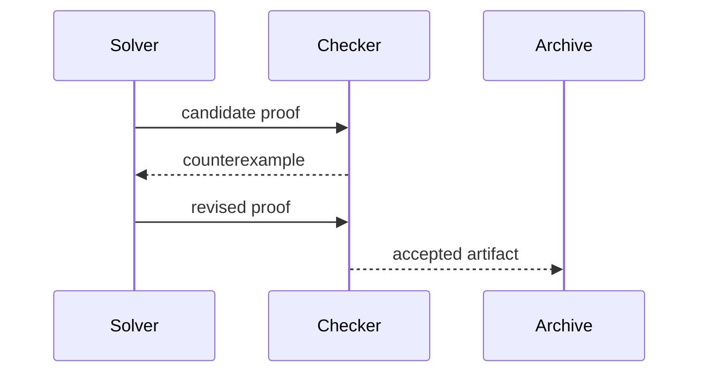
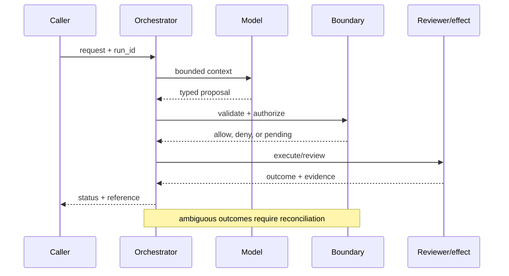

# Mathematical reasoning
Status: emerging
Sources: [DeepMind — 2026-02-11 Deep Think](https://deepmind.google/blog/accelerating-mathematical-and-scientific-discovery-with-gemini-deep-think/); [Lean theorem prover](https://lean-lang.org/)
## In one sentence
Reliable mathematical reasoning combines candidate search with verification and formal constraints.
## Background: what existed before
Language models produced plausible derivations whose arithmetic or premises were unchecked.
## What changed and why now
Deep Think describes parallel reasoning for scientific problems; formal systems provide an independent check.
## Impact on current processing and architecture
Generate candidates, run symbolic/numeric checks, reject failures, and retain proof/evidence artifacts.
## Real-world applications and constraints
Use for tutoring and theorem formalization. Search cost, formalization effort, and hidden assumptions constrain scale.
## Mental model
```mermaid
flowchart LR
 Q[Question]-->S[Search candidates]-->V[Verifier]-->P[Proof/evidence]
 V--fail-->S
 classDef a fill:#dbeafe,stroke:#2563eb,color:#111827; classDef b fill:#dcfce7,stroke:#16a34a,color:#111827; class Q,P a; class S,V b
```

## What changed this month
Deep Think's February source motivates search-plus-verification as the learning concept.
## Engineering consequence
Treat a fluent answer as a hypothesis until an independent checker accepts it.
## Limits and failure modes
A checker can encode the wrong specification; numeric tests do not prove generality; compute costs rise with search.

## SDE2 primer and prerequisites

This lesson is about **mathematical reasoning** as a production systems problem. A language model is only one stage: an ingress service accepts work, a data layer supplies evidence, an orchestrator keeps state, a policy layer decides what may happen, and an operator or downstream system observes the result. Students should know HTTP, JSON, functions, and basic databases. SDE2 readers should also know queues, authentication, structured logs, metrics, retries, and service-level objectives (SLOs). The central habit is to label what the February source actually reports separately from a recommendation derived from it.

The useful boundary for mathematical reasoning is **candidate generation, verifier, counterexample, proof obligation, formalization, and inference-time budget**. These are not magic model capabilities. They are interfaces, records, checks, and operating procedures that can be unit-tested. Start with a low-blast-radius workflow and make every external effect attributable to a run ID, actor, policy version, and evidence reference.

## February source reading: fact before inference

The primary February event is **Google DeepMind's February 11, 2026 Deep Think report**. DeepMind reports that its Aletheia math research agent uses a natural-language verifier to find flaws, iteratively generate and revise solutions, and can admit failure. The post reports up to 90% on IMO-ProofBench Advanced and says it does not claim Level 3 or Level 4 mathematical advances. These are source-reported results, not a guarantee for arbitrary mathematics. The report or announcement is evidence about what its publisher described. It is not independent validation of the publisher's claims, and it does not specify your data, threat model, latency budget, or regulatory obligations. That distinction matters because a source can motivate a concept without proving that the concept is solved.

The engineering inference in this lesson is that treating a fluent derivation as a candidate that must survive independent checks. Write that inference as a testable contract: state the accepted inputs, expected transitions, forbidden outcomes, and evidence needed to review a decision. If a test fails, improve the system or narrow the intended use; do not silently reinterpret a source claim as a guarantee.

## Historical baseline and problem boundary

Before this month's event, a team could make a convincing prototype with a synchronous request, a prompt, one model call, and a small script around an API. That baseline remains appropriate for drafting or a read-only experiment. It becomes unsafe or unreliable when a request crosses systems, waits, changes durable data, or must be explained later. The failure is not merely that the model can be wrong. It is that the surrounding software may have no place to record authority, version, evidence, retries, or recourse.

For **an Aletheia-style solver that revises a proof after a verifier finds a flaw**, draw the boundary before choosing a model. Identify the human or service principal, the records allowed into context, the actions proposed by the model, the component that validates them, and the owner who handles an ambiguous result. Decide which operations are reads, reversible writes, irreversible writes, or merely recommendations. A useful rule is that an untrusted string may influence a proposal but may never create a permission, erase an audit event, or bypass a state transition.

## Architecture and data flow

A deployable design has a control path and a data path. The control path versions configuration, policy, model adapters, schemas, evaluation sets, and rollout cohorts. The data path receives a request, authenticates it, retrieves bounded evidence, invokes the model, validates a typed proposal, executes an allowed action, and records an outcome. The mathematical reasoning boundary sits between the proposal and the observable outcome; it should be visible in traces and owned by a team.

```mermaid
flowchart LR
  A[Caller] --> I[Identity and tenant]
  I --> C[Context/evidence]
  C --> M[Model proposal]
  M --> B[Candidate Generation boundary]
  B --> X[Effect or review]
  X --> L[(Evidence log)]
  classDef data fill:#dbeafe,stroke:#2563eb,color:#172554; classDef control fill:#dcfce7,stroke:#15803d,color:#14532d; classDef risk fill:#fee2e2,stroke:#dc2626,color:#450a0a
  class A,C,X,L data; class I,B control; class M risk
```

Use separate fields for user text, retrieved facts, policy instructions, tool output, and generated proposal. This prevents an instruction hidden in a document or tool result from acquiring the authority of a system rule. Every record should carry a tenant or project key where relevant. Cache keys must include authorization scope and source version. Logs should retain enough structured evidence to explain a decision while redacting secrets and unnecessary free text.

A minimal run record is: `run_id`, `request_id`, actor, tenant, purpose, model/version, policy/version, context references, proposal hash, action, decision, timestamps, attempts, effect IDs, and final status. For this topic add candidate generation, verifier, counterexample, proof obligation, formalization, and inference-time budget. Do not put an unbounded transcript in the primary operational table; store a redacted pointer with a retention policy.

## Processing walkthrough and state

The happy path is only one transition. A request may be malformed, missing evidence, denied, awaiting a reviewer, interrupted after a remote commit, or invalidated by a policy change. Model states explicitly: `received`, `validated`, `proposed`, `blocked`, `pending`, `running`, `succeeded`, `failed`, and `cancelled`. Guard transitions with a run version or compare-and-swap so two workers cannot both advance the same work.



Persist the proposal before a side effect. On retry, reuse the same idempotency key or proof artifact rather than asking the model to invent a new action. A timeout is a state of knowledge, not proof that nothing happened. For a reversible operation, record the compensating action; for an irreversible operation, stop and escalate. For this lesson, the most important transition is the one that prevents **an Aletheia-style solver that revises a proof after a verifier finds a flaw** from becoming an unreviewed or untraceable effect.

## Topic mechanics: Mathematical reasoning

### Decision model and topic-specific data contract

A mathematical reasoning service should have a candidate channel and a proof channel. The generator proposes lemmas, definitions, and a derivation; a verifier checks syntax, arithmetic, consistency with assumptions, and—when possible—formal proof. A counterexample generator attacks universal claims. Minor defects return to a reviser with a precise diagnosis; a critical flaw restarts search; an exhausted budget produces abstention. Keep the proof state separate from natural-language explanation so a persuasive paragraph cannot overwrite a failed check. Lean or another prover can validate a formal subset, while symbolic algebra and executable tests cover other parts; none validates an incorrect formalization. For research-level tasks, retrieve literature with citations and record which sources were actually inspected. Allocate inference-time compute by expected value: more search for high-impact claims, less for routine arithmetic. DeepMind says Aletheia uses a natural-language verifier, iterative revision, and failure admission, and reports up to 90% on IMO-ProofBench Advanced while claiming no Level 3 or 4 advances. Those facts motivate the architecture but do not establish general theorem-solving reliability. Evaluate verifier false acceptance as a first-class catastrophic metric.

The first implementation question is what the system can know at each stage. At ingress, it knows an authenticated actor and a request, but not whether the request is well-formed or authorized. During retrieval, it can establish source IDs, freshness, and access filters, but similarity is not truth. During model generation, it can ask for a schema and bounded plan, but the output is still untrusted. At the boundary, deterministic code can enforce limits. After execution, only a receipt, read-after-write check, or independent artifact establishes what happened. This epistemic separation keeps **candidate generation, verifier, counterexample, proof obligation, formalization, and inference-time budget** from collapsing into one prompt.

Mathematical reasoning experiments should version the problem corpus, normalization rules, proof checker, solver configuration, and evaluator. Record them with each derivation so a higher pass rate can be attributed to better reasoning rather than a weaker parser or changed theorem set.

Proof search needs limits on branch count, solver time, proof length, and external lemma lookups. Stop with `search_exhausted` when the budget is spent; do not relabel an unproved conjecture as false. Keep parser failure, checker rejection, and timeout as separately inspectable results.

For **mathematical reasoning**, instrument verified-proof rate, counterexample discovery, verifier false acceptance, search cost, and abstention quality. Break down every metric by task slice, tenant, model version, policy version, and outcome class. An aggregate success number can improve while a small high-risk slice becomes worse. Pair capability metrics with reliability metrics and safety metrics; never use one as a proxy for the others.


## Mathematical reasoning: focused design workshop

The distinctive design choice for this lesson is **candidate search and independent verification**. Model the core record as a typed object with `claim, assumptions, candidate, counterexample, verifier_status`. Keep user prose outside that object; prose can explain intent, but code must decide whether the object is complete, authorized, fresh, and safe to execute. The invariant is: **no natural-language proof is accepted until its obligations pass a checker**. Emit an event whenever the invariant is checked, including the result, version, actor, and evidence reference. This makes a failure diagnosable without replaying an unconstrained model call.

Consider a concrete **mathematical reasoning** run. The ingress validator rejects missing identifiers and normalizes timestamps. The context builder retrieves only records permitted by tenant and purpose. The model receives a bounded view and returns a proposal, never a bearer credential or an opaque instruction. The topic-specific boundary then checks `claim, assumptions, candidate, counterexample, verifier_status`. If the check passes, the effect owner commits or queues work and returns a receipt. If it fails, the system returns a structured denial or asks for evidence. A reviewer can inspect the event sequence and distinguish bad input, missing authority, stale state, and a remote failure.

Test proof races. A solver may emit a candidate while the checker uses a different theory version, or a timeout may leave an incomplete derivation that looks polished. Pin the checker and theory manifest, and preserve `unproved` and `checker_unavailable` instead of accepting syntax as proof.

For operations, partition metrics by `candidate search and independent verification` and by model, policy, tenant, and outcome. Track the invariant violation directly, plus useful completion, latency, cost, and human override. A single aggregate can hide a catastrophic slice: one customer, one high-risk action, one rare theorem class, or one overloaded region. Set a release floor for the topic-specific safety metric before optimizing throughput.

The mini design exercise is **send a universal claim back to generation after finding a counterexample**. Implement it with an in-memory store first, then add a failure injection at every boundary. Expected behavior should be deterministic even if the proposal generator is not. Save the failing input as a regression fixture only after removing secrets and identifying the policy version that governed it.


## Applications and operational constraints

The strongest first application is **an Aletheia-style solver that revises a proof after a verifier finds a flaw** because it has a bounded workflow and a domain owner. A team might begin in shadow mode, where the system produces a proposal but performs no effect. Next, allow a canary cohort and only low-risk actions. Require an explicit launch review before expanding scope. The useful outcome is not “the model answered”; it is a completed task that meets quality, latency, cost, privacy, and policy constraints.

Other plausible applications include theorem tutoring, algorithm design, formalization, and research-assistant triage. Each has a different bottleneck. A support system values queue age and consistent escalation; an operations system values correctness and rollback; research values evidence and uncertainty; security values time to detect and false-positive capacity. Data residency, tenant isolation, secrets, rate limits, procurement, and human availability can dominate model latency. Document those constraints in the service contract rather than in an informal prompt.

Plan proof-search capacity around branch exploration, solver calls, checker time, and reviewer inspection. When the budget is exhausted, return the best candidate as unproved with its search limit. A partial derivation can be useful evidence, but it must not enter a verified-results channel.

## Failure modes, security, and limits

Mathematical reasoning fails when plausible notation hides an invalid step, a parser changes the problem, or a checker accepts an underspecified theory. Normalize inputs visibly, require proof or counterexample status, and use independent checkers where possible. Track checker coverage and unproved outputs rather than reporting only answer accuracy.

Reasoning metrics can improve by testing familiar forms, weakening the checker, or counting plausible final answers despite invalid steps. Pair answer accuracy with proof validation, adversarial variants, parser coverage, and abstention quality. A longer derivation is not evidence unless its critical transitions are checked.

The February source also has scope limits. DeepMind reports that its Aletheia math research agent uses a natural-language verifier to find flaws, iteratively generate and revise solutions, and can admit failure. The post reports up to 90% on IMO-ProofBench Advanced and says it does not claim Level 3 or Level 4 mathematical advances. These are source-reported results, not a guarantee for arbitrary mathematics. Nothing in that observation proves robustness against your adversaries, correctness on your domain, or a particular service-level target. Treat vendor examples as source facts and label recommendations as inference. When evidence is weak, abstention and escalation are valid outcomes.

## Evaluation and change management

Build a fixture set from ordinary, ambiguous, malformed, adversarial, slow, stale, and partially completed cases. Include a golden expected state and the invariants that must never break. Run the set against a pinned model and a deterministic baseline. Review failures by category, not just a total score. Keep hidden cases to detect overfitting, and sample production traces only after removing secrets.

Release gates should include a quality floor, a policy-violation ceiling, a reliability budget, a cost budget, and an evidence-completeness check. Roll out to a small cohort, compare with shadow results, and retain a kill switch that disables risky effects without destroying diagnostic reads. On rollback, record which version was disabled and whether external effects require remediation.

## February primary-source evidence

The source fact is bounded: **DeepMind reports that its Aletheia math research agent uses a natural-language verifier to find flaws, iteratively generate and revise solutions, and can admit failure. The post reports up to 90% on IMO-ProofBench Advanced and says it does not claim Level 3 or Level 4 mathematical advances. These are source-reported results, not a guarantee for arbitrary mathematics.** The February publication date and the publisher's wording should be cited when teaching the event. The recommendation that teams implement candidate generation, verifier, counterexample, proof obligation, formalization, and inference-time budget is an inference from the event plus established systems practice. It should be validated with local fixtures, security review, operational metrics, and domain experts. The source does not independently verify the examples, and this article does not present them as guarantees.

## Mini exercise extension

Create six fixtures for **an Aletheia-style solver that revises a proof after a verifier finds a flaw**: a normal request, missing evidence, an adversarial instruction, a policy denial, a timeout or interrupted run, and a successful outcome. For each fixture record the expected state, the allowed effect, and the evidence a reviewer should see. Add one version change and prove that the old event retains its original version. Your acceptance criterion is not a polished answer; it is a correct boundary, an explainable decision, and a safe recovery path.

## Build it locally: numbered implementation

1. Define dataclasses for `Request`, `Context`, `Proposal`, `Decision`, `Event`, and `Outcome`; require a run ID and version fields.
2. Write a deterministic boundary function for **candidate generation, verifier, counterexample, proof obligation, formalization, and inference-time budget**; deny unknown actions and malformed arguments.
3. Add a fake model that returns one valid and two invalid proposals, including an instruction hidden in retrieved text.
4. Add a fake downstream service with a timeout, an idempotency map, and a read-after-write reconciliation method.
5. Persist redacted JSON Lines events and implement replay without invoking a live model.
6. Run the six fixtures, assert the security invariant, and calculate verified-proof rate, counterexample discovery, verifier false acceptance, search cost, and abstention quality.
7. Change one policy or schema version, rerun the fixtures, and inspect the diff in evidence and state transitions.

## Runnable low-cost example

```python
def verify(claim, n):
    # counterexample search for the claim "all n in 1..5 pass"
    return all(n * (n + 1) // 2 == sum(range(1, n + 1)) for n in range(1, 6))
print("accepted" if verify("sum", 5) else "revise")
```

This example is intentionally small and deterministic. It demonstrates the lesson's boundary and its invariant; it does not claim production-grade authentication, durability, isolation, or domain correctness. Extend it with the numbered build steps and failure fixtures before drawing operational conclusions.

## Interview Q&A

**Q: What is the difference between a source fact and an engineering inference?** A: The fact is what a dated publisher says it released, measured, or observed. The inference is a design recommendation derived from that fact and other knowledge; it needs local validation.

**Q: Why separate model output from the boundary?** A: Model output is probabilistic and can be manipulated by input. The boundary is deterministic, attributable code that can enforce authorization, schemas, budgets, and state transitions.

**Q: Which metric would you put on the dashboard first?** A: A useful outcome metric plus a failure metric specific to the topic—verified-proof rate, counterexample discovery, verifier false acceptance, search cost, and abstention quality. Pair it with slices so an aggregate cannot hide a critical regression.

**Q: When should the system abstain?** A: When evidence is missing or stale, the policy is ambiguous, the budget is exhausted, or an external effect has an unknown status. Escalate with evidence instead of fabricating confidence.

**Q: What should happen during rollout?** A: Pin versions, start in shadow or canary mode, limit high-risk effects, monitor quality/reliability/safety separately, and keep an audited rollback path.

## Glossary

- **Candidate Generation**: the topic-specific control boundary that mediates a model proposal and an outcome.
- **Run ID**: a stable identifier joining request, context, decisions, attempts, and effects.
- **Idempotency**: repeating a request produces one logical effect rather than duplicates.
- **Provenance**: evidence describing origin, version, and transformations.
- **SLO**: a measurable service target such as latency or successful completion.
- **Abstention**: an explicit refusal or escalation when evidence or authority is insufficient.
- **Inference**: an engineering conclusion drawn from facts, not a quotation or guarantee from a source.

## References

- [Google DeepMind: Gemini Deep Think — February 11, 2026](https://deepmind.google/blog/accelerating-mathematical-and-scientific-discovery-with-gemini-deep-think/)
- [Lean theorem prover](https://lean-lang.org/)

## Claim ledger

| Claim | Source | Fact or inference |
|---|---|---|
| The cited publisher published the February event on the stated date. | [Google DeepMind's February 11, 2026 Deep Think report](https://deepmind.google/blog/accelerating-mathematical-and-scientific-discovery-with-gemini-deep-think/) | Fact |
| DeepMind reports that its Aletheia math research agent uses a natural-language verifier to find flaws, iteratively generate and revise solutions, and can admit failure. | [Google DeepMind's February 11, 2026 Deep Think report](https://deepmind.google/blog/accelerating-mathematical-and-scientific-discovery-with-gemini-deep-think/) | Fact |
| Treating a fluent derivation as a candidate that must survive independent checks. | Engineering design synthesis | Inference |
| A separately enforced boundary is safer and easier to operate than treating model text as authority. | Topic standards and systems reasoning | Inference |
| The local example demonstrates the concept but does not prove production security, reliability, or generalization. | This lesson | Fact about the example |
