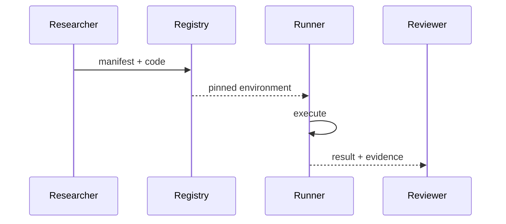
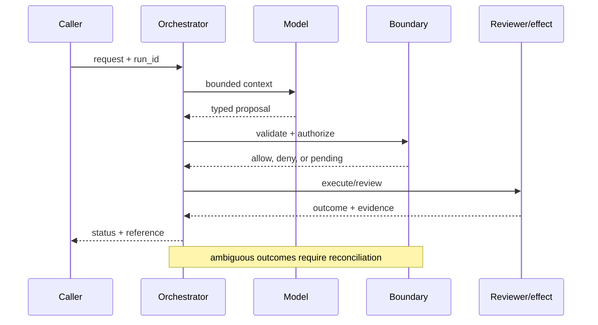

# Scientific reproducibility
Status: durable
Sources: [Nature — reproducibility](https://www.nature.com/articles/533452a); [DeepMind — 2026-02-11 Deep Think](https://deepmind.google/blog/accelerating-mathematical-and-scientific-discovery-with-gemini-deep-think/)
## In one sentence
Reproducibility means another team can rerun the same data, code, model settings, and analysis and inspect evidence.
## Background: what existed before
Papers often omitted exact prompts, seeds, dependency versions, or intermediate artifacts.
## What changed and why now
AI-assisted discovery adds nondeterminism and tool chains that must be recorded.
## Impact on current processing and architecture
Package data manifests, code commit, environment lockfile, prompt, seed, model ID, and outputs.
## Real-world applications and constraints
Important in drug and climate research. Proprietary data, nondeterministic hardware, and long-term storage complicate reruns.
## Mental model
```mermaid
flowchart LR
 D[Data]-->P[Pipeline]-->R[Result]
 E[Environment]-->P; M[Model/prompt]-->P; P-->A[Archive]
 classDef a fill:#dbeafe,stroke:#2563eb,color:#111827; classDef b fill:#dcfce7,stroke:#16a34a,color:#111827; class D,E,M a; class P,R,A b
```

## What changed this month
The February science concept applies reproducibility requirements to model-mediated discovery.
## Engineering consequence
Make runs content-addressed and publish a minimal reproduction command.
## Limits and failure modes
Reproducibility does not establish validity; inaccessible data and drifting APIs can block exact reruns.

## SDE2 primer and prerequisites

This lesson treats **scientific reproducibility** as a concrete engineering discipline, not a synonym for model intelligence. Its key artifact is scientific reproducibility evidence and state: the service must preserve it across scientific reproducibility and expose enough evidence for an operator to decide what happened. A model may suggest a next step, but deterministic interfaces, ownership, and versioned records decide whether that suggestion is usable. The useful prerequisite is familiarity with HTTP, JSON, persistence, queues, retries, authentication, and service-level objectives; the topic adds its own state and failure vocabulary.

The useful boundary for scientific reproducibility is **run manifest, dataset version, environment lockfile, model ID, prompt, seed, artifact, and independent rerun**. These are not magic model capabilities. They are interfaces, records, checks, and operating procedures that can be unit-tested. Start with a low-blast-radius workflow and make every external effect attributable to a run ID, actor, policy version, and evidence reference.

## February source reading: fact before inference

For scientific reproducibility, read the February source through its own claim boundary. The cited February event is **Google DeepMind's February 11, 2026 Deep Think report**. DeepMind says its February work came from collaboration among mathematicians, physicists, and computer scientists, and links papers, prompts, model outputs, and a taxonomy of AI contribution. It describes autonomous, collaborative, and human-plus-AI examples while explicitly saying no Level 3 or Level 4 major breakthrough is claimed. Those details make documentation part of the result. The report or announcement is evidence about what its publisher described. It is not independent validation of the publisher's claims, and it does not specify your data, threat model, latency budget, or regulatory obligations. That distinction matters because a source can motivate a concept without proving that the concept is solved.

For scientific reproducibility, the engineering inference is narrower: turn the cited capability into an operational contract with topic-specific inputs, states, evidence, and failure ownership. Test that contract against ordinary, adversarial, stale, and interrupted work. A source can motivate this design; it cannot guarantee the resulting reliability or safety.

## Historical baseline and problem boundary

The useful reproducibility baseline is a paper’s method section and a request to rerun the analysis. That often omits exact data, dependencies, seeds, or environment state. A reproducible workflow makes those inputs inspectable and labels what cannot be regenerated.

For **scientific reproducibility**, the scientific reproducibility boundary names scientific reproducibility evidence, the actor, the mutable state, and the rejecting component. Treat read evidence, model proposals, and committed effects as different data classes. A request can influence a proposal but cannot grant authority. Test this boundary with stale, malformed, replayed, and partially completed cases.

## Architecture and data flow

The scientific reproducibility path starts with its own scientific reproducibility evidence admission check, then records topic state, invokes only the needed processor, and finishes at a scientific reproducibility outcome gate for **scientific reproducibility**. Keep policy and configuration revisions beside the work, while generated text remains separate from authorization. Measure the bottleneck that belongs to scientific reproducibility, not a generic agent score.

```mermaid
flowchart LR
  A[Caller] --> I[Identity and tenant]
  I --> C[Context/evidence]
  C --> M[Model proposal]
  M --> B[Run Manifest boundary]
  B --> X[Effect or review]
  X --> L[(Evidence log)]
  classDef data fill:#dbeafe,stroke:#2563eb,color:#172554; classDef control fill:#dcfce7,stroke:#15803d,color:#14532d; classDef risk fill:#fee2e2,stroke:#dc2626,color:#450a0a
  class A,C,X,L data; class I,B control; class M risk
```

Keep source data, code revision, environment manifest, analysis output, interpretation, and publication claim separate. A narrative summary cannot substitute for raw inputs or method. Bind run ID, snapshot, seed, dependency set, instrument state, and access purpose to the manifest while protecting restricted data.

For scientific reproducibility, record a run identifier, actor, purpose, run manifest, dataset version, environment lockfile, model ID, prompt, seed, artifact, and independent rerun, policy and model versions, evidence references, decision, attempts, timestamps, and final state. Add the topic's durable artifact—such as a checkpoint, capability, proof status, privacy budget, or provenance chain—rather than assuming a generic transcript can explain the outcome. Keep raw content behind controlled references and retention rules.

## Processing walkthrough and state

Reproduction state should distinguish specified, provisioned, running, reproduced, divergent, blocked, and not_comparable. Freeze the original manifest and explain every changed input. Missing dependencies or data should produce a documented gap, not a silently simplified rerun.



On retry, reuse the scientific reproducibility idempotency key or durable artifact; never ask the model to invent a second action when the first attempt has an unknown outcome.

## Topic mechanics: Scientific reproducibility

### Decision model and topic-specific data contract

Reproducibility begins before the first model call. A run manifest should identify dataset hashes, filters, code commit, dependency lockfile, hardware/runtime, model and endpoint, system instructions, user prompt template, tool versions, seed, sampling parameters, and output artifacts. Store raw outputs and normalized analysis separately. When data cannot be shared, publish a synthetic fixture or a secure rerun protocol and document the limitation. For a Deep Think-inspired physics analysis, preserve the candidate derivation, verifier output, code used to calculate a quantity, and the human decision that accepted or rejected it. A rerun should compare both final values and important intermediate artifacts; a matching headline number can hide a changed dataset. Record nondeterminism and tolerance instead of promising bit-for-bit equality. Separate reproducibility from validity: a perfectly repeatable flawed experiment is still flawed. DeepMind links papers, prompts, model outputs, and a taxonomy of autonomous and collaborative contribution, and explicitly declines to claim its highest result levels. Those details are source facts that support transparent reporting, not evidence that every result will reproduce. Measure artifact completeness and independent rerun time.

Ask what **scientific reproducibility** can establish at each transition. The request establishes intent only; the scientific reproducibility evidence and state stage establishes a bounded representation; the next checker, owner, or reconciliation step establishes whether the proposed result is acceptable. A timeout, missing dependency, or ambiguous response therefore becomes an explicit status for **scientific reproducibility**, not an implicit success. Persist the relevant versions and evidence references, and retain unknown, deferred, or needs-review states when the system cannot prove the stronger claim.

Reproducibility requires versioned code, data snapshot, dependencies, random seeds, instrument configuration, and analysis notebook. Make the manifest immutable for a reported result; a later correction should point to a new run and explain which input or method changed.

Reproduction jobs need quotas for data transfer, compute, instrument access, and rerun count. Refuse a result that exceeds the declared method or data budget rather than silently substituting a smaller experiment. Mark `environment_missing`, `data_unavailable`, and `result_diverged` separately in the manifest.

Break scientific reproducibility metrics down by task slice, actor or tenant, version, dependency, and outcome class so a healthy average cannot hide a dangerous subgroup.


## Scientific reproducibility: focused design workshop

In scientific reproducibility, keep request prose, retrieved evidence, generated proposals, and the lesson artifact in separate typed fields. scientific reproducibility code owns completeness, freshness, authorization, and promotion of a result; prose only explains intent.

For scientific reproducibility, the event trail must let an operator distinguish bad input, missing topic evidence, stale state, dependency failure, and a confirmed outcome. Record the scientific reproducibility artifact and the decision that moved it between states.

Test reproduction races. A dependency can disappear after a run starts, or a data snapshot can be corrected while an analysis is being regenerated. Keep the original manifest immutable and mark the new attempt `not_comparable` when inputs differ. Preserve missing-environment and divergent-result states.

For scientific reproducibility, slice scientific reproducibility evidence metrics by task class, actor or tenant, governing revision, dependency, and final state. Report the topic invariant, useful completion, latency, cost, and recovery burden together; averages are insufficient when a rare scientific reproducibility failure carries the largest consequence.

Save a failing scientific reproducibility input as a regression fixture only after redaction, classification, and capture of the governing version.


## Applications and operational constraints

Start scientific reproducibility in observation or draft mode, compare against a deterministic or human baseline, then expand only a narrow cohort and reversible effect class.

Beyond **scientific reproducibility**, scientific reproducibility applies to workflows where scientific reproducibility evidence matters. Choose an application with a named owner and bounded effects, then document its data residency, access, quota, staffing, latency, and rollback constraints. The right metric differs by deployment; do not import a support or research target without checking the actual user outcome.

Plan reproduction capacity around data transfer, environment setup, compute, instrument reservations, and archival. If one dependency is missing, preserve a reproducibility gap and its reason rather than substituting an unrecorded environment. A successful rerun is meaningful only when its inputs and method remain comparable.

## Failure modes, security, and limits

Reproducibility fails through hidden preprocessing, unavailable dependencies, selective reruns, and incomparable environments. Preserve raw inputs and manifests, report what could not be recreated, and mark changed data or code as a new run. A matching headline number without matching method is not replication evidence.

Reproducibility metrics can improve by rerunning only easy studies, relaxing environment matching, or reporting a similar number without identical inputs. Pair rerun rate with manifest completeness, data availability, method equivalence, and divergence explanations. A successful rerun of a changed experiment is a new result, not replication.

For scientific reproducibility, the February source has a bounded claim. The February source also has scope limits. DeepMind says its February work came from collaboration among mathematicians, physicists, and computer scientists, and links papers, prompts, model outputs, and a taxonomy of AI contribution. It describes autonomous, collaborative, and human-plus-AI examples while explicitly saying no Level 3 or Level 4 major breakthrough is claimed. Those details make documentation part of the result. Nothing in that observation proves robustness against your adversaries, correctness on your domain, or a particular service-level target. Treat vendor examples as source facts and label recommendations as inference. When evidence is weak, abstention and escalation are valid outcomes.

## Evaluation and change management

Build reproduction fixtures for matching inputs, missing dependencies, changed preprocessing, random seeds, unavailable instruments, and divergent results. Assert manifest completeness and comparable method before calling a rerun successful. Keep sensitive data redacted and record why any reproduction gap remains.

Accept a reproduction only when manifest completeness, method equivalence, data provenance, and divergence explanation meet the study’s criteria. Run a small independent rerun first, retain the original package, and label any changed dependency or input rather than merging its result into the original claim.

## February primary-source evidence

The source fact is bounded: **DeepMind says its February work came from collaboration among mathematicians, physicists, and computer scientists, and links papers, prompts, model outputs, and a taxonomy of AI contribution. It describes autonomous, collaborative, and human-plus-AI examples while explicitly saying no Level 3 or Level 4 major breakthrough is claimed. Those details make documentation part of the result.** The February publication date and the publisher's wording should be cited when teaching the event. The recommendation that teams implement run manifest, dataset version, environment lockfile, model ID, prompt, seed, artifact, and independent rerun is an inference from the event plus established systems practice. It should be validated with local fixtures, security review, operational metrics, and domain experts. The source does not independently verify the examples, and this article does not present them as guarantees.

## Mini exercise extension

Create six fixtures for **scientific reproducibility** using the scientific reproducibility vocabulary: a scientific reproducibility evidence omission, a stale or contradictory scientific reproducibility evidence record, an adversarial input, a boundary rejection, a dependency interruption, and a verified completion. Assert different states for each case; do not use one generic success label. Store the evidence reference and recovery owner beside every assertion, then alter the governing version and prove that prior scientific reproducibility records remain historical.

## Build it locally: numbered implementation

1. Construct a scientific reproducibility test record with actor, request, scientific reproducibility evidence, decision, and outcome fields; reject a run that cannot identify the governing version.
2. Implement the scientific reproducibility boundary as a pure function. It must inspect scientific reproducibility evidence, return a typed state, and refuse an unrecognized or incomplete transition.
3. Create a deterministic scientific reproducibility generator with a valid proposal, a malformed proposal, and an input that attempts to redirect the topic-specific decision.
4. Simulate the scientific reproducibility dependency failing after admission. Use its own correlation or artifact key to detect duplicate delivery and reconcile uncertainty.
5. Write an event stream containing scientific reproducibility states, redacting sensitive payloads while retaining the evidence pointers needed for an offline replay.
6. Measure scientific reproducibility correctness alongside rejection rate, time in each state, recovery work, and resource cost; report slices relevant to the lesson.
7. Change the scientific reproducibility schema or policy revision and verify that old events still resolve under their original contract rather than being reinterpreted.

## Runnable low-cost example

```python
import json
manifest = {"dataset_hash":"d1", "commit":"abc", "model_id":"demo", "prompt_hash":"p1", "seed":7}
print(json.dumps(manifest, sort_keys=True))
```

This manifest sketch checks required fields only. It does not recreate dependencies, validate instruments, compare data, or establish scientific validity; add missing-environment and changed-input fixtures before calling a run reproducible.

## Interview Q&A

**Q: When is a rerun comparable?** A: Enforce the scientific reproducibility rule in deterministic code at the resource or artifact boundary; model output may propose, but it cannot authorize or prove the result.

**Q: What does a reproducibility manifest do?** A: Enforce the scientific reproducibility rule in deterministic code at the resource or artifact boundary; model output may propose, but it cannot authorize or prove the result.

**Q: Which metric would you put on the dashboard first?** A: Track scientific reproducibility evidence, plus false acceptance or rejection, time spent, resource cost, and recovery; slice results by the scientific reproducibility risk classes.

**Q: When is a result not comparable?** A: Enforce the scientific reproducibility rule in deterministic code at the resource or artifact boundary; model output may propose, but it cannot authorize or prove the result.

**Q: How should scientific reproducibility be released?** A: Pin scientific reproducibility evidence and the governing versions, begin with shadow or reversible work, and require the scientific reproducibility invariant before widening effects.

## Glossary

- **Run Manifest**: the topic-specific control boundary that mediates a model proposal and an outcome.
- **Run ID**: the correlation key that joins one scientific reproducibility attempt to its actor, scientific reproducibility evidence, decisions, and recovery evidence.
- **Idempotency**: the scientific reproducibility guarantee that a retry does not create a second logical result or duplicate effect.
- **Provenance**: origin, version, and transformation evidence attached to a scientific reproducibility input or artifact.
- **SLO**: an explicit scientific reproducibility service target, such as freshness, verification latency, queue age, or availability.
- **Abstention**: the scientific reproducibility state used when evidence, authority, or dependency health is insufficient for a stronger claim.
- **Inference**: an engineering recommendation about scientific reproducibility derived from source facts rather than presented as a source guarantee.

## References

- [Google DeepMind: Gemini Deep Think — February 11, 2026](https://deepmind.google/blog/accelerating-mathematical-and-scientific-discovery-with-gemini-deep-think/)
- [Nature: reproducibility](https://www.nature.com/articles/533452a)

## Claim ledger

| Claim | Source | Fact or inference |
|---|---|---|
| The cited publisher published the February event on the stated date. | [Google DeepMind's February 11, 2026 Deep Think report](https://deepmind.google/blog/accelerating-mathematical-and-scientific-discovery-with-gemini-deep-think/) | Fact |
| DeepMind says its February work came from collaboration among mathematicians, physicists, and computer scientists, and links papers, prompts, model outputs, and a taxonomy of AI contribution. | [Google DeepMind's February 11, 2026 Deep Think report](https://deepmind.google/blog/accelerating-mathematical-and-scientific-discovery-with-gemini-deep-think/) | Fact |
| Making an ai-assisted claim inspectable, rerunnable, and honest about who contributed what. | Engineering design synthesis | Inference |
| A separately enforced boundary is safer and easier to operate than treating model text as authority. | Topic standards and systems reasoning | Inference |
| The local example demonstrates the concept but does not prove production security, reliability, or generalization. | This lesson | Fact about the example |
