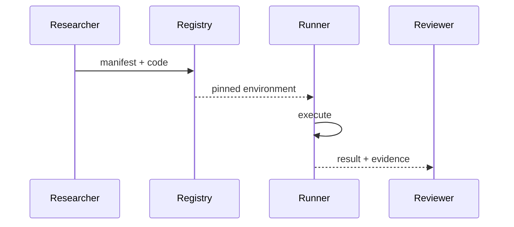
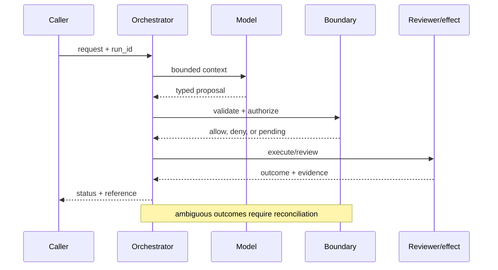

# Scientific reproducibility
Status: durable
Sources: [Nature — reproducibility](https://www.nature.com/articles/533452a); [DeepMind — 2026-02-11 Deep Think](https://deepmind.google/blog/accelerating-mathematical-and-scientific-discovery-with-gemini-deep-think/)
## In one sentence
Reproducibility means another team can rerun the same data, code, model settings, and analysis and inspect evidence.
## Background: what existed before
Papers often omitted exact prompts, seeds, dependency versions, or intermediate artifacts.
## What changed and why now
AI-assisted discovery adds nondeterminism and tool chains that must be recorded.
## Impact on current processing and architecture
Package data manifests, code commit, environment lockfile, prompt, seed, model ID, and outputs.
## Real-world applications and constraints
Important in drug and climate research. Proprietary data, nondeterministic hardware, and long-term storage complicate reruns.
## Mental model
```mermaid
flowchart LR
 D[Data]-->P[Pipeline]-->R[Result]
 E[Environment]-->P; M[Model/prompt]-->P; P-->A[Archive]
 classDef a fill:#dbeafe,stroke:#2563eb,color:#111827; classDef b fill:#dcfce7,stroke:#16a34a,color:#111827; class D,E,M a; class P,R,A b
```

## What changed this month
The February science concept applies reproducibility requirements to model-mediated discovery.
## Engineering consequence
Make runs content-addressed and publish a minimal reproduction command.
## Limits and failure modes
Reproducibility does not establish validity; inaccessible data and drifting APIs can block exact reruns.

## SDE2 primer and prerequisites

This lesson is about **scientific reproducibility** as a production systems problem. A language model is only one stage: an ingress service accepts work, a data layer supplies evidence, an orchestrator keeps state, a policy layer decides what may happen, and an operator or downstream system observes the result. Students should know HTTP, JSON, functions, and basic databases. SDE2 readers should also know queues, authentication, structured logs, metrics, retries, and service-level objectives (SLOs). The central habit is to label what the February source actually reports separately from a recommendation derived from it.

The useful boundary for scientific reproducibility is **run manifest, dataset version, environment lockfile, model ID, prompt, seed, artifact, and independent rerun**. These are not magic model capabilities. They are interfaces, records, checks, and operating procedures that can be unit-tested. Start with a low-blast-radius workflow and make every external effect attributable to a run ID, actor, policy version, and evidence reference.

## February source reading: fact before inference

The primary February event is **Google DeepMind's February 11, 2026 Deep Think report**. DeepMind says its February work came from collaboration among mathematicians, physicists, and computer scientists, and links papers, prompts, model outputs, and a taxonomy of AI contribution. It describes autonomous, collaborative, and human-plus-AI examples while explicitly saying no Level 3 or Level 4 major breakthrough is claimed. Those details make documentation part of the result. The report or announcement is evidence about what its publisher described. It is not independent validation of the publisher's claims, and it does not specify your data, threat model, latency budget, or regulatory obligations. That distinction matters because a source can motivate a concept without proving that the concept is solved.

The engineering inference in this lesson is that making an AI-assisted claim inspectable, rerunnable, and honest about who contributed what. Write that inference as a testable contract: state the accepted inputs, expected transitions, forbidden outcomes, and evidence needed to review a decision. If a test fails, improve the system or narrow the intended use; do not silently reinterpret a source claim as a guarantee.

## Historical baseline and problem boundary

Before this month's event, a team could make a convincing prototype with a synchronous request, a prompt, one model call, and a small script around an API. That baseline remains appropriate for drafting or a read-only experiment. It becomes unsafe or unreliable when a request crosses systems, waits, changes durable data, or must be explained later. The failure is not merely that the model can be wrong. It is that the surrounding software may have no place to record authority, version, evidence, retries, or recourse.

For **rerunning a model-assisted physics analysis from a frozen manifest rather than a screenshot**, draw the boundary before choosing a model. Identify the human or service principal, the records allowed into context, the actions proposed by the model, the component that validates them, and the owner who handles an ambiguous result. Decide which operations are reads, reversible writes, irreversible writes, or merely recommendations. A useful rule is that an untrusted string may influence a proposal but may never create a permission, erase an audit event, or bypass a state transition.

## Architecture and data flow

A deployable design has a control path and a data path. The control path versions configuration, policy, model adapters, schemas, evaluation sets, and rollout cohorts. The data path receives a request, authenticates it, retrieves bounded evidence, invokes the model, validates a typed proposal, executes an allowed action, and records an outcome. The scientific reproducibility boundary sits between the proposal and the observable outcome; it should be visible in traces and owned by a team.

```mermaid
flowchart LR
  A[Caller] --> I[Identity and tenant]
  I --> C[Context/evidence]
  C --> M[Model proposal]
  M --> B[Run Manifest boundary]
  B --> X[Effect or review]
  X --> L[(Evidence log)]
  classDef data fill:#dbeafe,stroke:#2563eb,color:#172554; classDef control fill:#dcfce7,stroke:#15803d,color:#14532d; classDef risk fill:#fee2e2,stroke:#dc2626,color:#450a0a
  class A,C,X,L data; class I,B control; class M risk
```

Use separate fields for user text, retrieved facts, policy instructions, tool output, and generated proposal. This prevents an instruction hidden in a document or tool result from acquiring the authority of a system rule. Every record should carry a tenant or project key where relevant. Cache keys must include authorization scope and source version. Logs should retain enough structured evidence to explain a decision while redacting secrets and unnecessary free text.

A minimal run record is: `run_id`, `request_id`, actor, tenant, purpose, model/version, policy/version, context references, proposal hash, action, decision, timestamps, attempts, effect IDs, and final status. For this topic add run manifest, dataset version, environment lockfile, model ID, prompt, seed, artifact, and independent rerun. Do not put an unbounded transcript in the primary operational table; store a redacted pointer with a retention policy.

## Processing walkthrough and state

The happy path is only one transition. A request may be malformed, missing evidence, denied, awaiting a reviewer, interrupted after a remote commit, or invalidated by a policy change. Model states explicitly: `received`, `validated`, `proposed`, `blocked`, `pending`, `running`, `succeeded`, `failed`, and `cancelled`. Guard transitions with a run version or compare-and-swap so two workers cannot both advance the same work.



Persist the proposal before a side effect. On retry, reuse the same idempotency key or proof artifact rather than asking the model to invent a new action. A timeout is a state of knowledge, not proof that nothing happened. For a reversible operation, record the compensating action; for an irreversible operation, stop and escalate. For this lesson, the most important transition is the one that prevents **rerunning a model-assisted physics analysis from a frozen manifest rather than a screenshot** from becoming an unreviewed or untraceable effect.

## Topic mechanics: Scientific reproducibility

### Decision model and topic-specific data contract

Reproducibility begins before the first model call. A run manifest should identify dataset hashes, filters, code commit, dependency lockfile, hardware/runtime, model and endpoint, system instructions, user prompt template, tool versions, seed, sampling parameters, and output artifacts. Store raw outputs and normalized analysis separately. When data cannot be shared, publish a synthetic fixture or a secure rerun protocol and document the limitation. For a Deep Think-inspired physics analysis, preserve the candidate derivation, verifier output, code used to calculate a quantity, and the human decision that accepted or rejected it. A rerun should compare both final values and important intermediate artifacts; a matching headline number can hide a changed dataset. Record nondeterminism and tolerance instead of promising bit-for-bit equality. Separate reproducibility from validity: a perfectly repeatable flawed experiment is still flawed. DeepMind links papers, prompts, model outputs, and a taxonomy of autonomous and collaborative contribution, and explicitly declines to claim its highest result levels. Those details are source facts that support transparent reporting, not evidence that every result will reproduce. Measure artifact completeness and independent rerun time.

The first implementation question is what the system can know at each stage. At ingress, it knows an authenticated actor and a request, but not whether the request is well-formed or authorized. During retrieval, it can establish source IDs, freshness, and access filters, but similarity is not truth. During model generation, it can ask for a schema and bounded plan, but the output is still untrusted. At the boundary, deterministic code can enforce limits. After execution, only a receipt, read-after-write check, or independent artifact establishes what happened. This epistemic separation keeps **run manifest, dataset version, environment lockfile, model ID, prompt, seed, artifact, and independent rerun** from collapsing into one prompt.

The second question is what must be versioned. Version the schema, policy, model adapter, context query, evaluator, and relevant data snapshot. Include the version in the run record and in emitted events. A deployment that changes a prompt but cannot identify which runs saw it cannot explain a regression. A policy change must not rewrite history: old runs retain the decision and policy that actually governed them.

The third question is where to put backpressure. Limit model calls, tool calls, context size, queue age, reviewer workload, and cumulative cost. Admission control should happen before expensive retrieval or inference when the request cannot meet its deadline or safety requirements. A bounded budget also makes failure legible: `budget_exhausted` is different from `model_error`, `policy_denied`, or `unknown_commit`.

For **scientific reproducibility**, instrument rerun success, artifact completeness, environment drift, independent agreement, and time to reproduce. Break down every metric by task slice, tenant, model version, policy version, and outcome class. An aggregate success number can improve while a small high-risk slice becomes worse. Pair capability metrics with reliability metrics and safety metrics; never use one as a proxy for the others.


## Scientific reproducibility: focused design workshop

The distinctive design choice for this lesson is **run manifests and independent reruns**. Model the core record as a typed object with `dataset_hash, commit, model_id, prompt_hash, seed, artifact`. Keep user prose outside that object; prose can explain intent, but code must decide whether the object is complete, authorized, fresh, and safe to execute. The invariant is: **a result is incomplete until data, code, model, prompt, and environment are recorded**. Emit an event whenever the invariant is checked, including the result, version, actor, and evidence reference. This makes a failure diagnosable without replaying an unconstrained model call.

Consider a concrete **scientific reproducibility** run. The ingress validator rejects missing identifiers and normalizes timestamps. The context builder retrieves only records permitted by tenant and purpose. The model receives a bounded view and returns a proposal, never a bearer credential or an opaque instruction. The topic-specific boundary then checks `dataset_hash, commit, model_id, prompt_hash, seed, artifact`. If the check passes, the effect owner commits or queues work and returns a receipt. If it fails, the system returns a structured denial or asks for evidence. A reviewer can inspect the event sequence and distinguish bad input, missing authority, stale state, and a remote failure.

There are two subtle cases worth testing. First, a valid record can become invalid between proposal and commit: an approval can expire, a memory can be deleted, a benchmark can be rerun with a different evaluator, or a capacity pool can fill. Recheck the relevant version at the boundary. Second, an invalid record can look plausible because a model or a dashboard smooths away uncertainty. Preserve `unknown`, `abstain`, and `needs_review` as first-class outcomes. Never convert them to success to simplify reporting.

For operations, partition metrics by `run manifests and independent reruns` and by model, policy, tenant, and outcome. Track the invariant violation directly, plus useful completion, latency, cost, and human override. A single aggregate can hide a catastrophic slice: one customer, one high-risk action, one rare theorem class, or one overloaded region. Set a release floor for the topic-specific safety metric before optimizing throughput.

The mini design exercise is **rerun after changing one dependency and explain the difference**. Implement it with an in-memory store first, then add a failure injection at every boundary. Expected behavior should be deterministic even if the proposal generator is not. Save the failing input as a regression fixture only after removing secrets and identifying the policy version that governed it.


## Applications and operational constraints

The strongest first application is **rerunning a model-assisted physics analysis from a frozen manifest rather than a screenshot** because it has a bounded workflow and a domain owner. A team might begin in shadow mode, where the system produces a proposal but performs no effect. Next, allow a canary cohort and only low-risk actions. Require an explicit launch review before expanding scope. The useful outcome is not “the model answered”; it is a completed task that meets quality, latency, cost, privacy, and policy constraints.

Other plausible applications include research software, drug discovery, climate modeling, benchmark studies, and graduate labs. Each has a different bottleneck. A support system values queue age and consistent escalation; an operations system values correctness and rollback; research values evidence and uncertainty; security values time to detect and false-positive capacity. Data residency, tenant isolation, secrets, rate limits, procurement, and human availability can dominate model latency. Document those constraints in the service contract rather than in an informal prompt.

Capacity planning should include the non-model dependencies. Retrieval may saturate a database, reviewers may saturate a queue, a policy service may add p95 latency, and a downstream API may have a stricter quota than the model. Budget the entire critical path and provide a degraded mode: read-only output, draft-only output, cached evidence, or a human handoff. A degraded response must be labeled so a user does not mistake it for a normal completion.

## Failure modes, security, and limits

The first failure mode is authority confusion: a generated plan is treated as a decision. Enforce the boundary in the effect-owning service and test adversarial proposals. The second is stale or poisoned context. Attach provenance and freshness, isolate tenants, and quarantine suspicious records. The third is partial completion. Use idempotency, reconciliation, checkpoints, and explicit compensation rather than an unbounded retry loop. The fourth is observability failure: a dashboard shows tokens but not who was affected or why. Emit structured events with access control and retention.

The fifth failure is metric gaming. A system can improve acceptance by refusing difficult requests, or improve latency by dropping evidence and safety checks. Define a minimum quality and safety floor before optimizing throughput. For human review, measure disagreement and overturns; a queue with 99% approvals may indicate excellent proposals or rubber-stamping. For privacy, avoid collecting raw content merely because it might be useful later.

The February source also has scope limits. DeepMind says its February work came from collaboration among mathematicians, physicists, and computer scientists, and links papers, prompts, model outputs, and a taxonomy of AI contribution. It describes autonomous, collaborative, and human-plus-AI examples while explicitly saying no Level 3 or Level 4 major breakthrough is claimed. Those details make documentation part of the result. Nothing in that observation proves robustness against your adversaries, correctness on your domain, or a particular service-level target. Treat vendor examples as source facts and label recommendations as inference. When evidence is weak, abstention and escalation are valid outcomes.

## Evaluation and change management

Build a fixture set from ordinary, ambiguous, malformed, adversarial, slow, stale, and partially completed cases. Include a golden expected state and the invariants that must never break. Run the set against a pinned model and a deterministic baseline. Review failures by category, not just a total score. Keep hidden cases to detect overfitting, and sample production traces only after removing secrets.

Release gates should include a quality floor, a policy-violation ceiling, a reliability budget, a cost budget, and an evidence-completeness check. Roll out to a small cohort, compare with shadow results, and retain a kill switch that disables risky effects without destroying diagnostic reads. On rollback, record which version was disabled and whether external effects require remediation.

## February primary-source evidence

The source fact is bounded: **DeepMind says its February work came from collaboration among mathematicians, physicists, and computer scientists, and links papers, prompts, model outputs, and a taxonomy of AI contribution. It describes autonomous, collaborative, and human-plus-AI examples while explicitly saying no Level 3 or Level 4 major breakthrough is claimed. Those details make documentation part of the result.** The February publication date and the publisher's wording should be cited when teaching the event. The recommendation that teams implement run manifest, dataset version, environment lockfile, model ID, prompt, seed, artifact, and independent rerun is an inference from the event plus established systems practice. It should be validated with local fixtures, security review, operational metrics, and domain experts. The source does not independently verify the examples, and this article does not present them as guarantees.

## Mini exercise extension

Create six fixtures for **rerunning a model-assisted physics analysis from a frozen manifest rather than a screenshot**: a normal request, missing evidence, an adversarial instruction, a policy denial, a timeout or interrupted run, and a successful outcome. For each fixture record the expected state, the allowed effect, and the evidence a reviewer should see. Add one version change and prove that the old event retains its original version. Your acceptance criterion is not a polished answer; it is a correct boundary, an explainable decision, and a safe recovery path.

## Build it locally: numbered implementation

1. Define dataclasses for `Request`, `Context`, `Proposal`, `Decision`, `Event`, and `Outcome`; require a run ID and version fields.
2. Write a deterministic boundary function for **run manifest, dataset version, environment lockfile, model ID, prompt, seed, artifact, and independent rerun**; deny unknown actions and malformed arguments.
3. Add a fake model that returns one valid and two invalid proposals, including an instruction hidden in retrieved text.
4. Add a fake downstream service with a timeout, an idempotency map, and a read-after-write reconciliation method.
5. Persist redacted JSON Lines events and implement replay without invoking a live model.
6. Run the six fixtures, assert the security invariant, and calculate rerun success, artifact completeness, environment drift, independent agreement, and time to reproduce.
7. Change one policy or schema version, rerun the fixtures, and inspect the diff in evidence and state transitions.

## Runnable low-cost example

```python
import json
manifest = {"dataset_hash":"d1", "commit":"abc", "model_id":"demo", "prompt_hash":"p1", "seed":7}
print(json.dumps(manifest, sort_keys=True))
```

This example is intentionally small and deterministic. It demonstrates the lesson's boundary and its invariant; it does not claim production-grade authentication, durability, isolation, or domain correctness. Extend it with the numbered build steps and failure fixtures before drawing operational conclusions.

## Interview Q&A

**Q: What is the difference between a source fact and an engineering inference?** A: The fact is what a dated publisher says it released, measured, or observed. The inference is a design recommendation derived from that fact and other knowledge; it needs local validation.

**Q: Why separate model output from the boundary?** A: Model output is probabilistic and can be manipulated by input. The boundary is deterministic, attributable code that can enforce authorization, schemas, budgets, and state transitions.

**Q: Which metric would you put on the dashboard first?** A: A useful outcome metric plus a failure metric specific to the topic—rerun success, artifact completeness, environment drift, independent agreement, and time to reproduce. Pair it with slices so an aggregate cannot hide a critical regression.

**Q: When should the system abstain?** A: When evidence is missing or stale, the policy is ambiguous, the budget is exhausted, or an external effect has an unknown status. Escalate with evidence instead of fabricating confidence.

**Q: What should happen during rollout?** A: Pin versions, start in shadow or canary mode, limit high-risk effects, monitor quality/reliability/safety separately, and keep an audited rollback path.

## Glossary

- **Run Manifest**: the topic-specific control boundary that mediates a model proposal and an outcome.
- **Run ID**: a stable identifier joining request, context, decisions, attempts, and effects.
- **Idempotency**: repeating a request produces one logical effect rather than duplicates.
- **Provenance**: evidence describing origin, version, and transformations.
- **SLO**: a measurable service target such as latency or successful completion.
- **Abstention**: an explicit refusal or escalation when evidence or authority is insufficient.
- **Inference**: an engineering conclusion drawn from facts, not a quotation or guarantee from a source.

## References

- [Google DeepMind: Gemini Deep Think — February 11, 2026](https://deepmind.google/blog/accelerating-mathematical-and-scientific-discovery-with-gemini-deep-think/)
- [Nature: reproducibility](https://www.nature.com/articles/533452a)

## Claim ledger

| Claim | Source | Fact or inference |
|---|---|---|
| The cited publisher published the February event on the stated date. | [Google DeepMind's February 11, 2026 Deep Think report](https://deepmind.google/blog/accelerating-mathematical-and-scientific-discovery-with-gemini-deep-think/) | Fact |
| DeepMind says its February work came from collaboration among mathematicians, physicists, and computer scientists, and links papers, prompts, model outputs, and a taxonomy of AI contribution. | [Google DeepMind's February 11, 2026 Deep Think report](https://deepmind.google/blog/accelerating-mathematical-and-scientific-discovery-with-gemini-deep-think/) | Fact |
| Making an ai-assisted claim inspectable, rerunnable, and honest about who contributed what. | Engineering design synthesis | Inference |
| A separately enforced boundary is safer and easier to operate than treating model text as authority. | Topic standards and systems reasoning | Inference |
| The local example demonstrates the concept but does not prove production security, reliability, or generalization. | This lesson | Fact about the example |
