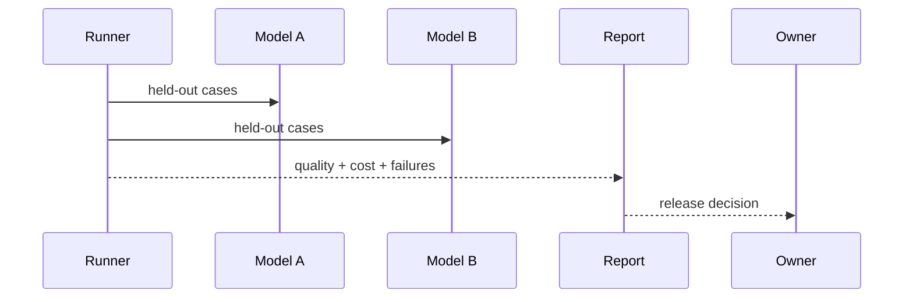
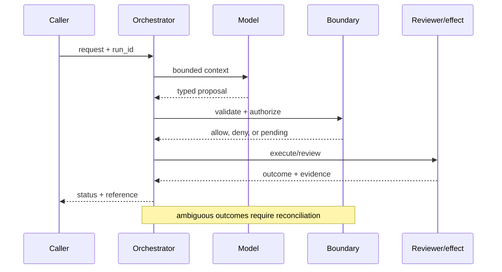

# Model benchmarking
Status: durable
Sources: [HELM](https://crfm.stanford.edu/helm/latest/); [NIST AI RMF](https://www.nist.gov/itl/ai-risk-management-framework); [Google DeepMind's February 11, 2026 Deep Think report](https://deepmind.google/blog/accelerating-mathematical-and-scientific-discovery-with-gemini-deep-think/)
## In one sentence
Meaningful benchmarking tests representative tasks, costs, latency, and failure modes—not one leaderboard score.
## Background: what existed before
Teams selected models from aggregate accuracy numbers disconnected from their workload.
## What changed and why now
System-level evaluation emphasizes scenarios, robustness, and transparent metrics.
## Impact on current processing and architecture
Build a task suite with held-out data, rubric, latency/cost capture, and regression thresholds.
## Real-world applications and constraints
Compare support summarizers or coding agents. Test leakage, sample size, and distribution shift.
## Mental model
```mermaid
flowchart LR
 T[Tasks]-->R[Runner]-->M[Metrics]-->D[Decision]
 R-->C[Cost/latency]
 classDef a fill:#dbeafe,stroke:#2563eb,color:#111827; classDef b fill:#dcfce7,stroke:#16a34a,color:#111827; class T,R a; class M,C,D b
```

## What changed this month
February frames evaluation as a workload decision rather than a vanity leaderboard.
## Engineering consequence
Report confidence intervals and slice results; keep a fixed regression set.
## Limits and failure modes
Benchmarks can be gamed or stale; human rubrics vary; offline gains may not transfer online.

## SDE2 primer and prerequisites

This lesson treats **model benchmarking** as a concrete engineering discipline, not a synonym for model intelligence. Its key artifact is model benchmarking evidence and state: the service must preserve it across model benchmarking and expose enough evidence for an operator to decide what happened. A model may suggest a next step, but deterministic interfaces, ownership, and versioned records decide whether that suggestion is usable. The useful prerequisite is familiarity with HTTP, JSON, persistence, queues, retries, authentication, and service-level objectives; the topic adds its own state and failure vocabulary.

The useful boundary for model benchmarking is **task taxonomy, held-out slice, contamination check, confidence interval, cost-quality frontier, and human rubric**. These are not magic model capabilities. They are interfaces, records, checks, and operating procedures that can be unit-tested. Start with a low-blast-radius workflow and make every external effect attributable to a run ID, actor, policy version, and evidence reference.

## February source reading: fact before inference

For model benchmarking, read the February source through its own claim boundary. The cited February event is **Google DeepMind's February 11, 2026 Deep Think report**. DeepMind reports up to 90% on IMO-ProofBench Advanced, says results were graded by human experts, and reports lower inference-time compute for Aletheia at comparable reasoning quality. The same post shows FutureMath Basic results remain well below its benchmark reference and distinguishes levels of AI contribution. These reported numbers illustrate why a benchmark needs task and protocol context. The report or announcement is evidence about what its publisher described. It is not independent validation of the publisher's claims, and it does not specify your data, threat model, latency budget, or regulatory obligations. That distinction matters because a source can motivate a concept without proving that the concept is solved.

For model benchmarking, the engineering inference is narrower: turn the cited capability into an operational contract with topic-specific inputs, states, evidence, and failure ownership. Test that contract against ordinary, adversarial, stale, and interrupted work. A source can motivate this design; it cannot guarantee the resulting reliability or safety.

## Historical baseline and problem boundary

The useful benchmarking baseline is a single headline score on a named test set. It becomes misleading when the split, evaluator, decoding settings, or protected slices change. Reliable benchmarking treats task, denominator, configuration, and uncertainty as part of the result.

For **model benchmarking**, the model benchmarking boundary names model benchmarking evidence, the actor, the mutable state, and the rejecting component. Treat read evidence, model proposals, and committed effects as different data classes. A request can influence a proposal but cannot grant authority. Test this boundary with stale, malformed, replayed, and partially completed cases.

## Architecture and data flow

The model benchmarking path starts with its own model benchmarking evidence admission check, then records topic state, invokes only the needed processor, and finishes at a model benchmarking outcome gate for **model benchmarking**. Keep policy and configuration revisions beside the work, while generated text remains separate from authorization. Measure the bottleneck that belongs to model benchmarking, not a generic agent score.

```mermaid
flowchart LR
  A[Caller] --> I[Identity and tenant]
  I --> C[Context/evidence]
  C --> M[Model proposal]
  M --> B[Task Taxonomy boundary]
  B --> X[Effect or review]
  X --> L[(Evidence log)]
  classDef data fill:#dbeafe,stroke:#2563eb,color:#172554; classDef control fill:#dcfce7,stroke:#15803d,color:#14532d; classDef risk fill:#fee2e2,stroke:#dc2626,color:#450a0a
  class A,C,X,L data; class I,B control; class M risk
```

Keep task split, model checkpoint, decoding configuration, evaluator output, uncertainty estimate, and publication record separate. A leaderboard number is not a complete result. Bind task revision, denominator, hardware, evaluator, and contamination controls to each run while preserving only permitted diagnostic artifacts.

For model benchmarking, record a run identifier, actor, purpose, task taxonomy, held-out slice, contamination check, confidence interval, cost-quality frontier, and human rubric, policy and model versions, evidence references, decision, attempts, timestamps, and final state. Add the topic's durable artifact—such as a checkpoint, capability, proof status, privacy budget, or provenance chain—rather than assuming a generic transcript can explain the outcome. Keep raw content behind controlled references and retention rules.

## Processing walkthrough and state

Benchmark state should distinguish planned, running, incomplete, scored, audited, comparable, and withdrawn. Require complete protected slices and evaluator identity before publishing a score. A failed job is not a low model score, and a changed denominator is not a comparable result.



On retry, reuse the model benchmarking idempotency key or durable artifact; never ask the model to invent a second action when the first attempt has an unknown outcome.

## Topic mechanics: Model benchmarking

### Decision model and topic-specific data contract

A benchmark is a measurement instrument with a workload model. Start with a taxonomy: routine requests, ambiguous cases, long contexts, tool calls, adversarial inputs, and high-cost or high-risk slices. Freeze a held-out set and record contamination risks, rubric, evaluator version, model configuration, tool permissions, retries, and human intervention. Report a distribution, not just a mean: quality by slice, abstention, critical errors, p50/p95 latency, tokens, dollars, and recovery. A cost-quality frontier often makes a smaller model preferable for routine work and a slower verifier preferable for rare high-impact work. Human grading needs calibration and agreement; automated graders need adversarial tests. DeepMind's February post provides a useful example: it reports up to 90% on IMO-ProofBench Advanced, human grading, lower inference-time compute in Aletheia, and much lower FutureMath Basic performance than its benchmark reference. The contrast warns against moving a score between task families. Test the decision rule itself: would a confidence interval or one costly failure change the procurement choice? Keep a regression set after deployment and audit for leakage.

Ask what **model benchmarking** can establish at each transition. The request establishes intent only; the model benchmarking evidence and state stage establishes a bounded representation; the next checker, owner, or reconciliation step establishes whether the proposed result is acceptable. A timeout, missing dependency, or ambiguous response therefore becomes an explicit status for **model benchmarking**, not an implicit success. Persist the relevant versions and evidence references, and retain unknown, deferred, or needs-review states when the system cannot prove the stronger claim.

Benchmarking needs versioned task definitions, scoring code, model checkpoint, decoding settings, hardware, and evaluation split. Publish those alongside the score; changing the denominator or evaluator is a new benchmark result, not a quiet update to the old number.

Benchmark runs should cap cases, decoding attempts, evaluator calls, and hardware time while protecting required slices. A run that cannot execute the full denominator is `incomplete`, not a score. Separate `fixture_error`, `model_failure`, and `evaluator_failure` so a published comparison remains interpretable.

Break model benchmarking metrics down by task slice, actor or tenant, version, dependency, and outcome class so a healthy average cannot hide a dangerous subgroup.


## Model benchmarking: focused design workshop

In model benchmarking, keep request prose, retrieved evidence, generated proposals, and the lesson artifact in separate typed fields. model benchmarking code owns completeness, freshness, authorization, and promotion of a result; prose only explains intent.

For model benchmarking, the event trail must let an operator distinguish bad input, missing topic evidence, stale state, dependency failure, and a confirmed outcome. Record the model benchmarking artifact and the decision that moved it between states.

Test benchmark races. A leaderboard task or evaluator may change while jobs are queued, or a failed protected slice may be hidden by a newly computed aggregate. Freeze split, evaluator, and denominator at admission. Preserve `incomplete` and `evaluator_changed`; neither is a comparable score.

For model benchmarking, slice model benchmarking evidence metrics by task class, actor or tenant, governing revision, dependency, and final state. Report the topic invariant, useful completion, latency, cost, and recovery burden together; averages are insufficient when a rare model benchmarking failure carries the largest consequence.

Save a failing model benchmarking input as a regression fixture only after redaction, classification, and capture of the governing version.


## Applications and operational constraints

Start model benchmarking in observation or draft mode, compare against a deterministic or human baseline, then expand only a narrow cohort and reversible effect class.

Beyond **model benchmarking**, model benchmarking applies to workflows where model benchmarking evidence matters. Choose an application with a named owner and bounded effects, then document its data residency, access, quota, staffing, latency, and rollback constraints. The right metric differs by deployment; do not import a support or research target without checking the actual user outcome.

Plan benchmark capacity around evaluator workers, protected slices, hardware allocation, and artifact retention. If a required slice cannot run, publish an incomplete status rather than a favorable partial score. A cheaper run is valuable only when its denominator and evaluator remain comparable.

## Failure modes, security, and limits

Benchmarking fails through contamination, denominator drift, evaluator leakage, and aggregate scores that hide a protected slice. Keep test data and scoring code controlled, publish confidence or variance where relevant, and require complete run manifests. A leaderboard change is not a model improvement until the task and evaluator remain comparable.

Benchmark metrics can improve through test contamination, hidden prompt tuning, denominator changes, or selecting only favorable tasks. Pair headline scores with protected splits, evaluator audit, confidence intervals, and full run manifests. A leaderboard position is not a general capability claim.

For model benchmarking, the February source has a bounded claim. The February source also has scope limits. DeepMind reports up to 90% on IMO-ProofBench Advanced, says results were graded by human experts, and reports lower inference-time compute for Aletheia at comparable reasoning quality. The same post shows FutureMath Basic results remain well below its benchmark reference and distinguishes levels of AI contribution. These reported numbers illustrate why a benchmark needs task and protocol context. Nothing in that observation proves robustness against your adversaries, correctness on your domain, or a particular service-level target. Treat vendor examples as source facts and label recommendations as inference. When evidence is weak, abstention and escalation are valid outcomes.

## Evaluation and change management

Build benchmark fixtures for protected slices, contamination checks, evaluator disagreement, incomplete runs, and task variants. Assert denominator, split, hardware, and scoring-version identity. Keep a holdout set hidden and report variance or uncertainty rather than treating one aggregate as general capability.

Publish a benchmark update only when split identity, evaluator integrity, protected-slice results, and run completeness meet the reporting contract. Re-run a small holdout before release, retain the prior manifest, and label any changed task or scoring code as a new comparison.

## February primary-source evidence

The source fact is bounded: **DeepMind reports up to 90% on IMO-ProofBench Advanced, says results were graded by human experts, and reports lower inference-time compute for Aletheia at comparable reasoning quality. The same post shows FutureMath Basic results remain well below its benchmark reference and distinguishes levels of AI contribution. These reported numbers illustrate why a benchmark needs task and protocol context.** The February publication date and the publisher's wording should be cited when teaching the event. The recommendation that teams implement task taxonomy, held-out slice, contamination check, confidence interval, cost-quality frontier, and human rubric is an inference from the event plus established systems practice. It should be validated with local fixtures, security review, operational metrics, and domain experts. The source does not independently verify the examples, and this article does not present them as guarantees.

## Mini exercise extension

Create six fixtures for **model benchmarking** using the model benchmarking vocabulary: a model benchmarking evidence omission, a stale or contradictory model benchmarking evidence record, an adversarial input, a boundary rejection, a dependency interruption, and a verified completion. Assert different states for each case; do not use one generic success label. Store the evidence reference and recovery owner beside every assertion, then alter the governing version and prove that prior model benchmarking records remain historical.

## Build it locally: numbered implementation

1. Construct a model benchmarking test record with actor, request, model benchmarking evidence, decision, and outcome fields; reject a run that cannot identify the governing version.
2. Implement the model benchmarking boundary as a pure function. It must inspect model benchmarking evidence, return a typed state, and refuse an unrecognized or incomplete transition.
3. Create a deterministic model benchmarking generator with a valid proposal, a malformed proposal, and an input that attempts to redirect the topic-specific decision.
4. Simulate the model benchmarking dependency failing after admission. Use its own correlation or artifact key to detect duplicate delivery and reconcile uncertainty.
5. Write an event stream containing model benchmarking states, redacting sensitive payloads while retaining the evidence pointers needed for an offline replay.
6. Measure model benchmarking correctness alongside rejection rate, time in each state, recovery work, and resource cost; report slices relevant to the lesson.
7. Change the model benchmarking schema or policy revision and verify that old events still resolve under their original contract rather than being reinterpreted.

## Runnable low-cost example

```python
runs = [{"model":"A","slice":"safety","score":.98,"cost":.10},{"model":"B","slice":"safety","score":.90,"cost":.03}]
chosen = max(runs, key=lambda r: (r["score"], -r["cost"]))
print(chosen)
```

This benchmark sketch computes a score over a toy split. It does not measure contamination, uncertainty, evaluator validity, or generalization; add protected slices and complete manifests before publishing comparisons.

## Interview Q&A

**Q: What makes a benchmark result interpretable?** A: Enforce the model benchmarking rule in deterministic code at the resource or artifact boundary; model output may propose, but it cannot authorize or prove the result.

**Q: What does a benchmark score measure?** A: Enforce the model benchmarking rule in deterministic code at the resource or artifact boundary; model output may propose, but it cannot authorize or prove the result.

**Q: Which metric would you put on the dashboard first?** A: Track model benchmarking evidence, plus false acceptance or rejection, time spent, resource cost, and recovery; slice results by the model benchmarking risk classes.

**Q: When should a score be withheld?** A: Enforce the model benchmarking rule in deterministic code at the resource or artifact boundary; model output may propose, but it cannot authorize or prove the result.

**Q: How should model benchmarking be released?** A: Pin model benchmarking evidence and the governing versions, begin with shadow or reversible work, and require the model benchmarking invariant before widening effects.

## Glossary

- **Task Taxonomy**: the topic-specific control boundary that mediates a model proposal and an outcome.
- **Run ID**: the correlation key that joins one model benchmarking attempt to its actor, model benchmarking evidence, decisions, and recovery evidence.
- **Idempotency**: the model benchmarking guarantee that a retry does not create a second logical result or duplicate effect.
- **Provenance**: origin, version, and transformation evidence attached to a model benchmarking input or artifact.
- **SLO**: an explicit model benchmarking service target, such as freshness, verification latency, queue age, or availability.
- **Abstention**: the model benchmarking state used when evidence, authority, or dependency health is insufficient for a stronger claim.
- **Inference**: an engineering recommendation about model benchmarking derived from source facts rather than presented as a source guarantee.

## References

- [Google DeepMind: Gemini Deep Think — February 11, 2026](https://deepmind.google/blog/accelerating-mathematical-and-scientific-discovery-with-gemini-deep-think/)
- [Stanford HELM](https://crfm.stanford.edu/helm/latest/)
- [NIST AI Risk Management Framework](https://www.nist.gov/itl/ai-risk-management-framework)

## Claim ledger

| Claim | Source | Fact or inference |
|---|---|---|
| The cited publisher published the February event on the stated date. | [Google DeepMind's February 11, 2026 Deep Think report](https://deepmind.google/blog/accelerating-mathematical-and-scientific-discovery-with-gemini-deep-think/) | Fact |
| DeepMind reports up to 90% on IMO-ProofBench Advanced, says results were graded by human experts, and reports lower inference-time compute for Aletheia at comparable reasoning quality. | [Google DeepMind's February 11, 2026 Deep Think report](https://deepmind.google/blog/accelerating-mathematical-and-scientific-discovery-with-gemini-deep-think/) | Fact |
| Turning a headline score into a workload decision with slices, cost, latency, and failure analysis. | Engineering design synthesis | Inference |
| A separately enforced boundary is safer and easier to operate than treating model text as authority. | Topic standards and systems reasoning | Inference |
| The local example demonstrates the concept but does not prove production security, reliability, or generalization. | This lesson | Fact about the example |
