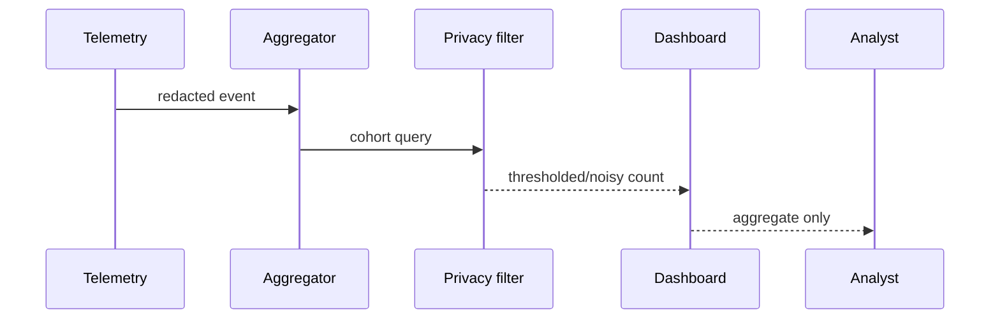
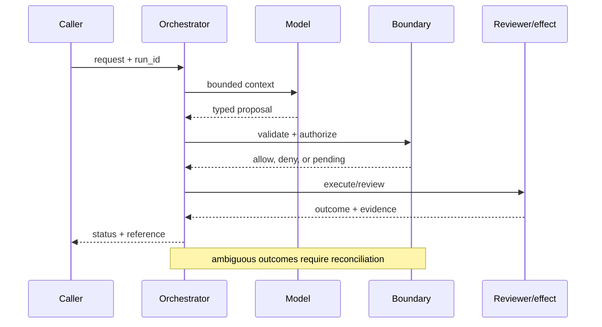

# Privacy-preserving analytics
Status: durable
Sources: [NIST Privacy Framework](https://www.nist.gov/privacy-framework); [Google differential privacy](https://developers.google.com/differential-privacy); [OpenAI's February 25, 2026 report, Disrupting malicious uses of AI](https://openai.com/index/disrupting-malicious-ai-uses/)
## In one sentence
Privacy-preserving analytics extracts aggregate signal while limiting what can be learned about an individual.
## Background: what existed before
Usage dashboards often retained raw identifiers and exposed small cohorts.
## What changed and why now
Agent telemetry increases the volume and sensitivity of interaction data, making minimization and noise important.
## Impact on current processing and architecture
Strip identifiers, aggregate cohorts, enforce minimum counts, and consider differential privacy noise.
## Real-world applications and constraints
Measure feature adoption without reading conversations. Noise, utility loss, and privacy-budget accounting constrain results.
## Mental model
```mermaid
flowchart LR
 R[Raw event]-->M[Minimize]-->G[Group]-->N[Noise]-->D[Dashboard]
 classDef a fill:#dbeafe,stroke:#2563eb,color:#111827; classDef b fill:#dcfce7,stroke:#16a34a,color:#111827; class R,D a; class M,G,N b
```

## What changed this month
February extends governance from agent actions to the analytics used to operate them.
## Engineering consequence
Set retention and query controls before collecting telemetry; document privacy assumptions.
## Limits and failure modes
Auxiliary data can re-identify users; repeated queries can consume a privacy budget; aggregates can still be sensitive.

## SDE2 primer and prerequisites

This lesson treats **privacy preserving analytics** as a concrete engineering discipline, not a synonym for model intelligence. Its key artifact is privacy preserving analytics evidence and state: the service must preserve it across privacy preserving analytics and expose enough evidence for an operator to decide what happened. A model may suggest a next step, but deterministic interfaces, ownership, and versioned records decide whether that suggestion is usable. The useful prerequisite is familiarity with HTTP, JSON, persistence, queues, retries, authentication, and service-level objectives; the topic adds its own state and failure vocabulary.

The useful boundary for privacy-preserving analytics is **data minimization, pseudonym, cohort threshold, privacy budget, differential privacy, and controlled join**. These are not magic model capabilities. They are interfaces, records, checks, and operating procedures that can be unit-tested. Start with a low-blast-radius workflow and make every external effect attributable to a run ID, actor, policy version, and evidence reference.

## February source reading: fact before inference

For privacy preserving analytics, read the February source through its own claim boundary. The cited February event is **OpenAI's February 25, 2026 report, Disrupting malicious uses of AI**. OpenAI's February report describes cross-platform and cross-model threat activity, which creates a legitimate need to join signals while limiting exposure. The report does not prescribe differential privacy. NIST's privacy framework and Google's differential-privacy documentation supply the controls and trade-offs for that engineering response. The report or announcement is evidence about what its publisher described. It is not independent validation of the publisher's claims, and it does not specify your data, threat model, latency budget, or regulatory obligations. That distinction matters because a source can motivate a concept without proving that the concept is solved.

For privacy preserving analytics, the engineering inference is narrower: turn the cited capability into an operational contract with topic-specific inputs, states, evidence, and failure ownership. Test that contract against ordinary, adversarial, stale, and interrupted work. A source can motivate this design; it cannot guarantee the resulting reliability or safety.

## Historical baseline and problem boundary

The useful analytics baseline is an analyst querying row-level data and exporting a report. It offers precision but exposes membership, linkage, and purpose risks. Privacy-preserving analytics adds release controls and budget accounting while making utility and residual disclosure risk explicit.

For **privacy preserving analytics**, the privacy preserving analytics boundary names privacy preserving analytics evidence, the actor, the mutable state, and the rejecting component. Treat read evidence, model proposals, and committed effects as different data classes. A request can influence a proposal but cannot grant authority. Test this boundary with stale, malformed, replayed, and partially completed cases.

## Architecture and data flow

The privacy preserving analytics path starts with its own privacy preserving analytics evidence admission check, then records topic state, invokes only the needed processor, and finishes at a privacy preserving analytics outcome gate for **privacy preserving analytics**. Keep policy and configuration revisions beside the work, while generated text remains separate from authorization. Measure the bottleneck that belongs to privacy preserving analytics, not a generic agent score.

```mermaid
flowchart LR
  A[Caller] --> I[Identity and tenant]
  I --> C[Context/evidence]
  C --> M[Model proposal]
  M --> B[Data Minimization boundary]
  B --> X[Effect or review]
  X --> L[(Evidence log)]
  classDef data fill:#dbeafe,stroke:#2563eb,color:#172554; classDef control fill:#dcfce7,stroke:#15803d,color:#14532d; classDef risk fill:#fee2e2,stroke:#dc2626,color:#450a0a
  class A,C,X,L data; class I,B control; class M risk
```

Keep row-level inputs, cohort definition, privacy mechanism, budget ledger, released aggregate, and access purpose separate. A masked export is not automatically private. Bind query identity, purpose, cohort size, composition spend, and release policy to each result while avoiding raw-row retention.

For privacy preserving analytics, record a run identifier, actor, purpose, data minimization, pseudonym, cohort threshold, privacy budget, differential privacy, and controlled join, policy and model versions, evidence references, decision, attempts, timestamps, and final state. Add the topic's durable artifact—such as a checkpoint, capability, proof status, privacy budget, or provenance chain—rather than assuming a generic transcript can explain the outcome. Keep raw content behind controlled references and retention rules.

## Processing walkthrough and state

Privacy-query state should distinguish requested, purpose_checked, cohort_rejected, computed, budget_spent, released, and withheld. Check cumulative privacy loss before release and preserve denied-query metadata without exposing the underlying cohort. A noisy answer can still be unsafe when combined with earlier releases.



On retry, reuse the privacy preserving analytics idempotency key or durable artifact; never ask the model to invent a second action when the first attempt has an unknown outcome.

## Topic mechanics: Privacy-preserving analytics

### Decision model and topic-specific data contract

Privacy-preserving analytics begins with purpose limitation. Define the question—such as weekly abuse rate by region—before collecting raw conversation content. Replace direct identifiers with keyed tokens in a restricted join service, strip fields not needed for the aggregate, enforce minimum cohort sizes, and separate an investigator's privileged evidence path from a product dashboard. Differential privacy adds calibrated noise and a privacy budget; it does not make a sensitive query harmless, and repeated or overlapping queries consume budget. For cross-platform abuse analysis, maintain two views: a protected linkage table that can join events under strict access and an aggregate table exposed to analysts. Log query purpose, caller, policy, and budget consumption. Test singling out with auxiliary data, differencing attacks across time windows, small cohorts, and repeated queries. Retain raw evidence only as long as an incident or legal process requires, and make deletion observable. The February report's cross-platform threat observation explains why linkage may be useful; it does not grant permission to collect everyone’s identity. Measure analyst utility alongside re-identification risk and deletion lag.

Ask what **privacy preserving analytics** can establish at each transition. The request establishes intent only; the privacy preserving analytics evidence and state stage establishes a bounded representation; the next checker, owner, or reconciliation step establishes whether the proposed result is acceptable. A timeout, missing dependency, or ambiguous response therefore becomes an explicit status for **privacy preserving analytics**, not an implicit success. Persist the relevant versions and evidence references, and retain unknown, deferred, or needs-review states when the system cannot prove the stronger claim.

Privacy-preserving analytics should version the cohort query, consent or purpose rule, noise mechanism, privacy budget ledger, and release threshold. Keep the budget spend attached to each result so a repeated query cannot appear harmless merely because its individual output is noisy.

Privacy analytics should enforce minimum cohort size, query rate, join depth, and cumulative privacy loss before computation. If a query is denied or the budget is depleted, return that state rather than releasing a more precise fallback. Log `small_cohort`, `budget_exhausted`, and `purpose_denied` distinctly.

Break privacy preserving analytics metrics down by task slice, actor or tenant, version, dependency, and outcome class so a healthy average cannot hide a dangerous subgroup.


## Privacy-preserving analytics: focused design workshop

In privacy preserving analytics, keep request prose, retrieved evidence, generated proposals, and the lesson artifact in separate typed fields. privacy preserving analytics code owns completeness, freshness, authorization, and promotion of a result; prose only explains intent.

For privacy preserving analytics, the event trail must let an operator distinguish bad input, missing topic evidence, stale state, dependency failure, and a confirmed outcome. Record the privacy preserving analytics artifact and the decision that moved it between states.

Test privacy races. Consent or purpose can be withdrawn while a query is running, and repeated releases can consume more privacy budget than any single result shows. Check purpose and ledger state immediately before release. Preserve `budget_exhausted` and `purpose_revoked`; do not release a more detailed fallback.

For privacy preserving analytics, slice privacy preserving analytics evidence metrics by task class, actor or tenant, governing revision, dependency, and final state. Report the topic invariant, useful completion, latency, cost, and recovery burden together; averages are insufficient when a rare privacy preserving analytics failure carries the largest consequence.

Save a failing privacy preserving analytics input as a regression fixture only after redaction, classification, and capture of the governing version.


## Applications and operational constraints

Start privacy preserving analytics in observation or draft mode, compare against a deterministic or human baseline, then expand only a narrow cohort and reversible effect class.

Beyond **privacy preserving analytics**, privacy preserving analytics applies to workflows where privacy preserving analytics evidence matters. Choose an application with a named owner and bounded effects, then document its data residency, access, quota, staffing, latency, and rollback constraints. The right metric differs by deployment; do not import a support or research target without checking the actual user outcome.

Plan privacy-analytics capacity around cohort computation, secure joins, key management, and privacy-budget accounting. Under load, queue or reject a query while preserving its purpose and budget check. A coarser aggregate may be a safe fallback, but label its precision and release policy.

## Failure modes, security, and limits

Privacy analytics fails through linkage, repeated-query attacks, small cohorts, and budget accounting that ignores correlated releases. Enforce purpose and minimum cohort rules before computation, spend a tracked privacy budget, and review joins that can reconstruct identities. More noise is not a substitute for correct governance.

Privacy metrics can improve by shrinking cohorts, spending budget across untracked joins, or publishing only queries that pass a utility threshold. Pair utility with privacy loss, linkage tests, purpose compliance, and repeated-query accounting. A noisy result is not safe if the release sequence identifies people.

For privacy preserving analytics, the February source has a bounded claim. The February source also has scope limits. OpenAI's February report describes cross-platform and cross-model threat activity, which creates a legitimate need to join signals while limiting exposure. The report does not prescribe differential privacy. NIST's privacy framework and Google's differential-privacy documentation supply the controls and trade-offs for that engineering response. Nothing in that observation proves robustness against your adversaries, correctness on your domain, or a particular service-level target. Treat vendor examples as source facts and label recommendations as inference. When evidence is weak, abstention and escalation are valid outcomes.

## Evaluation and change management

Build privacy fixtures for small cohorts, repeated queries, sensitive joins, purpose mismatch, budget exhaustion, and approved aggregates. Assert that no release exceeds its ledger and that outputs resist linkage tests. Use synthetic or redacted records; never sample raw production data merely to simplify evaluation.

Release an aggregate only when minimum cohort, purpose, privacy-budget, linkage-resistance, and utility requirements hold. Test the query sequence against a privacy ledger, retain an audit-only denial path, and do not reissue prior outputs after a policy rollback without reevaluating cumulative loss.

## February primary-source evidence

The source fact is bounded: **OpenAI's February report describes cross-platform and cross-model threat activity, which creates a legitimate need to join signals while limiting exposure. The report does not prescribe differential privacy. NIST's privacy framework and Google's differential-privacy documentation supply the controls and trade-offs for that engineering response.** The February publication date and the publisher's wording should be cited when teaching the event. The recommendation that teams implement data minimization, pseudonym, cohort threshold, privacy budget, differential privacy, and controlled join is an inference from the event plus established systems practice. It should be validated with local fixtures, security review, operational metrics, and domain experts. The source does not independently verify the examples, and this article does not present them as guarantees.

## Mini exercise extension

Create six fixtures for **privacy preserving analytics** using the privacy preserving analytics vocabulary: a privacy preserving analytics evidence omission, a stale or contradictory privacy preserving analytics evidence record, an adversarial input, a boundary rejection, a dependency interruption, and a verified completion. Assert different states for each case; do not use one generic success label. Store the evidence reference and recovery owner beside every assertion, then alter the governing version and prove that prior privacy preserving analytics records remain historical.

## Build it locally: numbered implementation

1. Construct a privacy preserving analytics test record with actor, request, privacy preserving analytics evidence, decision, and outcome fields; reject a run that cannot identify the governing version.
2. Implement the privacy preserving analytics boundary as a pure function. It must inspect privacy preserving analytics evidence, return a typed state, and refuse an unrecognized or incomplete transition.
3. Create a deterministic privacy preserving analytics generator with a valid proposal, a malformed proposal, and an input that attempts to redirect the topic-specific decision.
4. Simulate the privacy preserving analytics dependency failing after admission. Use its own correlation or artifact key to detect duplicate delivery and reconcile uncertainty.
5. Write an event stream containing privacy preserving analytics states, redacting sensitive payloads while retaining the evidence pointers needed for an offline replay.
6. Measure privacy preserving analytics correctness alongside rejection rate, time in each state, recovery work, and resource cost; report slices relevant to the lesson.
7. Change the privacy preserving analytics schema or policy revision and verify that old events still resolve under their original contract rather than being reinterpreted.

## Runnable low-cost example

```python
events = ["anon-a", "anon-a", "anon-b"]
counts = {x: events.count(x) for x in set(events)}
visible = {k:v for k,v in counts.items() if v >= 2}
print(visible)
```

This aggregate sketch demonstrates a minimum-cohort check only. It does not implement differential privacy, composition accounting, linkage resistance, or consent enforcement; use synthetic records and a privacy review before release.

## Interview Q&A

**Q: Does adding noise guarantee privacy?** A: Enforce the privacy preserving analytics rule in deterministic code at the resource or artifact boundary; model output may propose, but it cannot authorize or prove the result.

**Q: Why is noise not enough?** A: Enforce the privacy preserving analytics rule in deterministic code at the resource or artifact boundary; model output may propose, but it cannot authorize or prove the result.

**Q: Which metric would you put on the dashboard first?** A: Track privacy preserving analytics evidence, plus false acceptance or rejection, time spent, resource cost, and recovery; slice results by the privacy preserving analytics risk classes.

**Q: When should an aggregate be withheld?** A: Enforce the privacy preserving analytics rule in deterministic code at the resource or artifact boundary; model output may propose, but it cannot authorize or prove the result.

**Q: How should privacy preserving analytics be released?** A: Pin privacy preserving analytics evidence and the governing versions, begin with shadow or reversible work, and require the privacy preserving analytics invariant before widening effects.

## Glossary

- **Data Minimization**: the topic-specific control boundary that mediates a model proposal and an outcome.
- **Run ID**: the correlation key that joins one privacy preserving analytics attempt to its actor, privacy preserving analytics evidence, decisions, and recovery evidence.
- **Idempotency**: the privacy preserving analytics guarantee that a retry does not create a second logical result or duplicate effect.
- **Provenance**: origin, version, and transformation evidence attached to a privacy preserving analytics input or artifact.
- **SLO**: an explicit privacy preserving analytics service target, such as freshness, verification latency, queue age, or availability.
- **Abstention**: the privacy preserving analytics state used when evidence, authority, or dependency health is insufficient for a stronger claim.
- **Inference**: an engineering recommendation about privacy preserving analytics derived from source facts rather than presented as a source guarantee.

## References

- [OpenAI: Disrupting malicious uses of AI — February 25, 2026](https://openai.com/index/disrupting-malicious-ai-uses/)
- [NIST Privacy Framework](https://www.nist.gov/privacy-framework)
- [Google differential privacy](https://developers.google.com/differential-privacy)

## Claim ledger

| Claim | Source | Fact or inference |
|---|---|---|
| The cited publisher published the February event on the stated date. | [OpenAI's February 25, 2026 report, Disrupting malicious uses of AI](https://openai.com/index/disrupting-malicious-ai-uses/) | Fact |
| OpenAI's February report describes cross-platform and cross-model threat activity, which creates a legitimate need to join signals while limiting exposure. | [OpenAI's February 25, 2026 report, Disrupting malicious uses of AI](https://openai.com/index/disrupting-malicious-ai-uses/) | Fact |
| Separating an investigation's need for linkage from an analyst's need to see identity. | Engineering design synthesis | Inference |
| A separately enforced boundary is safer and easier to operate than treating model text as authority. | Topic standards and systems reasoning | Inference |
| The local example demonstrates the concept but does not prove production security, reliability, or generalization. | This lesson | Fact about the example |
