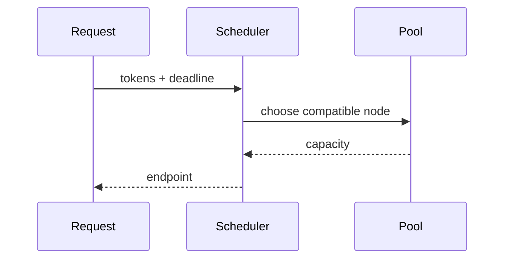
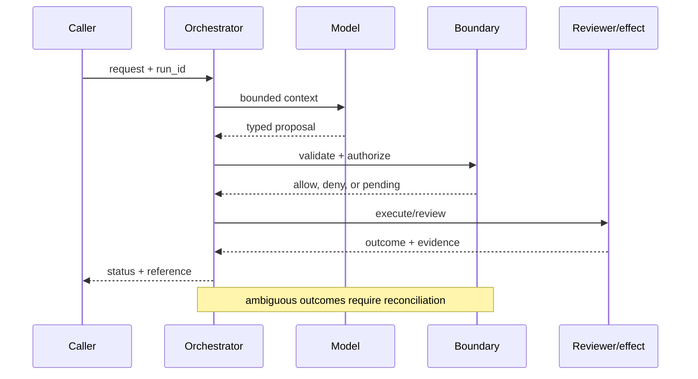

# Infrastructure portfolios
Status: durable
Sources: [Google Cloud TPU](https://cloud.google.com/tpu/docs); [Kubernetes scheduling](https://kubernetes.io/docs/concepts/scheduling-eviction/); [OpenAI's February 27, 2026 announcement, Scaling AI for everyone](https://openai.com/index/scaling-ai-for-everyone/)
## In one sentence
An infrastructure portfolio matches hardware, memory, networking, and serving shape to workload rather than buying one universal system.
## Background: what existed before
Teams defaulted to a single accelerator class and under-measured utilization.
## What changed and why now
Agent workloads mix interactive inference, batch retrieval, training, and tool calls with different bottlenecks.
## Impact on current processing and architecture
Route by latency, memory, throughput, and availability; measure utilization and queue time.
## Real-world applications and constraints
Use small instances for routing and accelerators for generation. Procurement, portability, and thermal/power limits matter.
## Mental model
```mermaid
flowchart LR
 W[Workload profile]-->S[Scheduler]-->N[Node pool]
 N-->CPU[CPU]; N-->GPU[GPU]; N-->TPU[TPU]
 classDef a fill:#dbeafe,stroke:#2563eb,color:#111827; classDef b fill:#dcfce7,stroke:#16a34a,color:#111827; class W,S a; class N,CPU,GPU,TPU b
```

## What changed this month
February places hardware choice in a portfolio and routing context.
## Engineering consequence
Track cost per useful result, not accelerator occupancy alone.
## Limits and failure modes
Fragmented pools complicate operations; benchmarks may not predict production; capacity can disappear during demand spikes.

## SDE2 primer and prerequisites

This lesson treats **infrastructure portfolios** as a concrete engineering discipline, not a synonym for model intelligence. Its key artifact is infrastructure portfolios evidence and state: the service must preserve it across infrastructure portfolios and expose enough evidence for an operator to decide what happened. A model may suggest a next step, but deterministic interfaces, ownership, and versioned records decide whether that suggestion is usable. The useful prerequisite is familiarity with HTTP, JSON, persistence, queues, retries, authentication, and service-level objectives; the topic adds its own state and failure vocabulary.

The useful boundary for infrastructure portfolios is **capacity tier, placement, accelerator pool, inference quota, failure domain, utilization, and unit economics**. These are not magic model capabilities. They are interfaces, records, checks, and operating procedures that can be unit-tested. Start with a low-blast-radius workflow and make every external effect attributable to a run ID, actor, policy version, and evidence reference.

## February source reading: fact before inference

For infrastructure portfolios, read the February source through its own claim boundary. The cited February event is **OpenAI's February 27, 2026 announcement, Scaling AI for everyone**. OpenAI's February 27 announcement says meeting demand requires compute, distribution, and capital; it announces $110 billion in new investment, a $730 billion pre-money valuation, 3 GW of dedicated inference capacity, and 2 GW of training on Vera Rubin systems. These are company-reported financing and capacity commitments, not a universal hardware benchmark. The report or announcement is evidence about what its publisher described. It is not independent validation of the publisher's claims, and it does not specify your data, threat model, latency budget, or regulatory obligations. That distinction matters because a source can motivate a concept without proving that the concept is solved.

For infrastructure portfolios, the engineering inference is narrower: turn the cited capability into an operational contract with topic-specific inputs, states, evidence, and failure ownership. Test that contract against ordinary, adversarial, stale, and interrupted work. A source can motivate this design; it cannot guarantee the resulting reliability or safety.

## Historical baseline and problem boundary

The useful portfolio baseline is a spreadsheet of services, spend, and projected demand. It is understandable but quickly loses dependency, uncertainty, and ownership detail. A portfolio model makes those assumptions explicit so investment choices can be compared and revisited.

For **infrastructure portfolios**, the infrastructure portfolios boundary names infrastructure portfolios evidence, the actor, the mutable state, and the rejecting component. Treat read evidence, model proposals, and committed effects as different data classes. A request can influence a proposal but cannot grant authority. Test this boundary with stale, malformed, replayed, and partially completed cases.

## Architecture and data flow

The infrastructure portfolios path starts with its own infrastructure portfolios evidence admission check, then records topic state, invokes only the needed processor, and finishes at a infrastructure portfolios outcome gate for **infrastructure portfolios**. Keep policy and configuration revisions beside the work, while generated text remains separate from authorization. Measure the bottleneck that belongs to infrastructure portfolios, not a generic agent score.

```mermaid
flowchart LR
  A[Caller] --> I[Identity and tenant]
  I --> C[Context/evidence]
  C --> M[Model proposal]
  M --> B[Capacity Tier boundary]
  B --> X[Effect or review]
  X --> L[(Evidence log)]
  classDef data fill:#dbeafe,stroke:#2563eb,color:#172554; classDef control fill:#dcfce7,stroke:#15803d,color:#14532d; classDef risk fill:#fee2e2,stroke:#dc2626,color:#450a0a
  class A,C,X,L data; class I,B control; class M risk
```

Keep demand observation, forecast assumption, dependency graph, scenario, recommendation, and investment decision separate. A model-generated plan must not overwrite the data that justified it. Bind timestamp, owner, cost basis, capacity reservation, and uncertainty to each scenario so decisions remain revisable.

For infrastructure portfolios, record a run identifier, actor, purpose, capacity tier, placement, accelerator pool, inference quota, failure domain, utilization, and unit economics, policy and model versions, evidence references, decision, attempts, timestamps, and final state. Add the topic's durable artifact—such as a checkpoint, capability, proof status, privacy budget, or provenance chain—rather than assuming a generic transcript can explain the outcome. Keep raw content behind controlled references and retention rules.

## Processing walkthrough and state

Portfolio state should distinguish observed, modeled, reviewed, approved, reserved, stale, and cancelled. Recheck assumptions and capacity before commitment. A recommendation based on an unavailable dependency is a planning gap, not an executable purchase order.



On retry, reuse the infrastructure portfolios idempotency key or durable artifact; never ask the model to invent a second action when the first attempt has an unknown outcome.

## Topic mechanics: Infrastructure portfolios

### Decision model and topic-specific data contract

A portfolio starts with workload classes, not hardware brand names. Interactive generation needs predictable tail latency; batch evaluation needs throughput and can tolerate queueing; training needs long-lived reservations and high-bandwidth interconnect; retrieval and policy checks may be CPU- or memory-bound. Define placement constraints, model memory, concurrency, token rate, region, power, and failure domain for each class. A scheduler can route by deadline and capability, but it must expose queue time and preemption so a product owner can understand degradation. Keep capacity reserves for safety and incident response instead of driving every pool to maximum occupancy. For OpenAI's February announcement, the facts are its stated need for compute, distribution, and capital, $110 billion investment announcement, and 3 GW inference plus 2 GW training commitments on Vera Rubin systems. Those figures illustrate scale and capital coupling; they do not tell a smaller team which accelerator wins. Measure cost per useful completed task and power per useful token, including idle and migration cost. Simulate a regional failure and a demand spike before committing to a single pool.

Ask what **infrastructure portfolios** can establish at each transition. The request establishes intent only; the infrastructure portfolios evidence and state stage establishes a bounded representation; the next checker, owner, or reconciliation step establishes whether the proposed result is acceptable. A timeout, missing dependency, or ambiguous response therefore becomes an explicit status for **infrastructure portfolios**, not an implicit success. Persist the relevant versions and evidence references, and retain unknown, deferred, or needs-review states when the system cannot prove the stronger claim.

An infrastructure portfolio should version service dependencies, capacity assumptions, risk scores, cost forecasts, and investment decisions. Snapshot the assumptions behind each recommendation; when utilization or prices change, produce a new scenario instead of overwriting the basis for an earlier commitment.

Portfolio analysis needs caps on scenario count, forecast horizon, dependency graph size, and planning-cycle latency. Mark a recommendation `assumption_incomplete` when essential cost or capacity data is missing instead of filling the gap with an optimistic default. Keep that state visible to decision-makers.

Break infrastructure portfolios metrics down by task slice, actor or tenant, version, dependency, and outcome class so a healthy average cannot hide a dangerous subgroup.


## Infrastructure portfolios: focused design workshop

In infrastructure portfolios, keep request prose, retrieved evidence, generated proposals, and the lesson artifact in separate typed fields. infrastructure portfolios code owns completeness, freshness, authorization, and promotion of a result; prose only explains intent.

For infrastructure portfolios, the event trail must let an operator distinguish bad input, missing topic evidence, stale state, dependency failure, and a confirmed outcome. Record the infrastructure portfolios artifact and the decision that moved it between states.

Test portfolio races. A capacity reservation can disappear while a recommendation is awaiting approval, or a price forecast can become stale before procurement commits. Attach assumption timestamp and reservation state to the decision. Preserve `assumption_stale` and `capacity_unavailable` rather than presenting an obsolete plan as executable.

For infrastructure portfolios, slice infrastructure portfolios evidence metrics by task class, actor or tenant, governing revision, dependency, and final state. Report the topic invariant, useful completion, latency, cost, and recovery burden together; averages are insufficient when a rare infrastructure portfolios failure carries the largest consequence.

Save a failing infrastructure portfolios input as a regression fixture only after redaction, classification, and capture of the governing version.


## Applications and operational constraints

Start infrastructure portfolios in observation or draft mode, compare against a deterministic or human baseline, then expand only a narrow cohort and reversible effect class.

Beyond **infrastructure portfolios**, infrastructure portfolios applies to workflows where infrastructure portfolios evidence matters. Choose an application with a named owner and bounded effects, then document its data residency, access, quota, staffing, latency, and rollback constraints. The right metric differs by deployment; do not import a support or research target without checking the actual user outcome.

Plan portfolio capacity around forecast jobs, dependency data, scenario review, and decision-maker time. If utilization or pricing feeds are stale, publish an assumption gap rather than filling it with a confident estimate. A planning dashboard should show data age and scenario incompleteness beside recommendations.

## Failure modes, security, and limits

Portfolio decisions fail when forecasts hide assumptions, dependencies are omitted, or incentives reward utilization over resilience. Show data age, uncertainty, and dependency edges beside each recommendation. Require a named owner and a reversible experiment before a speculative capacity purchase becomes a durable commitment.

Portfolio metrics can improve by deferring expensive maintenance, assuming optimistic utilization, or counting approved spend as delivered value. Pair cost with reliability, capacity headroom, dependency risk, and realized outcomes. A cheaper plan is not better when it transfers failure risk to operations.

For infrastructure portfolios, the February source has a bounded claim. The February source also has scope limits. OpenAI's February 27 announcement says meeting demand requires compute, distribution, and capital; it announces $110 billion in new investment, a $730 billion pre-money valuation, 3 GW of dedicated inference capacity, and 2 GW of training on Vera Rubin systems. These are company-reported financing and capacity commitments, not a universal hardware benchmark. Nothing in that observation proves robustness against your adversaries, correctness on your domain, or a particular service-level target. Treat vendor examples as source facts and label recommendations as inference. When evidence is weak, abstention and escalation are valid outcomes.

## Evaluation and change management

Build portfolio fixtures for demand spikes, stale prices, missing dependencies, alternative capacity plans, and failed investment assumptions. Assert that every recommendation exposes data age, uncertainty, owner, and reversible next step. Compare scenarios with a fixed input snapshot before changing the planning model.

Approve a portfolio recommendation only when forecast freshness, dependency coverage, risk uncertainty, and owner review meet the decision contract. Compare a small scenario set first, preserve the assumptions snapshot, and record which commitments need reconsideration when inputs or forecasts are rolled back.

## February primary-source evidence

The source fact is bounded: **OpenAI's February 27 announcement says meeting demand requires compute, distribution, and capital; it announces $110 billion in new investment, a $730 billion pre-money valuation, 3 GW of dedicated inference capacity, and 2 GW of training on Vera Rubin systems. These are company-reported financing and capacity commitments, not a universal hardware benchmark.** The February publication date and the publisher's wording should be cited when teaching the event. The recommendation that teams implement capacity tier, placement, accelerator pool, inference quota, failure domain, utilization, and unit economics is an inference from the event plus established systems practice. It should be validated with local fixtures, security review, operational metrics, and domain experts. The source does not independently verify the examples, and this article does not present them as guarantees.

## Mini exercise extension

Create six fixtures for **infrastructure portfolios** using the infrastructure portfolios vocabulary: a infrastructure portfolios evidence omission, a stale or contradictory infrastructure portfolios evidence record, an adversarial input, a boundary rejection, a dependency interruption, and a verified completion. Assert different states for each case; do not use one generic success label. Store the evidence reference and recovery owner beside every assertion, then alter the governing version and prove that prior infrastructure portfolios records remain historical.

## Build it locally: numbered implementation

1. Construct a infrastructure portfolios test record with actor, request, infrastructure portfolios evidence, decision, and outcome fields; reject a run that cannot identify the governing version.
2. Implement the infrastructure portfolios boundary as a pure function. It must inspect infrastructure portfolios evidence, return a typed state, and refuse an unrecognized or incomplete transition.
3. Create a deterministic infrastructure portfolios generator with a valid proposal, a malformed proposal, and an input that attempts to redirect the topic-specific decision.
4. Simulate the infrastructure portfolios dependency failing after admission. Use its own correlation or artifact key to detect duplicate delivery and reconcile uncertainty.
5. Write an event stream containing infrastructure portfolios states, redacting sensitive payloads while retaining the evidence pointers needed for an offline replay.
6. Measure infrastructure portfolios correctness alongside rejection rate, time in each state, recovery work, and resource cost; report slices relevant to the lesson.
7. Change the infrastructure portfolios schema or policy revision and verify that old events still resolve under their original contract rather than being reinterpreted.

## Runnable low-cost example

```python
jobs = [{"name":"chat","deadline":100,"memory":8},{"name":"batch","deadline":10000,"memory":80}]
pools = {"interactive":{"memory":16}, "batch":{"memory":128}}
for job in jobs:
    pool = "interactive" if job["deadline"] < 500 else "batch"
    print(job["name"], pool)
```

This portfolio sketch compares toy scenarios only. It does not forecast demand, validate prices, model dependencies, or authorize spend; add stale-input and failed-assumption fixtures before using it for planning.

## Interview Q&A

**Q: What belongs beside a capacity recommendation?** A: Enforce the infrastructure portfolios rule in deterministic code at the resource or artifact boundary; model output may propose, but it cannot authorize or prove the result.

**Q: What makes a portfolio recommendation actionable?** A: Enforce the infrastructure portfolios rule in deterministic code at the resource or artifact boundary; model output may propose, but it cannot authorize or prove the result.

**Q: Which metric would you put on the dashboard first?** A: Track infrastructure portfolios evidence, plus false acceptance or rejection, time spent, resource cost, and recovery; slice results by the infrastructure portfolios risk classes.

**Q: When should planning stop?** A: Enforce the infrastructure portfolios rule in deterministic code at the resource or artifact boundary; model output may propose, but it cannot authorize or prove the result.

**Q: How should infrastructure portfolios be released?** A: Pin infrastructure portfolios evidence and the governing versions, begin with shadow or reversible work, and require the infrastructure portfolios invariant before widening effects.

## Glossary

- **Capacity Tier**: the topic-specific control boundary that mediates a model proposal and an outcome.
- **Run ID**: the correlation key that joins one infrastructure portfolios attempt to its actor, infrastructure portfolios evidence, decisions, and recovery evidence.
- **Idempotency**: the infrastructure portfolios guarantee that a retry does not create a second logical result or duplicate effect.
- **Provenance**: origin, version, and transformation evidence attached to a infrastructure portfolios input or artifact.
- **SLO**: an explicit infrastructure portfolios service target, such as freshness, verification latency, queue age, or availability.
- **Abstention**: the infrastructure portfolios state used when evidence, authority, or dependency health is insufficient for a stronger claim.
- **Inference**: an engineering recommendation about infrastructure portfolios derived from source facts rather than presented as a source guarantee.

## References

- [OpenAI: Scaling AI for everyone — February 27, 2026](https://openai.com/index/scaling-ai-for-everyone/)
- [Google Cloud TPU documentation](https://cloud.google.com/tpu/docs)
- [Kubernetes scheduling](https://kubernetes.io/docs/concepts/scheduling-eviction/)

## Claim ledger

| Claim | Source | Fact or inference |
|---|---|---|
| The cited publisher published the February event on the stated date. | [OpenAI's February 27, 2026 announcement, Scaling AI for everyone](https://openai.com/index/scaling-ai-for-everyone/) | Fact |
| OpenAI's February 27 announcement says meeting demand requires compute, distribution, and capital; it announces $110 billion in new investment, a $730 billion pre-money valuation, 3 GW of dedicated inference capacity, and 2 GW of training on Vera Rubin systems. | [OpenAI's February 27, 2026 announcement, Scaling AI for everyone](https://openai.com/index/scaling-ai-for-everyone/) | Fact |
| Treating compute as a portfolio of pools with different latency, memory, availability, and cost characteristics. | Engineering design synthesis | Inference |
| A separately enforced boundary is safer and easier to operate than treating model text as authority. | Topic standards and systems reasoning | Inference |
| The local example demonstrates the concept but does not prove production security, reliability, or generalization. | This lesson | Fact about the example |
