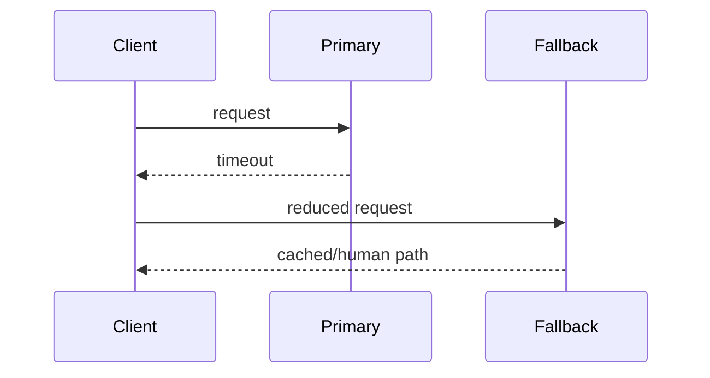
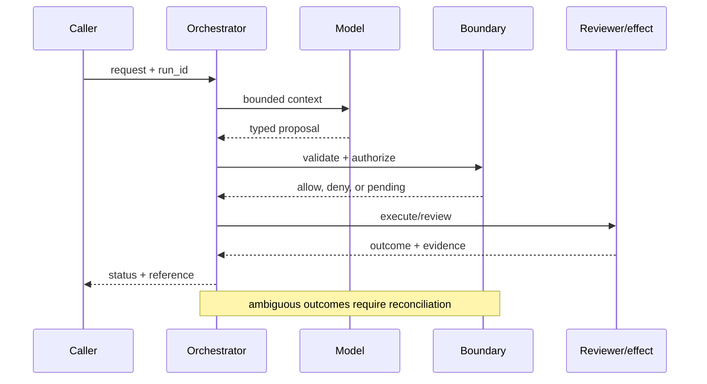

# Availability engineering
Status: durable
Sources: [Google SRE — availability](https://sre.google/sre-book/availability/); [IETF RFC 9110](https://www.rfc-editor.org/rfc/rfc9110); [OpenAI's February 27, 2026 announcement, Scaling AI for everyone](https://openai.com/index/scaling-ai-for-everyone/)
## In one sentence
Availability engineering combines capacity, fallbacks, rate limits, and graceful degradation to keep useful service reachable.
## Background: what existed before
AI demos assumed an always-available model endpoint and unlimited quota.
## What changed and why now
Agent chains multiply dependency failures and make capacity planning visible to users.
## Impact on current processing and architecture
Budget latency across calls, shed load, cache safe results, and provide fallback modes.
## Real-world applications and constraints
Support can fall back to retrieval or a human. Fallback quality, stale cache, and quota fairness constrain choices.
## Mental model
```mermaid
flowchart LR
 U[User]-->L[Limiter]-->P[Primary]
 P--fail-->F[Fallback]-->U
 classDef a fill:#dbeafe,stroke:#2563eb,color:#111827; classDef b fill:#fef3c7,stroke:#d97706,color:#111827; class U,L a; class P,F b
```

## What changed this month
February connects agent availability to dependency-aware service design.
## Engineering consequence
Define useful degraded behavior and measure it separately from hard failure.
## Limits and failure modes
Fallbacks can leak stale or unsafe data; retries synchronize load; rate limits can punish legitimate bursts.

## SDE2 primer and prerequisites

This lesson treats **availability engineering** as a concrete engineering discipline, not a synonym for model intelligence. Its key artifact is availability engineering evidence and state: the service must preserve it across availability engineering and expose enough evidence for an operator to decide what happened. A model may suggest a next step, but deterministic interfaces, ownership, and versioned records decide whether that suggestion is usable. The useful prerequisite is familiarity with HTTP, JSON, persistence, queues, retries, authentication, and service-level objectives; the topic adds its own state and failure vocabulary.

The useful boundary for availability engineering is **SLO, admission control, queue, fallback, load shedding, regional capacity, and graceful degradation**. These are not magic model capabilities. They are interfaces, records, checks, and operating procedures that can be unit-tested. Start with a low-blast-radius workflow and make every external effect attributable to a run ID, actor, policy version, and evidence reference.

## February source reading: fact before inference

For availability engineering, read the February source through its own claim boundary. The cited February event is **OpenAI's February 27, 2026 announcement, Scaling AI for everyone**. OpenAI's February 27 announcement describes surging demand, more than 900 million weekly active users, more than 9 million paying business users, and infrastructure partnerships intended to expand capacity. These are claims in the company's announcement. Designing an SLO, fallback, and load-shedding policy for your own service is an engineering inference. The report or announcement is evidence about what its publisher described. It is not independent validation of the publisher's claims, and it does not specify your data, threat model, latency budget, or regulatory obligations. That distinction matters because a source can motivate a concept without proving that the concept is solved.

For availability engineering, the engineering inference is narrower: turn the cited capability into an operational contract with topic-specific inputs, states, evidence, and failure ownership. Test that contract against ordinary, adversarial, stale, and interrupted work. A source can motivate this design; it cannot guarantee the resulting reliability or safety.

## Historical baseline and problem boundary

The useful availability baseline is a service that returns success or an error from one dependency. It fails under correlated outages, retry storms, and fallbacks that violate the user contract. Availability engineering adds budgets, dependency modeling, failure injection, and explicit degraded behavior.

For **availability engineering**, the availability engineering boundary names availability engineering evidence, the actor, the mutable state, and the rejecting component. Treat read evidence, model proposals, and committed effects as different data classes. A request can influence a proposal but cannot grant authority. Test this boundary with stale, malformed, replayed, and partially completed cases.

## Architecture and data flow

The availability engineering path starts with its own availability engineering evidence admission check, then records topic state, invokes only the needed processor, and finishes at a availability engineering outcome gate for **availability engineering**. Keep policy and configuration revisions beside the work, while generated text remains separate from authorization. Measure the bottleneck that belongs to availability engineering, not a generic agent score.

```mermaid
flowchart LR
  A[Caller] --> I[Identity and tenant]
  I --> C[Context/evidence]
  C --> M[Model proposal]
  M --> B[Slo boundary]
  B --> X[Effect or review]
  X --> L[(Evidence log)]
  classDef data fill:#dbeafe,stroke:#2563eb,color:#172554; classDef control fill:#dcfce7,stroke:#15803d,color:#14532d; classDef risk fill:#fee2e2,stroke:#dc2626,color:#450a0a
  class A,C,X,L data; class I,B control; class M risk
```

Keep request intent, dependency observation, retry state, fallback response, user-visible outcome, and incident evidence separate. A fast error page does not prove the service met its contract. Bind route, tenant, dependency, deadline, attempt, and degraded-mode label to each outcome while redacting payloads.

For availability engineering, record a run identifier, actor, purpose, SLO, admission control, queue, fallback, load shedding, regional capacity, and graceful degradation, policy and model versions, evidence references, decision, attempts, timestamps, and final state. Add the topic's durable artifact—such as a checkpoint, capability, proof status, privacy budget, or provenance chain—rather than assuming a generic transcript can explain the outcome. Keep raw content behind controlled references and retention rules.

## Processing walkthrough and state

Availability state should distinguish admitted, queued, served, fallback, timed_out, dependency_unknown, and recovered. Bound retries and reconcile idempotent requests after timeout. A service that returns bytes from a degraded path must still disclose which contract was preserved or lost.



On retry, reuse the availability engineering idempotency key or durable artifact; never ask the model to invent a second action when the first attempt has an unknown outcome.

## Topic mechanics: Availability engineering

### Decision model and topic-specific data contract

Availability is a property of the user-visible outcome, not merely of the primary model. Allocate a deadline across ingress, retrieval, policy, inference, tools, and rendering. Admission control rejects or defers work when the queue cannot meet that deadline; load shedding protects existing requests. A fallback can use a smaller model, cached evidence, retrieval-only answer, draft mode, or human handoff, but it needs its own quality and safety contract. Do not retry every layer independently, or a single request becomes a fan-out storm. Use a global request ID and a retry budget. For the February scaling announcement, OpenAI reports demand, 900 million weekly active users, over 9 million paying business users, and infrastructure partnerships aimed at expanding capacity. Those are company-reported scale facts; an individual service must still establish its own SLO and error budget. Test quota exhaustion, regional loss, stale cache, fallback hallucination, and recovery. Report useful-degraded service separately from hard failure so a fast but unsafe answer cannot improve availability on paper.

Ask what **availability engineering** can establish at each transition. The request establishes intent only; the availability engineering evidence and state stage establishes a bounded representation; the next checker, owner, or reconciliation step establishes whether the proposed result is acceptable. A timeout, missing dependency, or ambiguous response therefore becomes an explicit status for **availability engineering**, not an implicit success. Persist the relevant versions and evidence references, and retain unknown, deferred, or needs-review states when the system cannot prove the stronger claim.

Availability work needs versioned SLOs, dependency budgets, fallback behavior, load profiles, and incident runbooks. Attach the active contract to each measurement window; changing an SLO should not retroactively make an outage look compliant.

Availability controls should bound retry storms, queue depth, failover attempts, and dependency probe volume. Shed optional work before the critical path misses its budget, and distinguish `dependency_down`, `capacity_rejected`, and `fallback_served` in SLO accounting. A fallback response is not the same as normal success.

Break availability engineering metrics down by task slice, actor or tenant, version, dependency, and outcome class so a healthy average cannot hide a dangerous subgroup.


## Availability engineering: focused design workshop

In availability engineering, keep request prose, retrieved evidence, generated proposals, and the lesson artifact in separate typed fields. availability engineering code owns completeness, freshness, authorization, and promotion of a result; prose only explains intent.

For availability engineering, the event trail must let an operator distinguish bad input, missing topic evidence, stale state, dependency failure, and a confirmed outcome. Record the availability engineering artifact and the decision that moved it between states.

Test availability races. A dependency may recover after a fallback is selected, or a retry may arrive after the original request committed. Use a request deadline and receipt lookup at each transition. Count `fallback_served`, `duplicate_suppressed`, and `dependency_unknown` separately from ordinary success.

For availability engineering, slice availability engineering evidence metrics by task class, actor or tenant, governing revision, dependency, and final state. Report the topic invariant, useful completion, latency, cost, and recovery burden together; averages are insufficient when a rare availability engineering failure carries the largest consequence.

Save a failing availability engineering input as a regression fixture only after redaction, classification, and capture of the governing version.


## Applications and operational constraints

Start availability engineering in observation or draft mode, compare against a deterministic or human baseline, then expand only a narrow cohort and reversible effect class.

Beyond **availability engineering**, availability engineering applies to workflows where availability engineering evidence matters. Choose an application with a named owner and bounded effects, then document its data residency, access, quota, staffing, latency, and rollback constraints. The right metric differs by deployment; do not import a support or research target without checking the actual user outcome.

Plan availability capacity around dependency quotas, retry budgets, failover targets, and health-check load. Shed optional work before the protected path, and count fallback responses separately from normal success. A recovered dependency should not cause queued requests to replay blindly.

## Failure modes, security, and limits

Availability fails through retry storms, correlated dependency loss, stale health checks, and fallbacks that violate the user contract. Budget retries, exercise regional and dependency failures, and make degraded responses explicit. Measure error budget consumption and recovery quality, not only whether a request eventually returned bytes.

Availability metrics can improve by excluding degraded responses, resetting error-budget windows, or returning a fast fallback that violates the contract. Count fallback, timeout, and recovery quality explicitly by dependency and tenant. A high uptime percentage cannot excuse a critical operation that silently lost its guarantee.

For availability engineering, the February source has a bounded claim. The February source also has scope limits. OpenAI's February 27 announcement describes surging demand, more than 900 million weekly active users, more than 9 million paying business users, and infrastructure partnerships intended to expand capacity. These are claims in the company's announcement. Designing an SLO, fallback, and load-shedding policy for your own service is an engineering inference. Nothing in that observation proves robustness against your adversaries, correctness on your domain, or a particular service-level target. Treat vendor examples as source facts and label recommendations as inference. When evidence is weak, abstention and escalation are valid outcomes.

## Evaluation and change management

Build availability fixtures for dependency loss, retry storms, regional failover, stale health checks, partial response, and recovery. Assert the user contract for normal and degraded paths, including idempotency. Keep failure injection independent of the application’s own health dashboard and inspect error-budget impact.

Promote an availability change only when dependency failure, retry, failover, recovery, and degraded-contract tests meet the SLO. Canary one region or route, retain a traffic-shed switch, and reconcile requests that crossed the old and new behavior during rollback.

## February primary-source evidence

The source fact is bounded: **OpenAI's February 27 announcement describes surging demand, more than 900 million weekly active users, more than 9 million paying business users, and infrastructure partnerships intended to expand capacity. These are claims in the company's announcement. Designing an SLO, fallback, and load-shedding policy for your own service is an engineering inference.** The February publication date and the publisher's wording should be cited when teaching the event. The recommendation that teams implement SLO, admission control, queue, fallback, load shedding, regional capacity, and graceful degradation is an inference from the event plus established systems practice. It should be validated with local fixtures, security review, operational metrics, and domain experts. The source does not independently verify the examples, and this article does not present them as guarantees.

## Mini exercise extension

Create six fixtures for **availability engineering** using the availability engineering vocabulary: a availability engineering evidence omission, a stale or contradictory availability engineering evidence record, an adversarial input, a boundary rejection, a dependency interruption, and a verified completion. Assert different states for each case; do not use one generic success label. Store the evidence reference and recovery owner beside every assertion, then alter the governing version and prove that prior availability engineering records remain historical.

## Build it locally: numbered implementation

1. Construct a availability engineering test record with actor, request, availability engineering evidence, decision, and outcome fields; reject a run that cannot identify the governing version.
2. Implement the availability engineering boundary as a pure function. It must inspect availability engineering evidence, return a typed state, and refuse an unrecognized or incomplete transition.
3. Create a deterministic availability engineering generator with a valid proposal, a malformed proposal, and an input that attempts to redirect the topic-specific decision.
4. Simulate the availability engineering dependency failing after admission. Use its own correlation or artifact key to detect duplicate delivery and reconcile uncertainty.
5. Write an event stream containing availability engineering states, redacting sensitive payloads while retaining the evidence pointers needed for an offline replay.
6. Measure availability engineering correctness alongside rejection rate, time in each state, recovery work, and resource cost; report slices relevant to the lesson.
7. Change the availability engineering schema or policy revision and verify that old events still resolve under their original contract rather than being reinterpreted.

## Runnable low-cost example

```python
def serve(primary_ok, remaining_ms):
    if primary_ok: return {"mode":"primary", "label":"normal"}
    if remaining_ms > 0: return {"mode":"fallback", "label":"degraded"}
    return {"mode":"handoff", "label":"human"}
print(serve(False, 200), serve(False, 0))
```

This availability sketch demonstrates a bounded retry policy only. It does not model correlated failure, regional failover, user contracts, or recovery; add dependency and fallback tests before using it to set an SLO.

## Interview Q&A

**Q: Is a fast fallback normal success?** A: Enforce the availability engineering rule in deterministic code at the resource or artifact boundary; model output may propose, but it cannot authorize or prove the result.

**Q: What is a degraded response?** A: Enforce the availability engineering rule in deterministic code at the resource or artifact boundary; model output may propose, but it cannot authorize or prove the result.

**Q: Which metric would you put on the dashboard first?** A: Track availability engineering evidence, plus false acceptance or rejection, time spent, resource cost, and recovery; slice results by the availability engineering risk classes.

**Q: Why budget retries?** A: Enforce the availability engineering rule in deterministic code at the resource or artifact boundary; model output may propose, but it cannot authorize or prove the result.

**Q: How should availability engineering be released?** A: Pin availability engineering evidence and the governing versions, begin with shadow or reversible work, and require the availability engineering invariant before widening effects.

## Glossary

- **Slo**: the topic-specific control boundary that mediates a model proposal and an outcome.
- **Run ID**: the correlation key that joins one availability engineering attempt to its actor, availability engineering evidence, decisions, and recovery evidence.
- **Idempotency**: the availability engineering guarantee that a retry does not create a second logical result or duplicate effect.
- **Provenance**: origin, version, and transformation evidence attached to a availability engineering input or artifact.
- **SLO**: an explicit availability engineering service target, such as freshness, verification latency, queue age, or availability.
- **Abstention**: the availability engineering state used when evidence, authority, or dependency health is insufficient for a stronger claim.
- **Inference**: an engineering recommendation about availability engineering derived from source facts rather than presented as a source guarantee.

## References

- [OpenAI: Scaling AI for everyone — February 27, 2026](https://openai.com/index/scaling-ai-for-everyone/)
- [Google SRE: availability](https://sre.google/sre-book/availability/)
- [IETF RFC 9110](https://www.rfc-editor.org/rfc/rfc9110)

## Claim ledger

| Claim | Source | Fact or inference |
|---|---|---|
| The cited publisher published the February event on the stated date. | [OpenAI's February 27, 2026 announcement, Scaling AI for everyone](https://openai.com/index/scaling-ai-for-everyone/) | Fact |
| OpenAI's February 27 announcement describes surging demand, more than 900 million weekly active users, more than 9 million paying business users, and infrastructure partnerships intended to expand capacity. | [OpenAI's February 27, 2026 announcement, Scaling AI for everyone](https://openai.com/index/scaling-ai-for-everyone/) | Fact |
| Defining useful service under dependency failure instead of equating availability with one model endpoint. | Engineering design synthesis | Inference |
| A separately enforced boundary is safer and easier to operate than treating model text as authority. | Topic standards and systems reasoning | Inference |
| The local example demonstrates the concept but does not prove production security, reliability, or generalization. | This lesson | Fact about the example |
