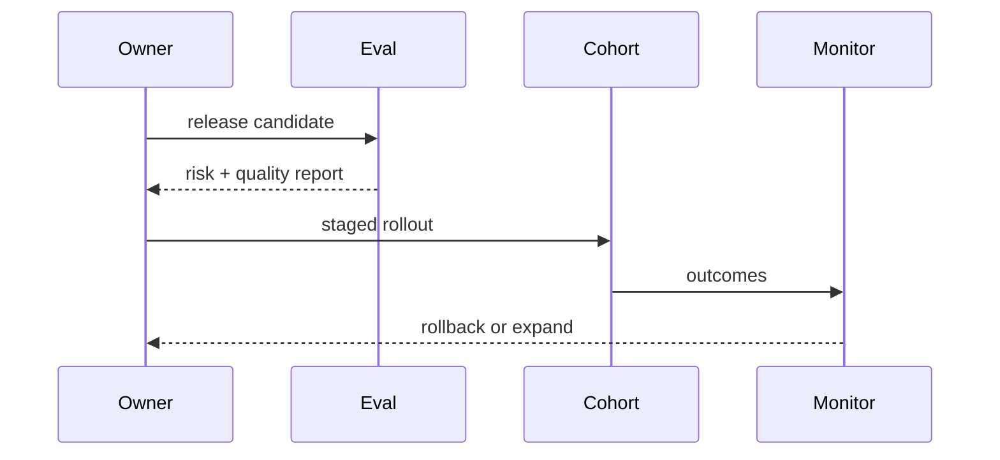
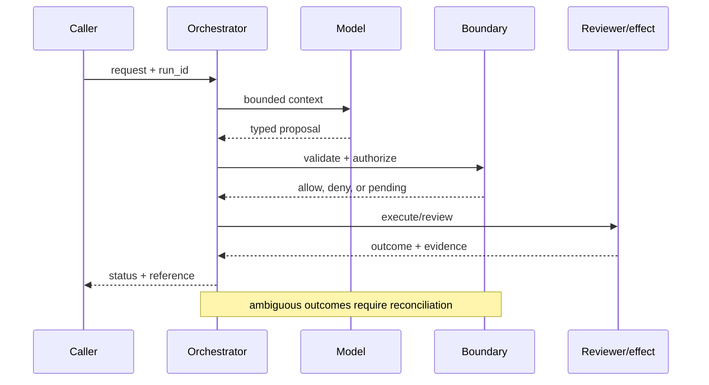

# Responsible deployment
Status: emerging
Sources: [NIST AI RMF](https://www.nist.gov/itl/ai-risk-management-framework); [OpenAI — 2026-02-25 malicious AI use](https://openai.com/index/disrupting-malicious-ai-uses/); [OpenAI — 2026-02-05 Frontier](https://openai.com/index/introducing-openai-frontier/)
## In one sentence
Responsible deployment aligns capability with policy, monitoring, human recourse, and a reversible rollout plan.
## Background: what existed before
Teams shipped model features with limited ownership after launch and weak user appeal paths.
## What changed and why now
Agent platforms and abuse reports emphasize lifecycle governance: assess, deploy, monitor, respond, and improve.
## Impact on current processing and architecture
Connect evaluation, permissions, telemetry, incident response, rollback, and support ownership.
## Real-world applications and constraints
Deploy agents in support or research with staged cohorts. Policy ambiguity, privacy, and operational cost remain real constraints.
## Mental model
```mermaid
flowchart LR
 A[Assess]-->D[Deploy]-->M[Monitor]-->R[Respond]-->I[Improve]-->A
 classDef a fill:#dbeafe,stroke:#2563eb,color:#111827; classDef b fill:#dcfce7,stroke:#16a34a,color:#111827; class A,D,I a; class M,R b
```

## What changed this month
February’s three source themes converge on governed deployment with monitoring and recourse.
## Engineering consequence
Ship an explicit owner, risk register, kill switch, audit trail, and appeal route with the feature.
## Limits and failure modes
Monitoring misses novel behavior; rollback may not undo effects; policy can lag capability.

## SDE2 primer and prerequisites

This lesson treats **responsible deployment** as a concrete engineering discipline, not a synonym for model intelligence. Its key artifact is responsible deployment evidence and state: the service must preserve it across responsible deployment and expose enough evidence for an operator to decide what happened. A model may suggest a next step, but deterministic interfaces, ownership, and versioned records decide whether that suggestion is usable. The useful prerequisite is familiarity with HTTP, JSON, persistence, queues, retries, authentication, and service-level objectives; the topic adds its own state and failure vocabulary.

The useful boundary for responsible deployment is **intended-use statement, release gate, risk register, monitoring, recourse, kill switch, and incident review**. These are not magic model capabilities. They are interfaces, records, checks, and operating procedures that can be unit-tested. Start with a low-blast-radius workflow and make every external effect attributable to a run ID, actor, policy version, and evidence reference.

## February source reading: fact before inference

For responsible deployment, read the February source through its own claim boundary. The cited February event is **OpenAI's February 25, 2026 malicious-use report and February 5, 2026 Frontier announcement**. Frontier says agents need shared context, onboarding, feedback, and identity, permissions, and boundaries. OpenAI's February 25 report says misuse commonly combines AI with traditional tools and can span platforms and models. These are separate company-reported facts; the lifecycle of assessment, staged release, monitoring, and recourse is the engineering synthesis. The report or announcement is evidence about what its publisher described. It is not independent validation of the publisher's claims, and it does not specify your data, threat model, latency budget, or regulatory obligations. That distinction matters because a source can motivate a concept without proving that the concept is solved.

For responsible deployment, the engineering inference is narrower: turn the cited capability into an operational contract with topic-specific inputs, states, evidence, and failure ownership. Test that contract against ordinary, adversarial, stale, and interrupted work. A source can motivate this design; it cannot guarantee the resulting reliability or safety.

## Historical baseline and problem boundary

The useful deployment baseline is a model demo judged by capability and adoption. That is insufficient when intended use, affected groups, monitoring, recourse, or rollback remain undefined. Responsible deployment turns those concerns into launch evidence, operating limits, and accountable review.

For **responsible deployment**, the responsible deployment boundary names responsible deployment evidence, the actor, the mutable state, and the rejecting component. Treat read evidence, model proposals, and committed effects as different data classes. A request can influence a proposal but cannot grant authority. Test this boundary with stale, malformed, replayed, and partially completed cases.

## Architecture and data flow

The responsible deployment path starts with its own responsible deployment evidence admission check, then records topic state, invokes only the needed processor, and finishes at a responsible deployment outcome gate for **responsible deployment**. Keep policy and configuration revisions beside the work, while generated text remains separate from authorization. Measure the bottleneck that belongs to responsible deployment, not a generic agent score.

```mermaid
flowchart LR
  A[Caller] --> I[Identity and tenant]
  I --> C[Context/evidence]
  C --> M[Model proposal]
  M --> B[Intended-Use Statement boundary]
  B --> X[Effect or review]
  X --> L[(Evidence log)]
  classDef data fill:#dbeafe,stroke:#2563eb,color:#172554; classDef control fill:#dcfce7,stroke:#15803d,color:#14532d; classDef risk fill:#fee2e2,stroke:#dc2626,color:#450a0a
  class A,C,X,L data; class I,B control; class M risk
```

Keep intended use, evidence package, affected-group result, mitigation, monitoring signal, decision, and incident record separate. A launch narrative must not become its own safety evidence. Bind release scope, owner, model/data revision, open findings, and rollback trigger to the decision while limiting sensitive user data.

For responsible deployment, record a run identifier, actor, purpose, intended-use statement, release gate, risk register, monitoring, recourse, kill switch, and incident review, policy and model versions, evidence references, decision, attempts, timestamps, and final state. Add the topic's durable artifact—such as a checkpoint, capability, proof status, privacy budget, or provenance chain—rather than assuming a generic transcript can explain the outcome. Keep raw content behind controlled references and retention rules.

## Processing walkthrough and state

Deployment state should distinguish assessed, pilot, monitored, expanded, paused, rolled_back, and under_remediation. Recheck open findings and monitoring coverage at each expansion gate. A rollback is incomplete until affected users, data, and downstream effects have been assessed.



On retry, reuse the responsible deployment idempotency key or durable artifact; never ask the model to invent a second action when the first attempt has an unknown outcome.

## Topic mechanics: Responsible deployment

### Decision model and topic-specific data contract

Responsible deployment is a release system with a feedback loop. An intended-use statement names users, tasks, data, allowed actions, exclusions, and recourse. A risk register assigns owners and controls to misuse, privacy, security, reliability, and domain harms. Evaluation must include ordinary and adversarial cases, while launch gates set floors for quality and safety. Staged rollout begins with shadow or draft mode, then a constrained cohort, then broader use only when monitoring and support are ready. Every effect needs an audit reference and every user needs a path to correct or appeal a consequential outcome. A kill switch should stop risky writes without erasing evidence. Incident response must handle effects already committed; rollback of the model is not rollback of the world. Frontier's February 5 framing names shared context, onboarding, feedback, and identity/permissions/boundaries. The February 25 report adds the observation that misuse combines AI with traditional tools and crosses platforms and models. These are separate source facts. The synthesis is to connect capability, policy, monitoring, evidence, and recourse rather than treating safety as a final prompt review. Measure safe useful completion, incidents, appeal outcomes, and time to disable.

Ask what **responsible deployment** can establish at each transition. The request establishes intent only; the responsible deployment evidence and state stage establishes a bounded representation; the next checker, owner, or reconciliation step establishes whether the proposed result is acceptable. A timeout, missing dependency, or ambiguous response therefore becomes an explicit status for **responsible deployment**, not an implicit success. Persist the relevant versions and evidence references, and retain unknown, deferred, or needs-review states when the system cannot prove the stronger claim.

Responsible deployment requires versioned risk assessment, intended-use scope, model and data release, mitigations, monitoring plan, and sign-off. Preserve the package used at launch; a later policy revision may narrow operation, but it should not erase why the earlier release was accepted.

Responsible deployment needs gates on release scope, affected users, monitoring coverage, incident load, and unresolved review findings. Pause expansion when evidence is incomplete or harms exceed the agreed threshold. Record `pilot_limited`, `monitoring_gap`, and `rollback_required` as governance states, not ordinary model errors.

Break responsible deployment metrics down by task slice, actor or tenant, version, dependency, and outcome class so a healthy average cannot hide a dangerous subgroup.


## Responsible deployment: focused design workshop

In responsible deployment, keep request prose, retrieved evidence, generated proposals, and the lesson artifact in separate typed fields. responsible deployment code owns completeness, freshness, authorization, and promotion of a result; prose only explains intent.

For responsible deployment, the event trail must let an operator distinguish bad input, missing topic evidence, stale state, dependency failure, and a confirmed outcome. Record the responsible deployment artifact and the decision that moved it between states.

Test deployment races. A pilot can reveal harm while expansion is queued, or a mitigation can be absent from the artifact being promoted. Recheck scope, monitoring, and open findings at the promotion gate. Preserve `rollback_required` and `evidence_incomplete`; neither should be counted as an ordinary release failure.

For responsible deployment, slice responsible deployment evidence metrics by task class, actor or tenant, governing revision, dependency, and final state. Report the topic invariant, useful completion, latency, cost, and recovery burden together; averages are insufficient when a rare responsible deployment failure carries the largest consequence.

Save a failing responsible deployment input as a regression fixture only after redaction, classification, and capture of the governing version.


## Applications and operational constraints

Start responsible deployment in observation or draft mode, compare against a deterministic or human baseline, then expand only a narrow cohort and reversible effect class.

Beyond **responsible deployment**, responsible deployment applies to workflows where responsible deployment evidence matters. Choose an application with a named owner and bounded effects, then document its data residency, access, quota, staffing, latency, and rollback constraints. The right metric differs by deployment; do not import a support or research target without checking the actual user outcome.

Plan deployment capacity around monitoring, support, incident response, review, and rollback—not inference throughput alone. If evidence collection or response staffing is saturated, freeze expansion and preserve pilot scope. A limited rollout must be visible as a governance state, not reported as ordinary production success.

## Failure modes, security, and limits

Responsible deployment fails when intended use expands silently, monitoring misses affected groups, or incident ownership is unclear. Define prohibited uses, launch evidence, rollback triggers, and appeal routes before rollout. Treat unresolved harms and missing evidence as blockers rather than burying them in an aggregate launch score.

Deployment metrics can improve by narrowing the pilot, undercounting affected users, or declaring incidents resolved before remediation is verified. Pair adoption with harm reports, subgroup outcomes, monitoring coverage, rollback readiness, and unresolved findings. A successful launch is a governed outcome, not a rising usage graph.

For responsible deployment, the February source has a bounded claim. The February source also has scope limits. Frontier says agents need shared context, onboarding, feedback, and identity, permissions, and boundaries. OpenAI's February 25 report says misuse commonly combines AI with traditional tools and can span platforms and models. These are separate company-reported facts; the lifecycle of assessment, staged release, monitoring, and recourse is the engineering synthesis. Nothing in that observation proves robustness against your adversaries, correctness on your domain, or a particular service-level target. Treat vendor examples as source facts and label recommendations as inference. When evidence is weak, abstention and escalation are valid outcomes.

## Evaluation and change management

Build deployment fixtures for intended use, prohibited use, subgroup harm, monitoring gaps, incident escalation, rollback, and appeal. Assert that open findings block scope expansion and that the release package names an owner. Keep adverse cases protected and inspect redacted pilot evidence rather than relying on launch self-reporting.

Expand deployment only when intended-use evidence, subgroup outcomes, monitoring coverage, incident response, and rollback readiness meet the agreed floors. Start with a bounded pilot, retain a scope-reduction switch, and document affected users, open findings, and remediation after rollback.

## February primary-source evidence

The source fact is bounded: **Frontier says agents need shared context, onboarding, feedback, and identity, permissions, and boundaries. OpenAI's February 25 report says misuse commonly combines AI with traditional tools and can span platforms and models. These are separate company-reported facts; the lifecycle of assessment, staged release, monitoring, and recourse is the engineering synthesis.** The February publication date and the publisher's wording should be cited when teaching the event. The recommendation that teams implement intended-use statement, release gate, risk register, monitoring, recourse, kill switch, and incident review is an inference from the event plus established systems practice. It should be validated with local fixtures, security review, operational metrics, and domain experts. The source does not independently verify the examples, and this article does not present them as guarantees.

## Mini exercise extension

Create six fixtures for **responsible deployment** using the responsible deployment vocabulary: a responsible deployment evidence omission, a stale or contradictory responsible deployment evidence record, an adversarial input, a boundary rejection, a dependency interruption, and a verified completion. Assert different states for each case; do not use one generic success label. Store the evidence reference and recovery owner beside every assertion, then alter the governing version and prove that prior responsible deployment records remain historical.

## Build it locally: numbered implementation

1. Construct a responsible deployment test record with actor, request, responsible deployment evidence, decision, and outcome fields; reject a run that cannot identify the governing version.
2. Implement the responsible deployment boundary as a pure function. It must inspect responsible deployment evidence, return a typed state, and refuse an unrecognized or incomplete transition.
3. Create a deterministic responsible deployment generator with a valid proposal, a malformed proposal, and an input that attempts to redirect the topic-specific decision.
4. Simulate the responsible deployment dependency failing after admission. Use its own correlation or artifact key to detect duplicate delivery and reconcile uncertainty.
5. Write an event stream containing responsible deployment states, redacting sensitive payloads while retaining the evidence pointers needed for an offline replay.
6. Measure responsible deployment correctness alongside rejection rate, time in each state, recovery work, and resource cost; report slices relevant to the lesson.
7. Change the responsible deployment schema or policy revision and verify that old events still resolve under their original contract rather than being reinterpreted.

## Runnable low-cost example

```python
release = {"owner":"ops", "risk_review":True, "monitor":True, "rollback":"writes-off", "appeal":"support-queue"}
required = {"owner", "risk_review", "monitor", "rollback", "appeal"}
print("ready" if required <= release.keys() else "blocked")
```

This rollout sketch checks a small evidence gate only. It does not evaluate subgroup harm, monitoring coverage, legal obligations, or incident readiness; add adverse-use and rollback fixtures before expanding scope.

## Interview Q&A

**Q: What blocks responsible expansion?** A: Enforce the responsible deployment rule in deterministic code at the resource or artifact boundary; model output may propose, but it cannot authorize or prove the result.

**Q: What is a responsible release gate?** A: Pin responsible deployment evidence and the governing versions, begin with shadow or reversible work, and require the responsible deployment invariant before widening effects.

**Q: Which metric would you put on the dashboard first?** A: Track responsible deployment evidence, plus false acceptance or rejection, time spent, resource cost, and recovery; slice results by the responsible deployment risk classes.

**Q: When should expansion stop?** A: Enforce the responsible deployment rule in deterministic code at the resource or artifact boundary; model output may propose, but it cannot authorize or prove the result.

**Q: How should responsible deployment be released?** A: Pin responsible deployment evidence and the governing versions, begin with shadow or reversible work, and require the responsible deployment invariant before widening effects.

## Glossary

- **Intended-Use Statement**: the topic-specific control boundary that mediates a model proposal and an outcome.
- **Run ID**: the correlation key that joins one responsible deployment attempt to its actor, responsible deployment evidence, decisions, and recovery evidence.
- **Idempotency**: the responsible deployment guarantee that a retry does not create a second logical result or duplicate effect.
- **Provenance**: origin, version, and transformation evidence attached to a responsible deployment input or artifact.
- **SLO**: an explicit responsible deployment service target, such as freshness, verification latency, queue age, or availability.
- **Abstention**: the responsible deployment state used when evidence, authority, or dependency health is insufficient for a stronger claim.
- **Inference**: an engineering recommendation about responsible deployment derived from source facts rather than presented as a source guarantee.

## References

- [OpenAI Frontier — February 5, 2026](https://openai.com/index/introducing-openai-frontier/)
- [OpenAI: Disrupting malicious uses of AI — February 25, 2026](https://openai.com/index/disrupting-malicious-ai-uses/)
- [NIST AI Risk Management Framework](https://www.nist.gov/itl/ai-risk-management-framework)

## Claim ledger

| Claim | Source | Fact or inference |
|---|---|---|
| The cited publisher published the February event on the stated date. | [OpenAI's February 25, 2026 malicious-use report and February 5, 2026 Frontier announcement](https://openai.com/index/disrupting-malicious-ai-uses/) | Fact |
| Frontier says agents need shared context, onboarding, feedback, and identity, permissions, and boundaries. | [OpenAI's February 25, 2026 malicious-use report and February 5, 2026 Frontier announcement](https://openai.com/index/disrupting-malicious-ai-uses/) | Fact |
| Connecting capability, controls, evidence, and human recourse into one release process. | Engineering design synthesis | Inference |
| A separately enforced boundary is safer and easier to operate than treating model text as authority. | Topic standards and systems reasoning | Inference |
| The local example demonstrates the concept but does not prove production security, reliability, or generalization. | This lesson | Fact about the example |
