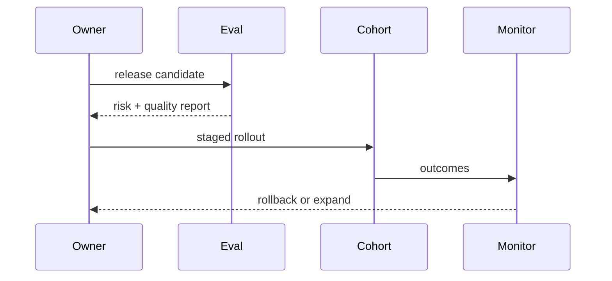
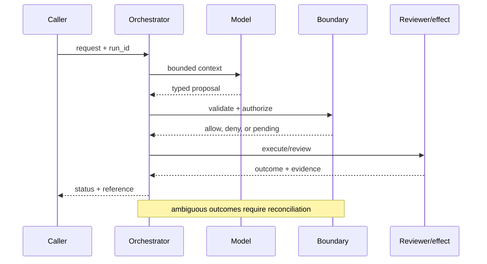

# Responsible deployment
Status: emerging
Sources: [NIST AI RMF](https://www.nist.gov/itl/ai-risk-management-framework); [OpenAI — 2026-02-25 malicious AI use](https://openai.com/index/disrupting-malicious-ai-uses/); [OpenAI — 2026-02-05 Frontier](https://openai.com/index/introducing-openai-frontier/)
## In one sentence
Responsible deployment aligns capability with policy, monitoring, human recourse, and a reversible rollout plan.
## Background: what existed before
Teams shipped model features with limited ownership after launch and weak user appeal paths.
## What changed and why now
Agent platforms and abuse reports emphasize lifecycle governance: assess, deploy, monitor, respond, and improve.
## Impact on current processing and architecture
Connect evaluation, permissions, telemetry, incident response, rollback, and support ownership.
## Real-world applications and constraints
Deploy agents in support or research with staged cohorts. Policy ambiguity, privacy, and operational cost remain real constraints.
## Mental model
```mermaid
flowchart LR
 A[Assess]-->D[Deploy]-->M[Monitor]-->R[Respond]-->I[Improve]-->A
 classDef a fill:#dbeafe,stroke:#2563eb,color:#111827; classDef b fill:#dcfce7,stroke:#16a34a,color:#111827; class A,D,I a; class M,R b
```

## What changed this month
February’s three source themes converge on governed deployment with monitoring and recourse.
## Engineering consequence
Ship an explicit owner, risk register, kill switch, audit trail, and appeal route with the feature.
## Limits and failure modes
Monitoring misses novel behavior; rollback may not undo effects; policy can lag capability.

## SDE2 primer and prerequisites

This lesson is about **responsible deployment** as a production systems problem. A language model is only one stage: an ingress service accepts work, a data layer supplies evidence, an orchestrator keeps state, a policy layer decides what may happen, and an operator or downstream system observes the result. Students should know HTTP, JSON, functions, and basic databases. SDE2 readers should also know queues, authentication, structured logs, metrics, retries, and service-level objectives (SLOs). The central habit is to label what the February source actually reports separately from a recommendation derived from it.

The useful boundary for responsible deployment is **intended-use statement, release gate, risk register, monitoring, recourse, kill switch, and incident review**. These are not magic model capabilities. They are interfaces, records, checks, and operating procedures that can be unit-tested. Start with a low-blast-radius workflow and make every external effect attributable to a run ID, actor, policy version, and evidence reference.

## February source reading: fact before inference

The primary February event is **OpenAI's February 25, 2026 malicious-use report and February 5, 2026 Frontier announcement**. Frontier says agents need shared context, onboarding, feedback, and identity, permissions, and boundaries. OpenAI's February 25 report says misuse commonly combines AI with traditional tools and can span platforms and models. These are separate company-reported facts; the lifecycle of assessment, staged release, monitoring, and recourse is the engineering synthesis. The report or announcement is evidence about what its publisher described. It is not independent validation of the publisher's claims, and it does not specify your data, threat model, latency budget, or regulatory obligations. That distinction matters because a source can motivate a concept without proving that the concept is solved.

The engineering inference in this lesson is that connecting capability, controls, evidence, and human recourse into one release process. Write that inference as a testable contract: state the accepted inputs, expected transitions, forbidden outcomes, and evidence needed to review a decision. If a test fails, improve the system or narrow the intended use; do not silently reinterpret a source claim as a guarantee.

## Historical baseline and problem boundary

Before this month's event, a team could make a convincing prototype with a synchronous request, a prompt, one model call, and a small script around an API. That baseline remains appropriate for drafting or a read-only experiment. It becomes unsafe or unreliable when a request crosses systems, waits, changes durable data, or must be explained later. The failure is not merely that the model can be wrong. It is that the surrounding software may have no place to record authority, version, evidence, retries, or recourse.

For **staging an agent for customer operations with a clear owner, audit trail, and appeal path**, draw the boundary before choosing a model. Identify the human or service principal, the records allowed into context, the actions proposed by the model, the component that validates them, and the owner who handles an ambiguous result. Decide which operations are reads, reversible writes, irreversible writes, or merely recommendations. A useful rule is that an untrusted string may influence a proposal but may never create a permission, erase an audit event, or bypass a state transition.

## Architecture and data flow

A deployable design has a control path and a data path. The control path versions configuration, policy, model adapters, schemas, evaluation sets, and rollout cohorts. The data path receives a request, authenticates it, retrieves bounded evidence, invokes the model, validates a typed proposal, executes an allowed action, and records an outcome. The responsible deployment boundary sits between the proposal and the observable outcome; it should be visible in traces and owned by a team.

```mermaid
flowchart LR
  A[Caller] --> I[Identity and tenant]
  I --> C[Context/evidence]
  C --> M[Model proposal]
  M --> B[Intended-Use Statement boundary]
  B --> X[Effect or review]
  X --> L[(Evidence log)]
  classDef data fill:#dbeafe,stroke:#2563eb,color:#172554; classDef control fill:#dcfce7,stroke:#15803d,color:#14532d; classDef risk fill:#fee2e2,stroke:#dc2626,color:#450a0a
  class A,C,X,L data; class I,B control; class M risk
```

Use separate fields for user text, retrieved facts, policy instructions, tool output, and generated proposal. This prevents an instruction hidden in a document or tool result from acquiring the authority of a system rule. Every record should carry a tenant or project key where relevant. Cache keys must include authorization scope and source version. Logs should retain enough structured evidence to explain a decision while redacting secrets and unnecessary free text.

A minimal run record is: `run_id`, `request_id`, actor, tenant, purpose, model/version, policy/version, context references, proposal hash, action, decision, timestamps, attempts, effect IDs, and final status. For this topic add intended-use statement, release gate, risk register, monitoring, recourse, kill switch, and incident review. Do not put an unbounded transcript in the primary operational table; store a redacted pointer with a retention policy.

## Processing walkthrough and state

The happy path is only one transition. A request may be malformed, missing evidence, denied, awaiting a reviewer, interrupted after a remote commit, or invalidated by a policy change. Model states explicitly: `received`, `validated`, `proposed`, `blocked`, `pending`, `running`, `succeeded`, `failed`, and `cancelled`. Guard transitions with a run version or compare-and-swap so two workers cannot both advance the same work.



Persist the proposal before a side effect. On retry, reuse the same idempotency key or proof artifact rather than asking the model to invent a new action. A timeout is a state of knowledge, not proof that nothing happened. For a reversible operation, record the compensating action; for an irreversible operation, stop and escalate. For this lesson, the most important transition is the one that prevents **staging an agent for customer operations with a clear owner, audit trail, and appeal path** from becoming an unreviewed or untraceable effect.

## Topic mechanics: Responsible deployment

### Decision model and topic-specific data contract

Responsible deployment is a release system with a feedback loop. An intended-use statement names users, tasks, data, allowed actions, exclusions, and recourse. A risk register assigns owners and controls to misuse, privacy, security, reliability, and domain harms. Evaluation must include ordinary and adversarial cases, while launch gates set floors for quality and safety. Staged rollout begins with shadow or draft mode, then a constrained cohort, then broader use only when monitoring and support are ready. Every effect needs an audit reference and every user needs a path to correct or appeal a consequential outcome. A kill switch should stop risky writes without erasing evidence. Incident response must handle effects already committed; rollback of the model is not rollback of the world. Frontier's February 5 framing names shared context, onboarding, feedback, and identity/permissions/boundaries. The February 25 report adds the observation that misuse combines AI with traditional tools and crosses platforms and models. These are separate source facts. The synthesis is to connect capability, policy, monitoring, evidence, and recourse rather than treating safety as a final prompt review. Measure safe useful completion, incidents, appeal outcomes, and time to disable.

The first implementation question is what the system can know at each stage. At ingress, it knows an authenticated actor and a request, but not whether the request is well-formed or authorized. During retrieval, it can establish source IDs, freshness, and access filters, but similarity is not truth. During model generation, it can ask for a schema and bounded plan, but the output is still untrusted. At the boundary, deterministic code can enforce limits. After execution, only a receipt, read-after-write check, or independent artifact establishes what happened. This epistemic separation keeps **intended-use statement, release gate, risk register, monitoring, recourse, kill switch, and incident review** from collapsing into one prompt.

Responsible deployment requires versioned risk assessment, intended-use scope, model and data release, mitigations, monitoring plan, and sign-off. Preserve the package used at launch; a later policy revision may narrow operation, but it should not erase why the earlier release was accepted.

Responsible deployment needs gates on release scope, affected users, monitoring coverage, incident load, and unresolved review findings. Pause expansion when evidence is incomplete or harms exceed the agreed threshold. Record `pilot_limited`, `monitoring_gap`, and `rollback_required` as governance states, not ordinary model errors.

For **responsible deployment**, instrument critical incidents, policy violations, rollback time, appeal outcomes, monitoring coverage, and safe useful completion. Break down every metric by task slice, tenant, model version, policy version, and outcome class. An aggregate success number can improve while a small high-risk slice becomes worse. Pair capability metrics with reliability metrics and safety metrics; never use one as a proxy for the others.


## Responsible deployment: focused design workshop

The distinctive design choice for this lesson is **release gates and recourse**. Model the core record as a typed object with `intended_use, risk, cohort, owner, rollback, appeal`. Keep user prose outside that object; prose can explain intent, but code must decide whether the object is complete, authorized, fresh, and safe to execute. The invariant is: **a launch is incomplete without an owner, monitor, rollback, and appeal path**. Emit an event whenever the invariant is checked, including the result, version, actor, and evidence reference. This makes a failure diagnosable without replaying an unconstrained model call.

Consider a concrete **responsible deployment** run. The ingress validator rejects missing identifiers and normalizes timestamps. The context builder retrieves only records permitted by tenant and purpose. The model receives a bounded view and returns a proposal, never a bearer credential or an opaque instruction. The topic-specific boundary then checks `intended_use, risk, cohort, owner, rollback, appeal`. If the check passes, the effect owner commits or queues work and returns a receipt. If it fails, the system returns a structured denial or asks for evidence. A reviewer can inspect the event sequence and distinguish bad input, missing authority, stale state, and a remote failure.

Test deployment races. A pilot can reveal harm while expansion is queued, or a mitigation can be absent from the artifact being promoted. Recheck scope, monitoring, and open findings at the promotion gate. Preserve `rollback_required` and `evidence_incomplete`; neither should be counted as an ordinary release failure.

For operations, partition metrics by `release gates and recourse` and by model, policy, tenant, and outcome. Track the invariant violation directly, plus useful completion, latency, cost, and human override. A single aggregate can hide a catastrophic slice: one customer, one high-risk action, one rare theorem class, or one overloaded region. Set a release floor for the topic-specific safety metric before optimizing throughput.

The mini design exercise is **roll back new writes while preserving evidence for already committed effects**. Implement it with an in-memory store first, then add a failure injection at every boundary. Expected behavior should be deterministic even if the proposal generator is not. Save the failing input as a regression fixture only after removing secrets and identifying the policy version that governed it.


## Applications and operational constraints

The strongest first application is **staging an agent for customer operations with a clear owner, audit trail, and appeal path** because it has a bounded workflow and a domain owner. A team might begin in shadow mode, where the system produces a proposal but performs no effect. Next, allow a canary cohort and only low-risk actions. Require an explicit launch review before expanding scope. The useful outcome is not “the model answered”; it is a completed task that meets quality, latency, cost, privacy, and policy constraints.

Other plausible applications include enterprise agents, security products, research assistants, public-facing support, and regulated workflows. Each has a different bottleneck. A support system values queue age and consistent escalation; an operations system values correctness and rollback; research values evidence and uncertainty; security values time to detect and false-positive capacity. Data residency, tenant isolation, secrets, rate limits, procurement, and human availability can dominate model latency. Document those constraints in the service contract rather than in an informal prompt.

Plan deployment capacity around monitoring, support, incident response, review, and rollback—not inference throughput alone. If evidence collection or response staffing is saturated, freeze expansion and preserve pilot scope. A limited rollout must be visible as a governance state, not reported as ordinary production success.

## Failure modes, security, and limits

Responsible deployment fails when intended use expands silently, monitoring misses affected groups, or incident ownership is unclear. Define prohibited uses, launch evidence, rollback triggers, and appeal routes before rollout. Treat unresolved harms and missing evidence as blockers rather than burying them in an aggregate launch score.

Deployment metrics can improve by narrowing the pilot, undercounting affected users, or declaring incidents resolved before remediation is verified. Pair adoption with harm reports, subgroup outcomes, monitoring coverage, rollback readiness, and unresolved findings. A successful launch is a governed outcome, not a rising usage graph.

The February source also has scope limits. Frontier says agents need shared context, onboarding, feedback, and identity, permissions, and boundaries. OpenAI's February 25 report says misuse commonly combines AI with traditional tools and can span platforms and models. These are separate company-reported facts; the lifecycle of assessment, staged release, monitoring, and recourse is the engineering synthesis. Nothing in that observation proves robustness against your adversaries, correctness on your domain, or a particular service-level target. Treat vendor examples as source facts and label recommendations as inference. When evidence is weak, abstention and escalation are valid outcomes.

## Evaluation and change management

Build a fixture set from ordinary, ambiguous, malformed, adversarial, slow, stale, and partially completed cases. Include a golden expected state and the invariants that must never break. Run the set against a pinned model and a deterministic baseline. Review failures by category, not just a total score. Keep hidden cases to detect overfitting, and sample production traces only after removing secrets.

Release gates should include a quality floor, a policy-violation ceiling, a reliability budget, a cost budget, and an evidence-completeness check. Roll out to a small cohort, compare with shadow results, and retain a kill switch that disables risky effects without destroying diagnostic reads. On rollback, record which version was disabled and whether external effects require remediation.

## February primary-source evidence

The source fact is bounded: **Frontier says agents need shared context, onboarding, feedback, and identity, permissions, and boundaries. OpenAI's February 25 report says misuse commonly combines AI with traditional tools and can span platforms and models. These are separate company-reported facts; the lifecycle of assessment, staged release, monitoring, and recourse is the engineering synthesis.** The February publication date and the publisher's wording should be cited when teaching the event. The recommendation that teams implement intended-use statement, release gate, risk register, monitoring, recourse, kill switch, and incident review is an inference from the event plus established systems practice. It should be validated with local fixtures, security review, operational metrics, and domain experts. The source does not independently verify the examples, and this article does not present them as guarantees.

## Mini exercise extension

Create six fixtures for **staging an agent for customer operations with a clear owner, audit trail, and appeal path**: a normal request, missing evidence, an adversarial instruction, a policy denial, a timeout or interrupted run, and a successful outcome. For each fixture record the expected state, the allowed effect, and the evidence a reviewer should see. Add one version change and prove that the old event retains its original version. Your acceptance criterion is not a polished answer; it is a correct boundary, an explainable decision, and a safe recovery path.

## Build it locally: numbered implementation

1. Define dataclasses for `Request`, `Context`, `Proposal`, `Decision`, `Event`, and `Outcome`; require a run ID and version fields.
2. Write a deterministic boundary function for **intended-use statement, release gate, risk register, monitoring, recourse, kill switch, and incident review**; deny unknown actions and malformed arguments.
3. Add a fake model that returns one valid and two invalid proposals, including an instruction hidden in retrieved text.
4. Add a fake downstream service with a timeout, an idempotency map, and a read-after-write reconciliation method.
5. Persist redacted JSON Lines events and implement replay without invoking a live model.
6. Run the six fixtures, assert the security invariant, and calculate critical incidents, policy violations, rollback time, appeal outcomes, monitoring coverage, and safe useful completion.
7. Change one policy or schema version, rerun the fixtures, and inspect the diff in evidence and state transitions.

## Runnable low-cost example

```python
release = {"owner":"ops", "risk_review":True, "monitor":True, "rollback":"writes-off", "appeal":"support-queue"}
required = {"owner", "risk_review", "monitor", "rollback", "appeal"}
print("ready" if required <= release.keys() else "blocked")
```

This example is intentionally small and deterministic. It demonstrates the lesson's boundary and its invariant; it does not claim production-grade authentication, durability, isolation, or domain correctness. Extend it with the numbered build steps and failure fixtures before drawing operational conclusions.

## Interview Q&A

**Q: What is the difference between a source fact and an engineering inference?** A: The fact is what a dated publisher says it released, measured, or observed. The inference is a design recommendation derived from that fact and other knowledge; it needs local validation.

**Q: Why separate model output from the boundary?** A: Model output is probabilistic and can be manipulated by input. The boundary is deterministic, attributable code that can enforce authorization, schemas, budgets, and state transitions.

**Q: Which metric would you put on the dashboard first?** A: A useful outcome metric plus a failure metric specific to the topic—critical incidents, policy violations, rollback time, appeal outcomes, monitoring coverage, and safe useful completion. Pair it with slices so an aggregate cannot hide a critical regression.

**Q: When should the system abstain?** A: When evidence is missing or stale, the policy is ambiguous, the budget is exhausted, or an external effect has an unknown status. Escalate with evidence instead of fabricating confidence.

**Q: What should happen during rollout?** A: Pin versions, start in shadow or canary mode, limit high-risk effects, monitor quality/reliability/safety separately, and keep an audited rollback path.

## Glossary

- **Intended-Use Statement**: the topic-specific control boundary that mediates a model proposal and an outcome.
- **Run ID**: a stable identifier joining request, context, decisions, attempts, and effects.
- **Idempotency**: repeating a request produces one logical effect rather than duplicates.
- **Provenance**: evidence describing origin, version, and transformations.
- **SLO**: a measurable service target such as latency or successful completion.
- **Abstention**: an explicit refusal or escalation when evidence or authority is insufficient.
- **Inference**: an engineering conclusion drawn from facts, not a quotation or guarantee from a source.

## References

- [OpenAI Frontier — February 5, 2026](https://openai.com/index/introducing-openai-frontier/)
- [OpenAI: Disrupting malicious uses of AI — February 25, 2026](https://openai.com/index/disrupting-malicious-ai-uses/)
- [NIST AI Risk Management Framework](https://www.nist.gov/itl/ai-risk-management-framework)

## Claim ledger

| Claim | Source | Fact or inference |
|---|---|---|
| The cited publisher published the February event on the stated date. | [OpenAI's February 25, 2026 malicious-use report and February 5, 2026 Frontier announcement](https://openai.com/index/disrupting-malicious-ai-uses/) | Fact |
| Frontier says agents need shared context, onboarding, feedback, and identity, permissions, and boundaries. | [OpenAI's February 25, 2026 malicious-use report and February 5, 2026 Frontier announcement](https://openai.com/index/disrupting-malicious-ai-uses/) | Fact |
| Connecting capability, controls, evidence, and human recourse into one release process. | Engineering design synthesis | Inference |
| A separately enforced boundary is safer and easier to operate than treating model text as authority. | Topic standards and systems reasoning | Inference |
| The local example demonstrates the concept but does not prove production security, reliability, or generalization. | This lesson | Fact about the example |
