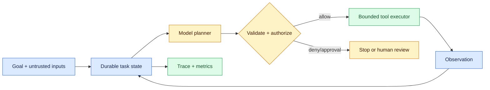
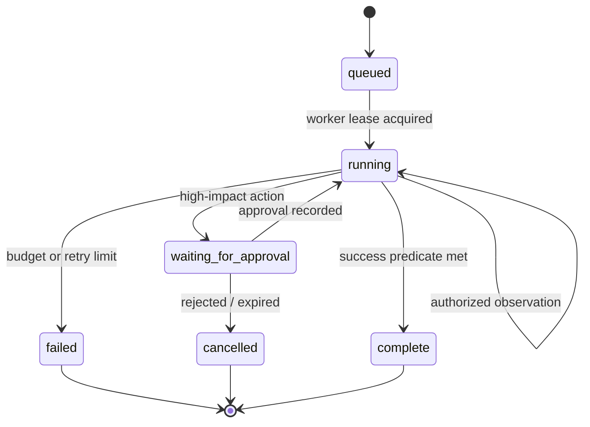

# The agent loop: turning a model call into a controlled system

Status: durable  
Sources: [HumanSignal — 2026-03-11](https://humansignal.com/blog/agent-evaluation-framework/), [DeepMind — 2026-03-10](https://deepmind.google/blog/10-years-of-alphago/)

## In one sentence

An AI agent is a feedback loop in which a model observes state, proposes a bounded action, receives an observation, and repeats under explicit budgets and controls.

## Why this matters

A chat completion is mostly a pure request/response operation: send context, receive text. An agent changes the engineering problem because it can use text to choose a tool, alter external state, inspect the result, and choose again. That adds the same concerns familiar from distributed systems: retries, idempotency, timeouts, stale reads, quotas, authorization, audit logs, and a clean terminal state.

The model is valuable as a planner under ambiguity. It is not a transaction coordinator, identity provider, or policy engine. Those jobs belong to deterministic code surrounding it. This separation is the core mental model for reliable modern AI.

## Background, processing impact, and applications

Before agents, most LLM products were single-turn chat or retrieval: the application owned the workflow and the model produced language. Modern tool calling lets a model propose the next step in a stateful workflow, changing processing into `goal → authorized context → proposal → policy gate → tool result → persisted state`. This is useful for support drafts, code proposals, research triage, and internal operations, but operational constraints—access scope, retries, cost, latency, and human ownership—set the safe autonomy level.

## Prerequisites, explained

**State machine.** A state machine defines valid states and transitions. For an agent task, `queued → running → waiting_for_approval → complete|failed|cancelled` is safer than an unbounded while loop because it makes resumption and failure behavior explicit.

**Idempotency.** A network response can be lost after a side effect succeeded. Repeating `create_ticket` must therefore use an idempotency key so the retried request returns the original ticket rather than creating a duplicate.

**Capability and authorization.** A capability is narrowly scoped authority, such as “read this issue for ten minutes.” The model can request it but should never create or widen it. Authorization is evaluated by a service using the caller, resource, task, and policy.

**Evaluation.** A passing trace is not proof of success. Evaluate the final world state, tool policy decisions, cost, latency, and operator interventions. The March HumanSignal article is useful context for this distinction between logged completion and actual effect.

## Anatomy of one run



The input may contain user text, retrieved documents, or prior tool output. All are potentially untrusted. The model proposes an action with structured arguments. The gateway validates the arguments, applies policy, and only then invokes an executor with a narrow credential. The executor returns a bounded, sanitized observation. State records the step count, prior decisions, idempotency keys, and budget so a crash can resume safely.

## Design the loop around invariants

Write invariants before choosing a model or prompt. For a support agent, useful invariants are: it may read only the caller’s tenant; it cannot issue a refund directly; no task exceeds ten tool calls; a task with two consecutive tool failures pauses; every side effect has an idempotency key; and all terminal transitions produce an audit event.



The **success predicate** must be outside the model. “The model said it finished” is not one. For example, success could mean a draft ticket exists with required fields, a test suite passes, or a human accepted a proposed change. AlphaGo is an instructive historical pattern: a learned policy/value component made choices within a search-and-feedback system. Modern tool agents similarly need environment feedback rather than trusting a single fluent output.

## Failure modes and trade-offs

Longer loops can solve multi-step tasks but accumulate error. A tool can partially succeed; retrieved text can inject malicious instructions; a plan can thrash between actions; and retries can duplicate effects. Stronger models help with planning but do not eliminate these system failures.

Countermeasures are concrete:

- Set independent budgets for turns, wall time, tool calls, money, and output size.
- Use typed tool inputs and server-side semantic checks, not only a prompt instruction.
- Make reads and writes tenant-aware; filter before retrieval or ranking.
- Return explicit tool error categories: retryable, terminal, needs approval, and unknown.
- Store traces with a task ID and redact secrets before observations return to the model.
- Add a deterministic fallback or human handoff when confidence, budget, or policy requires it.

These controls reduce autonomy, but that is often the desired product behavior. A production agent should be predictable about its limits.

## Runnable local example

```python
# python3 agent_loop.py
from dataclasses import dataclass

@dataclass
class Task:
    status: str = "running"
    steps: int = 0
    max_steps: int = 3

def authorize(action: str) -> str:
    return "needs_approval" if action == "refund" else "allow"

def step(task: Task, action: str) -> str:
    if task.steps >= task.max_steps:
        task.status = "failed"; return "budget_exhausted"
    decision = authorize(action)
    if decision != "allow":
        task.status = "waiting_for_approval"; return decision
    task.steps += 1
    task.status = "complete" if action == "create_draft" else "running"
    return task.status

t = Task()
print(step(t, "refund"), t)       # needs_approval; no effect
print(step(Task(), "create_draft"))  # complete
```

The important property is not the planner—it is that a high-impact action cannot execute because the policy transition is outside it. Add tests for an unknown tool, repeated draft creation with the same idempotency key, and cancellation after a timeout.

## Build it locally

1. Start with the example and persist `Task` records in SQLite or a JSONL file.
2. Add `task_id`, `tenant`, `idempotency_key`, `trace_id`, and a fixed cost/step budget.
3. Implement fake read and draft tools; keep every write reversible. Route both through `authorize`.
4. Write tests for cross-tenant denial, duplicate retries, terminal failure, and approval expiry.
5. Only then connect a local or hosted model as a *proposal generator*. Log proposed actions separately from policy decisions and compare final state against an oracle.

## Interview Q&A

**What makes an LLM application an agent?** It closes the loop with state and environment feedback: the model can select actions, observe results, and continue toward a goal.

**Why not trust tool calling?** Tool calling gives structured syntax, not business authority. A server must validate semantics and authorize the specific resource and effect.

**How do you stop infinite loops?** Persist state and enforce turn, time, cost, and retry budgets; transition deterministically to failed, cancelled, or human review.

**How do you evaluate it?** Use end-state success plus safety, cost, latency, and reliability metrics; replay representative and adversarial traces.

**When use a multi-agent system?** Only when specialization or parallel exploration improves a measured outcome enough to justify coordination, context, and observability overhead.

## Glossary

- **Agent loop:** repeated cycle of planning, action, observation, and state update.
- **World state:** the externally observable result, such as a created ticket or changed record.
- **Idempotency key:** identifier that makes a retry safe for a side effect.
- **Tool gateway:** deterministic service that validates, authorizes, executes, and logs a proposed action.

## Claim ledger

| Claim | Source | Fact or inference |
|---|---|---|
| Evaluation should distinguish a logged workflow completion from its final world-state effect. | [HumanSignal](https://humansignal.com/blog/agent-evaluation-framework/) | Industry perspective |
| AlphaGo combined neural networks with search and reinforcement learning. | [DeepMind](https://deepmind.google/blog/10-years-of-alphago/) | Fact |
| Agent loops should use durable state, explicit budgets, and a deterministic authorization boundary. | Systems-design recommendation | Inference |
