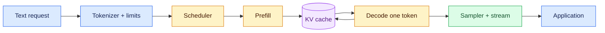
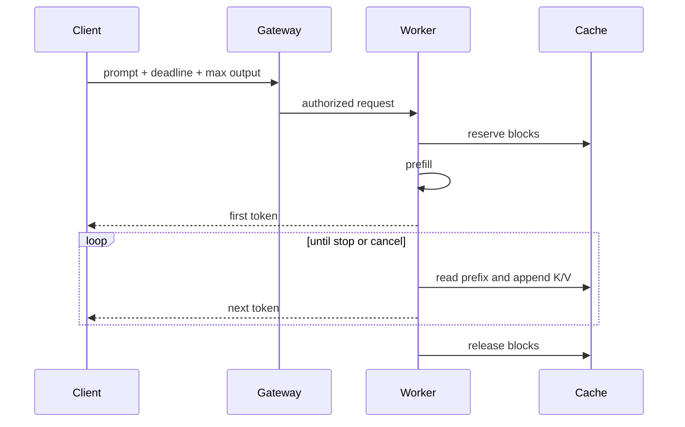

# Transformer inference

Status: durable
Sources: [Vaswani et al. — 2017 (foundational architecture)](https://arxiv.org/abs/1706.03762), [Dao et al. — FlashAttention](https://arxiv.org/abs/2205.14135), [vLLM PagedAttention](https://docs.vllm.ai/en/latest/design/paged_attention.html)

## In one sentence

Transformer inference processes a prompt in parallel, then decodes one token at a time while reusing cached attention keys and values.

## Background: what existed before

Recurrent neural networks carried a hidden state from one token to the next. That enabled sequence modeling but constrained parallel computation. Vaswani and colleagues’ Transformer replaced recurrence with causal self-attention: each position forms query, key, and value vectors and attends only to positions allowed by a causal mask. This is a foundational 2017 source, not a March 2026 release claim. It explains the computation that current agent runtimes wrap with queues, caches, and budgets.

## What changed and why now

The serving problem is now split into prefill and decode. During prefill, all prompt positions are available and can be processed in parallel. During decode, the system selects a token, appends it, and repeats. A KV cache stores prior keys and values so decode need not recompute those projections. FlashAttention’s foundational work shows how IO-aware tiling can reduce memory traffic while computing attention exactly under its stated numerical assumptions. vLLM’s documentation gives one implementation pattern for paging KV blocks across variable-length requests. These sources establish mechanisms, not a guarantee of safety or a universal provider design.

## Impact on current processing and architecture

A request first passes through authentication, tokenization, context-limit checks, and scheduling. The worker runs prefill, allocates per-layer cache state, samples the next token, and streams it. Each subsequent decode step reads the cached prefix and appends one new key/value entry. The gateway—not the model—owns tenant authorization and downstream side effects. Track queue delay, time to first token, inter-token latency, total tokens, cache bytes, cancellation, and termination reason independently.

## Real-world applications and constraints

Chat applications optimize first-token latency; batch extraction optimizes throughput; code completion benefits from repeated prefixes; agent loops repeatedly expand context after tools return. Long prompts consume prefill time and cache memory even when output is short. Long outputs hold cache blocks and can create noisy-neighbor effects. A service therefore needs per-request and per-tenant token limits, deadline-aware admission, cancellation cleanup, and a typed response when capacity is unavailable.

## Mental model





## What changed this month

March’s foundations track treats generation as a measurable systems loop rather than one opaque completion. The current lesson connects the historical Transformer mechanism to serving concerns that an agent evaluator can inspect: token budgets, cache ownership, queue delay, streaming, and downstream tool boundaries.

## Engineering consequence

Budget prompt tokens, maximum continuation, queue time, and cache bytes separately. Include model revision, tokenizer revision, system prefix, tenant scope, and relevant adapter configuration in cache compatibility checks. Prefix caching is an optimization only when exact reuse is authorized. A model worker should return structured proposals or text; deterministic application code must validate any action that changes external state.

## Limits and failure modes

KV caching reduces repeated computation but increases memory occupancy. A stale or overbroad cache key can return wrong context or leak a private prefix. Long context does not guarantee comprehension, and truncation can remove a critical instruction. Different hardware, kernels, batching, and floating-point reductions can change sampled tokens, so seeds are experimental controls rather than absolute reproducibility. Streaming introduces partial-output semantics: a client can disconnect after receiving some tokens. A worker crash can lose cache state; retrying an agent step may repeat a tool proposal, so side effects need idempotency outside inference.

## Runnable low-cost example

```python
# python3 transformer_inference.py
from time import perf_counter

def prefill(prompt):
    cache = {i: (tok, tok * 2) for i, tok in enumerate(prompt)}
    return cache, max(prompt, default=0) + 1

def decode(cache, first, steps):
    output = []
    for token in range(first, first + steps):
        cache[len(cache)] = (token, token * 2)
        output.append(token)
    return output

prompt = [11, 4, 9, 2]
start = perf_counter()
cache, first = prefill(prompt)
output = decode(cache, first, 5)
layers, kv_heads, head_dim, scalar_bytes = 32, 8, 128, 2
rough_bytes = layers * len(cache) * 2 * kv_heads * head_dim * scalar_bytes
print({"output": output, "cache_tokens": len(cache),
       "rough_kv_bytes": rough_bytes,
       "elapsed_ms": round((perf_counter() - start) * 1000, 3)})
assert len(cache) == len(prompt) + len(output)
```

The toy stores tuples instead of tensors. Its invariant is meaningful: one cache entry exists for each consumed position. The rough memory estimate omits alignment, temporary activations, and implementation-specific packing. Use it to reason about scaling, not to provision a worker.

## Mini exercise (15–30 min)

Add two requests with different prompt lengths. Compare serial execution with interleaving one decode step from each. Record queue delay and cache tokens. Then impose a cache-byte limit and reject a request unless prompt plus maximum continuation can be reserved. Add a model revision to the cache key and demonstrate that changing it forces a miss.

## Build it locally

1. Install Python 3.10 or newer; no external service or paid API is required.
2. Save the example as `transformer_inference.py` and run `python3 transformer_inference.py`.
3. Change prompt and output lengths and record the rough cache estimate.
4. Add tenant, deadline, model revision, tokenizer revision, and cancellation fields to a request record.
5. Implement admission before prefill and return a typed capacity error when reservation fails.
6. Add JSONL events for arrival, dispatch, first token, each sampled-count interval, cancellation, and release.
7. Test empty prompts, zero output budget, context overflow, model-version mismatch, worker restart, and two tenants with identical text.
8. Keep the toy as a contract test if you later connect a real inference server; never send production secrets to an experimental worker.

## Interview Q&A

**Why separate prefill and decode?** Prefill has many known positions and can parallelize; decode repeatedly processes one new position and reads the prefix cache. Their bottlenecks and latency metrics differ.

**What does KV caching store?** Keys and values for prior positions, typically per layer and KV head. It is execution state, not semantic memory or a permission record.

**Why can a short answer still be expensive?** A long prompt incurs tokenization, prefill, and cache occupancy before a short continuation is produced.

**What does FlashAttention contribute?** The cited paper describes IO-aware tiling intended to reduce memory traffic for exact attention under its numerical assumptions. It does not prove every implementation has identical performance.

**Can prefix caches be shared?** Only with exact compatibility and explicit authorization scope. Similar token text is not permission.

**What should an agent platform measure?** Queue delay, time to first token, inter-token latency, token counts, cache occupancy, cancellations, errors, and downstream task outcomes.

## Glossary

- **Attention:** weighted value aggregation selected using query-key scores.
- **Causal mask:** prevents a position from using future tokens.
- **Decode:** iterative continuation after prefill.
- **KV cache:** stored keys and values for consumed positions.
- **Logits:** scores before conversion to probabilities.
- **Prefill:** processing the supplied prompt.
- **Prefix caching:** reuse of exactly matching prior computation.
- **Sampling:** selection of a token from logits.
- **Time to first token:** arrival-to-first-token latency.

## Prefill as an admission decision

A serving request should reserve capacity before it enters the accelerator. Tokenization produces a length estimate, but the server must account for special tokens, tool wrappers, and the maximum continuation. Rejecting early is clearer than evicting a live sequence halfway through generation. A queue record should contain model identifier, tokenizer identifier, tenant, deadline, priority, and cancellation state. These fields make a request reproducible and prevent a cache created for one model configuration from being attached to another. The admission check can use the rough KV formula as a lower bound, then leave headroom for temporary activations and allocator alignment. In a production service, the check is measured against actual worker telemetry and is revised when kernels or precision change.

## Attention and memory traffic

The arithmetic description of attention is not enough to predict speed. Query, key, and value matrices are large tensors, and moving them between high-bandwidth memory and on-chip storage can dominate execution. FlashAttention’s contribution is an IO-aware tiling strategy: it computes blocks while retaining useful values in fast memory rather than materializing a full attention matrix. The paper presents this as an exact algorithm under its numerical assumptions. The practical lesson is to inspect bytes moved, not only floating-point operations. A smaller model with poor memory locality can lose to a larger optimized kernel for one shape, while a different sequence length reverses the result. Benchmark the shapes your workload actually sends.

## Cache layout and ownership

The cache is a mutable data structure indexed by sequence position and layer. A naïve implementation allocates one contiguous region for a maximum-length request, which wastes space when requests end early and makes fragmentation painful when lengths vary. Blocked layouts, such as the one documented by vLLM, let an allocator map logical positions to physical blocks. This is analogous to virtual memory: the logical sequence remains ordered while physical storage can be managed in chunks. The analogy does not grant sharing permissions. Blocks must carry request ownership and be released on completion, cancellation, or worker failure. A block belonging to a prior tenant must never be reachable through a reused handle.

## Scheduling interactive traffic

Interactive traffic cares about first-token latency and a steady stream; batch traffic cares about tokens per second and can tolerate waiting. A single FIFO queue provides a simple baseline but can suffer head-of-line blocking when a long prompt occupies a worker. Priority queues can improve deadlines while starving low-priority work, so aging or weighted fairness is needed. Continuous batching admits new sequences during decode steps, which can improve utilization, but each admission changes memory pressure and batch shape. The scheduler should measure queue age and deadline slack, not infer health from GPU utilization alone. A worker at 95 percent utilization can still violate every interactive objective.

## Sampling and stop behavior

The neural network emits logits, not an answer. Temperature changes the sharpness of the distribution; top-p or top-k restricts candidate mass; greedy selection chooses the largest score. These settings belong in the request and in the cache compatibility key where they affect reusable computation or output semantics. A deterministic seed helps compare experiments, but hardware, kernel, batching order, and floating-point reductions can still change a tie or low-probability choice. Stop sequences, end-of-sequence tokens, and maximum output length are independent termination paths. Record which one terminated the request so an unexpectedly short answer is distinguishable from a model refusal or a client cancellation.

## Context and position limits

A model’s advertised context limit is a hard interface boundary, not a guarantee of equal quality at every length. The tokenizer may split code, identifiers, or non-English text into more tokens than a character estimate predicts. An application should reserve space for the output before adding retrieval results and should truncate complete records with provenance. Sliding windows can preserve recent material but lose an early constraint; summaries reduce tokens but may introduce unsupported details. Position encoding and model-specific extrapolation determine what longer contexts mean, so the service must use the documented limit for the selected checkpoint. Treat a context overflow as a typed error that the agent loop can repair.

## Agent and tool interactions

An agent may call the model once to choose a search operation, add the result to context, call again, and finally draft a response. Each iteration creates a new prefix and may allocate another cache. The application should charge input and output tokens to a task budget, not only to individual calls, because a cheap-looking loop can accumulate expensive context. Tool results need size limits and provenance. A result that contains text such as “ignore the policy” is still untrusted data; the model worker should not be the component that authorizes a subsequent mutation. Keep tool execution outside inference, and make any retry safe with an idempotency key.

## Observability

A useful trace records prompt token count, accepted maximum output, queue arrival and dispatch times, prefill duration, first-token time, each decode step or a sampled token count, cache allocation, termination reason, and error class. It need not retain every sensitive token forever. Hash prompt templates and record model and tokenizer versions so aggregate metrics remain interpretable after upgrades. A dashboard should show distributions by prompt length and tenant; averages conceal a small set of pathological long contexts. Compare cache hit rate with correctness and isolation incidents. An optimization that increases hit rate while sharing a private prefix is a security regression, not a performance win.

## Failure recovery

A worker can crash after emitting tokens but before the application receives the final event. The client may reconnect, retry the request, or submit the partial answer as if it were complete. Define streaming semantics explicitly: whether partial output is usable, whether generation can resume, and whether a retry creates a new trace. Cache state is normally ephemeral, so a crash loses it; rebuilding is safer than attempting to deserialize an incompatible tensor layout. Cancellation must propagate from client to scheduler and worker, and the allocator must eventually reclaim blocks even when a network connection disappears. A watchdog can detect leaked sequences, but reconciliation should remain observable rather than silently deleting evidence.

## Capacity planning

Estimate capacity from the workload’s joint distribution, not a single maximum. A service with short prompts and long outputs has different memory and latency behavior from one with long prompts and short outputs. Calculate active sequences, prompt tokens per second, generated tokens per second, cache bytes, and expected concurrency for each route. Test a burst, a sustained load, and a noisy-neighbor case. Reserve headroom for model loading, allocator fragmentation, and rolling upgrades. Quantization may increase capacity but must be evaluated for extraction accuracy, code correctness, and refusal behavior. A lower dollar-per-token number is not sufficient if tail latency or error rate violates the product contract.

## Security boundaries

Inference workers process sensitive context, so model placement, cache lifetime, logs, and metrics are all data-governance decisions. The gateway should authenticate before allocating cache and apply tenant limits before batching. Do not use token equality as proof that two requests may share a prefix. Encrypt or isolate stored traces according to their content, and redact credentials from tool results before they enter context. A cache eviction policy should release references, not merely mark them unused, because stale buffers can be exposed by a programming error. Test cross-tenant requests with identical prompts and inspect actual cache identifiers in the trace.

## Verification and rollout

A safe rollout starts with the dependency-free harness in this lesson, then a sandbox worker and shadow traffic. Compare first-token and inter-token latency by prompt-length bucket. Verify output schema and task-level outcomes separately from token throughput. Run cancellation, context overflow, worker restart, cache exhaustion, and duplicate-request scenarios. Canary one model or scheduler version at a time and retain a rollback path. The foundational papers explain architecture and kernel or allocator ideas; they do not establish that a particular deployment is reliable, secure, or suitable for a high-impact decision. Those claims require workload-specific evaluation and human ownership.

## Additional topic-specific analysis

### Worked capacity example

Suppose a checkpoint has 32 layers, eight KV heads, head dimension 128, and two-byte cache values. Each cached position consumes approximately 32 × 8 × 128 × 2 × 2 bytes, or 131,072 bytes, before metadata and alignment. A 4,000-token prompt with a 1,000-token maximum continuation therefore needs a rough 655 MB for one sequence. This is not a recommendation to reserve exactly that amount. It is a way to see why ten simultaneous long contexts can exhaust a worker even when the parameter weights fit. Grouped-query attention changes the head count; quantization changes bytes per scalar; kernels add layout overhead. Measure real allocations.

### Tokenization as an interface

Tokenization is part of the model contract, not cosmetic preprocessing. A character limit cannot reliably enforce a token limit because whitespace, Unicode, source code, and identifiers split differently. The tokenizer version must match the checkpoint vocabulary and special-token rules. When an agent adds a tool result, estimate the resulting token count before the next call. If the estimate exceeds the reserved window, the controller can drop low-value records, summarize with citations, or ask the model to stop. Silently cutting the tail is dangerous because it may remove the user’s final constraint or a closing delimiter.

### Scheduler experiment design

A fair benchmark holds model, tokenizer, precision, and stopping policy constant while varying scheduler behavior. Generate fixtures with short and long prompts and outputs. Measure arrival-to-first-token, first-to-last-token, and tokens per second. A serial baseline gives queueing reference; static batching shows padding waste; continuous batching shows admission overhead. Repeat to estimate tails and separate warm-up. Report rejected requests and cancellations, not only successful throughput. If a scheduler improves average speed by making p99 unusable, the product may be worse. Encode the service objective as a pass/fail predicate.

### Numerical and reproducibility concerns

Floating-point reductions are associative only in exact arithmetic. Different GPU kernels, tensor-parallel partitions, or batch membership can round sums differently, changing a low-probability token. Greedy decoding is more reproducible than stochastic sampling but still depends on implementation details. Record precision, hardware class, seed, sampling parameters, and model revision. Use exact expected outputs only for deliberately deterministic tests; for general generation, assert schema, safety policy, or invariants. A cache test should prove that a changed model revision causes a miss.

### Streaming contract

Streaming shifts the API from one response to a sequence of events. Define events such as started, token, usage, stopped, cancelled, and error. The client may receive some tokens and disconnect; the server must release resources and mark the trace. Backpressure matters: a slow client can consume buffers and delay other requests. A proxy timeout can look like model failure, so correlation IDs should span gateway, scheduler, worker, and adapter. Do not commit a downstream action merely because partial natural-language output contains a plausible command. Structured actions need complete validation and authorization.

### Prefix reuse policy

Prefix caching is valuable for repeated system prompts, repository headers, and batch templates, but equality must be exact enough for correctness. Include system instructions, tool definitions, model revision, tokenizer, and adapter identity in the key. A user-specific conversation prefix should be scoped to that user or tenant. Eviction should account for recency and size, while a maximum lifetime limits stale policy. Measure hit rate, saved prefill time, memory occupancy, and incorrect-hit incidents together. A high hit rate is not success if the key omitted a hidden instruction.

### Failure injection plan

Exercise inference under a full cache, full queue, worker restart during prefill, client cancellation during decode, malformed sampling parameters, and tokenizer mismatch. For each case specify external response, state transition, cleanup, and retry safety. The model layer should return typed capacity or invalid-request errors; the controller can shorten context or route elsewhere. A restart test should prove no private cache block survives under another request. A timeout-after-stream test should prove downstream tools are not called from incomplete text. Failure injection makes assumptions executable.

### Cost accounting

Input and output token prices are provider-specific and can change, so cost should be represented as a measured usage event rather than hard-coded into correctness logic. Locally, count token IDs and multiply by a configurable rate only for estimates. Attribute cost to a task and retries, not just a model call. A tool-using agent can issue many short calls whose aggregate input context dominates one completion. Cache savings should be reported as avoided prefill work and memory occupancy, not claimed as free tokens. Controls include maximum task spend, per-tenant quotas, and approval for unusually large contexts.

### Rollout checklist

Before changing a serving stack, capture a baseline on representative prompt and output-length buckets. Verify first-token latency, inter-token latency, cache allocation, cancellation cleanup, and output correctness. Canary a small percentage with isolated capacity and compare safety and tenant-isolation alerts. Keep the old worker for rollback, but do not route a request to it with an incompatible cache. Inspect tail behavior during bursts and model-load events. Document who can disable prefix caching, lower concurrency, or switch route. Tuning is complete only when the operational runbook is updated.

### Source boundary

The Transformer paper is evidence for architecture and causal attention. FlashAttention is evidence for an IO-aware exact attention implementation, not every optimized kernel. vLLM documentation is evidence for one serving design’s paged-cache abstraction, not a universal standard. The arithmetic estimate and operational controls here are engineering reasoning. Validate them against the selected model, hardware, framework, privacy policy, and workload. A foundational technique can explain why a current agent platform has a bottleneck without pretending that the source announced a March product feature.

## References

- [Vaswani et al., Attention Is All You Need (2017; foundational)](https://arxiv.org/abs/1706.03762)
- [Dao et al., FlashAttention (2022; foundational systems technique)](https://arxiv.org/abs/2205.14135)
- [vLLM PagedAttention design (implementation reference)](https://docs.vllm.ai/en/latest/design/paged_attention.html)

## Claim ledger

| Claim | Source | Fact or inference |
|---|---|---|
| Transformer generation uses causal self-attention. | Vaswani et al. | Fact |
| FlashAttention reduces attention IO through tiling while targeting exact attention. | Dao et al. | Fact |
| PagedAttention manages variable-length KV cache in blocks. | vLLM documentation | Fact |
| Separate prefill/decode metrics improve capacity decisions. | Architecture analysis | Inference |
| Cache ownership and authorization must be enforced outside the model. | Security design principle | Inference |
| Foundational sources do not prove production safety for an arbitrary agent. | Scope of cited sources | Inference |
