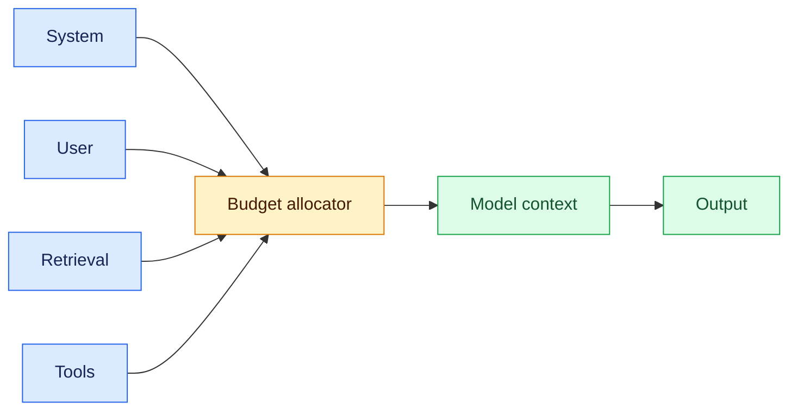
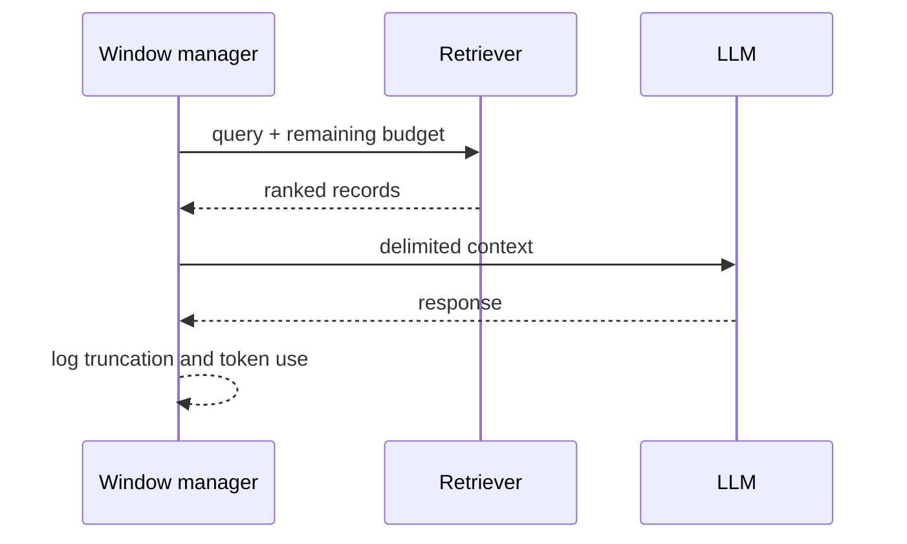

# Context windows
Status: durable
Sources: [OpenAI — Managing context](https://platform.openai.com/docs/guides/prompt-engineering)

## In one sentence
A context window is the bounded input and output working set for one model call, not durable memory.

## Background: what existed before
Short prompts and fixed application workflows could fit comfortably in model limits. As conversations and retrieval grew, prompt assembly became a resource-allocation problem.

## What changed and why now
Long-context models permit more material, but attention cost, token billing, and distraction still make “include everything” a poor policy.

## Impact on current processing and architecture
Reserve capacity for instructions, user input, retrieved records, tool results, and output. A context service should count tokens, rank records, and truncate whole units.

## Real-world applications and constraints
RAG, coding, and support history need recency and authorization filters. Truncation can remove a critical constraint; summarization can introduce unsupported facts.

## Mental model



## What changed this month
March’s agent framing makes context a per-step working set: each tool result competes with the next instruction and output reservation.

## Engineering consequence
Expose token estimates, truncation reasons, and “no result” behavior; test critical instructions at maximum realistic history.

## Limits and failure modes
Tokenizers differ; estimates can be wrong. Summaries lose provenance, and retrieved text may contain prompt injection. Authorization must happen before ranking.

## Runnable low-cost example
```python
records = [("policy", 4), ("ticket history", 7), ("tool result", 6)]
budget = 12; chosen = []
for name, cost in records:
    if cost <= budget: chosen.append(name); budget -= cost
print(chosen, "tokens left", budget)
```

## Mini exercise (15–30 min)
Add a mandatory system reservation and compare drop-oldest with summarize-then-drop policies.

## Build it locally
1. Run `python3 context.py` with Python 3.
2. Add records with scope and expiry metadata.
3. Filter unauthorized or expired records before budgeting.
4. Log selected IDs and remaining tokens for replay.

## Interview Q&A
**Is context memory?** No; memory is intentionally persisted and governed. **Why reserve output?** Otherwise generation can be truncated. **Why whole records?** Partial text loses meaning and provenance.

## Glossary
**Context window:** per-call token capacity. **Truncation:** removing content to fit. **RAG:** retrieval-augmented generation. **Prompt budget:** allocation across inputs and output.

## References
- [OpenAI prompt engineering guide](https://platform.openai.com/docs/guides/prompt-engineering)

## Claim ledger
| Claim | Source | Fact or inference |
|---|---|---|
| Prompts should be designed around explicit instructions and relevant context. | OpenAI guide | Fact |
| Whole-record budgeting and observability reduce operational surprises. | Systems-design recommendation | Inference |

### A concrete boundary

Context windows is easiest to reason about when the system boundary is explicit. The model or policy component may propose an interpretation, but the token admission, truncation, and provenance service owns the context budget, durable records, and the decision that becomes externally visible. The request enters with an identifier, tenant or study scope, and a deadline. A deterministic coordinator records the accepted input, selects relevant state, invokes the probabilistic component, and validates the returned artifact before the next transition. This tells an engineer where authority lives and where a failed call can be retried.

The useful contract has four parts: accepted input shape, trusted state available to the decision, output schema, and success predicate. For context windows, success should be observable without reading a model rationale. A test can inspect selected tokens, an admitted tool call, a measured participant outcome, or a search result and decide whether the contract held. If the predicate cannot be evaluated from durable evidence, the design is not ready for production review.

### Data and control flow

At ingress, normalize identifiers and attach a version for the tokenizer, tool schema, search policy, or study instrument. The planner receives only records that passed scope checks. The coordinator reserves the context budget, calls the component, and stores both the proposal and validation result. Downstream services consume the validated representation rather than the raw model message. That prevents a later consumer from treating an untrusted suggestion as authorization.

For token admission, truncation, and provenance, expose admission and rejection as first-class events. “No room,” “not permitted,” “not measurable,” and “dependency unavailable” are different outcomes and should not collapse into an empty result. Emit a correlation ID, policy version, input hash, latency, resource use, and outcome class. Keep payloads minimized: logs should contain references to sensitive records, not copied content. Retention and deletion must cover cached intermediate state as well as the final response.

### State that survives interruption

A worker crash must not erase the distinction between work that was proposed and work that was accepted. Persist a task record with `queued`, `running`, `waiting`, `succeeded`, `failed`, and `cancelled` states, plus attempt count and lease expiry. For context windows, add a domain field that makes recovery meaningful: an admitted span range, a tool-call receipt, a rollout seed, or a participant-session status. On restart, reclaim only expired leases and re-check the source of truth before repeating a step.

State transitions should be conditional. A late result from attempt one cannot overwrite a newer result from attempt two. Use a compare-and-set version or event sequence number. If the system cannot determine whether a side effect occurred, move to an `unknown` or `reconcile` state; do not guess that failure means no effect. This matters when lost instruction, stale summary, tokenizer drift occur at the same time as a network timeout.

### Resource accounting

One global limit is not enough. Allocate separate ceilings for input size, output reservation, remote calls, retries, wall-clock time, and storage. The context budget should be visible before work begins and decremented by measured use, not by a model estimate alone. Queue admission protects the service from accepting more work than its latency objective can support. Cancellation must stop new work and release leases while allowing an in-flight operation to be reconciled.

Measure distributions rather than only averages. Report p50 and p95 latency, rejection rate, budget exhaustion, retry count, and the fraction of results requiring human or operator intervention. Add domain metrics for token admission, truncation, and provenance. A throughput increase that raises lost instruction, stale summary, tokenizer drift is a regression even if the completion counter improves. Keep a small reserve for validation and error handling; otherwise the system can generate an answer but lack capacity to verify it.

### Failure-specific design

The primary failure for context windows is not simply “the model was wrong.” It is a mismatch between an uncertain proposal and a deterministic system assumption. When lost instruction, stale summary, tokenizer drift occurs, classify the event and choose a bounded response: retry only a transient dependency error, ask for narrower input when the contract is invalid, defer when evidence is incomplete, or stop when policy is violated. Never turn an authorization failure into a retry loop.

Use fault injection locally. Return an oversized input, a missing field, a stale record, a duplicate delivery, and a timeout after the dependency may have accepted the request. Assert the exact state transition and absence of forbidden effects. A useful test also checks that error text does not leak secret values or invite the model to bypass the failed control.

### Security and privacy boundary

Label every input by origin: caller, retrieved source, model output, operator decision, or system-generated measurement. In context windows, only the service that owns token admission, truncation, and provenance should be allowed to widen scope or commit a consequential result. Prompts are not an access-control mechanism. Apply tenant, consent, resource, and retention filters before content reaches ranking, generation, or analysis.

Separate audit evidence from user-visible explanation. The audit record identifies who requested work, which version ran, what was accepted, and which control allowed it. A response may summarize the outcome without exposing hidden instructions, private participant data, credentials, or internal policy details. Test cross-scope inputs explicitly; similar content is not evidence of permission.

### Evaluation plan

Build a fixture matrix with a normal case, a boundary case, a degraded dependency, an adversarial input, and a replay of a prior incident. For context windows, define an oracle that checks both the desired result and forbidden behavior. Compare a baseline with each change in isolation: component version, prompt or policy, storage strategy, or concurrency.

Keep outcome quality separate from reliability and safety. A useful result can still be too slow, too expensive, or unsafe to ship. Slice by input size, tenant or participant cohort, dependency status, and operator intervention. Preserve raw evidence needed to investigate a regression, but avoid retaining more sensitive data than the study or product requires.

### Rollout and migration

Start context windows in read-only, shadow, draft, or sandbox mode. Mirror representative traffic into the new path, compare its decision with the current path, and sample disagreements for review. Establish a rollback trigger before launch: a safety violation, a p95 breach, a cost ceiling, or a domain metric falling below its confidence interval. A feature flag should disable new work without destroying in-flight records.

During migration, version stored artifacts and make old records interpretable. For token admission, truncation, and provenance, compatibility includes more than an API shape: it includes tokenization, permission semantics, evaluator instructions, sampling protocol, and the meaning of success. Document the owner for each alert and procedure for reconciling ambiguous work.

### Local implementation sequence

1. Define a small fake world for context windows with three valid inputs and two invalid ones.
2. Add the domain contract and deterministic validator for token admission, truncation, and provenance.
3. Persist events as JSONL with IDs, versions, resource use, and outcomes.
4. Add injected timeout, duplicate, stale-state, and scope-violation cases.
5. Implement bounded retries and an explicit reconcile or human-review state.
6. Run fixtures against two component versions and compare sliced metrics.
7. Add a kill switch, retention rule, and redacted diagnostics before connecting a hosted model or external service.

The exercise teaches the control plane first, so a later model experiment cannot hide whether the surrounding system behaved correctly.

### Design review questions

Ask: Which part of context windows is probabilistic, and which part is authoritative? What evidence proves success? What happens after a timeout that may have committed work? Which input is untrusted, and where is it filtered? How are cost and latency bounded independently? What metric reveals harm while headline success improves? How can an operator pause, inspect, replay, and correct one task without changing unrelated tasks?

Strong answers name a state transition and an owner, not just a prompt instruction. They explain why token admission, truncation, and provenance needs its own metric and why the system returns a typed degraded result rather than fabricating certainty.

### Source interpretation

The linked March sources should be read narrowly. A published demonstration or historical result establishes what was tested, on which task, and under which measurement; it cannot establish that every workload inherits the result. The architecture above is an engineering inference built around that limitation. Mark release-specific facts in the claim ledger, identify assumptions about the local workload, and state which transfer questions remain open.

That discipline matters for context windows: a capability claim answers whether a system can produce a behavior under conditions, a reliability claim answers how often it works under disturbance, and a safety claim answers what happens when it does not. They require different evidence and owners.

### Operational checklist

Before approval, confirm that context windows has a versioned input contract, durable correlation ID, bounded resource use, and terminal state for every accepted task. Verify that token admission, truncation, and provenance is measured with a domain-appropriate oracle. Inspect a failure trace, a redacted audit event, a replay result, and a rollback drill. Confirm that scope checks happen before retrieval or execution and that an expired lease cannot authorize a late write.

If those checks pass, expand gradually and keep shadow comparison running. If they fail, retain the evidence and narrow the capability. A smaller reliable boundary is more useful than an impressive demo whose failures cannot be located.


## Context-window admission

A context manager should treat each record as a versioned, permission-checked object rather than a loose string. Reserve output tokens before selecting evidence, rank records by task value, and record why each item was admitted or dropped. Summaries need source IDs and timestamps so a reviewer can distinguish compression from fresh evidence. Test boundary cases where a critical instruction arrives late, a retrieved document is larger than the remaining budget, or a tokenizer upgrade changes the estimate. The safe result is a typed truncation or insufficient-context state, not silent omission.


### Token economics

A practical budget has a hard input ceiling, an output reserve, and a separate allowance for retrieved evidence. Estimate with the deployed tokenizer, then enforce the limit at the gateway. Log the selected record IDs and the reason for every eviction. A summary is a lossy transformation, so retain provenance and test whether required instructions survive it. Compare oldest-first, relevance-first, and hierarchical compaction on the same fixtures. The right policy depends on task risk; a customer-support answer can tolerate less history than a compliance decision.


## Context windows review notes

When a window overflows, the admission record should explain whether recency, authority, or task relevance won. Preserve the source identifier beside every retained span. A summary is not equivalent to the original: it should carry the IDs and a freshness timestamp, and the caller should be able to request the source again. Exercise the policy with a late system constraint, a long tool result, and a tokenizer version change. The observable outcome is `context_insufficient` or a deliberate handoff, never silent deletion of the only safety instruction. For context windows, evaluate answer support, critical-instruction retention, truncation rate, token cost, latency, and unauthorized retrieval attempts. A larger window is not an improvement if it increases distraction or leaks a record. For context windows, audit entries should include the prompt template hash, tokenizer version, selected record IDs, dropped-record reasons, and whether a summary was used. The user-facing answer must not imply that omitted evidence was considered. OpenAI documentation supports prompt and context design guidance, but it does not guarantee that a long context is attended correctly. The admission and retention policy here is an engineering inference and should be tested on the deployed model and tokenizer.
