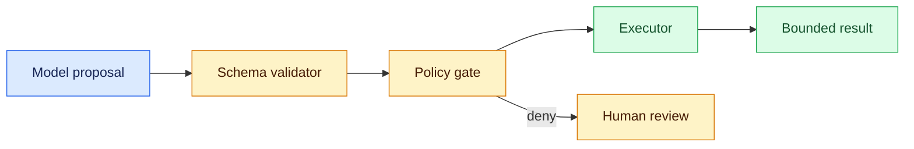
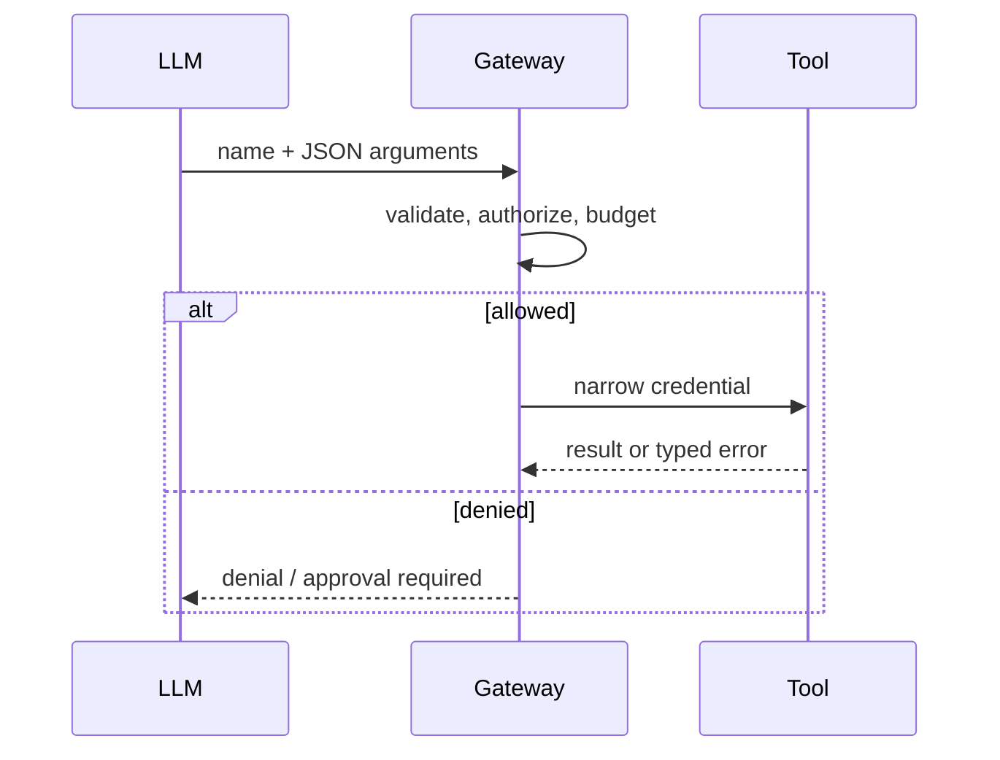

# Tool calling
Status: durable
Sources: [OpenAI — Function calling](https://platform.openai.com/docs/guides/function-calling)

## In one sentence
Tool calling lets a model propose typed arguments; deterministic code validates, authorizes, executes, and returns bounded results.

## Background: what existed before
Applications parsed free-form text or hard-coded every workflow. Both approaches made structured integration and error handling awkward.

## What changed and why now
Schema-shaped tool proposals made model-to-API handoffs easier, while modern agents expose many possible actions.

## Impact on current processing and architecture
The call path needs schema validation, semantic checks, identity and tenant authorization, timeout handling, redaction, and audit logging. JSON syntax is not authority.

## Real-world applications and constraints
Search and draft creation are low-risk starting points; payments, deletion, and messaging need approval, narrow credentials, and idempotency.

## Mental model



## What changed this month
The March baseline separates model proposals from deterministic authority and treats tool output as untrusted data.

## Engineering consequence
Version schemas and policies, return typed errors, and make side effects replayable with request IDs.

## Limits and failure modes
Valid JSON can request an unauthorized resource; tools can time out after succeeding. Prompt instructions cannot replace server checks.

## Runnable low-cost example
```python
def gateway(call):
    if call["name"] not in {"search", "draft"}: return "deny: unknown tool"
    if not isinstance(call.get("args"), dict): return "deny: bad args"
    return "allow"
print(gateway({"name":"draft", "args":{"title":"hi"}}))
```

## Mini exercise (15–30 min)
Add tenant ownership and a `delete` action that always returns approval-required.

## Build it locally
1. Save the snippet as `gateway.py` and run it with Python 3.
2. Define required fields and reject unknown fields.
3. Add an authorization check against a fake tenant map.
4. Log decision, arguments hash, and request ID without secrets.

## Interview Q&A
**Does schema validation authorize?** No; it only checks shape. **Where are credentials held?** In the executor or gateway, not model context. **How handle timeout-after-effect?** Query by idempotency key before retrying.

## Glossary
**Schema:** machine-readable argument shape. **Gateway:** policy-enforcing tool boundary. **Side effect:** externally visible mutation. **Idempotency:** safe repetition of one logical request.

## References
- [OpenAI function calling guide](https://platform.openai.com/docs/guides/function-calling)

## Claim ledger
| Claim | Source | Fact or inference |
|---|---|---|
| Function calling provides structured model-to-application arguments. | OpenAI guide | Fact |
| Server authorization must be separate from schema validation. | Security engineering principle | Inference |
## Detailed engineering walkthrough

A useful implementation starts by writing down the boundary between probabilistic work and deterministic work. The model may rank options, summarize evidence, or propose a next step, but a small service should own identity, authorization, persistence, and the definition of success. This boundary makes the system testable: a fixture can replace the model, a fake tool can return controlled failures, and an oracle can inspect the resulting state. It also makes incidents explainable because the trace can distinguish what was proposed from what was accepted.

For a local prototype, keep the state in a standard-library data structure or SQLite table. Give each task a stable identifier and record an event for every transition. Include the input hash, model and prompt version, selected route, tool name, sanitized arguments, policy decision, latency, and outcome. Never use a model-generated explanation as a permission check. Store only the minimum sensitive data needed to reproduce behavior, and make deletion and retention explicit from the start.

Design the happy path and at least four unhappy paths: malformed input, a transient dependency failure, a timeout after a possible side effect, and an adversarial or cross-tenant request. Each path should have a deterministic expected transition. Bound attempts, wall-clock time, output size, and money independently; one generous budget can hide an expensive failure. If uncertainty remains after a timeout, reconcile against the source of truth before retrying. If policy is unclear, pause for review rather than guessing.

Evaluate changes with a small matrix instead of one score. Compare task success, policy violations, p50 and p95 latency, tool calls, estimated cost, human edits, and escalation rate for simple, multi-step, stale-data, and tool-failure slices. Keep a holdout set and replay it after changing prompts, models, schemas, or routing. A capability improvement is not automatically a reliability or safety improvement. March’s primary discussions of AlphaGo and harmful-manipulation evaluation reinforce this separation: learned behavior can be useful while still requiring search, feedback, measurement, and human safeguards.

Operationally, expose dashboards for backlog, retries, denials, unknown errors, and terminal failures. Add alerts for sudden policy-denial changes, cross-tenant attempts, budget exhaustion, and p95 regressions. A kill switch should stop new side effects while allowing operators to inspect and reconcile in-flight tasks. Start with read-only or reversible actions, then expand authority only after the measured failure envelope is acceptable. These practices are engineering recommendations and inferences, not claims that a model or vendor guarantees safe autonomy.

## References and source use

Use the linked primary source to verify the release-specific claim before presenting it as fact. Use official protocol or platform documentation for implementation details, and label benchmark results with their task, population, and measurement method. When sources do not establish transfer to a production workload, say so explicitly. This keeps a March lesson useful to an SDE2 without turning an interesting demonstration into an unsupported deployment promise.
## Implementation design
This topic should be implemented as a small, inspectable system rather than a prompt-only demo. Begin with a contract that names inputs, outputs, authority, and success. Keep model suggestions separate from accepted actions. This allows deterministic test doubles to exercise policy and lets an operator answer what happened without reconstructing hidden conversation. A task identifier, correlation identifier, versioned configuration, and timestamp should travel through every event.

The minimum useful data model includes task status, owner or tenant, attempt count, deadline, budget remaining, and the last trusted observation. For any mutation, include an idempotency key and a before/after state check. For retrieved or human-provided content, include provenance and a trust classification. Filter scope before retrieval or ranking; semantic similarity is not authorization. Keep secrets out of prompts and redact them from logs. Define retention and deletion before collecting traces.

Build a deterministic local harness first. Use a fake world with a few records and tools that can return success, malformed output, a rate limit, a timeout, or a partial effect. Seed the scenario and record each event as JSONL. Assert both expected final state and forbidden events. A passing test can require a draft status and zero refund calls; a failure test can require a pause after two unknown errors. This is inexpensive and gives a stable baseline for model experiments.

When introducing a model, preserve the same harness and vary one factor at a time: model version, prompt template, retrieval policy, tool schema, or route. Report per-scenario and per-slice results, not just an average. Include success, unsafe-action rate, p50/p95 latency, tool-call count, estimated token cost, retry count, escalation rate, and human edits. A higher completion rate can coexist with worse safety or workload. Keep a hidden holdout and replay old incidents after every change.

Plan for operations. Set alerts on budget exhaustion, queue age, unknown errors, denied actions, cross-tenant attempts, and latency tails. Provide a kill switch that blocks new side effects, a drain mode for in-flight work, and reconciliation for ambiguous writes. Review sampled traces with access controls. Document who owns each terminal state and how correction is handled. Start with read-only, reversible, or draft-only actions; expand capability only when evidence supports it.

The March source context is deliberately narrow. DeepMind’s AlphaGo history supports claims about learned policy/value estimates working with search and environment feedback; it does not prove that a general business agent is reliable. DeepMind’s harmful-manipulation discussion supports studying human effects and safeguards; it does not establish a universal metric or safety guarantee. Treat official documentation as evidence for interfaces and published results as evidence for reported experiments. Mark deployment recommendations as engineering inference, and state where transfer remains uncertain.

A useful review asks five questions. What existed before this design, and what concrete capability changed? Which component owns authority and state? What happens on timeout, stale data, or adversarial input? Which metric would reveal harm even if task success rises? Can an operator pause, inspect, correct, and replay the task? If the lesson answers these with a runnable example and bounded test plan, it is ready for an SDE2 design review.
## Testing and operations
This topic should be implemented as a small, inspectable system rather than a prompt-only demo. Begin with a contract that names inputs, outputs, authority, and success. Keep model suggestions separate from accepted actions. This allows deterministic test doubles to exercise policy and lets an operator answer what happened without reconstructing hidden conversation. A task identifier, correlation identifier, versioned configuration, and timestamp should travel through every event.

The minimum useful data model includes task status, owner or tenant, attempt count, deadline, budget remaining, and the last trusted observation. For any mutation, include an idempotency key and a before/after state check. For retrieved or human-provided content, include provenance and a trust classification. Filter scope before retrieval or ranking; semantic similarity is not authorization. Keep secrets out of prompts and redact them from logs. Define retention and deletion before collecting traces.

Build a deterministic local harness first. Use a fake world with a few records and tools that can return success, malformed output, a rate limit, a timeout, or a partial effect. Seed the scenario and record each event as JSONL. Assert both expected final state and forbidden events. A passing test can require a draft status and zero refund calls; a failure test can require a pause after two unknown errors. This is inexpensive and gives a stable baseline for model experiments.

When introducing a model, preserve the same harness and vary one factor at a time: model version, prompt template, retrieval policy, tool schema, or route. Report per-scenario and per-slice results, not just an average. Include success, unsafe-action rate, p50/p95 latency, tool-call count, estimated token cost, retry count, escalation rate, and human edits. A higher completion rate can coexist with worse safety or workload. Keep a hidden holdout and replay old incidents after every change.

Plan for operations. Set alerts on budget exhaustion, queue age, unknown errors, denied actions, cross-tenant attempts, and latency tails. Provide a kill switch that blocks new side effects, a drain mode for in-flight work, and reconciliation for ambiguous writes. Review sampled traces with access controls. Document who owns each terminal state and how correction is handled. Start with read-only, reversible, or draft-only actions; expand capability only when evidence supports it.

The March source context is deliberately narrow. DeepMind’s AlphaGo history supports claims about learned policy/value estimates working with search and environment feedback; it does not prove that a general business agent is reliable. DeepMind’s harmful-manipulation discussion supports studying human effects and safeguards; it does not establish a universal metric or safety guarantee. Treat official documentation as evidence for interfaces and published results as evidence for reported experiments. Mark deployment recommendations as engineering inference, and state where transfer remains uncertain.

A useful review asks five questions. What existed before this design, and what concrete capability changed? Which component owns authority and state? What happens on timeout, stale data, or adversarial input? Which metric would reveal harm even if task success rises? Can an operator pause, inspect, correct, and replay the task? If the lesson answers these with a runnable example and bounded test plan, it is ready for an SDE2 design review.
## Review checklist
This topic should be implemented as a small, inspectable system rather than a prompt-only demo. Begin with a contract that names inputs, outputs, authority, and success. Keep model suggestions separate from accepted actions. This allows deterministic test doubles to exercise policy and lets an operator answer what happened without reconstructing hidden conversation. A task identifier, correlation identifier, versioned configuration, and timestamp should travel through every event.

The minimum useful data model includes task status, owner or tenant, attempt count, deadline, budget remaining, and the last trusted observation. For any mutation, include an idempotency key and a before/after state check. For retrieved or human-provided content, include provenance and a trust classification. Filter scope before retrieval or ranking; semantic similarity is not authorization. Keep secrets out of prompts and redact them from logs. Define retention and deletion before collecting traces.

Build a deterministic local harness first. Use a fake world with a few records and tools that can return success, malformed output, a rate limit, a timeout, or a partial effect. Seed the scenario and record each event as JSONL. Assert both expected final state and forbidden events. A passing test can require a draft status and zero refund calls; a failure test can require a pause after two unknown errors. This is inexpensive and gives a stable baseline for model experiments.

When introducing a model, preserve the same harness and vary one factor at a time: model version, prompt template, retrieval policy, tool schema, or route. Report per-scenario and per-slice results, not just an average. Include success, unsafe-action rate, p50/p95 latency, tool-call count, estimated token cost, retry count, escalation rate, and human edits. A higher completion rate can coexist with worse safety or workload. Keep a hidden holdout and replay old incidents after every change.

Plan for operations. Set alerts on budget exhaustion, queue age, unknown errors, denied actions, cross-tenant attempts, and latency tails. Provide a kill switch that blocks new side effects, a drain mode for in-flight work, and reconciliation for ambiguous writes. Review sampled traces with access controls. Document who owns each terminal state and how correction is handled. Start with read-only, reversible, or draft-only actions; expand capability only when evidence supports it.

The March source context is deliberately narrow. DeepMind’s AlphaGo history supports claims about learned policy/value estimates working with search and environment feedback; it does not prove that a general business agent is reliable. DeepMind’s harmful-manipulation discussion supports studying human effects and safeguards; it does not establish a universal metric or safety guarantee. Treat official documentation as evidence for interfaces and published results as evidence for reported experiments. Mark deployment recommendations as engineering inference, and state where transfer remains uncertain.

A useful review asks five questions. What existed before this design, and what concrete capability changed? Which component owns authority and state? What happens on timeout, stale data, or adversarial input? Which metric would reveal harm even if task success rises? Can an operator pause, inspect, correct, and replay the task? If the lesson answers these with a runnable example and bounded test plan, it is ready for an SDE2 design review.
## Extended local plan
This topic should be implemented as a small, inspectable system rather than a prompt-only demo. Begin with a contract that names inputs, outputs, authority, and success. Keep model suggestions separate from accepted actions. This allows deterministic test doubles to exercise policy and lets an operator answer what happened without reconstructing hidden conversation. A task identifier, correlation identifier, versioned configuration, and timestamp should travel through every event.

The minimum useful data model includes task status, owner or tenant, attempt count, deadline, budget remaining, and the last trusted observation. For any mutation, include an idempotency key and a before/after state check. For retrieved or human-provided content, include provenance and a trust classification. Filter scope before retrieval or ranking; semantic similarity is not authorization. Keep secrets out of prompts and redact them from logs. Define retention and deletion before collecting traces.

Build a deterministic local harness first. Use a fake world with a few records and tools that can return success, malformed output, a rate limit, a timeout, or a partial effect. Seed the scenario and record each event as JSONL. Assert both expected final state and forbidden events. A passing test can require a draft status and zero refund calls; a failure test can require a pause after two unknown errors. This is inexpensive and gives a stable baseline for model experiments.

When introducing a model, preserve the same harness and vary one factor at a time: model version, prompt template, retrieval policy, tool schema, or route. Report per-scenario and per-slice results, not just an average. Include success, unsafe-action rate, p50/p95 latency, tool-call count, estimated token cost, retry count, escalation rate, and human edits. A higher completion rate can coexist with worse safety or workload. Keep a hidden holdout and replay old incidents after every change.

Plan for operations. Set alerts on budget exhaustion, queue age, unknown errors, denied actions, cross-tenant attempts, and latency tails. Provide a kill switch that blocks new side effects, a drain mode for in-flight work, and reconciliation for ambiguous writes. Review sampled traces with access controls. Document who owns each terminal state and how correction is handled. Start with read-only, reversible, or draft-only actions; expand capability only when evidence supports it.

The March source context is deliberately narrow. DeepMind’s AlphaGo history supports claims about learned policy/value estimates working with search and environment feedback; it does not prove that a general business agent is reliable. DeepMind’s harmful-manipulation discussion supports studying human effects and safeguards; it does not establish a universal metric or safety guarantee. Treat official documentation as evidence for interfaces and published results as evidence for reported experiments. Mark deployment recommendations as engineering inference, and state where transfer remains uncertain.

A useful review asks five questions. What existed before this design, and what concrete capability changed? Which component owns authority and state? What happens on timeout, stale data, or adversarial input? Which metric would reveal harm even if task success rises? Can an operator pause, inspect, correct, and replay the task? If the lesson answers these with a runnable example and bounded test plan, it is ready for an SDE2 design review.
