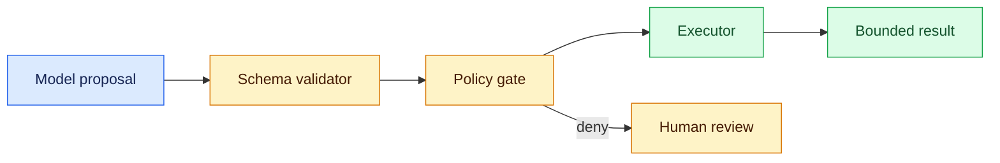
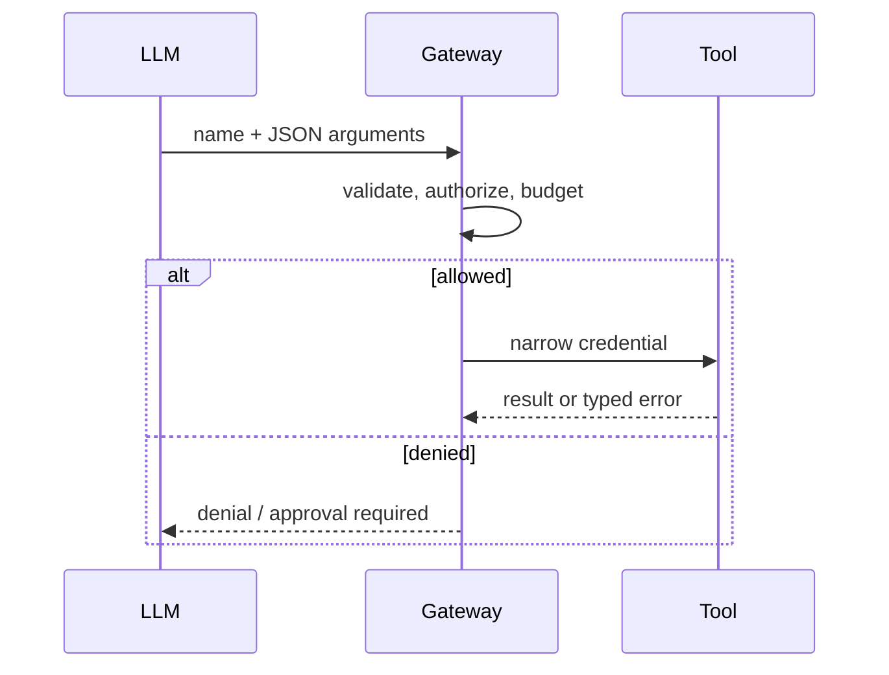

# Tool calling
Status: durable
Sources: [OpenAI — Function calling](https://platform.openai.com/docs/guides/function-calling)

## In one sentence
Tool calling lets a model propose typed arguments; deterministic code validates, authorizes, executes, and returns bounded results.

## Background: what existed before
Applications parsed free-form text or hard-coded every workflow. Both approaches made structured integration and error handling awkward.

## What changed and why now
Schema-shaped tool proposals made model-to-API handoffs easier, while modern agents expose many possible actions.

## Impact on current processing and architecture
The call path needs schema validation, semantic checks, identity and tenant authorization, timeout handling, redaction, and audit logging. JSON syntax is not authority.

## Real-world applications and constraints
Search and draft creation are low-risk starting points; payments, deletion, and messaging need approval, narrow credentials, and idempotency.

## Mental model



## What changed this month
The March baseline separates model proposals from deterministic authority and treats tool output as untrusted data.

## Engineering consequence
Version schemas and policies, return typed errors, and make side effects replayable with request IDs.

## Limits and failure modes
Valid JSON can request an unauthorized resource; tools can time out after succeeding. Prompt instructions cannot replace server checks.

## Runnable low-cost example
```python
def gateway(call):
    if call["name"] not in {"search", "draft"}: return "deny: unknown tool"
    if not isinstance(call.get("args"), dict): return "deny: bad args"
    return "allow"
print(gateway({"name":"draft", "args":{"title":"hi"}}))
```

## Mini exercise (15–30 min)
Add tenant ownership and a `delete` action that always returns approval-required.

## Build it locally
1. Save the snippet as `gateway.py` and run it with Python 3.
2. Define required fields and reject unknown fields.
3. Add an authorization check against a fake tenant map.
4. Log decision, arguments hash, and request ID without secrets.

## Interview Q&A
**Does schema validation authorize?** No; it only checks shape. **Where are credentials held?** In the executor or gateway, not model context. **How handle timeout-after-effect?** Query by idempotency key before retrying.

## Glossary
**Schema:** machine-readable argument shape. **Gateway:** policy-enforcing tool boundary. **Side effect:** externally visible mutation. **Idempotency:** safe repetition of one logical request.

## References
- [OpenAI function calling guide](https://platform.openai.com/docs/guides/function-calling)

## Claim ledger
| Claim | Source | Fact or inference |
|---|---|---|
| Function calling provides structured model-to-application arguments. | OpenAI guide | Fact |
| Server authorization must be separate from schema validation. | Security engineering principle | Inference |

### A concrete boundary

Tool calling is easiest to reason about when the system boundary is explicit. The model or policy component may propose an interpretation, but the schema validation, authorization, and effect reconciliation service owns the tool contract, durable records, and the decision that becomes externally visible. The request enters with an identifier, tenant or study scope, and a deadline. A deterministic coordinator records the accepted input, selects relevant state, invokes the probabilistic component, and validates the returned artifact before the next transition. This tells an engineer where authority lives and where a failed call can be retried.

The useful contract has four parts: accepted input shape, trusted state available to the decision, output schema, and success predicate. For tool calling, success should be observable without reading a model rationale. A test can inspect selected tokens, an admitted tool call, a measured participant outcome, or a search result and decide whether the contract held. If the predicate cannot be evaluated from durable evidence, the design is not ready for production review.

### Data and control flow

At ingress, normalize identifiers and attach a version for the tokenizer, tool schema, search policy, or study instrument. The planner receives only records that passed scope checks. The coordinator reserves the tool contract, calls the component, and stores both the proposal and validation result. Downstream services consume the validated representation rather than the raw model message. That prevents a later consumer from treating an untrusted suggestion as authorization.

For schema validation, authorization, and effect reconciliation, expose admission and rejection as first-class events. “No room,” “not permitted,” “not measurable,” and “dependency unavailable” are different outcomes and should not collapse into an empty result. Emit a correlation ID, policy version, input hash, latency, resource use, and outcome class. Keep payloads minimized: logs should contain references to sensitive records, not copied content. Retention and deletion must cover cached intermediate state as well as the final response.

### State that survives interruption

A worker crash must not erase the distinction between work that was proposed and work that was accepted. Persist a task record with `queued`, `running`, `waiting`, `succeeded`, `failed`, and `cancelled` states, plus attempt count and lease expiry. For tool calling, add a domain field that makes recovery meaningful: an admitted span range, a tool-call receipt, a rollout seed, or a participant-session status. On restart, reclaim only expired leases and re-check the source of truth before repeating a step.

State transitions should be conditional. A late result from attempt one cannot overwrite a newer result from attempt two. Use a compare-and-set version or event sequence number. If the system cannot determine whether a side effect occurred, move to an `unknown` or `reconcile` state; do not guess that failure means no effect. This matters when ambiguous timeout, malformed arguments, duplicate side effect occur at the same time as a network timeout.

### Resource accounting

One global limit is not enough. Allocate separate ceilings for input size, output reservation, remote calls, retries, wall-clock time, and storage. The tool contract should be visible before work begins and decremented by measured use, not by a model estimate alone. Queue admission protects the service from accepting more work than its latency objective can support. Cancellation must stop new work and release leases while allowing an in-flight operation to be reconciled.

Measure distributions rather than only averages. Report p50 and p95 latency, rejection rate, budget exhaustion, retry count, and the fraction of results requiring human or operator intervention. Add domain metrics for schema validation, authorization, and effect reconciliation. A throughput increase that raises ambiguous timeout, malformed arguments, duplicate side effect is a regression even if the completion counter improves. Keep a small reserve for validation and error handling; otherwise the system can generate an answer but lack capacity to verify it.

### Failure-specific design

The primary failure for tool calling is not simply “the model was wrong.” It is a mismatch between an uncertain proposal and a deterministic system assumption. When ambiguous timeout, malformed arguments, duplicate side effect occurs, classify the event and choose a bounded response: retry only a transient dependency error, ask for narrower input when the contract is invalid, defer when evidence is incomplete, or stop when policy is violated. Never turn an authorization failure into a retry loop.

Use fault injection locally. Return an oversized input, a missing field, a stale record, a duplicate delivery, and a timeout after the dependency may have accepted the request. Assert the exact state transition and absence of forbidden effects. A useful test also checks that error text does not leak secret values or invite the model to bypass the failed control.

### Security and privacy boundary

Label every input by origin: caller, retrieved source, model output, operator decision, or system-generated measurement. In tool calling, only the service that owns schema validation, authorization, and effect reconciliation should be allowed to widen scope or commit a consequential result. Prompts are not an access-control mechanism. Apply tenant, consent, resource, and retention filters before content reaches ranking, generation, or analysis.

Separate audit evidence from user-visible explanation. The audit record identifies who requested work, which version ran, what was accepted, and which control allowed it. A response may summarize the outcome without exposing hidden instructions, private participant data, credentials, or internal policy details. Test cross-scope inputs explicitly; similar content is not evidence of permission.

### Evaluation plan

Build a fixture matrix with a normal case, a boundary case, a degraded dependency, an adversarial input, and a replay of a prior incident. For tool calling, define an oracle that checks both the desired result and forbidden behavior. Compare a baseline with each change in isolation: component version, prompt or policy, storage strategy, or concurrency.

Keep outcome quality separate from reliability and safety. A useful result can still be too slow, too expensive, or unsafe to ship. Slice by input size, tenant or participant cohort, dependency status, and operator intervention. Preserve raw evidence needed to investigate a regression, but avoid retaining more sensitive data than the study or product requires.

### Rollout and migration

Start tool calling in read-only, shadow, draft, or sandbox mode. Mirror representative traffic into the new path, compare its decision with the current path, and sample disagreements for review. Establish a rollback trigger before launch: a safety violation, a p95 breach, a cost ceiling, or a domain metric falling below its confidence interval. A feature flag should disable new work without destroying in-flight records.

During migration, version stored artifacts and make old records interpretable. For schema validation, authorization, and effect reconciliation, compatibility includes more than an API shape: it includes tokenization, permission semantics, evaluator instructions, sampling protocol, and the meaning of success. Document the owner for each alert and procedure for reconciling ambiguous work.

### Local implementation sequence

1. Define a small fake world for tool calling with three valid inputs and two invalid ones.
2. Add the domain contract and deterministic validator for schema validation, authorization, and effect reconciliation.
3. Persist events as JSONL with IDs, versions, resource use, and outcomes.
4. Add injected timeout, duplicate, stale-state, and scope-violation cases.
5. Implement bounded retries and an explicit reconcile or human-review state.
6. Run fixtures against two component versions and compare sliced metrics.
7. Add a kill switch, retention rule, and redacted diagnostics before connecting a hosted model or external service.

The exercise teaches the control plane first, so a later model experiment cannot hide whether the surrounding system behaved correctly.

### Design review questions

Ask: Which part of tool calling is probabilistic, and which part is authoritative? What evidence proves success? What happens after a timeout that may have committed work? Which input is untrusted, and where is it filtered? How are cost and latency bounded independently? What metric reveals harm while headline success improves? How can an operator pause, inspect, replay, and correct one task without changing unrelated tasks?

Strong answers name a state transition and an owner, not just a prompt instruction. They explain why schema validation, authorization, and effect reconciliation needs its own metric and why the system returns a typed degraded result rather than fabricating certainty.

### Source interpretation

The linked March sources should be read narrowly. A published demonstration or historical result establishes what was tested, on which task, and under which measurement; it cannot establish that every workload inherits the result. The architecture above is an engineering inference built around that limitation. Mark release-specific facts in the claim ledger, identify assumptions about the local workload, and state which transfer questions remain open.

That discipline matters for tool calling: a capability claim answers whether a system can produce a behavior under conditions, a reliability claim answers how often it works under disturbance, and a safety claim answers what happens when it does not. They require different evidence and owners.

### Operational checklist

Before approval, confirm that tool calling has a versioned input contract, durable correlation ID, bounded resource use, and terminal state for every accepted task. Verify that schema validation, authorization, and effect reconciliation is measured with a domain-appropriate oracle. Inspect a failure trace, a redacted audit event, a replay result, and a rollback drill. Confirm that scope checks happen before retrieval or execution and that an expired lease cannot authorize a late write.

If those checks pass, expand gradually and keep shadow comparison running. If they fail, retain the evidence and narrow the capability. A smaller reliable boundary is more useful than an impressive demo whose failures cannot be located.


## Tool-call receipts

A tool gateway should validate syntax and meaning separately. Schema validation catches a missing field; authorization checks whether this caller may perform this operation on this resource; effect reconciliation checks what happened when the response was lost. Store a request hash, idempotency key, actor, policy decision, and provider receipt. For reads, cap result size and redact secrets before returning observations. For writes, require an explicit effect class and a server-side before/after assertion. These records make retries explainable and prevent a fluent argument from becoming an unreviewed mutation.


### Effect semantics

Every tool should declare whether it is read-only, reversible, or consequential. The executor can then apply different policies: reads may retry, reversible drafts may require an idempotency key, and irreversible actions need approval plus reconciliation. Do not infer effect class from a natural-language description. Return a receipt containing the provider status and resource version. If the provider reports an unknown result, the task pauses until a read-after-write check resolves it. This design makes a timeout a state to investigate rather than an invitation to duplicate work.


## Tool calling review notes

Fault injection for a gateway should distinguish a rejected argument from an uncertain external effect. Send an unknown operation, a valid operation on another tenant, malformed structured data, a provider rate limit, and a timeout after acceptance. Assert that only retryable failures are retried. Store a provider receipt or enter `reconcile`; never infer that an absent response means absent effect. Logs should show the request hash and decision while redacting credentials and private result fields. For tool calling, evaluate valid-call rate, policy-denial precision, duplicate-effect rate, reconciliation age, latency, and cost. A higher completion number is not an improvement if an unsafe mutation slips through. For tool calling, audit entries should include actor, resource, operation, validated arguments hash, policy version, provider receipt, and final reconciliation state. The user-facing answer may report a safe outcome without revealing tokens or hidden routing rules. OpenAI function-calling documentation supports the interface for structured proposals; authorization, idempotency, and reconciliation are application responsibilities. Those controls are engineering inferences, not vendor guarantees.


For a tool gateway, compatibility tests should replay old requests against the new schema and policy. A changed enum or default can alter an effect without changing the endpoint name. Keep provider receipts long enough to reconcile late responses, and expose a safe operator view that shows intent, authorization, execution status, and final resource version.
