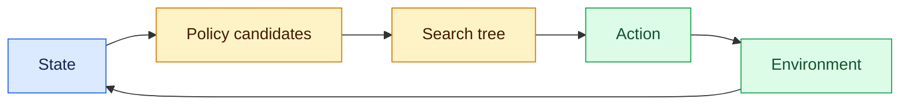
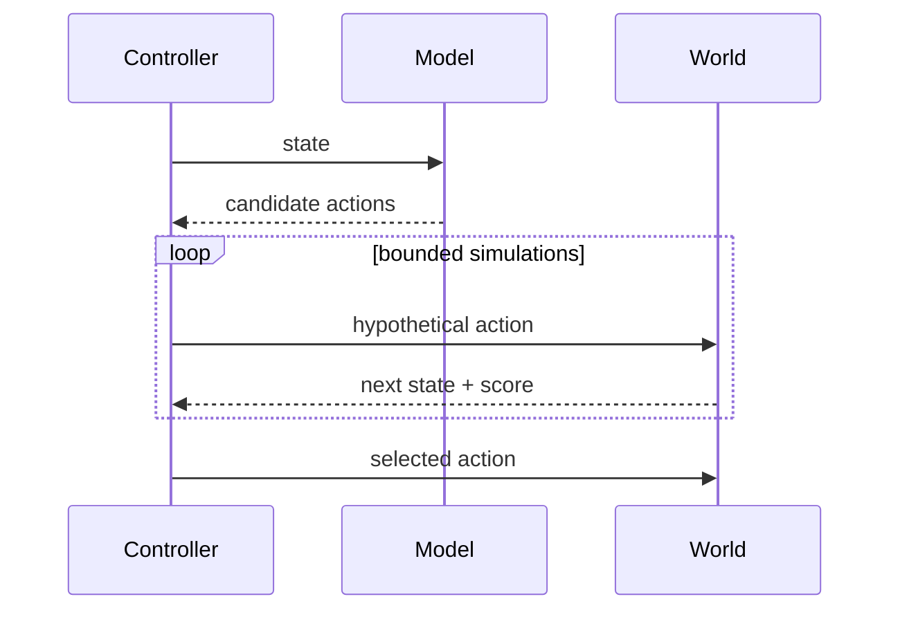

# Reinforcement learning and search
Status: durable
Sources: [DeepMind — 2026-03-10 AlphaGo at 10](https://deepmind.google/blog/10-years-of-alphago/)

## In one sentence
Reinforcement learning improves decisions from environment feedback, while search allocates computation across plausible future branches.
## Background: what existed before
Rules and greedy prediction selected one action without systematically exploring consequences. Game-playing research combined learned estimates with tree search.
## What changed and why now
AlphaGo demonstrated a practical blend of policy/value networks, self-play, and Monte Carlo tree search; agent systems reuse the planning pattern in new environments.
## Impact on current processing and architecture
A policy proposes candidates, a value estimates outcomes, and a search controller spends a bounded budget exploring. Tools provide observations and rewards.
## Real-world applications and constraints
Planning, scheduling, and code search can benefit. Environment simulators may be inaccurate, rewards can be gamed, and search costs latency.
## Mental model


## What changed this month
March uses AlphaGo as the historical anchor for separating learned proposals from explicit search and feedback.
## Engineering consequence
Make search budgets and reward definitions observable; evaluate final outcomes, not estimated value alone.
## Limits and failure modes
Reward hacking, simulation gaps, and combinatorial explosion can produce confidently wrong plans.
## Runnable low-cost example
```python
actions = {"wait": 0, "ship": 3, "refund": -2}
print(max(actions, key=actions.get))
```
## Mini exercise (15–30 min)
Add a two-step lookahead and show when a greedy choice loses.
## Build it locally
1. Run `python3 search.py`.
2. Define a tiny state transition function.
3. Compare greedy and depth-two choices.
4. Count simulations and cap them.
## Interview Q&A
**Policy versus value?** Policy suggests actions; value estimates outcomes. **Why search?** It spends compute on alternatives. **Main risk?** Optimizing a proxy rather than the real objective.
## Glossary
**Policy:** action-selection distribution. **Value:** expected return. **Reward:** feedback signal. **Search:** explicit exploration of alternatives.
## References
- [DeepMind — AlphaGo at ten](https://deepmind.google/blog/10-years-of-alphago/)
## Claim ledger
| Claim | Source | Fact or inference |
|---|---|---|
| AlphaGo combined learned components with search. | DeepMind | Fact |
| Bounded search can improve agent planning but adds latency. | Systems inference | Inference |

### A concrete boundary

Reinforcement-learning search is easiest to reason about when the system boundary is explicit. The model or policy component may propose an interpretation, but the action selection, rollout value, and exploration control service owns the search budget, durable records, and the decision that becomes externally visible. The request enters with an identifier, tenant or study scope, and a deadline. A deterministic coordinator records the accepted input, selects relevant state, invokes the probabilistic component, and validates the returned artifact before the next transition. This tells an engineer where authority lives and where a failed call can be retried.

The useful contract has four parts: accepted input shape, trusted state available to the decision, output schema, and success predicate. For reinforcement-learning search, success should be observable without reading a model rationale. A test can inspect selected tokens, an admitted tool call, a measured participant outcome, or a search result and decide whether the contract held. If the predicate cannot be evaluated from durable evidence, the design is not ready for production review.

### Data and control flow

At ingress, normalize identifiers and attach a version for the tokenizer, tool schema, search policy, or study instrument. The planner receives only records that passed scope checks. The coordinator reserves the search budget, calls the component, and stores both the proposal and validation result. Downstream services consume the validated representation rather than the raw model message. That prevents a later consumer from treating an untrusted suggestion as authorization.

For action selection, rollout value, and exploration control, expose admission and rejection as first-class events. “No room,” “not permitted,” “not measurable,” and “dependency unavailable” are different outcomes and should not collapse into an empty result. Emit a correlation ID, policy version, input hash, latency, resource use, and outcome class. Keep payloads minimized: logs should contain references to sensitive records, not copied content. Retention and deletion must cover cached intermediate state as well as the final response.

### State that survives interruption

A worker crash must not erase the distinction between work that was proposed and work that was accepted. Persist a task record with `queued`, `running`, `waiting`, `succeeded`, `failed`, and `cancelled` states, plus attempt count and lease expiry. For reinforcement-learning search, add a domain field that makes recovery meaningful: an admitted span range, a tool-call receipt, a rollout seed, or a participant-session status. On restart, reclaim only expired leases and re-check the source of truth before repeating a step.

State transitions should be conditional. A late result from attempt one cannot overwrite a newer result from attempt two. Use a compare-and-set version or event sequence number. If the system cannot determine whether a side effect occurred, move to an `unknown` or `reconcile` state; do not guess that failure means no effect. This matters when reward hacking, sparse feedback, unsafe exploration occur at the same time as a network timeout.

### Resource accounting

One global limit is not enough. Allocate separate ceilings for input size, output reservation, remote calls, retries, wall-clock time, and storage. The search budget should be visible before work begins and decremented by measured use, not by a model estimate alone. Queue admission protects the service from accepting more work than its latency objective can support. Cancellation must stop new work and release leases while allowing an in-flight operation to be reconciled.

Measure distributions rather than only averages. Report p50 and p95 latency, rejection rate, budget exhaustion, retry count, and the fraction of results requiring human or operator intervention. Add domain metrics for action selection, rollout value, and exploration control. A throughput increase that raises reward hacking, sparse feedback, unsafe exploration is a regression even if the completion counter improves. Keep a small reserve for validation and error handling; otherwise the system can generate an answer but lack capacity to verify it.

### Failure-specific design

The primary failure for reinforcement-learning search is not simply “the model was wrong.” It is a mismatch between an uncertain proposal and a deterministic system assumption. When reward hacking, sparse feedback, unsafe exploration occurs, classify the event and choose a bounded response: retry only a transient dependency error, ask for narrower input when the contract is invalid, defer when evidence is incomplete, or stop when policy is violated. Never turn an authorization failure into a retry loop.

Use fault injection locally. Return an oversized input, a missing field, a stale record, a duplicate delivery, and a timeout after the dependency may have accepted the request. Assert the exact state transition and absence of forbidden effects. A useful test also checks that error text does not leak secret values or invite the model to bypass the failed control.

### Security and privacy boundary

Label every input by origin: caller, retrieved source, model output, operator decision, or system-generated measurement. In reinforcement-learning search, only the service that owns action selection, rollout value, and exploration control should be allowed to widen scope or commit a consequential result. Prompts are not an access-control mechanism. Apply tenant, consent, resource, and retention filters before content reaches ranking, generation, or analysis.

Separate audit evidence from user-visible explanation. The audit record identifies who requested work, which version ran, what was accepted, and which control allowed it. A response may summarize the outcome without exposing hidden instructions, private participant data, credentials, or internal policy details. Test cross-scope inputs explicitly; similar content is not evidence of permission.

### Evaluation plan

Build a fixture matrix with a normal case, a boundary case, a degraded dependency, an adversarial input, and a replay of a prior incident. For reinforcement-learning search, define an oracle that checks both the desired result and forbidden behavior. Compare a baseline with each change in isolation: component version, prompt or policy, storage strategy, or concurrency.

Keep outcome quality separate from reliability and safety. A useful result can still be too slow, too expensive, or unsafe to ship. Slice by input size, tenant or participant cohort, dependency status, and operator intervention. Preserve raw evidence needed to investigate a regression, but avoid retaining more sensitive data than the study or product requires.

### Rollout and migration

Start reinforcement-learning search in read-only, shadow, draft, or sandbox mode. Mirror representative traffic into the new path, compare its decision with the current path, and sample disagreements for review. Establish a rollback trigger before launch: a safety violation, a p95 breach, a cost ceiling, or a domain metric falling below its confidence interval. A feature flag should disable new work without destroying in-flight records.

During migration, version stored artifacts and make old records interpretable. For action selection, rollout value, and exploration control, compatibility includes more than an API shape: it includes tokenization, permission semantics, evaluator instructions, sampling protocol, and the meaning of success. Document the owner for each alert and procedure for reconciling ambiguous work.

### Local implementation sequence

1. Define a small fake world for reinforcement-learning search with three valid inputs and two invalid ones.
2. Add the domain contract and deterministic validator for action selection, rollout value, and exploration control.
3. Persist events as JSONL with IDs, versions, resource use, and outcomes.
4. Add injected timeout, duplicate, stale-state, and scope-violation cases.
5. Implement bounded retries and an explicit reconcile or human-review state.
6. Run fixtures against two component versions and compare sliced metrics.
7. Add a kill switch, retention rule, and redacted diagnostics before connecting a hosted model or external service.

The exercise teaches the control plane first, so a later model experiment cannot hide whether the surrounding system behaved correctly.

### Design review questions

Ask: Which part of reinforcement-learning search is probabilistic, and which part is authoritative? What evidence proves success? What happens after a timeout that may have committed work? Which input is untrusted, and where is it filtered? How are cost and latency bounded independently? What metric reveals harm while headline success improves? How can an operator pause, inspect, replay, and correct one task without changing unrelated tasks?

Strong answers name a state transition and an owner, not just a prompt instruction. They explain why action selection, rollout value, and exploration control needs its own metric and why the system returns a typed degraded result rather than fabricating certainty.

### Source interpretation

The linked March sources should be read narrowly. A published demonstration or historical result establishes what was tested, on which task, and under which measurement; it cannot establish that every workload inherits the result. The architecture above is an engineering inference built around that limitation. Mark release-specific facts in the claim ledger, identify assumptions about the local workload, and state which transfer questions remain open.

That discipline matters for reinforcement-learning search: a capability claim answers whether a system can produce a behavior under conditions, a reliability claim answers how often it works under disturbance, and a safety claim answers what happens when it does not. They require different evidence and owners.

### Operational checklist

Before approval, confirm that reinforcement-learning search has a versioned input contract, durable correlation ID, bounded resource use, and terminal state for every accepted task. Verify that action selection, rollout value, and exploration control is measured with a domain-appropriate oracle. Inspect a failure trace, a redacted audit event, a replay result, and a rollback drill. Confirm that scope checks happen before retrieval or execution and that an expired lease cannot authorize a late write.

If those checks pass, expand gradually and keep shadow comparison running. If they fail, retain the evidence and narrow the capability. A smaller reliable boundary is more useful than an impressive demo whose failures cannot be located.


## Search-specific evidence

Search systems need an evaluation record richer than the winning action. Store the seed, legal-action mask, number of expansions, value estimates, terminal reward, and the state snapshot used for each comparison. A policy that wins against a weak opponent may still exploit a simulator artifact, and a reward increase may hide brittle behavior outside the training distribution. Use held-out environments, adversarial initial states, and a conservative fallback when the value estimate is uncertain. Treat exploration as a capability requiring an explicit safety envelope, not as permission to experiment on production state.


### Environment contract

A search policy is only as meaningful as its environment contract. Define legal actions, observation timing, reset behavior, reward ownership, and termination independently of the learned policy. Record simulator version and random seed with every run. If an action changes real resources, substitute a sandbox or approval gate and compare the proposed trajectory with a safe baseline. Evaluate counterfactuals where the obvious reward is unavailable or delayed. This exposes policies that optimize a proxy while violating the broader objective.


## Reinforcement learning and search review notes

Fault injection for a search controller means perturbing the environment, not merely returning malformed JSON. Remove an expected action, delay a reward, alter a simulator transition, and seed an adversarial state. Record whether the controller selected a legal fallback and whether exploration stayed inside its envelope. Compare the learned policy with a conservative baseline. If the value estimate is uncertain or the simulator disagrees with the real observation, stop or request review rather than spending more search to manufacture confidence. For search, evaluate legal-action rate, terminal reward, regret against a baseline, simulator-to-world gap, expansions, latency, and unsafe exploration. Report results by environment and seed. For search, audit entries should include environment version, random seed, action mask, expansion count, reward definition, and selected branch. A user-facing result should state uncertainty and source conditions rather than presenting an estimated value as fact. DeepMind’s AlphaGo history supports the reported combination of learned estimates, self-play, and search in that system. Applying the pattern to enterprise workflows is an engineering inference requiring environment-specific evidence.

The final review should compare the chosen action with legal alternatives and preserve the environment snapshot that produced the estimate. This makes a surprising win or loss inspectable rather than mystical.


Search evaluations should include seeds and environment snapshots in the artifact manifest. Reviewers can then reproduce a branch, compare legal alternatives, and identify whether a change improved decisions or merely changed exploration. Production actions require a sandbox, a conservative baseline, and an explicit owner for reward changes.
