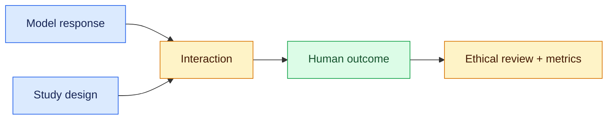
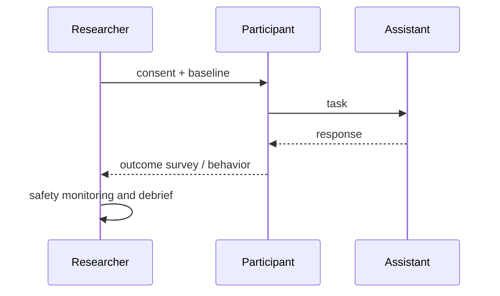

# Human-subject evaluation
Status: emerging
Sources: [DeepMind — 2026-03-26 harmful-manipulation evaluations](https://deepmind.google/blog/protecting-people-from-harmful-manipulation/)

## In one sentence
When AI behavior may change human outcomes, evaluation needs ethical study design and outcome measures, not only text labels.
## Background: what existed before
Teams often judged helpfulness with offline prompts or annotator preferences. Those measures miss downstream persuasion, reliance, and harm.
## What changed and why now
Research attention moved toward measuring harmful manipulation and interaction effects with people, including controlled evaluation protocols.
## Impact on current processing and architecture
Systems require escalation, consent and data governance, intervention logging, and metrics for behavior after a response—not merely response toxicity.
## Real-world applications and constraints
Health, finance, education, and support are sensitive. Institutional review, representative recruitment, privacy, informed consent, and stopping rules constrain experiments.
## Mental model


## What changed this month
DeepMind’s March discussion makes manipulation an outcome-oriented evaluation concern rather than a simple classifier label.
## Engineering consequence
Pair model red-team tests with domain review and explicit human-impact metrics.
## Limits and failure modes
Lab behavior may not generalize; self-report is noisy; measurement itself can cause distress or selection bias.
## Runnable low-cost example
```python
responses = [{"helpful":1,"pressure":0},{"helpful":1,"pressure":1}]
print(sum(r["pressure"] for r in responses)/len(responses))
```
## Mini exercise (15–30 min)
Design a consent-safe A/B hypothesis and a harm stopping rule for a support assistant.
## Build it locally
1. Run `python3 outcomes.py`.
2. Add separate capability and harm fields.
3. Compute subgroup rates without identifying data.
4. Write a review checklist before collecting any real responses.
## Interview Q&A
**Why not toxicity alone?** Harm can arise from context and outcomes. **What is a stopping rule?** A predefined condition to pause a study. **Who owns approval?** Appropriate ethics and domain governance, not the model.
## Glossary
**Outcome:** observed effect after interaction. **Consent:** informed voluntary participation. **Subgroup:** analysis slice. **Debrief:** explanation after a study.
## References
- [DeepMind — Protecting people from harmful manipulation](https://deepmind.google/blog/protecting-people-from-harmful-manipulation/)
## Claim ledger
| Claim | Source | Fact or inference |
|---|---|---|
| Manipulation evaluation concerns human effects, not only generated text. | DeepMind | Fact |
| Sensitive deployments need domain and ethics governance. | Research practice | Inference |

### A concrete boundary

Human-subject evaluation is easiest to reason about when the system boundary is explicit. The model or policy component may propose an interpretation, but the participant consent, task protocol, and outcome measurement service owns the study protocol, durable records, and the decision that becomes externally visible. The request enters with an identifier, tenant or study scope, and a deadline. A deterministic coordinator records the accepted input, selects relevant state, invokes the probabilistic component, and validates the returned artifact before the next transition. This tells an engineer where authority lives and where a failed call can be retried.

The useful contract has four parts: accepted input shape, trusted state available to the decision, output schema, and success predicate. For human-subject evaluation, success should be observable without reading a model rationale. A test can inspect selected tokens, an admitted tool call, a measured participant outcome, or a search result and decide whether the contract held. If the predicate cannot be evaluated from durable evidence, the design is not ready for production review.

### Data and control flow

At ingress, normalize identifiers and attach a version for the tokenizer, tool schema, search policy, or study instrument. The planner receives only records that passed scope checks. The coordinator reserves the study protocol, calls the component, and stores both the proposal and validation result. Downstream services consume the validated representation rather than the raw model message. That prevents a later consumer from treating an untrusted suggestion as authorization.

For participant consent, task protocol, and outcome measurement, expose admission and rejection as first-class events. “No room,” “not permitted,” “not measurable,” and “dependency unavailable” are different outcomes and should not collapse into an empty result. Emit a correlation ID, policy version, input hash, latency, resource use, and outcome class. Keep payloads minimized: logs should contain references to sensitive records, not copied content. Retention and deletion must cover cached intermediate state as well as the final response.

### State that survives interruption

A worker crash must not erase the distinction between work that was proposed and work that was accepted. Persist a task record with `queued`, `running`, `waiting`, `succeeded`, `failed`, and `cancelled` states, plus attempt count and lease expiry. For human-subject evaluation, add a domain field that makes recovery meaningful: an admitted span range, a tool-call receipt, a rollout seed, or a participant-session status. On restart, reclaim only expired leases and re-check the source of truth before repeating a step.

State transitions should be conditional. A late result from attempt one cannot overwrite a newer result from attempt two. Use a compare-and-set version or event sequence number. If the system cannot determine whether a side effect occurred, move to an `unknown` or `reconcile` state; do not guess that failure means no effect. This matters when sampling bias, demand effects, privacy exposure occur at the same time as a network timeout.

### Resource accounting

One global limit is not enough. Allocate separate ceilings for input size, output reservation, remote calls, retries, wall-clock time, and storage. The study protocol should be visible before work begins and decremented by measured use, not by a model estimate alone. Queue admission protects the service from accepting more work than its latency objective can support. Cancellation must stop new work and release leases while allowing an in-flight operation to be reconciled.

Measure distributions rather than only averages. Report p50 and p95 latency, rejection rate, budget exhaustion, retry count, and the fraction of results requiring human or operator intervention. Add domain metrics for participant consent, task protocol, and outcome measurement. A throughput increase that raises sampling bias, demand effects, privacy exposure is a regression even if the completion counter improves. Keep a small reserve for validation and error handling; otherwise the system can generate an answer but lack capacity to verify it.

### Failure-specific design

The primary failure for human-subject evaluation is not simply “the model was wrong.” It is a mismatch between an uncertain proposal and a deterministic system assumption. When sampling bias, demand effects, privacy exposure occurs, classify the event and choose a bounded response: retry only a transient dependency error, ask for narrower input when the contract is invalid, defer when evidence is incomplete, or stop when policy is violated. Never turn an authorization failure into a retry loop.

Use fault injection locally. Return an oversized input, a missing field, a stale record, a duplicate delivery, and a timeout after the dependency may have accepted the request. Assert the exact state transition and absence of forbidden effects. A useful test also checks that error text does not leak secret values or invite the model to bypass the failed control.

### Security and privacy boundary

Label every input by origin: caller, retrieved source, model output, operator decision, or system-generated measurement. In human-subject evaluation, only the service that owns participant consent, task protocol, and outcome measurement should be allowed to widen scope or commit a consequential result. Prompts are not an access-control mechanism. Apply tenant, consent, resource, and retention filters before content reaches ranking, generation, or analysis.

Separate audit evidence from user-visible explanation. The audit record identifies who requested work, which version ran, what was accepted, and which control allowed it. A response may summarize the outcome without exposing hidden instructions, private participant data, credentials, or internal policy details. Test cross-scope inputs explicitly; similar content is not evidence of permission.

### Evaluation plan

Build a fixture matrix with a normal case, a boundary case, a degraded dependency, an adversarial input, and a replay of a prior incident. For human-subject evaluation, define an oracle that checks both the desired result and forbidden behavior. Compare a baseline with each change in isolation: component version, prompt or policy, storage strategy, or concurrency.

Keep outcome quality separate from reliability and safety. A useful result can still be too slow, too expensive, or unsafe to ship. Slice by input size, tenant or participant cohort, dependency status, and operator intervention. Preserve raw evidence needed to investigate a regression, but avoid retaining more sensitive data than the study or product requires.

### Rollout and migration

Start human-subject evaluation in read-only, shadow, draft, or sandbox mode. Mirror representative traffic into the new path, compare its decision with the current path, and sample disagreements for review. Establish a rollback trigger before launch: a safety violation, a p95 breach, a cost ceiling, or a domain metric falling below its confidence interval. A feature flag should disable new work without destroying in-flight records.

During migration, version stored artifacts and make old records interpretable. For participant consent, task protocol, and outcome measurement, compatibility includes more than an API shape: it includes tokenization, permission semantics, evaluator instructions, sampling protocol, and the meaning of success. Document the owner for each alert and procedure for reconciling ambiguous work.

### Local implementation sequence

1. Define a small fake world for human-subject evaluation with three valid inputs and two invalid ones.
2. Add the domain contract and deterministic validator for participant consent, task protocol, and outcome measurement.
3. Persist events as JSONL with IDs, versions, resource use, and outcomes.
4. Add injected timeout, duplicate, stale-state, and scope-violation cases.
5. Implement bounded retries and an explicit reconcile or human-review state.
6. Run fixtures against two component versions and compare sliced metrics.
7. Add a kill switch, retention rule, and redacted diagnostics before connecting a hosted model or external service.

The exercise teaches the control plane first, so a later model experiment cannot hide whether the surrounding system behaved correctly.

### Design review questions

Ask: Which part of human-subject evaluation is probabilistic, and which part is authoritative? What evidence proves success? What happens after a timeout that may have committed work? Which input is untrusted, and where is it filtered? How are cost and latency bounded independently? What metric reveals harm while headline success improves? How can an operator pause, inspect, replay, and correct one task without changing unrelated tasks?

Strong answers name a state transition and an owner, not just a prompt instruction. They explain why participant consent, task protocol, and outcome measurement needs its own metric and why the system returns a typed degraded result rather than fabricating certainty.

### Source interpretation

The linked March sources should be read narrowly. A published demonstration or historical result establishes what was tested, on which task, and under which measurement; it cannot establish that every workload inherits the result. The architecture above is an engineering inference built around that limitation. Mark release-specific facts in the claim ledger, identify assumptions about the local workload, and state which transfer questions remain open.

That discipline matters for human-subject evaluation: a capability claim answers whether a system can produce a behavior under conditions, a reliability claim answers how often it works under disturbance, and a safety claim answers what happens when it does not. They require different evidence and owners.

### Operational checklist

Before approval, confirm that human-subject evaluation has a versioned input contract, durable correlation ID, bounded resource use, and terminal state for every accepted task. Verify that participant consent, task protocol, and outcome measurement is measured with a domain-appropriate oracle. Inspect a failure trace, a redacted audit event, a replay result, and a rollback drill. Confirm that scope checks happen before retrieval or execution and that an expired lease cannot authorize a late write.

If those checks pass, expand gradually and keep shadow comparison running. If they fail, retain the evidence and narrow the capability. A smaller reliable boundary is more useful than an impressive demo whose failures cannot be located.


## Participant-centered evidence

A human-subject study is a data pipeline with ethical constraints at every stage. Pre-register the task, eligibility rule, consent language, compensation, exclusion criteria, and primary outcome before collecting observations. Separate identifiers from responses, minimize free text, and define withdrawal and deletion paths. A faster task may reflect reduced comprehension or pressure rather than improved assistance, so combine completion time with errors, confidence calibration, workload, and adverse-event reports. Analyze attrition and subgroup differences; an aggregate improvement is not evidence of benefit if a vulnerable cohort bears the cost.


### Study operations

Recruitment, scheduling, instrumentation, analysis, and publication form one operational system. Version the questionnaire and interface, timestamp consent, and distinguish a participant abandoning a task from a system error. Monitor participant burden during collection rather than only after the study. Predefine stopping rules for adverse events and a process for reporting protocol deviations. When results are shared, aggregate small cells and remove indirect identifiers. A statistically significant average is not sufficient if the intervention changes who participates or who can safely decline.


## Human-subject evaluation review notes

Fault injection in a participant study must be ethical and reversible. Pilot a comprehension failure, an unavailable consent record, an interrupted session, a distress signal, and an instrumentation outage without exposing real people to avoidable risk. The system should distinguish withdrawal from technical failure and stop collection when a pre-registered threshold is crossed. Analyze missingness and subgroup effects. A debrief, contact path, and deletion request are part of the study workflow, not optional prose after the metrics are calculated. For human studies, evaluate task outcome, comprehension, workload, adverse events, attrition, subgroup effects, and participant-reported trust. Report uncertainty and protocol deviations instead of only a favorable mean. For human studies, audit entries should include consent version, protocol version, cohort, intervention, withdrawal status, and adverse-event decision without storing unnecessary identity. Public reporting must prevent re-identification and distinguish observation from interpretation. DeepMind’s harmful-manipulation discussion supports treating human impact as an evaluation concern. It does not define a universal study design or prove transfer to a product population; the consent and monitoring controls here are engineering and research-ethics requirements.


Study results should preserve a distinction between participant report, observed behavior, and investigator interpretation. Version the analysis plan, record protocol deviations, and make subgroup confidence intervals visible. If the intervention creates a new burden, that burden belongs in the outcome review even when task completion increases.
