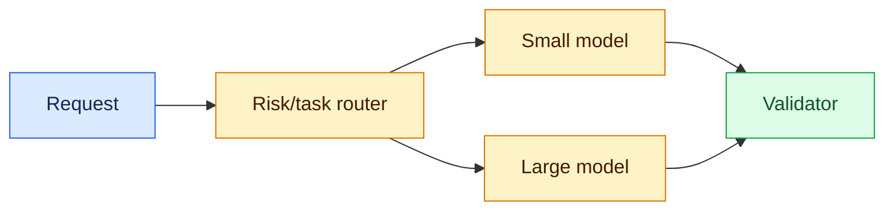
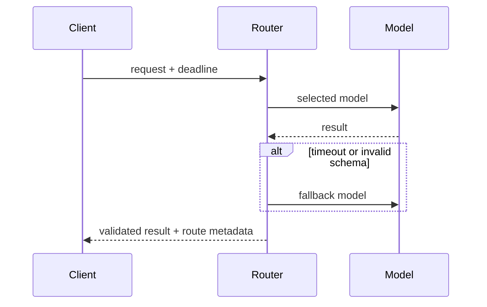

# Model routing
Status: durable
Sources: [Google Cloud — Model selection](https://cloud.google.com/vertex-ai/generative-ai/docs/learn/models)
## In one sentence
Model routing selects a model or fallback using task quality, risk, modality, latency, and cost requirements.
## Background: what existed before
Teams commonly hard-coded one model per product. Model diversity and variable traffic now make selection a runtime systems decision.
## What changed and why now
Specialized, small, and large models create a quality-cost frontier; routers can classify requests and choose an appropriate tier.
## Impact on current processing and architecture
A router needs policy, health checks, deadlines, budgets, and consistent output contracts. Route logs are essential for debugging drift.
## Real-world applications and constraints
Extraction can use a small model while ambiguous or high-risk work escalates. Fallbacks may change behavior and must preserve privacy and schema.
## Mental model


## What changed this month
The March map frames routing as an operational trade-off rather than a leaderboard choice.
## Engineering consequence
Define routing thresholds and fallback contracts; compare per-route quality, p95, and spend.
## Limits and failure modes
Misclassification sends risky work to weak models; fallback can duplicate cost or expose data to an unintended provider.
## Runnable low-cost example
```python
def route(risk, tokens): return "large" if risk == "high" or tokens > 500 else "small"
print(route("low", 40), route("high", 40))
```
## Mini exercise (15–30 min)
Add a deadline and route unavailable models to a deterministic template.
## Build it locally
1. Run `python3 router.py`.
2. Define low/high-risk fixtures.
3. Add model health and schema checks.
4. Record route, latency, and cost estimates.
## Interview Q&A
**What inputs matter?** Risk, task type, context size, deadline, and budget. **Why fallback?** Availability and latency. **What must remain stable?** Authorization and output contract.
## Glossary
**Router:** runtime model selector. **Fallback:** alternate path after failure. **p95:** 95th-percentile latency. **Contract:** promised input/output behavior.
## References
- [Vertex AI model documentation](https://cloud.google.com/vertex-ai/generative-ai/docs/learn/models)
## Claim ledger
| Claim | Source | Fact or inference |
|---|---|---|
| Model catalogs expose different capabilities and constraints. | Google Cloud docs | Fact |
| Runtime routing should optimize multiple dimensions. | Systems inference | Inference |

### Boundary

Model routing needs its own control plane. The route decision belongs to deterministic code, not to a model-generated instruction. The coordinator accepts a versioned request with identity, scope, and deadline, selects authorized state, invokes the uncertain component, and records the proposal separately from the accepted result. For policy-based model selection, fallback, and cost allocation, success must be checked from durable evidence without trusting hidden reasoning. “Unavailable,” “not permitted,” and “insufficient evidence” are different outcomes. Correlation IDs, input hashes, policy versions, resource measurements, and redacted receipts make a run replayable. A capability result is not automatically reliable, and a reliable result is not automatically safe.

In this design, misclassification, quota exhaustion, incompatible output is handled by a typed transition: retry only a transient dependency failure, narrow an invalid request, defer when evidence is incomplete, and stop when policy is violated. Persist leases and sequence numbers so a late result cannot overwrite newer state. Test normal, boundary, adversarial, timeout, duplicate, and stale-input cases. Measure domain outcomes alongside p95 latency, cost, retries, denials, and operator interventions. Start in shadow or draft mode, establish rollback triggers, and version every artifact that affects model routing.
### Data path

Model routing needs its own control plane. The route decision belongs to deterministic code, not to a model-generated instruction. The coordinator accepts a versioned request with identity, scope, and deadline, selects authorized state, invokes the uncertain component, and records the proposal separately from the accepted result. For policy-based model selection, fallback, and cost allocation, success must be checked from durable evidence without trusting hidden reasoning. “Unavailable,” “not permitted,” and “insufficient evidence” are different outcomes. Correlation IDs, input hashes, policy versions, resource measurements, and redacted receipts make a run replayable. A capability result is not automatically reliable, and a reliable result is not automatically safe.

In this design, misclassification, quota exhaustion, incompatible output is handled by a typed transition: retry only a transient dependency failure, narrow an invalid request, defer when evidence is incomplete, and stop when policy is violated. Persist leases and sequence numbers so a late result cannot overwrite newer state. Test normal, boundary, adversarial, timeout, duplicate, and stale-input cases. Measure domain outcomes alongside p95 latency, cost, retries, denials, and operator interventions. Start in shadow or draft mode, establish rollback triggers, and version every artifact that affects model routing.
### State recovery

Model routing needs its own control plane. The route decision belongs to deterministic code, not to a model-generated instruction. The coordinator accepts a versioned request with identity, scope, and deadline, selects authorized state, invokes the uncertain component, and records the proposal separately from the accepted result. For policy-based model selection, fallback, and cost allocation, success must be checked from durable evidence without trusting hidden reasoning. “Unavailable,” “not permitted,” and “insufficient evidence” are different outcomes. Correlation IDs, input hashes, policy versions, resource measurements, and redacted receipts make a run replayable. A capability result is not automatically reliable, and a reliable result is not automatically safe.

In this design, misclassification, quota exhaustion, incompatible output is handled by a typed transition: retry only a transient dependency failure, narrow an invalid request, defer when evidence is incomplete, and stop when policy is violated. Persist leases and sequence numbers so a late result cannot overwrite newer state. Test normal, boundary, adversarial, timeout, duplicate, and stale-input cases. Measure domain outcomes alongside p95 latency, cost, retries, denials, and operator interventions. Start in shadow or draft mode, establish rollback triggers, and version every artifact that affects model routing.
### Resource limits

Model routing needs its own control plane. The route decision belongs to deterministic code, not to a model-generated instruction. The coordinator accepts a versioned request with identity, scope, and deadline, selects authorized state, invokes the uncertain component, and records the proposal separately from the accepted result. For policy-based model selection, fallback, and cost allocation, success must be checked from durable evidence without trusting hidden reasoning. “Unavailable,” “not permitted,” and “insufficient evidence” are different outcomes. Correlation IDs, input hashes, policy versions, resource measurements, and redacted receipts make a run replayable. A capability result is not automatically reliable, and a reliable result is not automatically safe.

In this design, misclassification, quota exhaustion, incompatible output is handled by a typed transition: retry only a transient dependency failure, narrow an invalid request, defer when evidence is incomplete, and stop when policy is violated. Persist leases and sequence numbers so a late result cannot overwrite newer state. Test normal, boundary, adversarial, timeout, duplicate, and stale-input cases. Measure domain outcomes alongside p95 latency, cost, retries, denials, and operator interventions. Start in shadow or draft mode, establish rollback triggers, and version every artifact that affects model routing.
### Failure handling

Model routing needs its own control plane. The route decision belongs to deterministic code, not to a model-generated instruction. The coordinator accepts a versioned request with identity, scope, and deadline, selects authorized state, invokes the uncertain component, and records the proposal separately from the accepted result. For policy-based model selection, fallback, and cost allocation, success must be checked from durable evidence without trusting hidden reasoning. “Unavailable,” “not permitted,” and “insufficient evidence” are different outcomes. Correlation IDs, input hashes, policy versions, resource measurements, and redacted receipts make a run replayable. A capability result is not automatically reliable, and a reliable result is not automatically safe.

In this design, misclassification, quota exhaustion, incompatible output is handled by a typed transition: retry only a transient dependency failure, narrow an invalid request, defer when evidence is incomplete, and stop when policy is violated. Persist leases and sequence numbers so a late result cannot overwrite newer state. Test normal, boundary, adversarial, timeout, duplicate, and stale-input cases. Measure domain outcomes alongside p95 latency, cost, retries, denials, and operator interventions. Start in shadow or draft mode, establish rollback triggers, and version every artifact that affects model routing.
### Trust model

Model routing needs its own control plane. The route decision belongs to deterministic code, not to a model-generated instruction. The coordinator accepts a versioned request with identity, scope, and deadline, selects authorized state, invokes the uncertain component, and records the proposal separately from the accepted result. For policy-based model selection, fallback, and cost allocation, success must be checked from durable evidence without trusting hidden reasoning. “Unavailable,” “not permitted,” and “insufficient evidence” are different outcomes. Correlation IDs, input hashes, policy versions, resource measurements, and redacted receipts make a run replayable. A capability result is not automatically reliable, and a reliable result is not automatically safe.

In this design, misclassification, quota exhaustion, incompatible output is handled by a typed transition: retry only a transient dependency failure, narrow an invalid request, defer when evidence is incomplete, and stop when policy is violated. Persist leases and sequence numbers so a late result cannot overwrite newer state. Test normal, boundary, adversarial, timeout, duplicate, and stale-input cases. Measure domain outcomes alongside p95 latency, cost, retries, denials, and operator interventions. Start in shadow or draft mode, establish rollback triggers, and version every artifact that affects model routing.
### Evaluation

Model routing needs its own control plane. The route decision belongs to deterministic code, not to a model-generated instruction. The coordinator accepts a versioned request with identity, scope, and deadline, selects authorized state, invokes the uncertain component, and records the proposal separately from the accepted result. For policy-based model selection, fallback, and cost allocation, success must be checked from durable evidence without trusting hidden reasoning. “Unavailable,” “not permitted,” and “insufficient evidence” are different outcomes. Correlation IDs, input hashes, policy versions, resource measurements, and redacted receipts make a run replayable. A capability result is not automatically reliable, and a reliable result is not automatically safe.

In this design, misclassification, quota exhaustion, incompatible output is handled by a typed transition: retry only a transient dependency failure, narrow an invalid request, defer when evidence is incomplete, and stop when policy is violated. Persist leases and sequence numbers so a late result cannot overwrite newer state. Test normal, boundary, adversarial, timeout, duplicate, and stale-input cases. Measure domain outcomes alongside p95 latency, cost, retries, denials, and operator interventions. Start in shadow or draft mode, establish rollback triggers, and version every artifact that affects model routing.
### Rollout

Model routing needs its own control plane. The route decision belongs to deterministic code, not to a model-generated instruction. The coordinator accepts a versioned request with identity, scope, and deadline, selects authorized state, invokes the uncertain component, and records the proposal separately from the accepted result. For policy-based model selection, fallback, and cost allocation, success must be checked from durable evidence without trusting hidden reasoning. “Unavailable,” “not permitted,” and “insufficient evidence” are different outcomes. Correlation IDs, input hashes, policy versions, resource measurements, and redacted receipts make a run replayable. A capability result is not automatically reliable, and a reliable result is not automatically safe.

In this design, misclassification, quota exhaustion, incompatible output is handled by a typed transition: retry only a transient dependency failure, narrow an invalid request, defer when evidence is incomplete, and stop when policy is violated. Persist leases and sequence numbers so a late result cannot overwrite newer state. Test normal, boundary, adversarial, timeout, duplicate, and stale-input cases. Measure domain outcomes alongside p95 latency, cost, retries, denials, and operator interventions. Start in shadow or draft mode, establish rollback triggers, and version every artifact that affects model routing.
### Local build

Model routing needs its own control plane. The route decision belongs to deterministic code, not to a model-generated instruction. The coordinator accepts a versioned request with identity, scope, and deadline, selects authorized state, invokes the uncertain component, and records the proposal separately from the accepted result. For policy-based model selection, fallback, and cost allocation, success must be checked from durable evidence without trusting hidden reasoning. “Unavailable,” “not permitted,” and “insufficient evidence” are different outcomes. Correlation IDs, input hashes, policy versions, resource measurements, and redacted receipts make a run replayable. A capability result is not automatically reliable, and a reliable result is not automatically safe.

In this design, misclassification, quota exhaustion, incompatible output is handled by a typed transition: retry only a transient dependency failure, narrow an invalid request, defer when evidence is incomplete, and stop when policy is violated. Persist leases and sequence numbers so a late result cannot overwrite newer state. Test normal, boundary, adversarial, timeout, duplicate, and stale-input cases. Measure domain outcomes alongside p95 latency, cost, retries, denials, and operator interventions. Start in shadow or draft mode, establish rollback triggers, and version every artifact that affects model routing.
### Review questions

Model routing needs its own control plane. The route decision belongs to deterministic code, not to a model-generated instruction. The coordinator accepts a versioned request with identity, scope, and deadline, selects authorized state, invokes the uncertain component, and records the proposal separately from the accepted result. For policy-based model selection, fallback, and cost allocation, success must be checked from durable evidence without trusting hidden reasoning. “Unavailable,” “not permitted,” and “insufficient evidence” are different outcomes. Correlation IDs, input hashes, policy versions, resource measurements, and redacted receipts make a run replayable. A capability result is not automatically reliable, and a reliable result is not automatically safe.

In this design, misclassification, quota exhaustion, incompatible output is handled by a typed transition: retry only a transient dependency failure, narrow an invalid request, defer when evidence is incomplete, and stop when policy is violated. Persist leases and sequence numbers so a late result cannot overwrite newer state. Test normal, boundary, adversarial, timeout, duplicate, and stale-input cases. Measure domain outcomes alongside p95 latency, cost, retries, denials, and operator interventions. Start in shadow or draft mode, establish rollback triggers, and version every artifact that affects model routing.
### Source evidence

Model routing needs its own control plane. The route decision belongs to deterministic code, not to a model-generated instruction. The coordinator accepts a versioned request with identity, scope, and deadline, selects authorized state, invokes the uncertain component, and records the proposal separately from the accepted result. For policy-based model selection, fallback, and cost allocation, success must be checked from durable evidence without trusting hidden reasoning. “Unavailable,” “not permitted,” and “insufficient evidence” are different outcomes. Correlation IDs, input hashes, policy versions, resource measurements, and redacted receipts make a run replayable. A capability result is not automatically reliable, and a reliable result is not automatically safe.

In this design, misclassification, quota exhaustion, incompatible output is handled by a typed transition: retry only a transient dependency failure, narrow an invalid request, defer when evidence is incomplete, and stop when policy is violated. Persist leases and sequence numbers so a late result cannot overwrite newer state. Test normal, boundary, adversarial, timeout, duplicate, and stale-input cases. Measure domain outcomes alongside p95 latency, cost, retries, denials, and operator interventions. Start in shadow or draft mode, establish rollback triggers, and version every artifact that affects model routing.
### Operations

Model routing needs its own control plane. The route decision belongs to deterministic code, not to a model-generated instruction. The coordinator accepts a versioned request with identity, scope, and deadline, selects authorized state, invokes the uncertain component, and records the proposal separately from the accepted result. For policy-based model selection, fallback, and cost allocation, success must be checked from durable evidence without trusting hidden reasoning. “Unavailable,” “not permitted,” and “insufficient evidence” are different outcomes. Correlation IDs, input hashes, policy versions, resource measurements, and redacted receipts make a run replayable. A capability result is not automatically reliable, and a reliable result is not automatically safe.

In this design, misclassification, quota exhaustion, incompatible output is handled by a typed transition: retry only a transient dependency failure, narrow an invalid request, defer when evidence is incomplete, and stop when policy is violated. Persist leases and sequence numbers so a late result cannot overwrite newer state. Test normal, boundary, adversarial, timeout, duplicate, and stale-input cases. Measure domain outcomes alongside p95 latency, cost, retries, denials, and operator interventions. Start in shadow or draft mode, establish rollback triggers, and version every artifact that affects model routing.
### Migration

Model routing needs its own control plane. The route decision belongs to deterministic code, not to a model-generated instruction. The coordinator accepts a versioned request with identity, scope, and deadline, selects authorized state, invokes the uncertain component, and records the proposal separately from the accepted result. For policy-based model selection, fallback, and cost allocation, success must be checked from durable evidence without trusting hidden reasoning. “Unavailable,” “not permitted,” and “insufficient evidence” are different outcomes. Correlation IDs, input hashes, policy versions, resource measurements, and redacted receipts make a run replayable. A capability result is not automatically reliable, and a reliable result is not automatically safe.

In this design, misclassification, quota exhaustion, incompatible output is handled by a typed transition: retry only a transient dependency failure, narrow an invalid request, defer when evidence is incomplete, and stop when policy is violated. Persist leases and sequence numbers so a late result cannot overwrite newer state. Test normal, boundary, adversarial, timeout, duplicate, and stale-input cases. Measure domain outcomes alongside p95 latency, cost, retries, denials, and operator interventions. Start in shadow or draft mode, establish rollback triggers, and version every artifact that affects model routing.
### Final guardrail

Model routing needs its own control plane. The route decision belongs to deterministic code, not to a model-generated instruction. The coordinator accepts a versioned request with identity, scope, and deadline, selects authorized state, invokes the uncertain component, and records the proposal separately from the accepted result. For policy-based model selection, fallback, and cost allocation, success must be checked from durable evidence without trusting hidden reasoning. “Unavailable,” “not permitted,” and “insufficient evidence” are different outcomes. Correlation IDs, input hashes, policy versions, resource measurements, and redacted receipts make a run replayable. A capability result is not automatically reliable, and a reliable result is not automatically safe.

In this design, misclassification, quota exhaustion, incompatible output is handled by a typed transition: retry only a transient dependency failure, narrow an invalid request, defer when evidence is incomplete, and stop when policy is violated. Persist leases and sequence numbers so a late result cannot overwrite newer state. Test normal, boundary, adversarial, timeout, duplicate, and stale-input cases. Measure domain outcomes alongside p95 latency, cost, retries, denials, and operator interventions. Start in shadow or draft mode, establish rollback triggers, and version every artifact that affects model routing.
