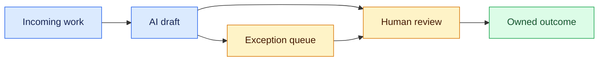
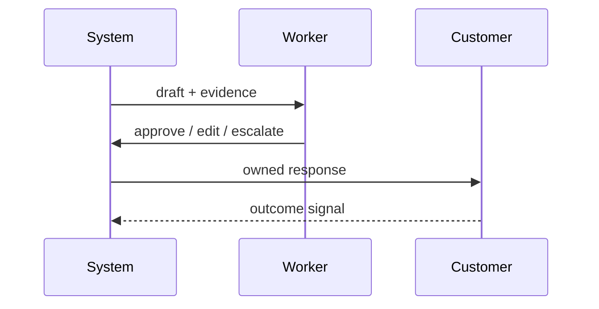

# AI work redesign
Status: emerging
Sources: [OpenAI — ChatGPT and the price of work](https://cdn.openai.com/pdf/ChatGPT-and-the-price-of-work_report.pdf)
## In one sentence
AI changes work when it is embedded in owned workflows with review, exception handling, and measurable outcomes.
## Background: what existed before
Automation targeted isolated tasks while knowledge workers coordinated exceptions manually. Chat interfaces often left ownership ambiguous.
## What changed and why now
Generative systems can draft, search, and coordinate across tasks, moving design attention from “access to a bot” to workflow boundaries.
## Impact on current processing and architecture
Products need queues, human review, audit trails, role permissions, rollback, and outcome instrumentation around model calls.
## Real-world applications and constraints
Support drafts and document triage are good pilots. Labor impact, training, accessibility, privacy, quality, and accountability constrain rollout.
## Mental model


## What changed this month
March’s work-redesign lens emphasizes process and human ownership, not raw model capability.
## Engineering consequence
Measure human edits, resolution time, error rate, and queue health alongside model quality.
## Limits and failure modes
Automation bias, hidden monitoring, deskilling, and shifted workload can harm outcomes even when throughput rises.
## Runnable low-cost example
```python
draft = {"confidence": .62, "needs_review": True}
print("queue" if draft["needs_review"] or draft["confidence"] < .8 else "send")
```
## Mini exercise (15–30 min)
Map one workflow’s approval, escalation, and rollback boundaries.
## Build it locally
1. Run `python3 workflow.py`.
2. Add an edit and escalation event.
3. Compute review rate and median handling time.
4. Define an owner for every terminal state.
## Interview Q&A
**What is human-in-the-loop?** A designed decision boundary, not a rubber stamp. **Why measure edits?** They reveal quality and workload. **What is a safe pilot?** Reversible drafts with read-only access.
## Glossary
**Exception queue:** work requiring judgment. **Human ownership:** accountable decision maker. **Audit trail:** evidence of actions. **Rollback:** restore prior state.
## References
- [OpenAI — ChatGPT and the price of work](https://cdn.openai.com/pdf/ChatGPT-and-the-price-of-work_report.pdf)
## Claim ledger
| Claim | Source | Fact or inference |
|---|---|---|
| AI adoption can alter task composition and workflows. | OpenAI report | Fact |
| Review queues and ownership are deployment requirements. | Product-design inference | Inference |

### Boundary

AI work redesign needs its own control plane. The workflow contract belongs to deterministic code, not to a model-generated instruction. The coordinator accepts a versioned request with identity, scope, and deadline, selects authorized state, invokes the uncertain component, and records the proposal separately from the accepted result. For task decomposition, role boundaries, and measurable human handoffs, success must be checked from durable evidence without trusting hidden reasoning. “Unavailable,” “not permitted,” and “insufficient evidence” are different outcomes. Correlation IDs, input hashes, policy versions, resource measurements, and redacted receipts make a run replayable. A capability result is not automatically reliable, and a reliable result is not automatically safe.

In this design, automation bias, hidden labor, unmeasured rework is handled by a typed transition: retry only a transient dependency failure, narrow an invalid request, defer when evidence is incomplete, and stop when policy is violated. Persist leases and sequence numbers so a late result cannot overwrite newer state. Test normal, boundary, adversarial, timeout, duplicate, and stale-input cases. Measure domain outcomes alongside p95 latency, cost, retries, denials, and operator interventions. Start in shadow or draft mode, establish rollback triggers, and version every artifact that affects ai work redesign.
### Data path

AI work redesign needs its own control plane. The workflow contract belongs to deterministic code, not to a model-generated instruction. The coordinator accepts a versioned request with identity, scope, and deadline, selects authorized state, invokes the uncertain component, and records the proposal separately from the accepted result. For task decomposition, role boundaries, and measurable human handoffs, success must be checked from durable evidence without trusting hidden reasoning. “Unavailable,” “not permitted,” and “insufficient evidence” are different outcomes. Correlation IDs, input hashes, policy versions, resource measurements, and redacted receipts make a run replayable. A capability result is not automatically reliable, and a reliable result is not automatically safe.

In this design, automation bias, hidden labor, unmeasured rework is handled by a typed transition: retry only a transient dependency failure, narrow an invalid request, defer when evidence is incomplete, and stop when policy is violated. Persist leases and sequence numbers so a late result cannot overwrite newer state. Test normal, boundary, adversarial, timeout, duplicate, and stale-input cases. Measure domain outcomes alongside p95 latency, cost, retries, denials, and operator interventions. Start in shadow or draft mode, establish rollback triggers, and version every artifact that affects ai work redesign.
### State recovery

AI work redesign needs its own control plane. The workflow contract belongs to deterministic code, not to a model-generated instruction. The coordinator accepts a versioned request with identity, scope, and deadline, selects authorized state, invokes the uncertain component, and records the proposal separately from the accepted result. For task decomposition, role boundaries, and measurable human handoffs, success must be checked from durable evidence without trusting hidden reasoning. “Unavailable,” “not permitted,” and “insufficient evidence” are different outcomes. Correlation IDs, input hashes, policy versions, resource measurements, and redacted receipts make a run replayable. A capability result is not automatically reliable, and a reliable result is not automatically safe.

In this design, automation bias, hidden labor, unmeasured rework is handled by a typed transition: retry only a transient dependency failure, narrow an invalid request, defer when evidence is incomplete, and stop when policy is violated. Persist leases and sequence numbers so a late result cannot overwrite newer state. Test normal, boundary, adversarial, timeout, duplicate, and stale-input cases. Measure domain outcomes alongside p95 latency, cost, retries, denials, and operator interventions. Start in shadow or draft mode, establish rollback triggers, and version every artifact that affects ai work redesign.
### Resource limits

AI work redesign needs its own control plane. The workflow contract belongs to deterministic code, not to a model-generated instruction. The coordinator accepts a versioned request with identity, scope, and deadline, selects authorized state, invokes the uncertain component, and records the proposal separately from the accepted result. For task decomposition, role boundaries, and measurable human handoffs, success must be checked from durable evidence without trusting hidden reasoning. “Unavailable,” “not permitted,” and “insufficient evidence” are different outcomes. Correlation IDs, input hashes, policy versions, resource measurements, and redacted receipts make a run replayable. A capability result is not automatically reliable, and a reliable result is not automatically safe.

In this design, automation bias, hidden labor, unmeasured rework is handled by a typed transition: retry only a transient dependency failure, narrow an invalid request, defer when evidence is incomplete, and stop when policy is violated. Persist leases and sequence numbers so a late result cannot overwrite newer state. Test normal, boundary, adversarial, timeout, duplicate, and stale-input cases. Measure domain outcomes alongside p95 latency, cost, retries, denials, and operator interventions. Start in shadow or draft mode, establish rollback triggers, and version every artifact that affects ai work redesign.
### Failure handling

AI work redesign needs its own control plane. The workflow contract belongs to deterministic code, not to a model-generated instruction. The coordinator accepts a versioned request with identity, scope, and deadline, selects authorized state, invokes the uncertain component, and records the proposal separately from the accepted result. For task decomposition, role boundaries, and measurable human handoffs, success must be checked from durable evidence without trusting hidden reasoning. “Unavailable,” “not permitted,” and “insufficient evidence” are different outcomes. Correlation IDs, input hashes, policy versions, resource measurements, and redacted receipts make a run replayable. A capability result is not automatically reliable, and a reliable result is not automatically safe.

In this design, automation bias, hidden labor, unmeasured rework is handled by a typed transition: retry only a transient dependency failure, narrow an invalid request, defer when evidence is incomplete, and stop when policy is violated. Persist leases and sequence numbers so a late result cannot overwrite newer state. Test normal, boundary, adversarial, timeout, duplicate, and stale-input cases. Measure domain outcomes alongside p95 latency, cost, retries, denials, and operator interventions. Start in shadow or draft mode, establish rollback triggers, and version every artifact that affects ai work redesign.
### Trust model

AI work redesign needs its own control plane. The workflow contract belongs to deterministic code, not to a model-generated instruction. The coordinator accepts a versioned request with identity, scope, and deadline, selects authorized state, invokes the uncertain component, and records the proposal separately from the accepted result. For task decomposition, role boundaries, and measurable human handoffs, success must be checked from durable evidence without trusting hidden reasoning. “Unavailable,” “not permitted,” and “insufficient evidence” are different outcomes. Correlation IDs, input hashes, policy versions, resource measurements, and redacted receipts make a run replayable. A capability result is not automatically reliable, and a reliable result is not automatically safe.

In this design, automation bias, hidden labor, unmeasured rework is handled by a typed transition: retry only a transient dependency failure, narrow an invalid request, defer when evidence is incomplete, and stop when policy is violated. Persist leases and sequence numbers so a late result cannot overwrite newer state. Test normal, boundary, adversarial, timeout, duplicate, and stale-input cases. Measure domain outcomes alongside p95 latency, cost, retries, denials, and operator interventions. Start in shadow or draft mode, establish rollback triggers, and version every artifact that affects ai work redesign.
### Evaluation

AI work redesign needs its own control plane. The workflow contract belongs to deterministic code, not to a model-generated instruction. The coordinator accepts a versioned request with identity, scope, and deadline, selects authorized state, invokes the uncertain component, and records the proposal separately from the accepted result. For task decomposition, role boundaries, and measurable human handoffs, success must be checked from durable evidence without trusting hidden reasoning. “Unavailable,” “not permitted,” and “insufficient evidence” are different outcomes. Correlation IDs, input hashes, policy versions, resource measurements, and redacted receipts make a run replayable. A capability result is not automatically reliable, and a reliable result is not automatically safe.

In this design, automation bias, hidden labor, unmeasured rework is handled by a typed transition: retry only a transient dependency failure, narrow an invalid request, defer when evidence is incomplete, and stop when policy is violated. Persist leases and sequence numbers so a late result cannot overwrite newer state. Test normal, boundary, adversarial, timeout, duplicate, and stale-input cases. Measure domain outcomes alongside p95 latency, cost, retries, denials, and operator interventions. Start in shadow or draft mode, establish rollback triggers, and version every artifact that affects ai work redesign.
### Rollout

AI work redesign needs its own control plane. The workflow contract belongs to deterministic code, not to a model-generated instruction. The coordinator accepts a versioned request with identity, scope, and deadline, selects authorized state, invokes the uncertain component, and records the proposal separately from the accepted result. For task decomposition, role boundaries, and measurable human handoffs, success must be checked from durable evidence without trusting hidden reasoning. “Unavailable,” “not permitted,” and “insufficient evidence” are different outcomes. Correlation IDs, input hashes, policy versions, resource measurements, and redacted receipts make a run replayable. A capability result is not automatically reliable, and a reliable result is not automatically safe.

In this design, automation bias, hidden labor, unmeasured rework is handled by a typed transition: retry only a transient dependency failure, narrow an invalid request, defer when evidence is incomplete, and stop when policy is violated. Persist leases and sequence numbers so a late result cannot overwrite newer state. Test normal, boundary, adversarial, timeout, duplicate, and stale-input cases. Measure domain outcomes alongside p95 latency, cost, retries, denials, and operator interventions. Start in shadow or draft mode, establish rollback triggers, and version every artifact that affects ai work redesign.
### Local build

AI work redesign needs its own control plane. The workflow contract belongs to deterministic code, not to a model-generated instruction. The coordinator accepts a versioned request with identity, scope, and deadline, selects authorized state, invokes the uncertain component, and records the proposal separately from the accepted result. For task decomposition, role boundaries, and measurable human handoffs, success must be checked from durable evidence without trusting hidden reasoning. “Unavailable,” “not permitted,” and “insufficient evidence” are different outcomes. Correlation IDs, input hashes, policy versions, resource measurements, and redacted receipts make a run replayable. A capability result is not automatically reliable, and a reliable result is not automatically safe.

In this design, automation bias, hidden labor, unmeasured rework is handled by a typed transition: retry only a transient dependency failure, narrow an invalid request, defer when evidence is incomplete, and stop when policy is violated. Persist leases and sequence numbers so a late result cannot overwrite newer state. Test normal, boundary, adversarial, timeout, duplicate, and stale-input cases. Measure domain outcomes alongside p95 latency, cost, retries, denials, and operator interventions. Start in shadow or draft mode, establish rollback triggers, and version every artifact that affects ai work redesign.
### Review questions

AI work redesign needs its own control plane. The workflow contract belongs to deterministic code, not to a model-generated instruction. The coordinator accepts a versioned request with identity, scope, and deadline, selects authorized state, invokes the uncertain component, and records the proposal separately from the accepted result. For task decomposition, role boundaries, and measurable human handoffs, success must be checked from durable evidence without trusting hidden reasoning. “Unavailable,” “not permitted,” and “insufficient evidence” are different outcomes. Correlation IDs, input hashes, policy versions, resource measurements, and redacted receipts make a run replayable. A capability result is not automatically reliable, and a reliable result is not automatically safe.

In this design, automation bias, hidden labor, unmeasured rework is handled by a typed transition: retry only a transient dependency failure, narrow an invalid request, defer when evidence is incomplete, and stop when policy is violated. Persist leases and sequence numbers so a late result cannot overwrite newer state. Test normal, boundary, adversarial, timeout, duplicate, and stale-input cases. Measure domain outcomes alongside p95 latency, cost, retries, denials, and operator interventions. Start in shadow or draft mode, establish rollback triggers, and version every artifact that affects ai work redesign.
### Source evidence

AI work redesign needs its own control plane. The workflow contract belongs to deterministic code, not to a model-generated instruction. The coordinator accepts a versioned request with identity, scope, and deadline, selects authorized state, invokes the uncertain component, and records the proposal separately from the accepted result. For task decomposition, role boundaries, and measurable human handoffs, success must be checked from durable evidence without trusting hidden reasoning. “Unavailable,” “not permitted,” and “insufficient evidence” are different outcomes. Correlation IDs, input hashes, policy versions, resource measurements, and redacted receipts make a run replayable. A capability result is not automatically reliable, and a reliable result is not automatically safe.

In this design, automation bias, hidden labor, unmeasured rework is handled by a typed transition: retry only a transient dependency failure, narrow an invalid request, defer when evidence is incomplete, and stop when policy is violated. Persist leases and sequence numbers so a late result cannot overwrite newer state. Test normal, boundary, adversarial, timeout, duplicate, and stale-input cases. Measure domain outcomes alongside p95 latency, cost, retries, denials, and operator interventions. Start in shadow or draft mode, establish rollback triggers, and version every artifact that affects ai work redesign.
### Operations

AI work redesign needs its own control plane. The workflow contract belongs to deterministic code, not to a model-generated instruction. The coordinator accepts a versioned request with identity, scope, and deadline, selects authorized state, invokes the uncertain component, and records the proposal separately from the accepted result. For task decomposition, role boundaries, and measurable human handoffs, success must be checked from durable evidence without trusting hidden reasoning. “Unavailable,” “not permitted,” and “insufficient evidence” are different outcomes. Correlation IDs, input hashes, policy versions, resource measurements, and redacted receipts make a run replayable. A capability result is not automatically reliable, and a reliable result is not automatically safe.

In this design, automation bias, hidden labor, unmeasured rework is handled by a typed transition: retry only a transient dependency failure, narrow an invalid request, defer when evidence is incomplete, and stop when policy is violated. Persist leases and sequence numbers so a late result cannot overwrite newer state. Test normal, boundary, adversarial, timeout, duplicate, and stale-input cases. Measure domain outcomes alongside p95 latency, cost, retries, denials, and operator interventions. Start in shadow or draft mode, establish rollback triggers, and version every artifact that affects ai work redesign.
### Migration

AI work redesign needs its own control plane. The workflow contract belongs to deterministic code, not to a model-generated instruction. The coordinator accepts a versioned request with identity, scope, and deadline, selects authorized state, invokes the uncertain component, and records the proposal separately from the accepted result. For task decomposition, role boundaries, and measurable human handoffs, success must be checked from durable evidence without trusting hidden reasoning. “Unavailable,” “not permitted,” and “insufficient evidence” are different outcomes. Correlation IDs, input hashes, policy versions, resource measurements, and redacted receipts make a run replayable. A capability result is not automatically reliable, and a reliable result is not automatically safe.

In this design, automation bias, hidden labor, unmeasured rework is handled by a typed transition: retry only a transient dependency failure, narrow an invalid request, defer when evidence is incomplete, and stop when policy is violated. Persist leases and sequence numbers so a late result cannot overwrite newer state. Test normal, boundary, adversarial, timeout, duplicate, and stale-input cases. Measure domain outcomes alongside p95 latency, cost, retries, denials, and operator interventions. Start in shadow or draft mode, establish rollback triggers, and version every artifact that affects ai work redesign.
### Final guardrail

AI work redesign needs its own control plane. The workflow contract belongs to deterministic code, not to a model-generated instruction. The coordinator accepts a versioned request with identity, scope, and deadline, selects authorized state, invokes the uncertain component, and records the proposal separately from the accepted result. For task decomposition, role boundaries, and measurable human handoffs, success must be checked from durable evidence without trusting hidden reasoning. “Unavailable,” “not permitted,” and “insufficient evidence” are different outcomes. Correlation IDs, input hashes, policy versions, resource measurements, and redacted receipts make a run replayable. A capability result is not automatically reliable, and a reliable result is not automatically safe.

In this design, automation bias, hidden labor, unmeasured rework is handled by a typed transition: retry only a transient dependency failure, narrow an invalid request, defer when evidence is incomplete, and stop when policy is violated. Persist leases and sequence numbers so a late result cannot overwrite newer state. Test normal, boundary, adversarial, timeout, duplicate, and stale-input cases. Measure domain outcomes alongside p95 latency, cost, retries, denials, and operator interventions. Start in shadow or draft mode, establish rollback triggers, and version every artifact that affects ai work redesign.
