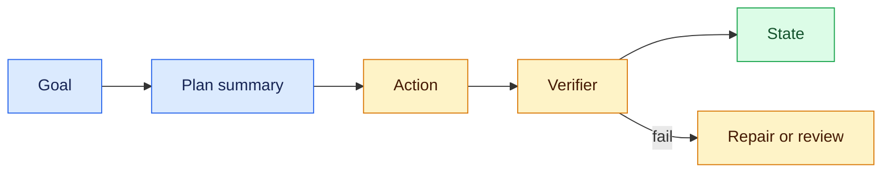
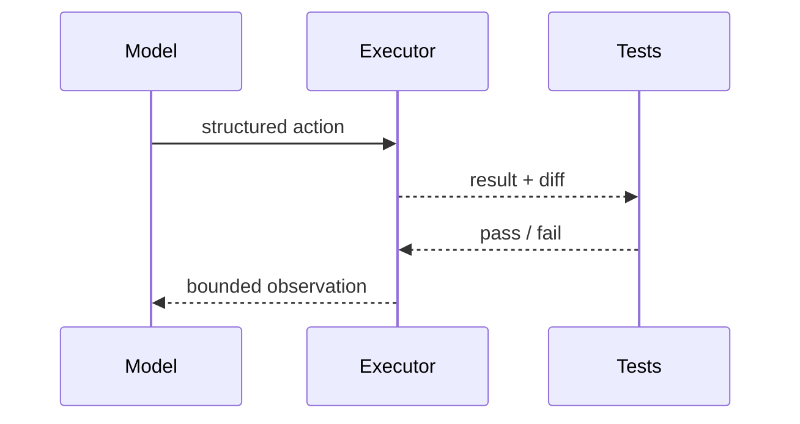

# Chain-of-thought versus verifiable action
Status: emerging
Sources: [OpenAI — Reasoning best practices](https://platform.openai.com/docs/guides/reasoning-best-practices)
## In one sentence
Reliable systems validate observable plans and effects rather than requiring or trusting hidden reasoning transcripts.
## Background: what existed before
Prompting often asked models to reveal step-by-step reasoning. That text is not a proof and may contain sensitive or misleading content.
## What changed and why now
Reasoning models shifted focus toward concise answers, structured plans, tool traces, tests, and external verification.
## Impact on current processing and architecture
Store inputs, tool calls, outputs, tests, and state diffs; make verifiers deterministic where possible and minimize sensitive traces.
## Real-world applications and constraints
Code agents can run tests; data agents can validate queries; support agents can cite records. Verification can be incomplete and costly.
## Mental model


## What changed this month
The March engineering baseline elevates verifiable state and tool traces above fluent internal narratives.
## Engineering consequence
Design an evidence contract and redact traces; never use a reasoning text as authorization.
## Limits and failure modes
Tests may miss requirements, plans may omit assumptions, and a verifier can share the same bug as the generator.
## Runnable low-cost example
```python
plan = {"op":"add", "value":2}; result = 1 + plan["value"]
print("pass" if result == 3 else "fail")
```
## Mini exercise (15–30 min)
Add a negative test and an approval requirement for a destructive operation.
## Build it locally
1. Run `python3 verify.py`.
2. Define an action schema and expected state predicate.
3. Execute against a fake state and record a diff.
4. Add failing tests and a human fallback.
## Interview Q&A
**Is a chain of thought proof?** No. **What is stronger?** Independent tests, invariants, and state checks. **What should traces contain?** Minimal evidence needed for debugging and audit.
## Glossary
**Verifier:** checker of result or invariant. **State diff:** before/after change. **Evidence contract:** required observable proof. **Redaction:** removing sensitive data.
## References
- [OpenAI reasoning best practices](https://platform.openai.com/docs/guides/reasoning-best-practices)
## Claim ledger
| Claim | Source | Fact or inference |
|---|---|---|
| Reasoning guidance emphasizes clear goals and verification. | OpenAI guide | Fact |
| Observable checks are safer than trusting generated rationale. | Systems inference | Inference |

### Boundary

Verifiable action needs its own control plane. The verification budget belongs to deterministic code, not to a model-generated instruction. The coordinator accepts a versioned request with identity, scope, and deadline, selects authorized state, invokes the uncertain component, and records the proposal separately from the accepted result. For evidence-linked action summaries, external checks, and selective disclosure, success must be checked from durable evidence without trusting hidden reasoning. “Unavailable,” “not permitted,” and “insufficient evidence” are different outcomes. Correlation IDs, input hashes, policy versions, resource measurements, and redacted receipts make a run replayable. A capability result is not automatically reliable, and a reliable result is not automatically safe.

In this design, unsupported rationale, stale evidence, irreversible action is handled by a typed transition: retry only a transient dependency failure, narrow an invalid request, defer when evidence is incomplete, and stop when policy is violated. Persist leases and sequence numbers so a late result cannot overwrite newer state. Test normal, boundary, adversarial, timeout, duplicate, and stale-input cases. Measure domain outcomes alongside p95 latency, cost, retries, denials, and operator interventions. Start in shadow or draft mode, establish rollback triggers, and version every artifact that affects verifiable action.
### Data path

Verifiable action needs its own control plane. The verification budget belongs to deterministic code, not to a model-generated instruction. The coordinator accepts a versioned request with identity, scope, and deadline, selects authorized state, invokes the uncertain component, and records the proposal separately from the accepted result. For evidence-linked action summaries, external checks, and selective disclosure, success must be checked from durable evidence without trusting hidden reasoning. “Unavailable,” “not permitted,” and “insufficient evidence” are different outcomes. Correlation IDs, input hashes, policy versions, resource measurements, and redacted receipts make a run replayable. A capability result is not automatically reliable, and a reliable result is not automatically safe.

In this design, unsupported rationale, stale evidence, irreversible action is handled by a typed transition: retry only a transient dependency failure, narrow an invalid request, defer when evidence is incomplete, and stop when policy is violated. Persist leases and sequence numbers so a late result cannot overwrite newer state. Test normal, boundary, adversarial, timeout, duplicate, and stale-input cases. Measure domain outcomes alongside p95 latency, cost, retries, denials, and operator interventions. Start in shadow or draft mode, establish rollback triggers, and version every artifact that affects verifiable action.
### State recovery

Verifiable action needs its own control plane. The verification budget belongs to deterministic code, not to a model-generated instruction. The coordinator accepts a versioned request with identity, scope, and deadline, selects authorized state, invokes the uncertain component, and records the proposal separately from the accepted result. For evidence-linked action summaries, external checks, and selective disclosure, success must be checked from durable evidence without trusting hidden reasoning. “Unavailable,” “not permitted,” and “insufficient evidence” are different outcomes. Correlation IDs, input hashes, policy versions, resource measurements, and redacted receipts make a run replayable. A capability result is not automatically reliable, and a reliable result is not automatically safe.

In this design, unsupported rationale, stale evidence, irreversible action is handled by a typed transition: retry only a transient dependency failure, narrow an invalid request, defer when evidence is incomplete, and stop when policy is violated. Persist leases and sequence numbers so a late result cannot overwrite newer state. Test normal, boundary, adversarial, timeout, duplicate, and stale-input cases. Measure domain outcomes alongside p95 latency, cost, retries, denials, and operator interventions. Start in shadow or draft mode, establish rollback triggers, and version every artifact that affects verifiable action.
### Resource limits

Verifiable action needs its own control plane. The verification budget belongs to deterministic code, not to a model-generated instruction. The coordinator accepts a versioned request with identity, scope, and deadline, selects authorized state, invokes the uncertain component, and records the proposal separately from the accepted result. For evidence-linked action summaries, external checks, and selective disclosure, success must be checked from durable evidence without trusting hidden reasoning. “Unavailable,” “not permitted,” and “insufficient evidence” are different outcomes. Correlation IDs, input hashes, policy versions, resource measurements, and redacted receipts make a run replayable. A capability result is not automatically reliable, and a reliable result is not automatically safe.

In this design, unsupported rationale, stale evidence, irreversible action is handled by a typed transition: retry only a transient dependency failure, narrow an invalid request, defer when evidence is incomplete, and stop when policy is violated. Persist leases and sequence numbers so a late result cannot overwrite newer state. Test normal, boundary, adversarial, timeout, duplicate, and stale-input cases. Measure domain outcomes alongside p95 latency, cost, retries, denials, and operator interventions. Start in shadow or draft mode, establish rollback triggers, and version every artifact that affects verifiable action.
### Failure handling

Verifiable action needs its own control plane. The verification budget belongs to deterministic code, not to a model-generated instruction. The coordinator accepts a versioned request with identity, scope, and deadline, selects authorized state, invokes the uncertain component, and records the proposal separately from the accepted result. For evidence-linked action summaries, external checks, and selective disclosure, success must be checked from durable evidence without trusting hidden reasoning. “Unavailable,” “not permitted,” and “insufficient evidence” are different outcomes. Correlation IDs, input hashes, policy versions, resource measurements, and redacted receipts make a run replayable. A capability result is not automatically reliable, and a reliable result is not automatically safe.

In this design, unsupported rationale, stale evidence, irreversible action is handled by a typed transition: retry only a transient dependency failure, narrow an invalid request, defer when evidence is incomplete, and stop when policy is violated. Persist leases and sequence numbers so a late result cannot overwrite newer state. Test normal, boundary, adversarial, timeout, duplicate, and stale-input cases. Measure domain outcomes alongside p95 latency, cost, retries, denials, and operator interventions. Start in shadow or draft mode, establish rollback triggers, and version every artifact that affects verifiable action.
### Trust model

Verifiable action needs its own control plane. The verification budget belongs to deterministic code, not to a model-generated instruction. The coordinator accepts a versioned request with identity, scope, and deadline, selects authorized state, invokes the uncertain component, and records the proposal separately from the accepted result. For evidence-linked action summaries, external checks, and selective disclosure, success must be checked from durable evidence without trusting hidden reasoning. “Unavailable,” “not permitted,” and “insufficient evidence” are different outcomes. Correlation IDs, input hashes, policy versions, resource measurements, and redacted receipts make a run replayable. A capability result is not automatically reliable, and a reliable result is not automatically safe.

In this design, unsupported rationale, stale evidence, irreversible action is handled by a typed transition: retry only a transient dependency failure, narrow an invalid request, defer when evidence is incomplete, and stop when policy is violated. Persist leases and sequence numbers so a late result cannot overwrite newer state. Test normal, boundary, adversarial, timeout, duplicate, and stale-input cases. Measure domain outcomes alongside p95 latency, cost, retries, denials, and operator interventions. Start in shadow or draft mode, establish rollback triggers, and version every artifact that affects verifiable action.
### Evaluation

Verifiable action needs its own control plane. The verification budget belongs to deterministic code, not to a model-generated instruction. The coordinator accepts a versioned request with identity, scope, and deadline, selects authorized state, invokes the uncertain component, and records the proposal separately from the accepted result. For evidence-linked action summaries, external checks, and selective disclosure, success must be checked from durable evidence without trusting hidden reasoning. “Unavailable,” “not permitted,” and “insufficient evidence” are different outcomes. Correlation IDs, input hashes, policy versions, resource measurements, and redacted receipts make a run replayable. A capability result is not automatically reliable, and a reliable result is not automatically safe.

In this design, unsupported rationale, stale evidence, irreversible action is handled by a typed transition: retry only a transient dependency failure, narrow an invalid request, defer when evidence is incomplete, and stop when policy is violated. Persist leases and sequence numbers so a late result cannot overwrite newer state. Test normal, boundary, adversarial, timeout, duplicate, and stale-input cases. Measure domain outcomes alongside p95 latency, cost, retries, denials, and operator interventions. Start in shadow or draft mode, establish rollback triggers, and version every artifact that affects verifiable action.
### Rollout

Verifiable action needs its own control plane. The verification budget belongs to deterministic code, not to a model-generated instruction. The coordinator accepts a versioned request with identity, scope, and deadline, selects authorized state, invokes the uncertain component, and records the proposal separately from the accepted result. For evidence-linked action summaries, external checks, and selective disclosure, success must be checked from durable evidence without trusting hidden reasoning. “Unavailable,” “not permitted,” and “insufficient evidence” are different outcomes. Correlation IDs, input hashes, policy versions, resource measurements, and redacted receipts make a run replayable. A capability result is not automatically reliable, and a reliable result is not automatically safe.

In this design, unsupported rationale, stale evidence, irreversible action is handled by a typed transition: retry only a transient dependency failure, narrow an invalid request, defer when evidence is incomplete, and stop when policy is violated. Persist leases and sequence numbers so a late result cannot overwrite newer state. Test normal, boundary, adversarial, timeout, duplicate, and stale-input cases. Measure domain outcomes alongside p95 latency, cost, retries, denials, and operator interventions. Start in shadow or draft mode, establish rollback triggers, and version every artifact that affects verifiable action.
### Local build

Verifiable action needs its own control plane. The verification budget belongs to deterministic code, not to a model-generated instruction. The coordinator accepts a versioned request with identity, scope, and deadline, selects authorized state, invokes the uncertain component, and records the proposal separately from the accepted result. For evidence-linked action summaries, external checks, and selective disclosure, success must be checked from durable evidence without trusting hidden reasoning. “Unavailable,” “not permitted,” and “insufficient evidence” are different outcomes. Correlation IDs, input hashes, policy versions, resource measurements, and redacted receipts make a run replayable. A capability result is not automatically reliable, and a reliable result is not automatically safe.

In this design, unsupported rationale, stale evidence, irreversible action is handled by a typed transition: retry only a transient dependency failure, narrow an invalid request, defer when evidence is incomplete, and stop when policy is violated. Persist leases and sequence numbers so a late result cannot overwrite newer state. Test normal, boundary, adversarial, timeout, duplicate, and stale-input cases. Measure domain outcomes alongside p95 latency, cost, retries, denials, and operator interventions. Start in shadow or draft mode, establish rollback triggers, and version every artifact that affects verifiable action.
### Review questions

Verifiable action needs its own control plane. The verification budget belongs to deterministic code, not to a model-generated instruction. The coordinator accepts a versioned request with identity, scope, and deadline, selects authorized state, invokes the uncertain component, and records the proposal separately from the accepted result. For evidence-linked action summaries, external checks, and selective disclosure, success must be checked from durable evidence without trusting hidden reasoning. “Unavailable,” “not permitted,” and “insufficient evidence” are different outcomes. Correlation IDs, input hashes, policy versions, resource measurements, and redacted receipts make a run replayable. A capability result is not automatically reliable, and a reliable result is not automatically safe.

In this design, unsupported rationale, stale evidence, irreversible action is handled by a typed transition: retry only a transient dependency failure, narrow an invalid request, defer when evidence is incomplete, and stop when policy is violated. Persist leases and sequence numbers so a late result cannot overwrite newer state. Test normal, boundary, adversarial, timeout, duplicate, and stale-input cases. Measure domain outcomes alongside p95 latency, cost, retries, denials, and operator interventions. Start in shadow or draft mode, establish rollback triggers, and version every artifact that affects verifiable action.
### Source evidence

Verifiable action needs its own control plane. The verification budget belongs to deterministic code, not to a model-generated instruction. The coordinator accepts a versioned request with identity, scope, and deadline, selects authorized state, invokes the uncertain component, and records the proposal separately from the accepted result. For evidence-linked action summaries, external checks, and selective disclosure, success must be checked from durable evidence without trusting hidden reasoning. “Unavailable,” “not permitted,” and “insufficient evidence” are different outcomes. Correlation IDs, input hashes, policy versions, resource measurements, and redacted receipts make a run replayable. A capability result is not automatically reliable, and a reliable result is not automatically safe.

In this design, unsupported rationale, stale evidence, irreversible action is handled by a typed transition: retry only a transient dependency failure, narrow an invalid request, defer when evidence is incomplete, and stop when policy is violated. Persist leases and sequence numbers so a late result cannot overwrite newer state. Test normal, boundary, adversarial, timeout, duplicate, and stale-input cases. Measure domain outcomes alongside p95 latency, cost, retries, denials, and operator interventions. Start in shadow or draft mode, establish rollback triggers, and version every artifact that affects verifiable action.
### Operations

Verifiable action needs its own control plane. The verification budget belongs to deterministic code, not to a model-generated instruction. The coordinator accepts a versioned request with identity, scope, and deadline, selects authorized state, invokes the uncertain component, and records the proposal separately from the accepted result. For evidence-linked action summaries, external checks, and selective disclosure, success must be checked from durable evidence without trusting hidden reasoning. “Unavailable,” “not permitted,” and “insufficient evidence” are different outcomes. Correlation IDs, input hashes, policy versions, resource measurements, and redacted receipts make a run replayable. A capability result is not automatically reliable, and a reliable result is not automatically safe.

In this design, unsupported rationale, stale evidence, irreversible action is handled by a typed transition: retry only a transient dependency failure, narrow an invalid request, defer when evidence is incomplete, and stop when policy is violated. Persist leases and sequence numbers so a late result cannot overwrite newer state. Test normal, boundary, adversarial, timeout, duplicate, and stale-input cases. Measure domain outcomes alongside p95 latency, cost, retries, denials, and operator interventions. Start in shadow or draft mode, establish rollback triggers, and version every artifact that affects verifiable action.
### Migration

Verifiable action needs its own control plane. The verification budget belongs to deterministic code, not to a model-generated instruction. The coordinator accepts a versioned request with identity, scope, and deadline, selects authorized state, invokes the uncertain component, and records the proposal separately from the accepted result. For evidence-linked action summaries, external checks, and selective disclosure, success must be checked from durable evidence without trusting hidden reasoning. “Unavailable,” “not permitted,” and “insufficient evidence” are different outcomes. Correlation IDs, input hashes, policy versions, resource measurements, and redacted receipts make a run replayable. A capability result is not automatically reliable, and a reliable result is not automatically safe.

In this design, unsupported rationale, stale evidence, irreversible action is handled by a typed transition: retry only a transient dependency failure, narrow an invalid request, defer when evidence is incomplete, and stop when policy is violated. Persist leases and sequence numbers so a late result cannot overwrite newer state. Test normal, boundary, adversarial, timeout, duplicate, and stale-input cases. Measure domain outcomes alongside p95 latency, cost, retries, denials, and operator interventions. Start in shadow or draft mode, establish rollback triggers, and version every artifact that affects verifiable action.
### Final guardrail

Verifiable action needs its own control plane. The verification budget belongs to deterministic code, not to a model-generated instruction. The coordinator accepts a versioned request with identity, scope, and deadline, selects authorized state, invokes the uncertain component, and records the proposal separately from the accepted result. For evidence-linked action summaries, external checks, and selective disclosure, success must be checked from durable evidence without trusting hidden reasoning. “Unavailable,” “not permitted,” and “insufficient evidence” are different outcomes. Correlation IDs, input hashes, policy versions, resource measurements, and redacted receipts make a run replayable. A capability result is not automatically reliable, and a reliable result is not automatically safe.

In this design, unsupported rationale, stale evidence, irreversible action is handled by a typed transition: retry only a transient dependency failure, narrow an invalid request, defer when evidence is incomplete, and stop when policy is violated. Persist leases and sequence numbers so a late result cannot overwrite newer state. Test normal, boundary, adversarial, timeout, duplicate, and stale-input cases. Measure domain outcomes alongside p95 latency, cost, retries, denials, and operator interventions. Start in shadow or draft mode, establish rollback triggers, and version every artifact that affects verifiable action.
