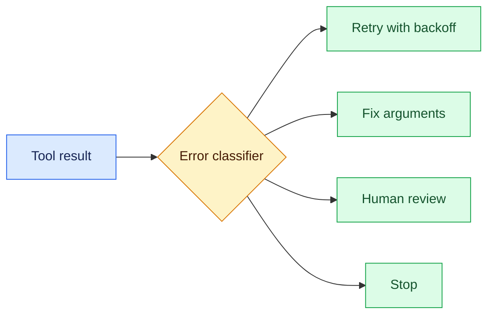
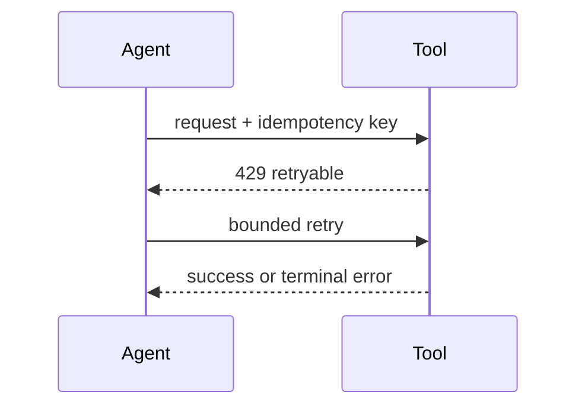

# Tool error taxonomies
Status: durable
Sources: [RFC 9110 — HTTP semantics](https://www.rfc-editor.org/rfc/rfc9110)
## In one sentence
Typed tool errors let an agent retry, repair, request approval, or stop predictably.
## Background: what existed before
Applications often returned strings such as “failed,” leaving callers to guess whether retrying was safe.
## What changed and why now
Agent loops make error interpretation a first-class control decision because retries can multiply side effects.
## Impact on current processing and architecture
Represent retryable, terminal, approval-required, invalid-input, and unknown outcomes with stable codes, detail limits, and correlation IDs.
## Real-world applications and constraints
Network services need timeout and rate-limit handling; write tools need idempotency. Error details must not leak secrets.
## Mental model


## What changed this month
March’s loop requires errors to drive explicit state transitions rather than free-form model improvisation.
## Engineering consequence
Version codes and cap retries by error class, attempt, time, and cost.
## Limits and failure modes
A timeout can hide a successful write; unknown errors require reconciliation, not blind retry.
## Runnable low-cost example
```python
def action(code): return {"429":"retry", "403":"stop", "approval":"review"}.get(code,"unknown")
print(action("429"), action("403"))
```
## Mini exercise (15–30 min)
Add a timeout-after-effect state and a reconciliation operation.
## Build it locally
1. Run `python3 errors.py`.
2. Define stable error codes.
3. Add attempt and deadline limits.
4. Test each transition with a fake tool.
## Interview Q&A
**Retry every error?** No; classify first. **Why idempotency?** To make retried effects safe. **What is unknown?** A state requiring reconciliation or review.
## Glossary
**Retryable:** likely transient failure. **Terminal:** retry cannot fix it. **Backoff:** increasing wait. **Reconciliation:** checking actual external state.
## References
- [RFC 9110 HTTP semantics](https://www.rfc-editor.org/rfc/rfc9110)
## Claim ledger
| Claim | Source | Fact or inference |
|---|---|---|
| HTTP distinguishes classes of client and server failure. | RFC 9110 | Fact |
| Agent tools need a richer typed taxonomy than one error string. | Systems inference | Inference |

### Boundary

Tool-error taxonomy needs a control plane built around error contract. The service receives a versioned request with identity, scope, and deadline, validates it, performs typed error classes, retry budgets, and operator diagnosis, and records the result separately from any uncertain proposal. For this topic, success is an observable predicate, not a fluent claim. “Unavailable,” “denied,” “inconclusive,” and “completed” must be distinct states. Correlation IDs, event sequence numbers, resource measurements, and redacted payload references make an incident replayable.

When partial success, retry storm, ambiguous provider state occurs, the coordinator must choose a bounded transition: retry only a classified transient, defer for review, reconcile against the source of truth, or stop. Persist leases and compare-and-set versions so late work cannot overwrite newer state. Exercise normal, boundary, adversarial, timeout, duplicate, and stale-input cases. Measure domain correctness beside p95 latency, cost, retries, denials, and human intervention. Start in shadow or reversible mode, define rollback triggers, and version every artifact that affects tool-error taxonomy.
### Canonical data

Tool-error taxonomy needs a control plane built around error contract. The service receives a versioned request with identity, scope, and deadline, validates it, performs typed error classes, retry budgets, and operator diagnosis, and records the result separately from any uncertain proposal. For this topic, success is an observable predicate, not a fluent claim. “Unavailable,” “denied,” “inconclusive,” and “completed” must be distinct states. Correlation IDs, event sequence numbers, resource measurements, and redacted payload references make an incident replayable.

When partial success, retry storm, ambiguous provider state occurs, the coordinator must choose a bounded transition: retry only a classified transient, defer for review, reconcile against the source of truth, or stop. Persist leases and compare-and-set versions so late work cannot overwrite newer state. Exercise normal, boundary, adversarial, timeout, duplicate, and stale-input cases. Measure domain correctness beside p95 latency, cost, retries, denials, and human intervention. Start in shadow or reversible mode, define rollback triggers, and version every artifact that affects tool-error taxonomy.
### Processing path

Tool-error taxonomy needs a control plane built around error contract. The service receives a versioned request with identity, scope, and deadline, validates it, performs typed error classes, retry budgets, and operator diagnosis, and records the result separately from any uncertain proposal. For this topic, success is an observable predicate, not a fluent claim. “Unavailable,” “denied,” “inconclusive,” and “completed” must be distinct states. Correlation IDs, event sequence numbers, resource measurements, and redacted payload references make an incident replayable.

When partial success, retry storm, ambiguous provider state occurs, the coordinator must choose a bounded transition: retry only a classified transient, defer for review, reconcile against the source of truth, or stop. Persist leases and compare-and-set versions so late work cannot overwrite newer state. Exercise normal, boundary, adversarial, timeout, duplicate, and stale-input cases. Measure domain correctness beside p95 latency, cost, retries, denials, and human intervention. Start in shadow or reversible mode, define rollback triggers, and version every artifact that affects tool-error taxonomy.
### State model

Tool-error taxonomy needs a control plane built around error contract. The service receives a versioned request with identity, scope, and deadline, validates it, performs typed error classes, retry budgets, and operator diagnosis, and records the result separately from any uncertain proposal. For this topic, success is an observable predicate, not a fluent claim. “Unavailable,” “denied,” “inconclusive,” and “completed” must be distinct states. Correlation IDs, event sequence numbers, resource measurements, and redacted payload references make an incident replayable.

When partial success, retry storm, ambiguous provider state occurs, the coordinator must choose a bounded transition: retry only a classified transient, defer for review, reconcile against the source of truth, or stop. Persist leases and compare-and-set versions so late work cannot overwrite newer state. Exercise normal, boundary, adversarial, timeout, duplicate, and stale-input cases. Measure domain correctness beside p95 latency, cost, retries, denials, and human intervention. Start in shadow or reversible mode, define rollback triggers, and version every artifact that affects tool-error taxonomy.
### Budgeting

Tool-error taxonomy needs a control plane built around error contract. The service receives a versioned request with identity, scope, and deadline, validates it, performs typed error classes, retry budgets, and operator diagnosis, and records the result separately from any uncertain proposal. For this topic, success is an observable predicate, not a fluent claim. “Unavailable,” “denied,” “inconclusive,” and “completed” must be distinct states. Correlation IDs, event sequence numbers, resource measurements, and redacted payload references make an incident replayable.

When partial success, retry storm, ambiguous provider state occurs, the coordinator must choose a bounded transition: retry only a classified transient, defer for review, reconcile against the source of truth, or stop. Persist leases and compare-and-set versions so late work cannot overwrite newer state. Exercise normal, boundary, adversarial, timeout, duplicate, and stale-input cases. Measure domain correctness beside p95 latency, cost, retries, denials, and human intervention. Start in shadow or reversible mode, define rollback triggers, and version every artifact that affects tool-error taxonomy.
### Failure classes

Tool-error taxonomy needs a control plane built around error contract. The service receives a versioned request with identity, scope, and deadline, validates it, performs typed error classes, retry budgets, and operator diagnosis, and records the result separately from any uncertain proposal. For this topic, success is an observable predicate, not a fluent claim. “Unavailable,” “denied,” “inconclusive,” and “completed” must be distinct states. Correlation IDs, event sequence numbers, resource measurements, and redacted payload references make an incident replayable.

When partial success, retry storm, ambiguous provider state occurs, the coordinator must choose a bounded transition: retry only a classified transient, defer for review, reconcile against the source of truth, or stop. Persist leases and compare-and-set versions so late work cannot overwrite newer state. Exercise normal, boundary, adversarial, timeout, duplicate, and stale-input cases. Measure domain correctness beside p95 latency, cost, retries, denials, and human intervention. Start in shadow or reversible mode, define rollback triggers, and version every artifact that affects tool-error taxonomy.
### Security

Tool-error taxonomy needs a control plane built around error contract. The service receives a versioned request with identity, scope, and deadline, validates it, performs typed error classes, retry budgets, and operator diagnosis, and records the result separately from any uncertain proposal. For this topic, success is an observable predicate, not a fluent claim. “Unavailable,” “denied,” “inconclusive,” and “completed” must be distinct states. Correlation IDs, event sequence numbers, resource measurements, and redacted payload references make an incident replayable.

When partial success, retry storm, ambiguous provider state occurs, the coordinator must choose a bounded transition: retry only a classified transient, defer for review, reconcile against the source of truth, or stop. Persist leases and compare-and-set versions so late work cannot overwrite newer state. Exercise normal, boundary, adversarial, timeout, duplicate, and stale-input cases. Measure domain correctness beside p95 latency, cost, retries, denials, and human intervention. Start in shadow or reversible mode, define rollback triggers, and version every artifact that affects tool-error taxonomy.
### Observability

Tool-error taxonomy needs a control plane built around error contract. The service receives a versioned request with identity, scope, and deadline, validates it, performs typed error classes, retry budgets, and operator diagnosis, and records the result separately from any uncertain proposal. For this topic, success is an observable predicate, not a fluent claim. “Unavailable,” “denied,” “inconclusive,” and “completed” must be distinct states. Correlation IDs, event sequence numbers, resource measurements, and redacted payload references make an incident replayable.

When partial success, retry storm, ambiguous provider state occurs, the coordinator must choose a bounded transition: retry only a classified transient, defer for review, reconcile against the source of truth, or stop. Persist leases and compare-and-set versions so late work cannot overwrite newer state. Exercise normal, boundary, adversarial, timeout, duplicate, and stale-input cases. Measure domain correctness beside p95 latency, cost, retries, denials, and human intervention. Start in shadow or reversible mode, define rollback triggers, and version every artifact that affects tool-error taxonomy.
### Test fixtures

Tool-error taxonomy needs a control plane built around error contract. The service receives a versioned request with identity, scope, and deadline, validates it, performs typed error classes, retry budgets, and operator diagnosis, and records the result separately from any uncertain proposal. For this topic, success is an observable predicate, not a fluent claim. “Unavailable,” “denied,” “inconclusive,” and “completed” must be distinct states. Correlation IDs, event sequence numbers, resource measurements, and redacted payload references make an incident replayable.

When partial success, retry storm, ambiguous provider state occurs, the coordinator must choose a bounded transition: retry only a classified transient, defer for review, reconcile against the source of truth, or stop. Persist leases and compare-and-set versions so late work cannot overwrite newer state. Exercise normal, boundary, adversarial, timeout, duplicate, and stale-input cases. Measure domain correctness beside p95 latency, cost, retries, denials, and human intervention. Start in shadow or reversible mode, define rollback triggers, and version every artifact that affects tool-error taxonomy.
### Differential review

Tool-error taxonomy needs a control plane built around error contract. The service receives a versioned request with identity, scope, and deadline, validates it, performs typed error classes, retry budgets, and operator diagnosis, and records the result separately from any uncertain proposal. For this topic, success is an observable predicate, not a fluent claim. “Unavailable,” “denied,” “inconclusive,” and “completed” must be distinct states. Correlation IDs, event sequence numbers, resource measurements, and redacted payload references make an incident replayable.

When partial success, retry storm, ambiguous provider state occurs, the coordinator must choose a bounded transition: retry only a classified transient, defer for review, reconcile against the source of truth, or stop. Persist leases and compare-and-set versions so late work cannot overwrite newer state. Exercise normal, boundary, adversarial, timeout, duplicate, and stale-input cases. Measure domain correctness beside p95 latency, cost, retries, denials, and human intervention. Start in shadow or reversible mode, define rollback triggers, and version every artifact that affects tool-error taxonomy.
### Rollout

Tool-error taxonomy needs a control plane built around error contract. The service receives a versioned request with identity, scope, and deadline, validates it, performs typed error classes, retry budgets, and operator diagnosis, and records the result separately from any uncertain proposal. For this topic, success is an observable predicate, not a fluent claim. “Unavailable,” “denied,” “inconclusive,” and “completed” must be distinct states. Correlation IDs, event sequence numbers, resource measurements, and redacted payload references make an incident replayable.

When partial success, retry storm, ambiguous provider state occurs, the coordinator must choose a bounded transition: retry only a classified transient, defer for review, reconcile against the source of truth, or stop. Persist leases and compare-and-set versions so late work cannot overwrite newer state. Exercise normal, boundary, adversarial, timeout, duplicate, and stale-input cases. Measure domain correctness beside p95 latency, cost, retries, denials, and human intervention. Start in shadow or reversible mode, define rollback triggers, and version every artifact that affects tool-error taxonomy.
### Recovery

Tool-error taxonomy needs a control plane built around error contract. The service receives a versioned request with identity, scope, and deadline, validates it, performs typed error classes, retry budgets, and operator diagnosis, and records the result separately from any uncertain proposal. For this topic, success is an observable predicate, not a fluent claim. “Unavailable,” “denied,” “inconclusive,” and “completed” must be distinct states. Correlation IDs, event sequence numbers, resource measurements, and redacted payload references make an incident replayable.

When partial success, retry storm, ambiguous provider state occurs, the coordinator must choose a bounded transition: retry only a classified transient, defer for review, reconcile against the source of truth, or stop. Persist leases and compare-and-set versions so late work cannot overwrite newer state. Exercise normal, boundary, adversarial, timeout, duplicate, and stale-input cases. Measure domain correctness beside p95 latency, cost, retries, denials, and human intervention. Start in shadow or reversible mode, define rollback triggers, and version every artifact that affects tool-error taxonomy.
### Interview prompts

Tool-error taxonomy needs a control plane built around error contract. The service receives a versioned request with identity, scope, and deadline, validates it, performs typed error classes, retry budgets, and operator diagnosis, and records the result separately from any uncertain proposal. For this topic, success is an observable predicate, not a fluent claim. “Unavailable,” “denied,” “inconclusive,” and “completed” must be distinct states. Correlation IDs, event sequence numbers, resource measurements, and redacted payload references make an incident replayable.

When partial success, retry storm, ambiguous provider state occurs, the coordinator must choose a bounded transition: retry only a classified transient, defer for review, reconcile against the source of truth, or stop. Persist leases and compare-and-set versions so late work cannot overwrite newer state. Exercise normal, boundary, adversarial, timeout, duplicate, and stale-input cases. Measure domain correctness beside p95 latency, cost, retries, denials, and human intervention. Start in shadow or reversible mode, define rollback triggers, and version every artifact that affects tool-error taxonomy.
### Evidence limits

Tool-error taxonomy needs a control plane built around error contract. The service receives a versioned request with identity, scope, and deadline, validates it, performs typed error classes, retry budgets, and operator diagnosis, and records the result separately from any uncertain proposal. For this topic, success is an observable predicate, not a fluent claim. “Unavailable,” “denied,” “inconclusive,” and “completed” must be distinct states. Correlation IDs, event sequence numbers, resource measurements, and redacted payload references make an incident replayable.

When partial success, retry storm, ambiguous provider state occurs, the coordinator must choose a bounded transition: retry only a classified transient, defer for review, reconcile against the source of truth, or stop. Persist leases and compare-and-set versions so late work cannot overwrite newer state. Exercise normal, boundary, adversarial, timeout, duplicate, and stale-input cases. Measure domain correctness beside p95 latency, cost, retries, denials, and human intervention. Start in shadow or reversible mode, define rollback triggers, and version every artifact that affects tool-error taxonomy.
