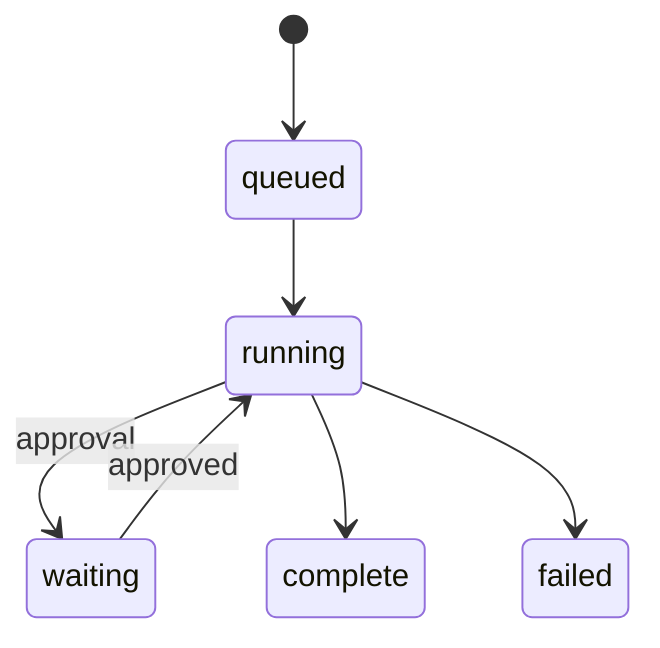
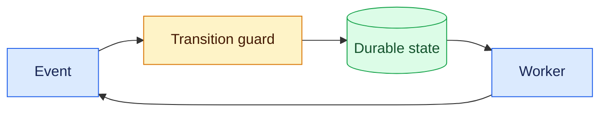

# State machines
Status: durable
Sources: [AWS Step Functions — States](https://docs.aws.amazon.com/step-functions/latest/dg/concepts-states.html)
## In one sentence
A state machine makes an agent’s allowed progress and terminal behavior explicit, testable, and resumable.
## Background: what existed before
Scripts commonly used implicit flags and loops. Crashes and retries then made it unclear which actions had completed.
## What changed and why now
Long-running agent workflows need durable transitions, leases, approvals, and cancellation across workers.
## Impact on current processing and architecture
Persist state and transition events atomically; separate queued, running, waiting, complete, failed, and cancelled states.
## Real-world applications and constraints
Support and deployment workflows benefit. State proliferation, migration, and stuck leases require operational tooling.
## Mental model


## What changed this month
The March agent loop is a state machine with explicit budgets and terminal predicates.
## Engineering consequence
Reject illegal transitions and make every transition idempotent and auditable.
## Limits and failure modes
Concurrent workers can race; schema changes can strand old states; state diagrams can omit real failure paths.
## Runnable low-cost example
```python
allowed={"queued":{"running"},"running":{"complete","failed"}}
state="queued"; nxt="running"; assert nxt in allowed[state]; state=nxt; print(state)
```
## Mini exercise (15–30 min)
Add cancellation and approval expiry transitions.
## Build it locally
1. Run `python3 states.py`.
2. Write allowed transitions as a map.
3. Reject invalid events.
4. Persist event and resulting state in JSONL.
## Interview Q&A
**Why persist transitions?** For recovery and audit. **What is a guard?** A condition permitting a transition. **How handle workers?** Leases and compare-and-swap updates.
## Glossary
**State:** durable workflow status. **Transition:** event-driven change. **Guard:** transition predicate. **Terminal:** no further work state.
## References
- [AWS Step Functions states](https://docs.aws.amazon.com/step-functions/latest/dg/concepts-states.html)
## Claim ledger
| Claim | Source | Fact or inference |
|---|---|---|
| Workflow engines represent execution using states and transitions. | AWS docs | Fact |
| Explicit transitions improve agent recovery. | Systems inference | Inference |

### Boundary

State machines needs a control plane built around transition invariant. The service receives a versioned request with identity, scope, and deadline, validates it, performs guarded transitions, durable events, and recovery ownership, and records the result separately from any uncertain proposal. For this topic, success is an observable predicate, not a fluent claim. “Unavailable,” “denied,” “inconclusive,” and “completed” must be distinct states. Correlation IDs, event sequence numbers, resource measurements, and redacted payload references make an incident replayable.

When illegal transition, stale event, stranded lease occurs, the coordinator must choose a bounded transition: retry only a classified transient, defer for review, reconcile against the source of truth, or stop. Persist leases and compare-and-set versions so late work cannot overwrite newer state. Exercise normal, boundary, adversarial, timeout, duplicate, and stale-input cases. Measure domain correctness beside p95 latency, cost, retries, denials, and human intervention. Start in shadow or reversible mode, define rollback triggers, and version every artifact that affects state machines.
### Canonical data

State machines needs a control plane built around transition invariant. The service receives a versioned request with identity, scope, and deadline, validates it, performs guarded transitions, durable events, and recovery ownership, and records the result separately from any uncertain proposal. For this topic, success is an observable predicate, not a fluent claim. “Unavailable,” “denied,” “inconclusive,” and “completed” must be distinct states. Correlation IDs, event sequence numbers, resource measurements, and redacted payload references make an incident replayable.

When illegal transition, stale event, stranded lease occurs, the coordinator must choose a bounded transition: retry only a classified transient, defer for review, reconcile against the source of truth, or stop. Persist leases and compare-and-set versions so late work cannot overwrite newer state. Exercise normal, boundary, adversarial, timeout, duplicate, and stale-input cases. Measure domain correctness beside p95 latency, cost, retries, denials, and human intervention. Start in shadow or reversible mode, define rollback triggers, and version every artifact that affects state machines.
### Processing path

State machines needs a control plane built around transition invariant. The service receives a versioned request with identity, scope, and deadline, validates it, performs guarded transitions, durable events, and recovery ownership, and records the result separately from any uncertain proposal. For this topic, success is an observable predicate, not a fluent claim. “Unavailable,” “denied,” “inconclusive,” and “completed” must be distinct states. Correlation IDs, event sequence numbers, resource measurements, and redacted payload references make an incident replayable.

When illegal transition, stale event, stranded lease occurs, the coordinator must choose a bounded transition: retry only a classified transient, defer for review, reconcile against the source of truth, or stop. Persist leases and compare-and-set versions so late work cannot overwrite newer state. Exercise normal, boundary, adversarial, timeout, duplicate, and stale-input cases. Measure domain correctness beside p95 latency, cost, retries, denials, and human intervention. Start in shadow or reversible mode, define rollback triggers, and version every artifact that affects state machines.
### State model

State machines needs a control plane built around transition invariant. The service receives a versioned request with identity, scope, and deadline, validates it, performs guarded transitions, durable events, and recovery ownership, and records the result separately from any uncertain proposal. For this topic, success is an observable predicate, not a fluent claim. “Unavailable,” “denied,” “inconclusive,” and “completed” must be distinct states. Correlation IDs, event sequence numbers, resource measurements, and redacted payload references make an incident replayable.

When illegal transition, stale event, stranded lease occurs, the coordinator must choose a bounded transition: retry only a classified transient, defer for review, reconcile against the source of truth, or stop. Persist leases and compare-and-set versions so late work cannot overwrite newer state. Exercise normal, boundary, adversarial, timeout, duplicate, and stale-input cases. Measure domain correctness beside p95 latency, cost, retries, denials, and human intervention. Start in shadow or reversible mode, define rollback triggers, and version every artifact that affects state machines.
### Budgeting

State machines needs a control plane built around transition invariant. The service receives a versioned request with identity, scope, and deadline, validates it, performs guarded transitions, durable events, and recovery ownership, and records the result separately from any uncertain proposal. For this topic, success is an observable predicate, not a fluent claim. “Unavailable,” “denied,” “inconclusive,” and “completed” must be distinct states. Correlation IDs, event sequence numbers, resource measurements, and redacted payload references make an incident replayable.

When illegal transition, stale event, stranded lease occurs, the coordinator must choose a bounded transition: retry only a classified transient, defer for review, reconcile against the source of truth, or stop. Persist leases and compare-and-set versions so late work cannot overwrite newer state. Exercise normal, boundary, adversarial, timeout, duplicate, and stale-input cases. Measure domain correctness beside p95 latency, cost, retries, denials, and human intervention. Start in shadow or reversible mode, define rollback triggers, and version every artifact that affects state machines.
### Failure classes

State machines needs a control plane built around transition invariant. The service receives a versioned request with identity, scope, and deadline, validates it, performs guarded transitions, durable events, and recovery ownership, and records the result separately from any uncertain proposal. For this topic, success is an observable predicate, not a fluent claim. “Unavailable,” “denied,” “inconclusive,” and “completed” must be distinct states. Correlation IDs, event sequence numbers, resource measurements, and redacted payload references make an incident replayable.

When illegal transition, stale event, stranded lease occurs, the coordinator must choose a bounded transition: retry only a classified transient, defer for review, reconcile against the source of truth, or stop. Persist leases and compare-and-set versions so late work cannot overwrite newer state. Exercise normal, boundary, adversarial, timeout, duplicate, and stale-input cases. Measure domain correctness beside p95 latency, cost, retries, denials, and human intervention. Start in shadow or reversible mode, define rollback triggers, and version every artifact that affects state machines.
### Security

State machines needs a control plane built around transition invariant. The service receives a versioned request with identity, scope, and deadline, validates it, performs guarded transitions, durable events, and recovery ownership, and records the result separately from any uncertain proposal. For this topic, success is an observable predicate, not a fluent claim. “Unavailable,” “denied,” “inconclusive,” and “completed” must be distinct states. Correlation IDs, event sequence numbers, resource measurements, and redacted payload references make an incident replayable.

When illegal transition, stale event, stranded lease occurs, the coordinator must choose a bounded transition: retry only a classified transient, defer for review, reconcile against the source of truth, or stop. Persist leases and compare-and-set versions so late work cannot overwrite newer state. Exercise normal, boundary, adversarial, timeout, duplicate, and stale-input cases. Measure domain correctness beside p95 latency, cost, retries, denials, and human intervention. Start in shadow or reversible mode, define rollback triggers, and version every artifact that affects state machines.
### Observability

State machines needs a control plane built around transition invariant. The service receives a versioned request with identity, scope, and deadline, validates it, performs guarded transitions, durable events, and recovery ownership, and records the result separately from any uncertain proposal. For this topic, success is an observable predicate, not a fluent claim. “Unavailable,” “denied,” “inconclusive,” and “completed” must be distinct states. Correlation IDs, event sequence numbers, resource measurements, and redacted payload references make an incident replayable.

When illegal transition, stale event, stranded lease occurs, the coordinator must choose a bounded transition: retry only a classified transient, defer for review, reconcile against the source of truth, or stop. Persist leases and compare-and-set versions so late work cannot overwrite newer state. Exercise normal, boundary, adversarial, timeout, duplicate, and stale-input cases. Measure domain correctness beside p95 latency, cost, retries, denials, and human intervention. Start in shadow or reversible mode, define rollback triggers, and version every artifact that affects state machines.
### Test fixtures

State machines needs a control plane built around transition invariant. The service receives a versioned request with identity, scope, and deadline, validates it, performs guarded transitions, durable events, and recovery ownership, and records the result separately from any uncertain proposal. For this topic, success is an observable predicate, not a fluent claim. “Unavailable,” “denied,” “inconclusive,” and “completed” must be distinct states. Correlation IDs, event sequence numbers, resource measurements, and redacted payload references make an incident replayable.

When illegal transition, stale event, stranded lease occurs, the coordinator must choose a bounded transition: retry only a classified transient, defer for review, reconcile against the source of truth, or stop. Persist leases and compare-and-set versions so late work cannot overwrite newer state. Exercise normal, boundary, adversarial, timeout, duplicate, and stale-input cases. Measure domain correctness beside p95 latency, cost, retries, denials, and human intervention. Start in shadow or reversible mode, define rollback triggers, and version every artifact that affects state machines.
### Differential review

State machines needs a control plane built around transition invariant. The service receives a versioned request with identity, scope, and deadline, validates it, performs guarded transitions, durable events, and recovery ownership, and records the result separately from any uncertain proposal. For this topic, success is an observable predicate, not a fluent claim. “Unavailable,” “denied,” “inconclusive,” and “completed” must be distinct states. Correlation IDs, event sequence numbers, resource measurements, and redacted payload references make an incident replayable.

When illegal transition, stale event, stranded lease occurs, the coordinator must choose a bounded transition: retry only a classified transient, defer for review, reconcile against the source of truth, or stop. Persist leases and compare-and-set versions so late work cannot overwrite newer state. Exercise normal, boundary, adversarial, timeout, duplicate, and stale-input cases. Measure domain correctness beside p95 latency, cost, retries, denials, and human intervention. Start in shadow or reversible mode, define rollback triggers, and version every artifact that affects state machines.
### Rollout

State machines needs a control plane built around transition invariant. The service receives a versioned request with identity, scope, and deadline, validates it, performs guarded transitions, durable events, and recovery ownership, and records the result separately from any uncertain proposal. For this topic, success is an observable predicate, not a fluent claim. “Unavailable,” “denied,” “inconclusive,” and “completed” must be distinct states. Correlation IDs, event sequence numbers, resource measurements, and redacted payload references make an incident replayable.

When illegal transition, stale event, stranded lease occurs, the coordinator must choose a bounded transition: retry only a classified transient, defer for review, reconcile against the source of truth, or stop. Persist leases and compare-and-set versions so late work cannot overwrite newer state. Exercise normal, boundary, adversarial, timeout, duplicate, and stale-input cases. Measure domain correctness beside p95 latency, cost, retries, denials, and human intervention. Start in shadow or reversible mode, define rollback triggers, and version every artifact that affects state machines.
### Recovery

State machines needs a control plane built around transition invariant. The service receives a versioned request with identity, scope, and deadline, validates it, performs guarded transitions, durable events, and recovery ownership, and records the result separately from any uncertain proposal. For this topic, success is an observable predicate, not a fluent claim. “Unavailable,” “denied,” “inconclusive,” and “completed” must be distinct states. Correlation IDs, event sequence numbers, resource measurements, and redacted payload references make an incident replayable.

When illegal transition, stale event, stranded lease occurs, the coordinator must choose a bounded transition: retry only a classified transient, defer for review, reconcile against the source of truth, or stop. Persist leases and compare-and-set versions so late work cannot overwrite newer state. Exercise normal, boundary, adversarial, timeout, duplicate, and stale-input cases. Measure domain correctness beside p95 latency, cost, retries, denials, and human intervention. Start in shadow or reversible mode, define rollback triggers, and version every artifact that affects state machines.
### Interview prompts

State machines needs a control plane built around transition invariant. The service receives a versioned request with identity, scope, and deadline, validates it, performs guarded transitions, durable events, and recovery ownership, and records the result separately from any uncertain proposal. For this topic, success is an observable predicate, not a fluent claim. “Unavailable,” “denied,” “inconclusive,” and “completed” must be distinct states. Correlation IDs, event sequence numbers, resource measurements, and redacted payload references make an incident replayable.

When illegal transition, stale event, stranded lease occurs, the coordinator must choose a bounded transition: retry only a classified transient, defer for review, reconcile against the source of truth, or stop. Persist leases and compare-and-set versions so late work cannot overwrite newer state. Exercise normal, boundary, adversarial, timeout, duplicate, and stale-input cases. Measure domain correctness beside p95 latency, cost, retries, denials, and human intervention. Start in shadow or reversible mode, define rollback triggers, and version every artifact that affects state machines.
### Evidence limits

State machines needs a control plane built around transition invariant. The service receives a versioned request with identity, scope, and deadline, validates it, performs guarded transitions, durable events, and recovery ownership, and records the result separately from any uncertain proposal. For this topic, success is an observable predicate, not a fluent claim. “Unavailable,” “denied,” “inconclusive,” and “completed” must be distinct states. Correlation IDs, event sequence numbers, resource measurements, and redacted payload references make an incident replayable.

When illegal transition, stale event, stranded lease occurs, the coordinator must choose a bounded transition: retry only a classified transient, defer for review, reconcile against the source of truth, or stop. Persist leases and compare-and-set versions so late work cannot overwrite newer state. Exercise normal, boundary, adversarial, timeout, duplicate, and stale-input cases. Measure domain correctness beside p95 latency, cost, retries, denials, and human intervention. Start in shadow or reversible mode, define rollback triggers, and version every artifact that affects state machines.
