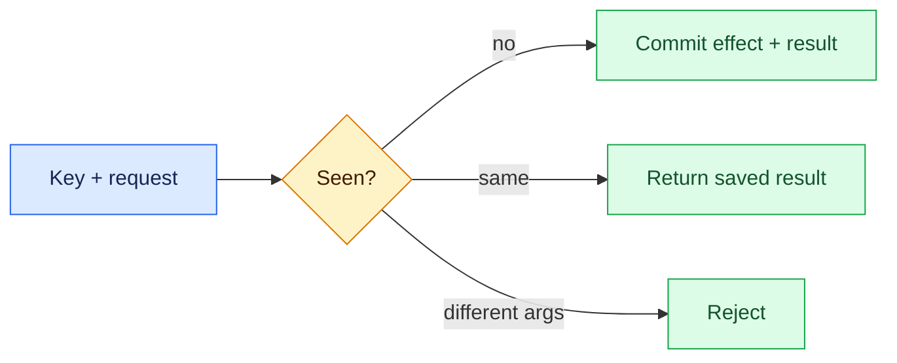
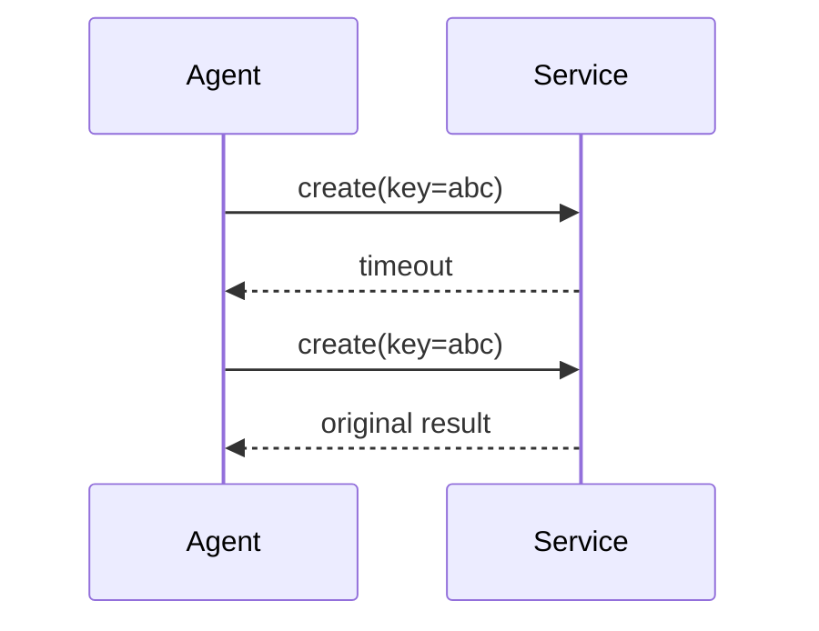

# Idempotency
Status: durable
Sources: [Stripe — Idempotent requests](https://docs.stripe.com/api/idempotent_requests)
## In one sentence
Idempotency makes repeated requests for one logical operation produce one effect, crucial when agents retry after ambiguous failures.
## Background: what existed before
Reliable request/response assumptions were common in short scripts. Distributed networks can lose responses after the server commits.
## What changed and why now
Autonomous retries increase the probability of duplicate writes unless APIs accept and persist operation keys.
## Impact on current processing and architecture
Store key, request fingerprint, result, and expiry atomically; reject reuse with different arguments.
## Real-world applications and constraints
Payments, tickets, and messages need it. Retention, storage growth, key guessing, and multi-region races need design.
## Mental model


## What changed this month
March’s retry and tool-calling lessons make idempotency a boundary invariant for side effects.
## Engineering consequence
Pass keys through traces and use an atomic uniqueness constraint.
## Limits and failure modes
Expiry too short permits duplicates; non-deterministic request bodies break safe comparison.
## Runnable low-cost example
```python
seen={}
def create(k,v):
    if k in seen and seen[k][0]!=v: return "conflict"
    seen[k]=(v,"created"); return seen[k][1]
print(create("a",1), create("a",1), create("a",2))
```
## Mini exercise (15–30 min)
Add a simulated timeout and verify the second call returns the first result.
## Build it locally
1. Run `python3 idem.py`.
2. Add a request fingerprint.
3. Test concurrent-like repeated calls.
4. Choose and document key retention.
## Interview Q&A
**Does idempotency mean no retries?** No, it makes retries safe. **What if arguments differ?** Reject key reuse. **Where store keys?** Durable service-side storage.
## Glossary
**Logical operation:** one intended effect. **Fingerprint:** canonical request identity. **Ambiguous failure:** unknown whether effect committed. **TTL:** retention duration.
## References
- [Stripe idempotent requests](https://docs.stripe.com/api/idempotent_requests)
## Claim ledger
| Claim | Source | Fact or inference |
|---|---|---|
| Idempotency keys let clients safely retry requests. | Stripe docs | Fact |
| Agent write tools should require keys. | Systems inference | Inference |

### Boundary

Idempotency needs a control plane built around effect identity. The service receives a versioned request with identity, scope, and deadline, validates it, performs deduplication keys, effect identity, and reconciliation, and records the result separately from any uncertain proposal. For this topic, success is an observable predicate, not a fluent claim. “Unavailable,” “denied,” “inconclusive,” and “completed” must be distinct states. Correlation IDs, event sequence numbers, resource measurements, and redacted payload references make an incident replayable.

When duplicate mutation, key collision, expired dedupe record occurs, the coordinator must choose a bounded transition: retry only a classified transient, defer for review, reconcile against the source of truth, or stop. Persist leases and compare-and-set versions so late work cannot overwrite newer state. Exercise normal, boundary, adversarial, timeout, duplicate, and stale-input cases. Measure domain correctness beside p95 latency, cost, retries, denials, and human intervention. Start in shadow or reversible mode, define rollback triggers, and version every artifact that affects idempotency.
### Canonical data

Idempotency needs a control plane built around effect identity. The service receives a versioned request with identity, scope, and deadline, validates it, performs deduplication keys, effect identity, and reconciliation, and records the result separately from any uncertain proposal. For this topic, success is an observable predicate, not a fluent claim. “Unavailable,” “denied,” “inconclusive,” and “completed” must be distinct states. Correlation IDs, event sequence numbers, resource measurements, and redacted payload references make an incident replayable.

When duplicate mutation, key collision, expired dedupe record occurs, the coordinator must choose a bounded transition: retry only a classified transient, defer for review, reconcile against the source of truth, or stop. Persist leases and compare-and-set versions so late work cannot overwrite newer state. Exercise normal, boundary, adversarial, timeout, duplicate, and stale-input cases. Measure domain correctness beside p95 latency, cost, retries, denials, and human intervention. Start in shadow or reversible mode, define rollback triggers, and version every artifact that affects idempotency.
### Processing path

Idempotency needs a control plane built around effect identity. The service receives a versioned request with identity, scope, and deadline, validates it, performs deduplication keys, effect identity, and reconciliation, and records the result separately from any uncertain proposal. For this topic, success is an observable predicate, not a fluent claim. “Unavailable,” “denied,” “inconclusive,” and “completed” must be distinct states. Correlation IDs, event sequence numbers, resource measurements, and redacted payload references make an incident replayable.

When duplicate mutation, key collision, expired dedupe record occurs, the coordinator must choose a bounded transition: retry only a classified transient, defer for review, reconcile against the source of truth, or stop. Persist leases and compare-and-set versions so late work cannot overwrite newer state. Exercise normal, boundary, adversarial, timeout, duplicate, and stale-input cases. Measure domain correctness beside p95 latency, cost, retries, denials, and human intervention. Start in shadow or reversible mode, define rollback triggers, and version every artifact that affects idempotency.
### State model

Idempotency needs a control plane built around effect identity. The service receives a versioned request with identity, scope, and deadline, validates it, performs deduplication keys, effect identity, and reconciliation, and records the result separately from any uncertain proposal. For this topic, success is an observable predicate, not a fluent claim. “Unavailable,” “denied,” “inconclusive,” and “completed” must be distinct states. Correlation IDs, event sequence numbers, resource measurements, and redacted payload references make an incident replayable.

When duplicate mutation, key collision, expired dedupe record occurs, the coordinator must choose a bounded transition: retry only a classified transient, defer for review, reconcile against the source of truth, or stop. Persist leases and compare-and-set versions so late work cannot overwrite newer state. Exercise normal, boundary, adversarial, timeout, duplicate, and stale-input cases. Measure domain correctness beside p95 latency, cost, retries, denials, and human intervention. Start in shadow or reversible mode, define rollback triggers, and version every artifact that affects idempotency.
### Budgeting

Idempotency needs a control plane built around effect identity. The service receives a versioned request with identity, scope, and deadline, validates it, performs deduplication keys, effect identity, and reconciliation, and records the result separately from any uncertain proposal. For this topic, success is an observable predicate, not a fluent claim. “Unavailable,” “denied,” “inconclusive,” and “completed” must be distinct states. Correlation IDs, event sequence numbers, resource measurements, and redacted payload references make an incident replayable.

When duplicate mutation, key collision, expired dedupe record occurs, the coordinator must choose a bounded transition: retry only a classified transient, defer for review, reconcile against the source of truth, or stop. Persist leases and compare-and-set versions so late work cannot overwrite newer state. Exercise normal, boundary, adversarial, timeout, duplicate, and stale-input cases. Measure domain correctness beside p95 latency, cost, retries, denials, and human intervention. Start in shadow or reversible mode, define rollback triggers, and version every artifact that affects idempotency.
### Failure classes

Idempotency needs a control plane built around effect identity. The service receives a versioned request with identity, scope, and deadline, validates it, performs deduplication keys, effect identity, and reconciliation, and records the result separately from any uncertain proposal. For this topic, success is an observable predicate, not a fluent claim. “Unavailable,” “denied,” “inconclusive,” and “completed” must be distinct states. Correlation IDs, event sequence numbers, resource measurements, and redacted payload references make an incident replayable.

When duplicate mutation, key collision, expired dedupe record occurs, the coordinator must choose a bounded transition: retry only a classified transient, defer for review, reconcile against the source of truth, or stop. Persist leases and compare-and-set versions so late work cannot overwrite newer state. Exercise normal, boundary, adversarial, timeout, duplicate, and stale-input cases. Measure domain correctness beside p95 latency, cost, retries, denials, and human intervention. Start in shadow or reversible mode, define rollback triggers, and version every artifact that affects idempotency.
### Security

Idempotency needs a control plane built around effect identity. The service receives a versioned request with identity, scope, and deadline, validates it, performs deduplication keys, effect identity, and reconciliation, and records the result separately from any uncertain proposal. For this topic, success is an observable predicate, not a fluent claim. “Unavailable,” “denied,” “inconclusive,” and “completed” must be distinct states. Correlation IDs, event sequence numbers, resource measurements, and redacted payload references make an incident replayable.

When duplicate mutation, key collision, expired dedupe record occurs, the coordinator must choose a bounded transition: retry only a classified transient, defer for review, reconcile against the source of truth, or stop. Persist leases and compare-and-set versions so late work cannot overwrite newer state. Exercise normal, boundary, adversarial, timeout, duplicate, and stale-input cases. Measure domain correctness beside p95 latency, cost, retries, denials, and human intervention. Start in shadow or reversible mode, define rollback triggers, and version every artifact that affects idempotency.
### Observability

Idempotency needs a control plane built around effect identity. The service receives a versioned request with identity, scope, and deadline, validates it, performs deduplication keys, effect identity, and reconciliation, and records the result separately from any uncertain proposal. For this topic, success is an observable predicate, not a fluent claim. “Unavailable,” “denied,” “inconclusive,” and “completed” must be distinct states. Correlation IDs, event sequence numbers, resource measurements, and redacted payload references make an incident replayable.

When duplicate mutation, key collision, expired dedupe record occurs, the coordinator must choose a bounded transition: retry only a classified transient, defer for review, reconcile against the source of truth, or stop. Persist leases and compare-and-set versions so late work cannot overwrite newer state. Exercise normal, boundary, adversarial, timeout, duplicate, and stale-input cases. Measure domain correctness beside p95 latency, cost, retries, denials, and human intervention. Start in shadow or reversible mode, define rollback triggers, and version every artifact that affects idempotency.
### Test fixtures

Idempotency needs a control plane built around effect identity. The service receives a versioned request with identity, scope, and deadline, validates it, performs deduplication keys, effect identity, and reconciliation, and records the result separately from any uncertain proposal. For this topic, success is an observable predicate, not a fluent claim. “Unavailable,” “denied,” “inconclusive,” and “completed” must be distinct states. Correlation IDs, event sequence numbers, resource measurements, and redacted payload references make an incident replayable.

When duplicate mutation, key collision, expired dedupe record occurs, the coordinator must choose a bounded transition: retry only a classified transient, defer for review, reconcile against the source of truth, or stop. Persist leases and compare-and-set versions so late work cannot overwrite newer state. Exercise normal, boundary, adversarial, timeout, duplicate, and stale-input cases. Measure domain correctness beside p95 latency, cost, retries, denials, and human intervention. Start in shadow or reversible mode, define rollback triggers, and version every artifact that affects idempotency.
### Differential review

Idempotency needs a control plane built around effect identity. The service receives a versioned request with identity, scope, and deadline, validates it, performs deduplication keys, effect identity, and reconciliation, and records the result separately from any uncertain proposal. For this topic, success is an observable predicate, not a fluent claim. “Unavailable,” “denied,” “inconclusive,” and “completed” must be distinct states. Correlation IDs, event sequence numbers, resource measurements, and redacted payload references make an incident replayable.

When duplicate mutation, key collision, expired dedupe record occurs, the coordinator must choose a bounded transition: retry only a classified transient, defer for review, reconcile against the source of truth, or stop. Persist leases and compare-and-set versions so late work cannot overwrite newer state. Exercise normal, boundary, adversarial, timeout, duplicate, and stale-input cases. Measure domain correctness beside p95 latency, cost, retries, denials, and human intervention. Start in shadow or reversible mode, define rollback triggers, and version every artifact that affects idempotency.
### Rollout

Idempotency needs a control plane built around effect identity. The service receives a versioned request with identity, scope, and deadline, validates it, performs deduplication keys, effect identity, and reconciliation, and records the result separately from any uncertain proposal. For this topic, success is an observable predicate, not a fluent claim. “Unavailable,” “denied,” “inconclusive,” and “completed” must be distinct states. Correlation IDs, event sequence numbers, resource measurements, and redacted payload references make an incident replayable.

When duplicate mutation, key collision, expired dedupe record occurs, the coordinator must choose a bounded transition: retry only a classified transient, defer for review, reconcile against the source of truth, or stop. Persist leases and compare-and-set versions so late work cannot overwrite newer state. Exercise normal, boundary, adversarial, timeout, duplicate, and stale-input cases. Measure domain correctness beside p95 latency, cost, retries, denials, and human intervention. Start in shadow or reversible mode, define rollback triggers, and version every artifact that affects idempotency.
### Recovery

Idempotency needs a control plane built around effect identity. The service receives a versioned request with identity, scope, and deadline, validates it, performs deduplication keys, effect identity, and reconciliation, and records the result separately from any uncertain proposal. For this topic, success is an observable predicate, not a fluent claim. “Unavailable,” “denied,” “inconclusive,” and “completed” must be distinct states. Correlation IDs, event sequence numbers, resource measurements, and redacted payload references make an incident replayable.

When duplicate mutation, key collision, expired dedupe record occurs, the coordinator must choose a bounded transition: retry only a classified transient, defer for review, reconcile against the source of truth, or stop. Persist leases and compare-and-set versions so late work cannot overwrite newer state. Exercise normal, boundary, adversarial, timeout, duplicate, and stale-input cases. Measure domain correctness beside p95 latency, cost, retries, denials, and human intervention. Start in shadow or reversible mode, define rollback triggers, and version every artifact that affects idempotency.
### Interview prompts

Idempotency needs a control plane built around effect identity. The service receives a versioned request with identity, scope, and deadline, validates it, performs deduplication keys, effect identity, and reconciliation, and records the result separately from any uncertain proposal. For this topic, success is an observable predicate, not a fluent claim. “Unavailable,” “denied,” “inconclusive,” and “completed” must be distinct states. Correlation IDs, event sequence numbers, resource measurements, and redacted payload references make an incident replayable.

When duplicate mutation, key collision, expired dedupe record occurs, the coordinator must choose a bounded transition: retry only a classified transient, defer for review, reconcile against the source of truth, or stop. Persist leases and compare-and-set versions so late work cannot overwrite newer state. Exercise normal, boundary, adversarial, timeout, duplicate, and stale-input cases. Measure domain correctness beside p95 latency, cost, retries, denials, and human intervention. Start in shadow or reversible mode, define rollback triggers, and version every artifact that affects idempotency.
### Evidence limits

Idempotency needs a control plane built around effect identity. The service receives a versioned request with identity, scope, and deadline, validates it, performs deduplication keys, effect identity, and reconciliation, and records the result separately from any uncertain proposal. For this topic, success is an observable predicate, not a fluent claim. “Unavailable,” “denied,” “inconclusive,” and “completed” must be distinct states. Correlation IDs, event sequence numbers, resource measurements, and redacted payload references make an incident replayable.

When duplicate mutation, key collision, expired dedupe record occurs, the coordinator must choose a bounded transition: retry only a classified transient, defer for review, reconcile against the source of truth, or stop. Persist leases and compare-and-set versions so late work cannot overwrite newer state. Exercise normal, boundary, adversarial, timeout, duplicate, and stale-input cases. Measure domain correctness beside p95 latency, cost, retries, denials, and human intervention. Start in shadow or reversible mode, define rollback triggers, and version every artifact that affects idempotency.
