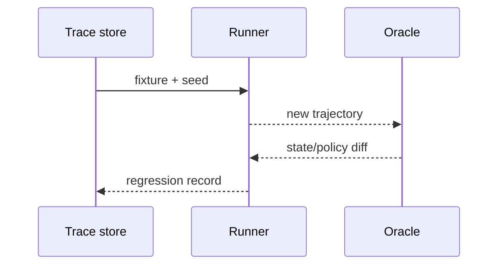

# Replay testing
Status: durable
Sources: [OpenTelemetry — Traces](https://opentelemetry.io/docs/concepts/signals/traces/)
## In one sentence
Replay testing reruns recorded, sanitized scenarios against a new agent version to expose regressions in outcomes and policy.
## Background: what existed before
Unit tests used handcrafted inputs and production debugging depended on incomplete logs. Stateful agents need whole trajectories.
## What changed and why now
Trace context and deterministic mocks make multi-step behavior reproducible enough for release comparisons.
## Impact on current processing and architecture
Capture model/version, prompt hash, tools, policy decisions, timing, and world-state snapshots with privacy controls.
## Real-world applications and constraints
Support and code agents can replay safely in sandboxes. External data drift, nondeterministic models, and personal data complicate comparison.
## Mental model


## What changed this month
March evaluation guidance promotes replay as a bridge between unit tests and production monitoring.
## Engineering consequence
Version fixtures and compare slices, not only aggregate pass rate.
## Limits and failure modes
Replay can mask live dependency failures; redaction can remove causal context; seeds do not ensure full determinism.
## Runnable low-cost example
```python
old=["search","draft"]; new=["search","refund"]
print("regression" if old != new else "same")
```
## Mini exercise (15–30 min)
Add a policy assertion that fails if replay includes refund.
## Build it locally
1. Run `python3 replay.py`.
2. Store a JSON fixture with a seed.
3. Run old and new policy functions.
4. Diff states and redact identifiers.
## Interview Q&A
**Why replay?** It catches trajectory regressions. **What cannot replay?** Uncontrolled external effects. **How compare?** Outcomes, policy events, cost, and latency slices.
## Glossary
**Trace:** correlated execution events. **Fixture:** controlled test world. **Replay:** rerun of a recorded scenario. **Diff:** observed change.
## References
- [OpenTelemetry traces](https://opentelemetry.io/docs/concepts/signals/traces/)
## Claim ledger
| Claim | Source | Fact or inference |
|---|---|---|
| Traces correlate spans across a request. | OpenTelemetry | Fact |
| Sanitized trace replay is a useful agent regression method. | Systems inference | Inference |

### Boundary

Replay testing needs a control plane built around replay artifact. The service receives a versioned request with identity, scope, and deadline, validates it, performs trace capture, deterministic fixtures, and regression comparison, and records the result separately from any uncertain proposal. For this topic, success is an observable predicate, not a fluent claim. “Unavailable,” “denied,” “inconclusive,” and “completed” must be distinct states. Correlation IDs, event sequence numbers, resource measurements, and redacted payload references make an incident replayable.

When nondeterministic dependency, sensitive trace, false replay confidence occurs, the coordinator must choose a bounded transition: retry only a classified transient, defer for review, reconcile against the source of truth, or stop. Persist leases and compare-and-set versions so late work cannot overwrite newer state. Exercise normal, boundary, adversarial, timeout, duplicate, and stale-input cases. Measure domain correctness beside p95 latency, cost, retries, denials, and human intervention. Start in shadow or reversible mode, define rollback triggers, and version every artifact that affects replay testing.
### Canonical data

Replay testing needs a control plane built around replay artifact. The service receives a versioned request with identity, scope, and deadline, validates it, performs trace capture, deterministic fixtures, and regression comparison, and records the result separately from any uncertain proposal. For this topic, success is an observable predicate, not a fluent claim. “Unavailable,” “denied,” “inconclusive,” and “completed” must be distinct states. Correlation IDs, event sequence numbers, resource measurements, and redacted payload references make an incident replayable.

When nondeterministic dependency, sensitive trace, false replay confidence occurs, the coordinator must choose a bounded transition: retry only a classified transient, defer for review, reconcile against the source of truth, or stop. Persist leases and compare-and-set versions so late work cannot overwrite newer state. Exercise normal, boundary, adversarial, timeout, duplicate, and stale-input cases. Measure domain correctness beside p95 latency, cost, retries, denials, and human intervention. Start in shadow or reversible mode, define rollback triggers, and version every artifact that affects replay testing.
### Processing path

Replay testing needs a control plane built around replay artifact. The service receives a versioned request with identity, scope, and deadline, validates it, performs trace capture, deterministic fixtures, and regression comparison, and records the result separately from any uncertain proposal. For this topic, success is an observable predicate, not a fluent claim. “Unavailable,” “denied,” “inconclusive,” and “completed” must be distinct states. Correlation IDs, event sequence numbers, resource measurements, and redacted payload references make an incident replayable.

When nondeterministic dependency, sensitive trace, false replay confidence occurs, the coordinator must choose a bounded transition: retry only a classified transient, defer for review, reconcile against the source of truth, or stop. Persist leases and compare-and-set versions so late work cannot overwrite newer state. Exercise normal, boundary, adversarial, timeout, duplicate, and stale-input cases. Measure domain correctness beside p95 latency, cost, retries, denials, and human intervention. Start in shadow or reversible mode, define rollback triggers, and version every artifact that affects replay testing.
### State model

Replay testing needs a control plane built around replay artifact. The service receives a versioned request with identity, scope, and deadline, validates it, performs trace capture, deterministic fixtures, and regression comparison, and records the result separately from any uncertain proposal. For this topic, success is an observable predicate, not a fluent claim. “Unavailable,” “denied,” “inconclusive,” and “completed” must be distinct states. Correlation IDs, event sequence numbers, resource measurements, and redacted payload references make an incident replayable.

When nondeterministic dependency, sensitive trace, false replay confidence occurs, the coordinator must choose a bounded transition: retry only a classified transient, defer for review, reconcile against the source of truth, or stop. Persist leases and compare-and-set versions so late work cannot overwrite newer state. Exercise normal, boundary, adversarial, timeout, duplicate, and stale-input cases. Measure domain correctness beside p95 latency, cost, retries, denials, and human intervention. Start in shadow or reversible mode, define rollback triggers, and version every artifact that affects replay testing.
### Budgeting

Replay testing needs a control plane built around replay artifact. The service receives a versioned request with identity, scope, and deadline, validates it, performs trace capture, deterministic fixtures, and regression comparison, and records the result separately from any uncertain proposal. For this topic, success is an observable predicate, not a fluent claim. “Unavailable,” “denied,” “inconclusive,” and “completed” must be distinct states. Correlation IDs, event sequence numbers, resource measurements, and redacted payload references make an incident replayable.

When nondeterministic dependency, sensitive trace, false replay confidence occurs, the coordinator must choose a bounded transition: retry only a classified transient, defer for review, reconcile against the source of truth, or stop. Persist leases and compare-and-set versions so late work cannot overwrite newer state. Exercise normal, boundary, adversarial, timeout, duplicate, and stale-input cases. Measure domain correctness beside p95 latency, cost, retries, denials, and human intervention. Start in shadow or reversible mode, define rollback triggers, and version every artifact that affects replay testing.
### Failure classes

Replay testing needs a control plane built around replay artifact. The service receives a versioned request with identity, scope, and deadline, validates it, performs trace capture, deterministic fixtures, and regression comparison, and records the result separately from any uncertain proposal. For this topic, success is an observable predicate, not a fluent claim. “Unavailable,” “denied,” “inconclusive,” and “completed” must be distinct states. Correlation IDs, event sequence numbers, resource measurements, and redacted payload references make an incident replayable.

When nondeterministic dependency, sensitive trace, false replay confidence occurs, the coordinator must choose a bounded transition: retry only a classified transient, defer for review, reconcile against the source of truth, or stop. Persist leases and compare-and-set versions so late work cannot overwrite newer state. Exercise normal, boundary, adversarial, timeout, duplicate, and stale-input cases. Measure domain correctness beside p95 latency, cost, retries, denials, and human intervention. Start in shadow or reversible mode, define rollback triggers, and version every artifact that affects replay testing.
### Security

Replay testing needs a control plane built around replay artifact. The service receives a versioned request with identity, scope, and deadline, validates it, performs trace capture, deterministic fixtures, and regression comparison, and records the result separately from any uncertain proposal. For this topic, success is an observable predicate, not a fluent claim. “Unavailable,” “denied,” “inconclusive,” and “completed” must be distinct states. Correlation IDs, event sequence numbers, resource measurements, and redacted payload references make an incident replayable.

When nondeterministic dependency, sensitive trace, false replay confidence occurs, the coordinator must choose a bounded transition: retry only a classified transient, defer for review, reconcile against the source of truth, or stop. Persist leases and compare-and-set versions so late work cannot overwrite newer state. Exercise normal, boundary, adversarial, timeout, duplicate, and stale-input cases. Measure domain correctness beside p95 latency, cost, retries, denials, and human intervention. Start in shadow or reversible mode, define rollback triggers, and version every artifact that affects replay testing.
### Observability

Replay testing needs a control plane built around replay artifact. The service receives a versioned request with identity, scope, and deadline, validates it, performs trace capture, deterministic fixtures, and regression comparison, and records the result separately from any uncertain proposal. For this topic, success is an observable predicate, not a fluent claim. “Unavailable,” “denied,” “inconclusive,” and “completed” must be distinct states. Correlation IDs, event sequence numbers, resource measurements, and redacted payload references make an incident replayable.

When nondeterministic dependency, sensitive trace, false replay confidence occurs, the coordinator must choose a bounded transition: retry only a classified transient, defer for review, reconcile against the source of truth, or stop. Persist leases and compare-and-set versions so late work cannot overwrite newer state. Exercise normal, boundary, adversarial, timeout, duplicate, and stale-input cases. Measure domain correctness beside p95 latency, cost, retries, denials, and human intervention. Start in shadow or reversible mode, define rollback triggers, and version every artifact that affects replay testing.
### Test fixtures

Replay testing needs a control plane built around replay artifact. The service receives a versioned request with identity, scope, and deadline, validates it, performs trace capture, deterministic fixtures, and regression comparison, and records the result separately from any uncertain proposal. For this topic, success is an observable predicate, not a fluent claim. “Unavailable,” “denied,” “inconclusive,” and “completed” must be distinct states. Correlation IDs, event sequence numbers, resource measurements, and redacted payload references make an incident replayable.

When nondeterministic dependency, sensitive trace, false replay confidence occurs, the coordinator must choose a bounded transition: retry only a classified transient, defer for review, reconcile against the source of truth, or stop. Persist leases and compare-and-set versions so late work cannot overwrite newer state. Exercise normal, boundary, adversarial, timeout, duplicate, and stale-input cases. Measure domain correctness beside p95 latency, cost, retries, denials, and human intervention. Start in shadow or reversible mode, define rollback triggers, and version every artifact that affects replay testing.
### Differential review

Replay testing needs a control plane built around replay artifact. The service receives a versioned request with identity, scope, and deadline, validates it, performs trace capture, deterministic fixtures, and regression comparison, and records the result separately from any uncertain proposal. For this topic, success is an observable predicate, not a fluent claim. “Unavailable,” “denied,” “inconclusive,” and “completed” must be distinct states. Correlation IDs, event sequence numbers, resource measurements, and redacted payload references make an incident replayable.

When nondeterministic dependency, sensitive trace, false replay confidence occurs, the coordinator must choose a bounded transition: retry only a classified transient, defer for review, reconcile against the source of truth, or stop. Persist leases and compare-and-set versions so late work cannot overwrite newer state. Exercise normal, boundary, adversarial, timeout, duplicate, and stale-input cases. Measure domain correctness beside p95 latency, cost, retries, denials, and human intervention. Start in shadow or reversible mode, define rollback triggers, and version every artifact that affects replay testing.
### Rollout

Replay testing needs a control plane built around replay artifact. The service receives a versioned request with identity, scope, and deadline, validates it, performs trace capture, deterministic fixtures, and regression comparison, and records the result separately from any uncertain proposal. For this topic, success is an observable predicate, not a fluent claim. “Unavailable,” “denied,” “inconclusive,” and “completed” must be distinct states. Correlation IDs, event sequence numbers, resource measurements, and redacted payload references make an incident replayable.

When nondeterministic dependency, sensitive trace, false replay confidence occurs, the coordinator must choose a bounded transition: retry only a classified transient, defer for review, reconcile against the source of truth, or stop. Persist leases and compare-and-set versions so late work cannot overwrite newer state. Exercise normal, boundary, adversarial, timeout, duplicate, and stale-input cases. Measure domain correctness beside p95 latency, cost, retries, denials, and human intervention. Start in shadow or reversible mode, define rollback triggers, and version every artifact that affects replay testing.
### Recovery

Replay testing needs a control plane built around replay artifact. The service receives a versioned request with identity, scope, and deadline, validates it, performs trace capture, deterministic fixtures, and regression comparison, and records the result separately from any uncertain proposal. For this topic, success is an observable predicate, not a fluent claim. “Unavailable,” “denied,” “inconclusive,” and “completed” must be distinct states. Correlation IDs, event sequence numbers, resource measurements, and redacted payload references make an incident replayable.

When nondeterministic dependency, sensitive trace, false replay confidence occurs, the coordinator must choose a bounded transition: retry only a classified transient, defer for review, reconcile against the source of truth, or stop. Persist leases and compare-and-set versions so late work cannot overwrite newer state. Exercise normal, boundary, adversarial, timeout, duplicate, and stale-input cases. Measure domain correctness beside p95 latency, cost, retries, denials, and human intervention. Start in shadow or reversible mode, define rollback triggers, and version every artifact that affects replay testing.
### Interview prompts

Replay testing needs a control plane built around replay artifact. The service receives a versioned request with identity, scope, and deadline, validates it, performs trace capture, deterministic fixtures, and regression comparison, and records the result separately from any uncertain proposal. For this topic, success is an observable predicate, not a fluent claim. “Unavailable,” “denied,” “inconclusive,” and “completed” must be distinct states. Correlation IDs, event sequence numbers, resource measurements, and redacted payload references make an incident replayable.

When nondeterministic dependency, sensitive trace, false replay confidence occurs, the coordinator must choose a bounded transition: retry only a classified transient, defer for review, reconcile against the source of truth, or stop. Persist leases and compare-and-set versions so late work cannot overwrite newer state. Exercise normal, boundary, adversarial, timeout, duplicate, and stale-input cases. Measure domain correctness beside p95 latency, cost, retries, denials, and human intervention. Start in shadow or reversible mode, define rollback triggers, and version every artifact that affects replay testing.
### Evidence limits

Replay testing needs a control plane built around replay artifact. The service receives a versioned request with identity, scope, and deadline, validates it, performs trace capture, deterministic fixtures, and regression comparison, and records the result separately from any uncertain proposal. For this topic, success is an observable predicate, not a fluent claim. “Unavailable,” “denied,” “inconclusive,” and “completed” must be distinct states. Correlation IDs, event sequence numbers, resource measurements, and redacted payload references make an incident replayable.

When nondeterministic dependency, sensitive trace, false replay confidence occurs, the coordinator must choose a bounded transition: retry only a classified transient, defer for review, reconcile against the source of truth, or stop. Persist leases and compare-and-set versions so late work cannot overwrite newer state. Exercise normal, boundary, adversarial, timeout, duplicate, and stale-input cases. Measure domain correctness beside p95 latency, cost, retries, denials, and human intervention. Start in shadow or reversible mode, define rollback triggers, and version every artifact that affects replay testing.
