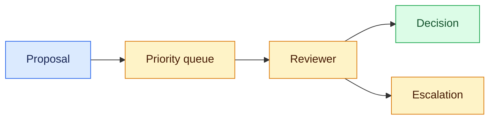
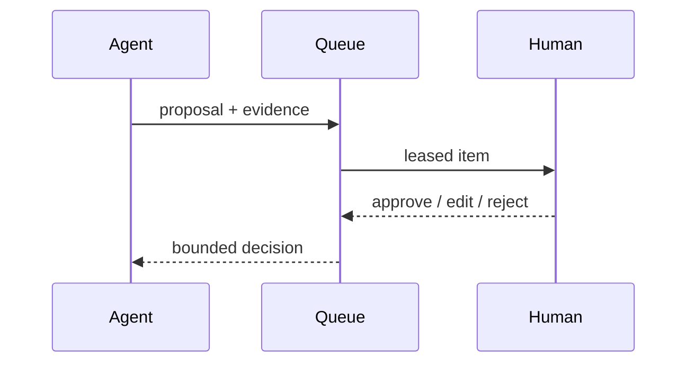

# Human-in-the-loop queues
Status: durable
Sources: [NIST AI RMF](https://www.nist.gov/itl/ai-risk-management-framework)
## In one sentence
A review queue turns uncertain or high-impact model proposals into accountable, observable human decisions.
## Background: what existed before
People handled all cases manually or automation silently accepted model output. Neither made uncertainty and ownership explicit.
## What changed and why now
Agents can produce many proposals, making triage, prioritization, SLAs, and reviewer feedback necessary infrastructure.
## Impact on current processing and architecture
Persist queue items, evidence, lease, decision, reason, and escalation; prevent duplicate review and preserve audit history.
## Real-world applications and constraints
Support, moderation, and operations use queues. Reviewer fatigue, sensitive data, latency SLAs, and inconsistent judgments constrain quality.
## Mental model


## What changed this month
March’s work-redesign concept treats review as a product and control boundary.
## Engineering consequence
Set priority, lease expiry, reviewer permissions, and escalation SLAs; measure edits and disagreement.
## Limits and failure modes
Rubber-stamping, queue starvation, and unclear accountability defeat the control.
## Runnable low-cost example
```python
items=[("high", "refund"),("low","draft")]
print(sorted(items, key=lambda x:x[0]!="high"))
```
## Mini exercise (15–30 min)
Add an expired lease and requeue behavior.
## Build it locally
1. Run `python3 queue.py`.
2. Add priority and created time.
3. Lease an item to one reviewer.
4. Record the decision and escalation reason.
## Interview Q&A
**Why queue?** It makes uncertainty manageable. **What is a lease?** Temporary reviewer ownership. **What metrics matter?** Age, SLA, edits, disagreement, and escape rate.
## Glossary
**Queue:** ordered pending work. **Lease:** time-bounded ownership. **SLA:** service-level objective. **Escalation:** routing to greater authority.
## References
- [NIST AI Risk Management Framework](https://www.nist.gov/itl/ai-risk-management-framework)
## Claim ledger
| Claim | Source | Fact or inference |
|---|---|---|
| AI risk management includes governance and accountability. | NIST | Fact |
| Review queues operationalize those controls for agents. | Systems inference | Inference |

### Boundary

Human-in-the-loop queues is a system boundary, not a prompt feature. The review queue belongs to a deterministic coordinator that receives a versioned request, checks identity and scope, performs risk-aware queue admission, reviewer context, and escalation, and records the accepted result separately from a model suggestion. For this lesson, success is an observable predicate. “Unavailable,” “denied,” “inconclusive,” and “completed” remain distinct outcomes. Correlation IDs, event sequence numbers, resource measurements, and redacted evidence make a run replayable.

When starvation, reviewer overload, stale approval occurs, use a typed transition: retry only a known transient, defer to an owner, reconcile against authoritative state, or stop. Persist leases and sequence numbers so late work cannot overwrite newer state. Test normal, boundary, adversarial, timeout, duplicate, stale, and cross-scope cases. Measure domain correctness with p95 latency, cost, retries, denials, queue age, and human intervention. Start in reversible mode; define rollback triggers and version every artifact affecting human-in-the-loop queues.
### Inputs

Human-in-the-loop queues is a system boundary, not a prompt feature. The review queue belongs to a deterministic coordinator that receives a versioned request, checks identity and scope, performs risk-aware queue admission, reviewer context, and escalation, and records the accepted result separately from a model suggestion. For this lesson, success is an observable predicate. “Unavailable,” “denied,” “inconclusive,” and “completed” remain distinct outcomes. Correlation IDs, event sequence numbers, resource measurements, and redacted evidence make a run replayable.

When starvation, reviewer overload, stale approval occurs, use a typed transition: retry only a known transient, defer to an owner, reconcile against authoritative state, or stop. Persist leases and sequence numbers so late work cannot overwrite newer state. Test normal, boundary, adversarial, timeout, duplicate, stale, and cross-scope cases. Measure domain correctness with p95 latency, cost, retries, denials, queue age, and human intervention. Start in reversible mode; define rollback triggers and version every artifact affecting human-in-the-loop queues.
### Decision path

Human-in-the-loop queues is a system boundary, not a prompt feature. The review queue belongs to a deterministic coordinator that receives a versioned request, checks identity and scope, performs risk-aware queue admission, reviewer context, and escalation, and records the accepted result separately from a model suggestion. For this lesson, success is an observable predicate. “Unavailable,” “denied,” “inconclusive,” and “completed” remain distinct outcomes. Correlation IDs, event sequence numbers, resource measurements, and redacted evidence make a run replayable.

When starvation, reviewer overload, stale approval occurs, use a typed transition: retry only a known transient, defer to an owner, reconcile against authoritative state, or stop. Persist leases and sequence numbers so late work cannot overwrite newer state. Test normal, boundary, adversarial, timeout, duplicate, stale, and cross-scope cases. Measure domain correctness with p95 latency, cost, retries, denials, queue age, and human intervention. Start in reversible mode; define rollback triggers and version every artifact affecting human-in-the-loop queues.
### Durable state

Human-in-the-loop queues is a system boundary, not a prompt feature. The review queue belongs to a deterministic coordinator that receives a versioned request, checks identity and scope, performs risk-aware queue admission, reviewer context, and escalation, and records the accepted result separately from a model suggestion. For this lesson, success is an observable predicate. “Unavailable,” “denied,” “inconclusive,” and “completed” remain distinct outcomes. Correlation IDs, event sequence numbers, resource measurements, and redacted evidence make a run replayable.

When starvation, reviewer overload, stale approval occurs, use a typed transition: retry only a known transient, defer to an owner, reconcile against authoritative state, or stop. Persist leases and sequence numbers so late work cannot overwrite newer state. Test normal, boundary, adversarial, timeout, duplicate, stale, and cross-scope cases. Measure domain correctness with p95 latency, cost, retries, denials, queue age, and human intervention. Start in reversible mode; define rollback triggers and version every artifact affecting human-in-the-loop queues.
### Capacity

Human-in-the-loop queues is a system boundary, not a prompt feature. The review queue belongs to a deterministic coordinator that receives a versioned request, checks identity and scope, performs risk-aware queue admission, reviewer context, and escalation, and records the accepted result separately from a model suggestion. For this lesson, success is an observable predicate. “Unavailable,” “denied,” “inconclusive,” and “completed” remain distinct outcomes. Correlation IDs, event sequence numbers, resource measurements, and redacted evidence make a run replayable.

When starvation, reviewer overload, stale approval occurs, use a typed transition: retry only a known transient, defer to an owner, reconcile against authoritative state, or stop. Persist leases and sequence numbers so late work cannot overwrite newer state. Test normal, boundary, adversarial, timeout, duplicate, stale, and cross-scope cases. Measure domain correctness with p95 latency, cost, retries, denials, queue age, and human intervention. Start in reversible mode; define rollback triggers and version every artifact affecting human-in-the-loop queues.
### Failure handling

Human-in-the-loop queues is a system boundary, not a prompt feature. The review queue belongs to a deterministic coordinator that receives a versioned request, checks identity and scope, performs risk-aware queue admission, reviewer context, and escalation, and records the accepted result separately from a model suggestion. For this lesson, success is an observable predicate. “Unavailable,” “denied,” “inconclusive,” and “completed” remain distinct outcomes. Correlation IDs, event sequence numbers, resource measurements, and redacted evidence make a run replayable.

When starvation, reviewer overload, stale approval occurs, use a typed transition: retry only a known transient, defer to an owner, reconcile against authoritative state, or stop. Persist leases and sequence numbers so late work cannot overwrite newer state. Test normal, boundary, adversarial, timeout, duplicate, stale, and cross-scope cases. Measure domain correctness with p95 latency, cost, retries, denials, queue age, and human intervention. Start in reversible mode; define rollback triggers and version every artifact affecting human-in-the-loop queues.
### Trust and privacy

Human-in-the-loop queues is a system boundary, not a prompt feature. The review queue belongs to a deterministic coordinator that receives a versioned request, checks identity and scope, performs risk-aware queue admission, reviewer context, and escalation, and records the accepted result separately from a model suggestion. For this lesson, success is an observable predicate. “Unavailable,” “denied,” “inconclusive,” and “completed” remain distinct outcomes. Correlation IDs, event sequence numbers, resource measurements, and redacted evidence make a run replayable.

When starvation, reviewer overload, stale approval occurs, use a typed transition: retry only a known transient, defer to an owner, reconcile against authoritative state, or stop. Persist leases and sequence numbers so late work cannot overwrite newer state. Test normal, boundary, adversarial, timeout, duplicate, stale, and cross-scope cases. Measure domain correctness with p95 latency, cost, retries, denials, queue age, and human intervention. Start in reversible mode; define rollback triggers and version every artifact affecting human-in-the-loop queues.
### Metrics

Human-in-the-loop queues is a system boundary, not a prompt feature. The review queue belongs to a deterministic coordinator that receives a versioned request, checks identity and scope, performs risk-aware queue admission, reviewer context, and escalation, and records the accepted result separately from a model suggestion. For this lesson, success is an observable predicate. “Unavailable,” “denied,” “inconclusive,” and “completed” remain distinct outcomes. Correlation IDs, event sequence numbers, resource measurements, and redacted evidence make a run replayable.

When starvation, reviewer overload, stale approval occurs, use a typed transition: retry only a known transient, defer to an owner, reconcile against authoritative state, or stop. Persist leases and sequence numbers so late work cannot overwrite newer state. Test normal, boundary, adversarial, timeout, duplicate, stale, and cross-scope cases. Measure domain correctness with p95 latency, cost, retries, denials, queue age, and human intervention. Start in reversible mode; define rollback triggers and version every artifact affecting human-in-the-loop queues.
### Fixtures

Human-in-the-loop queues is a system boundary, not a prompt feature. The review queue belongs to a deterministic coordinator that receives a versioned request, checks identity and scope, performs risk-aware queue admission, reviewer context, and escalation, and records the accepted result separately from a model suggestion. For this lesson, success is an observable predicate. “Unavailable,” “denied,” “inconclusive,” and “completed” remain distinct outcomes. Correlation IDs, event sequence numbers, resource measurements, and redacted evidence make a run replayable.

When starvation, reviewer overload, stale approval occurs, use a typed transition: retry only a known transient, defer to an owner, reconcile against authoritative state, or stop. Persist leases and sequence numbers so late work cannot overwrite newer state. Test normal, boundary, adversarial, timeout, duplicate, stale, and cross-scope cases. Measure domain correctness with p95 latency, cost, retries, denials, queue age, and human intervention. Start in reversible mode; define rollback triggers and version every artifact affecting human-in-the-loop queues.
### Rollout

Human-in-the-loop queues is a system boundary, not a prompt feature. The review queue belongs to a deterministic coordinator that receives a versioned request, checks identity and scope, performs risk-aware queue admission, reviewer context, and escalation, and records the accepted result separately from a model suggestion. For this lesson, success is an observable predicate. “Unavailable,” “denied,” “inconclusive,” and “completed” remain distinct outcomes. Correlation IDs, event sequence numbers, resource measurements, and redacted evidence make a run replayable.

When starvation, reviewer overload, stale approval occurs, use a typed transition: retry only a known transient, defer to an owner, reconcile against authoritative state, or stop. Persist leases and sequence numbers so late work cannot overwrite newer state. Test normal, boundary, adversarial, timeout, duplicate, stale, and cross-scope cases. Measure domain correctness with p95 latency, cost, retries, denials, queue age, and human intervention. Start in reversible mode; define rollback triggers and version every artifact affecting human-in-the-loop queues.
### Recovery

Human-in-the-loop queues is a system boundary, not a prompt feature. The review queue belongs to a deterministic coordinator that receives a versioned request, checks identity and scope, performs risk-aware queue admission, reviewer context, and escalation, and records the accepted result separately from a model suggestion. For this lesson, success is an observable predicate. “Unavailable,” “denied,” “inconclusive,” and “completed” remain distinct outcomes. Correlation IDs, event sequence numbers, resource measurements, and redacted evidence make a run replayable.

When starvation, reviewer overload, stale approval occurs, use a typed transition: retry only a known transient, defer to an owner, reconcile against authoritative state, or stop. Persist leases and sequence numbers so late work cannot overwrite newer state. Test normal, boundary, adversarial, timeout, duplicate, stale, and cross-scope cases. Measure domain correctness with p95 latency, cost, retries, denials, queue age, and human intervention. Start in reversible mode; define rollback triggers and version every artifact affecting human-in-the-loop queues.
### Local sequence

Human-in-the-loop queues is a system boundary, not a prompt feature. The review queue belongs to a deterministic coordinator that receives a versioned request, checks identity and scope, performs risk-aware queue admission, reviewer context, and escalation, and records the accepted result separately from a model suggestion. For this lesson, success is an observable predicate. “Unavailable,” “denied,” “inconclusive,” and “completed” remain distinct outcomes. Correlation IDs, event sequence numbers, resource measurements, and redacted evidence make a run replayable.

When starvation, reviewer overload, stale approval occurs, use a typed transition: retry only a known transient, defer to an owner, reconcile against authoritative state, or stop. Persist leases and sequence numbers so late work cannot overwrite newer state. Test normal, boundary, adversarial, timeout, duplicate, stale, and cross-scope cases. Measure domain correctness with p95 latency, cost, retries, denials, queue age, and human intervention. Start in reversible mode; define rollback triggers and version every artifact affecting human-in-the-loop queues.
### Review questions

Human-in-the-loop queues is a system boundary, not a prompt feature. The review queue belongs to a deterministic coordinator that receives a versioned request, checks identity and scope, performs risk-aware queue admission, reviewer context, and escalation, and records the accepted result separately from a model suggestion. For this lesson, success is an observable predicate. “Unavailable,” “denied,” “inconclusive,” and “completed” remain distinct outcomes. Correlation IDs, event sequence numbers, resource measurements, and redacted evidence make a run replayable.

When starvation, reviewer overload, stale approval occurs, use a typed transition: retry only a known transient, defer to an owner, reconcile against authoritative state, or stop. Persist leases and sequence numbers so late work cannot overwrite newer state. Test normal, boundary, adversarial, timeout, duplicate, stale, and cross-scope cases. Measure domain correctness with p95 latency, cost, retries, denials, queue age, and human intervention. Start in reversible mode; define rollback triggers and version every artifact affecting human-in-the-loop queues.
### Source limits

Human-in-the-loop queues is a system boundary, not a prompt feature. The review queue belongs to a deterministic coordinator that receives a versioned request, checks identity and scope, performs risk-aware queue admission, reviewer context, and escalation, and records the accepted result separately from a model suggestion. For this lesson, success is an observable predicate. “Unavailable,” “denied,” “inconclusive,” and “completed” remain distinct outcomes. Correlation IDs, event sequence numbers, resource measurements, and redacted evidence make a run replayable.

When starvation, reviewer overload, stale approval occurs, use a typed transition: retry only a known transient, defer to an owner, reconcile against authoritative state, or stop. Persist leases and sequence numbers so late work cannot overwrite newer state. Test normal, boundary, adversarial, timeout, duplicate, stale, and cross-scope cases. Measure domain correctness with p95 latency, cost, retries, denials, queue age, and human intervention. Start in reversible mode; define rollback triggers and version every artifact affecting human-in-the-loop queues.
