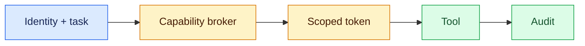
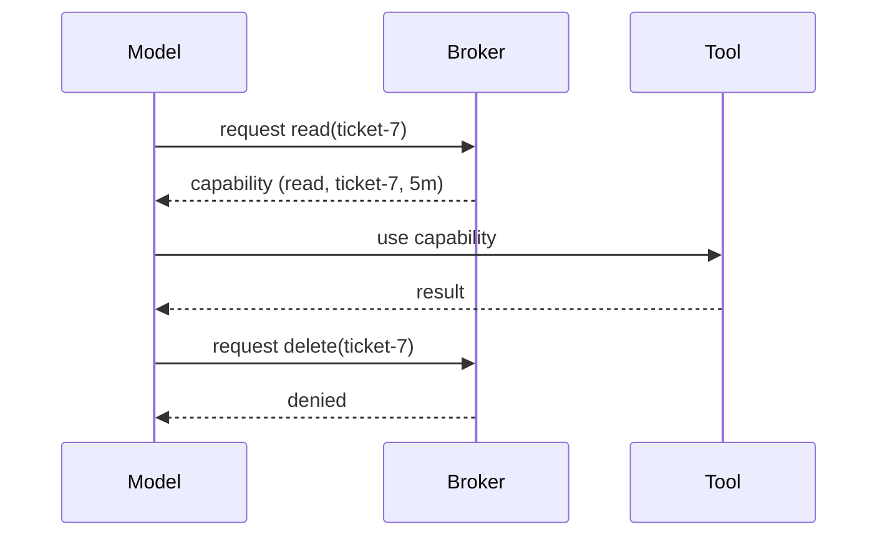

# Capability security
Status: durable
Sources: [OWASP — Least privilege](https://owasp.org/www-community/Access_Control)
## In one sentence
Capability security gives an agent only narrowly scoped, expiring authority and prevents model text from minting permissions.
## Background: what existed before
Services often used broad application credentials and checked authorization deep inside business logic, making tool integrations risky.
## What changed and why now
Agents can choose tools dynamically, so every proposed effect needs explicit identity, resource, scope, and time limits.
## Impact on current processing and architecture
A broker issues short-lived capabilities; executors enforce tenant and operation checks; logs connect capability use to task identity.
## Real-world applications and constraints
Read-only search and draft writes are easy to scope. Secret handling, revocation, delegation, and legacy APIs are hard.
## Mental model


## What changed this month
The March tool boundary makes authority an application decision, not an instruction-following outcome.
## Engineering consequence
Use deny-by-default scopes and separate read/write credentials.
## Limits and failure modes
Confused deputies, leaked tokens, overbroad resource patterns, and missing revocation remain risks.
## Runnable low-cost example
```python
cap={"op":"read","resource":"ticket-7"}
print("allow" if (cap["op"],cap["resource"]) == ("read","ticket-7") else "deny")
```
## Mini exercise (15–30 min)
Add expiry and a resource mismatch test.
## Build it locally
1. Run `python3 capability.py`.
2. Model operation/resource/expiry fields.
3. Enforce them at the fake tool.
4. Log capability ID and task ID.
## Interview Q&A
**Can the model grant itself access?** No. **Why short-lived?** Limit replay window. **What is deny-by-default?** Unknown operations fail closed.
## Glossary
**Capability:** scoped authority token. **Broker:** issuer and policy service. **Deputy:** service acting with delegated authority. **Revocation:** invalidating access.
## References
- [OWASP access control](https://owasp.org/www-community/Access_Control)
## Claim ledger
| Claim | Source | Fact or inference |
|---|---|---|
| Least privilege limits access to required resources. | OWASP | Fact |
| Short-lived capabilities fit agent tool boundaries. | Security inference | Inference |

### Boundary

Capability security is a system boundary, not a prompt feature. The capability grant belongs to a deterministic coordinator that receives a versioned request, checks identity and scope, performs least privilege, scoped tokens, and effect gates, and records the accepted result separately from a model suggestion. For this lesson, success is an observable predicate. “Unavailable,” “denied,” “inconclusive,” and “completed” remain distinct outcomes. Correlation IDs, event sequence numbers, resource measurements, and redacted evidence make a run replayable.

When confused deputy, privilege creep, token leakage occurs, use a typed transition: retry only a known transient, defer to an owner, reconcile against authoritative state, or stop. Persist leases and sequence numbers so late work cannot overwrite newer state. Test normal, boundary, adversarial, timeout, duplicate, stale, and cross-scope cases. Measure domain correctness with p95 latency, cost, retries, denials, queue age, and human intervention. Start in reversible mode; define rollback triggers and version every artifact affecting capability security.
### Inputs

Capability security is a system boundary, not a prompt feature. The capability grant belongs to a deterministic coordinator that receives a versioned request, checks identity and scope, performs least privilege, scoped tokens, and effect gates, and records the accepted result separately from a model suggestion. For this lesson, success is an observable predicate. “Unavailable,” “denied,” “inconclusive,” and “completed” remain distinct outcomes. Correlation IDs, event sequence numbers, resource measurements, and redacted evidence make a run replayable.

When confused deputy, privilege creep, token leakage occurs, use a typed transition: retry only a known transient, defer to an owner, reconcile against authoritative state, or stop. Persist leases and sequence numbers so late work cannot overwrite newer state. Test normal, boundary, adversarial, timeout, duplicate, stale, and cross-scope cases. Measure domain correctness with p95 latency, cost, retries, denials, queue age, and human intervention. Start in reversible mode; define rollback triggers and version every artifact affecting capability security.
### Decision path

Capability security is a system boundary, not a prompt feature. The capability grant belongs to a deterministic coordinator that receives a versioned request, checks identity and scope, performs least privilege, scoped tokens, and effect gates, and records the accepted result separately from a model suggestion. For this lesson, success is an observable predicate. “Unavailable,” “denied,” “inconclusive,” and “completed” remain distinct outcomes. Correlation IDs, event sequence numbers, resource measurements, and redacted evidence make a run replayable.

When confused deputy, privilege creep, token leakage occurs, use a typed transition: retry only a known transient, defer to an owner, reconcile against authoritative state, or stop. Persist leases and sequence numbers so late work cannot overwrite newer state. Test normal, boundary, adversarial, timeout, duplicate, stale, and cross-scope cases. Measure domain correctness with p95 latency, cost, retries, denials, queue age, and human intervention. Start in reversible mode; define rollback triggers and version every artifact affecting capability security.
### Durable state

Capability security is a system boundary, not a prompt feature. The capability grant belongs to a deterministic coordinator that receives a versioned request, checks identity and scope, performs least privilege, scoped tokens, and effect gates, and records the accepted result separately from a model suggestion. For this lesson, success is an observable predicate. “Unavailable,” “denied,” “inconclusive,” and “completed” remain distinct outcomes. Correlation IDs, event sequence numbers, resource measurements, and redacted evidence make a run replayable.

When confused deputy, privilege creep, token leakage occurs, use a typed transition: retry only a known transient, defer to an owner, reconcile against authoritative state, or stop. Persist leases and sequence numbers so late work cannot overwrite newer state. Test normal, boundary, adversarial, timeout, duplicate, stale, and cross-scope cases. Measure domain correctness with p95 latency, cost, retries, denials, queue age, and human intervention. Start in reversible mode; define rollback triggers and version every artifact affecting capability security.
### Capacity

Capability security is a system boundary, not a prompt feature. The capability grant belongs to a deterministic coordinator that receives a versioned request, checks identity and scope, performs least privilege, scoped tokens, and effect gates, and records the accepted result separately from a model suggestion. For this lesson, success is an observable predicate. “Unavailable,” “denied,” “inconclusive,” and “completed” remain distinct outcomes. Correlation IDs, event sequence numbers, resource measurements, and redacted evidence make a run replayable.

When confused deputy, privilege creep, token leakage occurs, use a typed transition: retry only a known transient, defer to an owner, reconcile against authoritative state, or stop. Persist leases and sequence numbers so late work cannot overwrite newer state. Test normal, boundary, adversarial, timeout, duplicate, stale, and cross-scope cases. Measure domain correctness with p95 latency, cost, retries, denials, queue age, and human intervention. Start in reversible mode; define rollback triggers and version every artifact affecting capability security.
### Failure handling

Capability security is a system boundary, not a prompt feature. The capability grant belongs to a deterministic coordinator that receives a versioned request, checks identity and scope, performs least privilege, scoped tokens, and effect gates, and records the accepted result separately from a model suggestion. For this lesson, success is an observable predicate. “Unavailable,” “denied,” “inconclusive,” and “completed” remain distinct outcomes. Correlation IDs, event sequence numbers, resource measurements, and redacted evidence make a run replayable.

When confused deputy, privilege creep, token leakage occurs, use a typed transition: retry only a known transient, defer to an owner, reconcile against authoritative state, or stop. Persist leases and sequence numbers so late work cannot overwrite newer state. Test normal, boundary, adversarial, timeout, duplicate, stale, and cross-scope cases. Measure domain correctness with p95 latency, cost, retries, denials, queue age, and human intervention. Start in reversible mode; define rollback triggers and version every artifact affecting capability security.
### Trust and privacy

Capability security is a system boundary, not a prompt feature. The capability grant belongs to a deterministic coordinator that receives a versioned request, checks identity and scope, performs least privilege, scoped tokens, and effect gates, and records the accepted result separately from a model suggestion. For this lesson, success is an observable predicate. “Unavailable,” “denied,” “inconclusive,” and “completed” remain distinct outcomes. Correlation IDs, event sequence numbers, resource measurements, and redacted evidence make a run replayable.

When confused deputy, privilege creep, token leakage occurs, use a typed transition: retry only a known transient, defer to an owner, reconcile against authoritative state, or stop. Persist leases and sequence numbers so late work cannot overwrite newer state. Test normal, boundary, adversarial, timeout, duplicate, stale, and cross-scope cases. Measure domain correctness with p95 latency, cost, retries, denials, queue age, and human intervention. Start in reversible mode; define rollback triggers and version every artifact affecting capability security.
### Metrics

Capability security is a system boundary, not a prompt feature. The capability grant belongs to a deterministic coordinator that receives a versioned request, checks identity and scope, performs least privilege, scoped tokens, and effect gates, and records the accepted result separately from a model suggestion. For this lesson, success is an observable predicate. “Unavailable,” “denied,” “inconclusive,” and “completed” remain distinct outcomes. Correlation IDs, event sequence numbers, resource measurements, and redacted evidence make a run replayable.

When confused deputy, privilege creep, token leakage occurs, use a typed transition: retry only a known transient, defer to an owner, reconcile against authoritative state, or stop. Persist leases and sequence numbers so late work cannot overwrite newer state. Test normal, boundary, adversarial, timeout, duplicate, stale, and cross-scope cases. Measure domain correctness with p95 latency, cost, retries, denials, queue age, and human intervention. Start in reversible mode; define rollback triggers and version every artifact affecting capability security.
### Fixtures

Capability security is a system boundary, not a prompt feature. The capability grant belongs to a deterministic coordinator that receives a versioned request, checks identity and scope, performs least privilege, scoped tokens, and effect gates, and records the accepted result separately from a model suggestion. For this lesson, success is an observable predicate. “Unavailable,” “denied,” “inconclusive,” and “completed” remain distinct outcomes. Correlation IDs, event sequence numbers, resource measurements, and redacted evidence make a run replayable.

When confused deputy, privilege creep, token leakage occurs, use a typed transition: retry only a known transient, defer to an owner, reconcile against authoritative state, or stop. Persist leases and sequence numbers so late work cannot overwrite newer state. Test normal, boundary, adversarial, timeout, duplicate, stale, and cross-scope cases. Measure domain correctness with p95 latency, cost, retries, denials, queue age, and human intervention. Start in reversible mode; define rollback triggers and version every artifact affecting capability security.
### Rollout

Capability security is a system boundary, not a prompt feature. The capability grant belongs to a deterministic coordinator that receives a versioned request, checks identity and scope, performs least privilege, scoped tokens, and effect gates, and records the accepted result separately from a model suggestion. For this lesson, success is an observable predicate. “Unavailable,” “denied,” “inconclusive,” and “completed” remain distinct outcomes. Correlation IDs, event sequence numbers, resource measurements, and redacted evidence make a run replayable.

When confused deputy, privilege creep, token leakage occurs, use a typed transition: retry only a known transient, defer to an owner, reconcile against authoritative state, or stop. Persist leases and sequence numbers so late work cannot overwrite newer state. Test normal, boundary, adversarial, timeout, duplicate, stale, and cross-scope cases. Measure domain correctness with p95 latency, cost, retries, denials, queue age, and human intervention. Start in reversible mode; define rollback triggers and version every artifact affecting capability security.
### Recovery

Capability security is a system boundary, not a prompt feature. The capability grant belongs to a deterministic coordinator that receives a versioned request, checks identity and scope, performs least privilege, scoped tokens, and effect gates, and records the accepted result separately from a model suggestion. For this lesson, success is an observable predicate. “Unavailable,” “denied,” “inconclusive,” and “completed” remain distinct outcomes. Correlation IDs, event sequence numbers, resource measurements, and redacted evidence make a run replayable.

When confused deputy, privilege creep, token leakage occurs, use a typed transition: retry only a known transient, defer to an owner, reconcile against authoritative state, or stop. Persist leases and sequence numbers so late work cannot overwrite newer state. Test normal, boundary, adversarial, timeout, duplicate, stale, and cross-scope cases. Measure domain correctness with p95 latency, cost, retries, denials, queue age, and human intervention. Start in reversible mode; define rollback triggers and version every artifact affecting capability security.
### Local sequence

Capability security is a system boundary, not a prompt feature. The capability grant belongs to a deterministic coordinator that receives a versioned request, checks identity and scope, performs least privilege, scoped tokens, and effect gates, and records the accepted result separately from a model suggestion. For this lesson, success is an observable predicate. “Unavailable,” “denied,” “inconclusive,” and “completed” remain distinct outcomes. Correlation IDs, event sequence numbers, resource measurements, and redacted evidence make a run replayable.

When confused deputy, privilege creep, token leakage occurs, use a typed transition: retry only a known transient, defer to an owner, reconcile against authoritative state, or stop. Persist leases and sequence numbers so late work cannot overwrite newer state. Test normal, boundary, adversarial, timeout, duplicate, stale, and cross-scope cases. Measure domain correctness with p95 latency, cost, retries, denials, queue age, and human intervention. Start in reversible mode; define rollback triggers and version every artifact affecting capability security.
### Review questions

Capability security is a system boundary, not a prompt feature. The capability grant belongs to a deterministic coordinator that receives a versioned request, checks identity and scope, performs least privilege, scoped tokens, and effect gates, and records the accepted result separately from a model suggestion. For this lesson, success is an observable predicate. “Unavailable,” “denied,” “inconclusive,” and “completed” remain distinct outcomes. Correlation IDs, event sequence numbers, resource measurements, and redacted evidence make a run replayable.

When confused deputy, privilege creep, token leakage occurs, use a typed transition: retry only a known transient, defer to an owner, reconcile against authoritative state, or stop. Persist leases and sequence numbers so late work cannot overwrite newer state. Test normal, boundary, adversarial, timeout, duplicate, stale, and cross-scope cases. Measure domain correctness with p95 latency, cost, retries, denials, queue age, and human intervention. Start in reversible mode; define rollback triggers and version every artifact affecting capability security.
### Source limits

Capability security is a system boundary, not a prompt feature. The capability grant belongs to a deterministic coordinator that receives a versioned request, checks identity and scope, performs least privilege, scoped tokens, and effect gates, and records the accepted result separately from a model suggestion. For this lesson, success is an observable predicate. “Unavailable,” “denied,” “inconclusive,” and “completed” remain distinct outcomes. Correlation IDs, event sequence numbers, resource measurements, and redacted evidence make a run replayable.

When confused deputy, privilege creep, token leakage occurs, use a typed transition: retry only a known transient, defer to an owner, reconcile against authoritative state, or stop. Persist leases and sequence numbers so late work cannot overwrite newer state. Test normal, boundary, adversarial, timeout, duplicate, stale, and cross-scope cases. Measure domain correctness with p95 latency, cost, retries, denials, queue age, and human intervention. Start in reversible mode; define rollback triggers and version every artifact affecting capability security.
