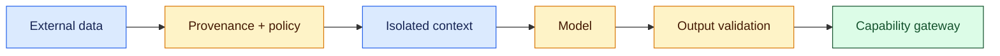
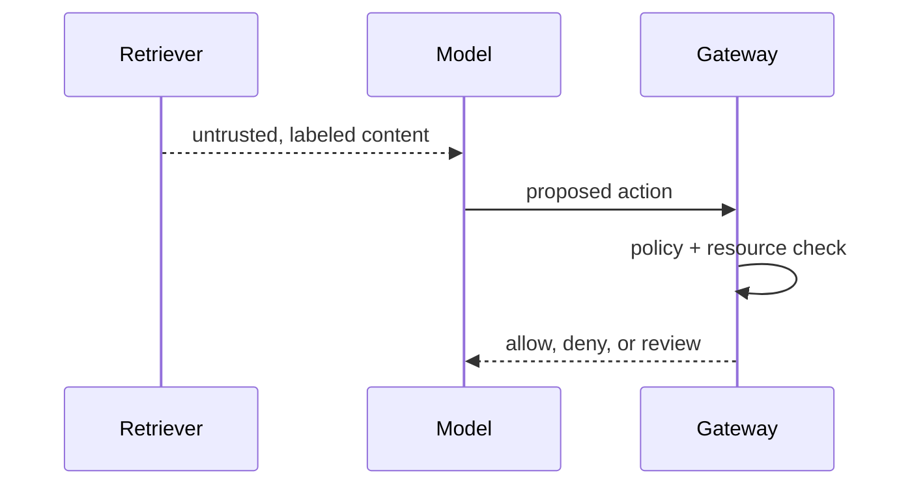

# Secure prompt-injection handling
Status: emerging
Sources: [OWASP — LLM prompt injection](https://genai.owasp.org/llmrisk/llm01-prompt-injection/)
## In one sentence
Prompt-injection defense combines provenance, isolation, least privilege, validation, and monitoring because no single prompt can establish trust.
## Background: what existed before
Static prompts assumed the application controlled all instructions. Retrieval and browsing now import content written by unknown parties.
## What changed and why now
Indirect attacks arrive through documents and tool responses, requiring security architecture around context assembly.
## Impact on current processing and architecture
Attach source labels, keep instructions separate from data, sanitize outputs, authorize tools, and quarantine suspicious records.
## Real-world applications and constraints
Document agents and browsers need these controls. Filtering can reduce recall, provenance can be forged, and models may still misclassify intent.
## Mental model


## What changed this month
March separates data from authority and requires defense in depth for agent inputs.
## Engineering consequence
Make provenance and policy decisions first-class trace fields and add adversarial fixtures.
## Limits and failure modes
Attackers can hide instructions in images or metadata; defense remains probabilistic at the model layer.
## Runnable low-cost example
```python
item={"source":"web","trusted":False}; print("data-only" if not item["trusted"] else "instruction")
```
## Mini exercise (15–30 min)
Add a source allowlist and gateway denial for exports.
## Build it locally
1. Run `python3 secure_injection.py`.
2. Label every retrieved item.
3. Keep labels outside content text.
4. Test benign and adversarial fixtures.
## Interview Q&A
**What is defense in depth?** Multiple independent controls. **Can provenance prove truth?** No, it supports policy and investigation. **Where enforce effects?** At the gateway.
## Glossary
**Provenance:** origin metadata. **Isolation:** preventing data from becoming authority. **Quarantine:** withholding suspicious input. **Defense in depth:** layered controls.
## References
- [OWASP prompt injection](https://genai.owasp.org/llmrisk/llm01-prompt-injection/)
## Claim ledger
| Claim | Source | Fact or inference |
|---|---|---|
| Prompt injection can be direct or indirect. | OWASP | Fact |
| Provenance plus gateway checks are practical layered defenses. | Security inference | Inference |

### Boundary

Secure prompt injection is a system boundary, not a prompt feature. The content trust boundary belongs to a deterministic coordinator that receives a versioned request, checks identity and scope, performs untrusted content isolation, instruction hierarchy, and outbound controls, and records the accepted result separately from a model suggestion. For this lesson, success is an observable predicate. “Unavailable,” “denied,” “inconclusive,” and “completed” remain distinct outcomes. Correlation IDs, event sequence numbers, resource measurements, and redacted evidence make a run replayable.

When indirect instruction, exfiltration, tool misuse occurs, use a typed transition: retry only a known transient, defer to an owner, reconcile against authoritative state, or stop. Persist leases and sequence numbers so late work cannot overwrite newer state. Test normal, boundary, adversarial, timeout, duplicate, stale, and cross-scope cases. Measure domain correctness with p95 latency, cost, retries, denials, queue age, and human intervention. Start in reversible mode; define rollback triggers and version every artifact affecting secure prompt injection.
### Inputs

Secure prompt injection is a system boundary, not a prompt feature. The content trust boundary belongs to a deterministic coordinator that receives a versioned request, checks identity and scope, performs untrusted content isolation, instruction hierarchy, and outbound controls, and records the accepted result separately from a model suggestion. For this lesson, success is an observable predicate. “Unavailable,” “denied,” “inconclusive,” and “completed” remain distinct outcomes. Correlation IDs, event sequence numbers, resource measurements, and redacted evidence make a run replayable.

When indirect instruction, exfiltration, tool misuse occurs, use a typed transition: retry only a known transient, defer to an owner, reconcile against authoritative state, or stop. Persist leases and sequence numbers so late work cannot overwrite newer state. Test normal, boundary, adversarial, timeout, duplicate, stale, and cross-scope cases. Measure domain correctness with p95 latency, cost, retries, denials, queue age, and human intervention. Start in reversible mode; define rollback triggers and version every artifact affecting secure prompt injection.
### Decision path

Secure prompt injection is a system boundary, not a prompt feature. The content trust boundary belongs to a deterministic coordinator that receives a versioned request, checks identity and scope, performs untrusted content isolation, instruction hierarchy, and outbound controls, and records the accepted result separately from a model suggestion. For this lesson, success is an observable predicate. “Unavailable,” “denied,” “inconclusive,” and “completed” remain distinct outcomes. Correlation IDs, event sequence numbers, resource measurements, and redacted evidence make a run replayable.

When indirect instruction, exfiltration, tool misuse occurs, use a typed transition: retry only a known transient, defer to an owner, reconcile against authoritative state, or stop. Persist leases and sequence numbers so late work cannot overwrite newer state. Test normal, boundary, adversarial, timeout, duplicate, stale, and cross-scope cases. Measure domain correctness with p95 latency, cost, retries, denials, queue age, and human intervention. Start in reversible mode; define rollback triggers and version every artifact affecting secure prompt injection.
### Durable state

Secure prompt injection is a system boundary, not a prompt feature. The content trust boundary belongs to a deterministic coordinator that receives a versioned request, checks identity and scope, performs untrusted content isolation, instruction hierarchy, and outbound controls, and records the accepted result separately from a model suggestion. For this lesson, success is an observable predicate. “Unavailable,” “denied,” “inconclusive,” and “completed” remain distinct outcomes. Correlation IDs, event sequence numbers, resource measurements, and redacted evidence make a run replayable.

When indirect instruction, exfiltration, tool misuse occurs, use a typed transition: retry only a known transient, defer to an owner, reconcile against authoritative state, or stop. Persist leases and sequence numbers so late work cannot overwrite newer state. Test normal, boundary, adversarial, timeout, duplicate, stale, and cross-scope cases. Measure domain correctness with p95 latency, cost, retries, denials, queue age, and human intervention. Start in reversible mode; define rollback triggers and version every artifact affecting secure prompt injection.
### Capacity

Secure prompt injection is a system boundary, not a prompt feature. The content trust boundary belongs to a deterministic coordinator that receives a versioned request, checks identity and scope, performs untrusted content isolation, instruction hierarchy, and outbound controls, and records the accepted result separately from a model suggestion. For this lesson, success is an observable predicate. “Unavailable,” “denied,” “inconclusive,” and “completed” remain distinct outcomes. Correlation IDs, event sequence numbers, resource measurements, and redacted evidence make a run replayable.

When indirect instruction, exfiltration, tool misuse occurs, use a typed transition: retry only a known transient, defer to an owner, reconcile against authoritative state, or stop. Persist leases and sequence numbers so late work cannot overwrite newer state. Test normal, boundary, adversarial, timeout, duplicate, stale, and cross-scope cases. Measure domain correctness with p95 latency, cost, retries, denials, queue age, and human intervention. Start in reversible mode; define rollback triggers and version every artifact affecting secure prompt injection.
### Failure handling

Secure prompt injection is a system boundary, not a prompt feature. The content trust boundary belongs to a deterministic coordinator that receives a versioned request, checks identity and scope, performs untrusted content isolation, instruction hierarchy, and outbound controls, and records the accepted result separately from a model suggestion. For this lesson, success is an observable predicate. “Unavailable,” “denied,” “inconclusive,” and “completed” remain distinct outcomes. Correlation IDs, event sequence numbers, resource measurements, and redacted evidence make a run replayable.

When indirect instruction, exfiltration, tool misuse occurs, use a typed transition: retry only a known transient, defer to an owner, reconcile against authoritative state, or stop. Persist leases and sequence numbers so late work cannot overwrite newer state. Test normal, boundary, adversarial, timeout, duplicate, stale, and cross-scope cases. Measure domain correctness with p95 latency, cost, retries, denials, queue age, and human intervention. Start in reversible mode; define rollback triggers and version every artifact affecting secure prompt injection.
### Trust and privacy

Secure prompt injection is a system boundary, not a prompt feature. The content trust boundary belongs to a deterministic coordinator that receives a versioned request, checks identity and scope, performs untrusted content isolation, instruction hierarchy, and outbound controls, and records the accepted result separately from a model suggestion. For this lesson, success is an observable predicate. “Unavailable,” “denied,” “inconclusive,” and “completed” remain distinct outcomes. Correlation IDs, event sequence numbers, resource measurements, and redacted evidence make a run replayable.

When indirect instruction, exfiltration, tool misuse occurs, use a typed transition: retry only a known transient, defer to an owner, reconcile against authoritative state, or stop. Persist leases and sequence numbers so late work cannot overwrite newer state. Test normal, boundary, adversarial, timeout, duplicate, stale, and cross-scope cases. Measure domain correctness with p95 latency, cost, retries, denials, queue age, and human intervention. Start in reversible mode; define rollback triggers and version every artifact affecting secure prompt injection.
### Metrics

Secure prompt injection is a system boundary, not a prompt feature. The content trust boundary belongs to a deterministic coordinator that receives a versioned request, checks identity and scope, performs untrusted content isolation, instruction hierarchy, and outbound controls, and records the accepted result separately from a model suggestion. For this lesson, success is an observable predicate. “Unavailable,” “denied,” “inconclusive,” and “completed” remain distinct outcomes. Correlation IDs, event sequence numbers, resource measurements, and redacted evidence make a run replayable.

When indirect instruction, exfiltration, tool misuse occurs, use a typed transition: retry only a known transient, defer to an owner, reconcile against authoritative state, or stop. Persist leases and sequence numbers so late work cannot overwrite newer state. Test normal, boundary, adversarial, timeout, duplicate, stale, and cross-scope cases. Measure domain correctness with p95 latency, cost, retries, denials, queue age, and human intervention. Start in reversible mode; define rollback triggers and version every artifact affecting secure prompt injection.
### Fixtures

Secure prompt injection is a system boundary, not a prompt feature. The content trust boundary belongs to a deterministic coordinator that receives a versioned request, checks identity and scope, performs untrusted content isolation, instruction hierarchy, and outbound controls, and records the accepted result separately from a model suggestion. For this lesson, success is an observable predicate. “Unavailable,” “denied,” “inconclusive,” and “completed” remain distinct outcomes. Correlation IDs, event sequence numbers, resource measurements, and redacted evidence make a run replayable.

When indirect instruction, exfiltration, tool misuse occurs, use a typed transition: retry only a known transient, defer to an owner, reconcile against authoritative state, or stop. Persist leases and sequence numbers so late work cannot overwrite newer state. Test normal, boundary, adversarial, timeout, duplicate, stale, and cross-scope cases. Measure domain correctness with p95 latency, cost, retries, denials, queue age, and human intervention. Start in reversible mode; define rollback triggers and version every artifact affecting secure prompt injection.
### Rollout

Secure prompt injection is a system boundary, not a prompt feature. The content trust boundary belongs to a deterministic coordinator that receives a versioned request, checks identity and scope, performs untrusted content isolation, instruction hierarchy, and outbound controls, and records the accepted result separately from a model suggestion. For this lesson, success is an observable predicate. “Unavailable,” “denied,” “inconclusive,” and “completed” remain distinct outcomes. Correlation IDs, event sequence numbers, resource measurements, and redacted evidence make a run replayable.

When indirect instruction, exfiltration, tool misuse occurs, use a typed transition: retry only a known transient, defer to an owner, reconcile against authoritative state, or stop. Persist leases and sequence numbers so late work cannot overwrite newer state. Test normal, boundary, adversarial, timeout, duplicate, stale, and cross-scope cases. Measure domain correctness with p95 latency, cost, retries, denials, queue age, and human intervention. Start in reversible mode; define rollback triggers and version every artifact affecting secure prompt injection.
### Recovery

Secure prompt injection is a system boundary, not a prompt feature. The content trust boundary belongs to a deterministic coordinator that receives a versioned request, checks identity and scope, performs untrusted content isolation, instruction hierarchy, and outbound controls, and records the accepted result separately from a model suggestion. For this lesson, success is an observable predicate. “Unavailable,” “denied,” “inconclusive,” and “completed” remain distinct outcomes. Correlation IDs, event sequence numbers, resource measurements, and redacted evidence make a run replayable.

When indirect instruction, exfiltration, tool misuse occurs, use a typed transition: retry only a known transient, defer to an owner, reconcile against authoritative state, or stop. Persist leases and sequence numbers so late work cannot overwrite newer state. Test normal, boundary, adversarial, timeout, duplicate, stale, and cross-scope cases. Measure domain correctness with p95 latency, cost, retries, denials, queue age, and human intervention. Start in reversible mode; define rollback triggers and version every artifact affecting secure prompt injection.
### Local sequence

Secure prompt injection is a system boundary, not a prompt feature. The content trust boundary belongs to a deterministic coordinator that receives a versioned request, checks identity and scope, performs untrusted content isolation, instruction hierarchy, and outbound controls, and records the accepted result separately from a model suggestion. For this lesson, success is an observable predicate. “Unavailable,” “denied,” “inconclusive,” and “completed” remain distinct outcomes. Correlation IDs, event sequence numbers, resource measurements, and redacted evidence make a run replayable.

When indirect instruction, exfiltration, tool misuse occurs, use a typed transition: retry only a known transient, defer to an owner, reconcile against authoritative state, or stop. Persist leases and sequence numbers so late work cannot overwrite newer state. Test normal, boundary, adversarial, timeout, duplicate, stale, and cross-scope cases. Measure domain correctness with p95 latency, cost, retries, denials, queue age, and human intervention. Start in reversible mode; define rollback triggers and version every artifact affecting secure prompt injection.
### Review questions

Secure prompt injection is a system boundary, not a prompt feature. The content trust boundary belongs to a deterministic coordinator that receives a versioned request, checks identity and scope, performs untrusted content isolation, instruction hierarchy, and outbound controls, and records the accepted result separately from a model suggestion. For this lesson, success is an observable predicate. “Unavailable,” “denied,” “inconclusive,” and “completed” remain distinct outcomes. Correlation IDs, event sequence numbers, resource measurements, and redacted evidence make a run replayable.

When indirect instruction, exfiltration, tool misuse occurs, use a typed transition: retry only a known transient, defer to an owner, reconcile against authoritative state, or stop. Persist leases and sequence numbers so late work cannot overwrite newer state. Test normal, boundary, adversarial, timeout, duplicate, stale, and cross-scope cases. Measure domain correctness with p95 latency, cost, retries, denials, queue age, and human intervention. Start in reversible mode; define rollback triggers and version every artifact affecting secure prompt injection.
### Source limits

Secure prompt injection is a system boundary, not a prompt feature. The content trust boundary belongs to a deterministic coordinator that receives a versioned request, checks identity and scope, performs untrusted content isolation, instruction hierarchy, and outbound controls, and records the accepted result separately from a model suggestion. For this lesson, success is an observable predicate. “Unavailable,” “denied,” “inconclusive,” and “completed” remain distinct outcomes. Correlation IDs, event sequence numbers, resource measurements, and redacted evidence make a run replayable.

When indirect instruction, exfiltration, tool misuse occurs, use a typed transition: retry only a known transient, defer to an owner, reconcile against authoritative state, or stop. Persist leases and sequence numbers so late work cannot overwrite newer state. Test normal, boundary, adversarial, timeout, duplicate, stale, and cross-scope cases. Measure domain correctness with p95 latency, cost, retries, denials, queue age, and human intervention. Start in reversible mode; define rollback triggers and version every artifact affecting secure prompt injection.
