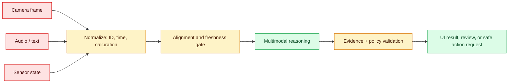
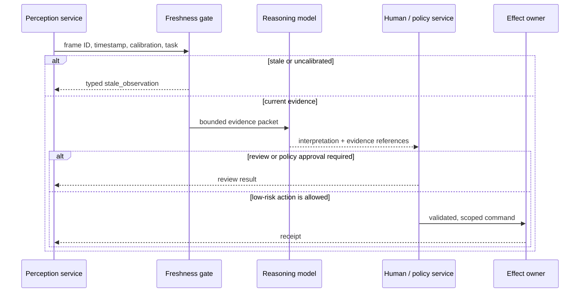

# Multimodal representation

Status: emerging
Sources: [Google DeepMind — 2026-04-14](https://deepmind.google/blog/gemini-robotics-er-1-6/)

## In one sentence

Multimodal representation is the engineering work of turning text, images, audio, time, and action state into compatible evidence for one decision, while preserving which sensor saw what, when, and how certain it was.

## Background: what existed before

Most production software began with one dominant input type. Search indexes text. A speech recognizer turns audio into a transcript. A vision service returns labels or bounding boxes. A robot controller accepts numeric coordinates. These services can be useful in isolation, but a user request often crosses their boundaries: “put the blue pen in the holder,” “read this pressure gauge,” or “stop when the assembly is complete.” The useful answer depends on words, pixels, camera viewpoint, time, and the physical action already attempted.

The conventional integration was a pipeline of handoffs. Speech became text; an image classifier emitted labels; a workflow engine matched rules; a controller executed a fixed command. This is predictable and cheap for narrow tasks, but loses information at each conversion. A transcript does not say where an object is. A label such as `cup` does not establish which cup, its depth, or whether it is behind another object. A camera frame without timestamp or calibration cannot reliably describe the robot's current workspace.

A **representation** is the data form a component uses to compare or transform an observation. A text embedding is one representation; a sequence of image patches is another; a pose is a geometric representation of position and orientation. Multimodal systems need an alignment contract: the components must agree on IDs, coordinate frames, timestamps, units, and scope. Without that contract, a model can produce a plausible explanation while referring to stale video or a different camera's coordinate system.

## What changed and why now

Google DeepMind's April 14, 2026 announcement for Gemini Robotics-ER 1.6 describes a high-level robotics reasoning model with visual and spatial understanding, task planning, success detection, multi-view reasoning, and tool use. It presents pointing as an intermediate representation for spatial reasoning and describes instrument reading that combines visual reasoning, zooming, pointing, and code execution. Those are source-specific product claims, not independent proof of all-purpose robotic reliability.

The engineering significance is not that every application needs a robot model. It is that multimodal systems increasingly expose intermediate evidence rather than only a final label. A point, bounding box, camera view, gauge tick, transcript segment, or action plan can be carried through an observable system. That makes an SDE's job less about concatenating “image description + prompt” and more about defining data contracts between perception, reasoning, policy, and execution.

For an internal inspection workflow, this change can be practical. Instead of asking a model to answer “is the valve open?” from a raw image, a service can send an image ID, calibrated crop, timestamp, equipment ID, and a constrained task. The response may contain a proposed reading, a confidence or uncertainty state, and an evidence location. Deterministic code can then check that the camera is recent, the asset is in scope, and the reading is inside a plausible operating range. The model contributes interpretation; the surrounding system owns authority.

## Impact on current processing and architecture

A multimodal request is not simply a larger prompt. It has ingestion, synchronization, and retention work. Each raw input needs a stable object ID and metadata: camera ID, capture time, clock source, coordinate frame, orientation, source tenant, consent or retention class, and preprocessing version. A derived crop or transcript must link back to its parent input. If a later incident asks why the system routed an alarm, an operator needs to reconstruct the exact frame and model configuration rather than inspect an unrelated live camera feed.

Put **early fusion** and **late fusion** in your vocabulary. Early fusion combines modality features before a shared model makes a decision; it can capture fine relationships such as “the red object left of the gauge needle.” Late fusion lets separate services produce results and combines them with code or a later model; it can be easier to operate because each modality has its own metrics and fallback. Neither is automatically better. Early fusion may require synchronized data and a costly multimodal call. Late fusion can discard nuance or multiply inconsistent confidence scores.

Time is a first-class field. A camera frame at 12:00:00.000 and a force reading at 12:00:01.200 do not describe one instant, even if they arrive in the same queue batch. Define a maximum observation age and a synchronization tolerance. If the request exceeds either, return `stale_observation` rather than treating the most recent image as current. For physical action, receive fresh perception after every consequential movement. A prior frame is evidence of history, not proof of the current world.

## Real-world applications and constraints

In a factory inspection service, vision can locate a gauge, OCR can read its unit, and a reasoning model can decide whether the needle position indicates an abnormal range. The effect should be a review ticket or alarm proposal, not a direct actuation command. The service needs calibration records, equipment-specific thresholds, an operator override, and audit retention suitable for the facility. Image quality, glare, occlusion, and a changed gauge face are operational risks, not edge cases.

In a voice-and-screen support assistant, audio is useful for intent and urgency, screen content is useful for the exact error message, and text policy documents are useful for the prescribed remedy. Accessibility matters: a caller may have a speech difference, the screen capture may be unavailable, or captions may be wrong. The system needs modality-specific fallbacks, such as typed confirmation of an account action. It must not use a perceived emotion as authorization or a reliability shortcut.

In robotics, the blast radius is higher. A model can propose a target point or verify task completion, but low-level control must enforce joint limits, collision checks, speed limits, and emergency stop behavior. A spatial answer that is correct in pixels can still be unsafe after camera calibration drift or object motion. Treat the action interface as a narrow API with a current-state check; do not let a natural-language answer become motor commands.

## Mental model

Think of a multimodal decision as an evidence packet, not a magic all-seeing model call. The packet has observations, alignments, provenance, uncertainty, and a requested operation. The model may propose an interpretation. A deterministic boundary decides whether the evidence is recent, scoped, and sufficient for the next state transition.



The model should receive only the modalities and metadata needed for the task. A support ticket does not need every camera in a facility; an inspection task does not need a customer's full conversation history. Bounded context lowers cost and makes accidental disclosure less likely.

## What changed this month

The April source says Gemini Robotics-ER 1.6 improves spatial and multi-view reasoning capabilities, task planning, success detection, and instrument reading, and presents its own benchmark comparisons. It also describes pointing and code execution as components of its instrument-reading workflow. Those statements are release-specific facts from Google DeepMind. This lesson's recommendations about timestamps, policy gates, and safety envelopes are engineering inferences that an implementation should test locally.

## Engineering consequence

Version the multimodal contract like any API. Add fields for `observation_id`, `captured_at`, `frame_id`, `preprocess_version`, and `source_scope`; reject a request that lacks required provenance. A model response should have a typed outcome such as `interpreted`, `insufficient_evidence`, `stale_observation`, or `needs_review`, with optional evidence references. Do not encode “probably safe” as an unstructured sentence that a downstream controller must interpret.

Measure pipelines per modality and end to end: frame age, dropped-frame rate, transcript delay, calibration version mismatch, model latency, disagreement with a human or deterministic sensor, review rate, and final task success. A good image metric cannot prove a good physical outcome. Split metrics by lighting, camera, language, device class, and task type to find a system that works only in its best conditions.

## Choosing a fusion boundary

Choose early fusion when the task requires relationships that would be expensive or lossy to hand off: identifying the object named in speech while tracking its location in a particular frame, comparing a gauge needle with printed scale markings, or deciding whether a hand has completed a placement. The model needs the joint evidence, but the request must still name the observation IDs and token/size budget. Treat the combined request as an input API with fixtures, not as a screenshot pasted into an ad hoc prompt.

Choose late fusion when each modality has a useful independent result or fallback. For example, an inspection service can use deterministic OCR to extract a serial number, a vision service to propose a crop, and a reasoning model only to resolve whether the reading violates a particular rule. If OCR is unavailable, the workflow can queue a manual review rather than asking a general model to guess every field. Late fusion also supports component-level evaluation: an OCR regression need not be misdiagnosed as a robot-planning regression.

Test degraded paths deliberately. Remove one camera view, introduce glare, delay audio, corrupt a calibration ID, and supply an image where the requested object is absent. The desired result is often an honest degraded state, not a best-effort action. Define an owner and runbook for repeated degraded outcomes: operations may need to repair a camera, retrain a perception model, update a scene configuration, or change a workflow threshold.



## Limits and failure modes

**Misalignment.** An image and sensor state from different times can support a false conclusion. Detect it with clocks, tolerance checks, and replay fixtures containing deliberately delayed frames.

**Calibration drift.** A bounding box in pixels is not a safe robot target if the camera pose changed. Require calibration IDs and fail closed when they are missing or expired.

**Occlusion and ambiguity.** A model may not see the object it is asked about. Include an explicit abstention state and test scenes where the target is absent, covered, or visually similar to another object.

**Prompt injection in visual or textual evidence.** Signs, documents, and tool results can contain instructions intended for the model. Treat them as data; no evidence item may change permissions, tool allowlists, or the request scope.

**Automation bias.** A convincing overlay can make a reviewer accept an incorrect interpretation. Show source frame, timestamp, evidence point, and uncertainty; sample reviewed outcomes and add failures to a regression set.

## Build it locally

Save this as `freshness_gate.py` and run `python3 freshness_gate.py`. It is a deliberately small example of the boundary before reasoning; it does not analyze an image.

```python
from datetime import datetime, timedelta, timezone

MAX_AGE = timedelta(seconds=2)

def admit(observation, now):
    if observation["tenant"] != "acme":
        return {"status": "denied", "reason": "scope"}
    captured = datetime.fromisoformat(observation["captured_at"])
    if now - captured > MAX_AGE:
        return {"status": "stale_observation"}
    if not observation.get("calibration_id"):
        return {"status": "needs_review", "reason": "missing_calibration"}
    return {"status": "admitted", "evidence_id": observation["id"]}

now = datetime(2026, 4, 14, 12, 0, 1, tzinfo=timezone.utc)
frame = {"id": "cam-7:42", "tenant": "acme", "calibration_id": "cal-9",
         "captured_at": "2026-04-14T12:00:00+00:00"}
assert admit(frame, now)["status"] == "admitted"
print(admit(frame, now))
```

1. Add a second frame that is three seconds old and assert `stale_observation`.
2. Add a different tenant and assert it is denied before any model call.
3. Add a transcript segment with its own timestamp; reject the packet when it falls outside your synchronization tolerance.
4. Record the accepted observation IDs and replay the same fixture after a preprocessing change.
5. For a real robot, pass only a validated target to a controller that independently checks reachability and collision rules.

## Mini exercise (15–30 min)

Design an evidence packet for “is the blue pen inside the black holder?” Include two camera IDs, capture times, coordinate frames, a task ID, and a maximum age. List the conditions for `insufficient_evidence`, `stale_observation`, and `needs_review`. Then identify which component—not the model—can authorize a physical move.

## Interview Q&A

**Why is a timestamp part of model quality?** A correct interpretation of an old frame can be operationally wrong. Freshness is therefore a property of the evidence contract and should be measured before reasoning.

**What is the practical difference between early and late fusion?** Early fusion lets one model use fine-grained cross-modal relationships. Late fusion combines separate service results and is often easier to observe and fall back from. The right choice depends on the task and data availability.

**Can a multimodal model directly control a robot?** It can propose a high-level target or action, but a separate controller must enforce physical constraints and current state. Capability is not authority.

**How would you evaluate success detection?** Use labeled multi-view task states, include occlusion and stale-frame cases, compare against the true final state, and measure false-complete separately from false-incomplete outcomes.

## Glossary

- **Modality:** a kind of input or output, such as text, audio, images, sensor values, or actions.
- **Fusion:** combining evidence from more than one modality for a decision.
- **Coordinate frame:** the origin and axes used to describe a position.
- **Calibration:** the mapping between a sensor's measurements and physical space.
- **Freshness:** whether evidence is recent enough for the requested decision.
- **Success detection:** deciding whether a task reached its specified final state.

## References

- [Google DeepMind: Gemini Robotics-ER 1.6](https://deepmind.google/blog/gemini-robotics-er-1-6/)
- [April 2026 learning map](README.md)

## Claim ledger

| Claim | Source | Fact or inference |
|---|---|---|
| Google DeepMind announced Gemini Robotics-ER 1.6 on April 14, 2026 and describes it as a high-level reasoning model for robotics with visual/spatial understanding, planning, and success detection. | [Google DeepMind announcement](https://deepmind.google/blog/gemini-robotics-er-1-6/) | Fact, vendor claim |
| The announcement describes multi-view reasoning, pointing, tool use, and an instrument-reading workflow involving visual reasoning and code execution. | [Google DeepMind announcement](https://deepmind.google/blog/gemini-robotics-er-1-6/) | Fact, vendor claim |
| Evidence packets, freshness gates, and independent physical safety controls are appropriate production architecture. | Systems-design reasoning based on the source's embodied-task setting | Inference |
| A multimodal model's spatial interpretation is not by itself permission to actuate equipment. | Systems-design reasoning | Inference |
