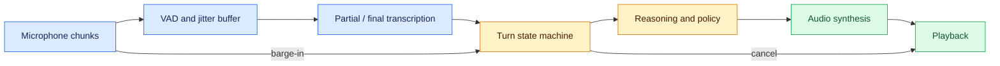
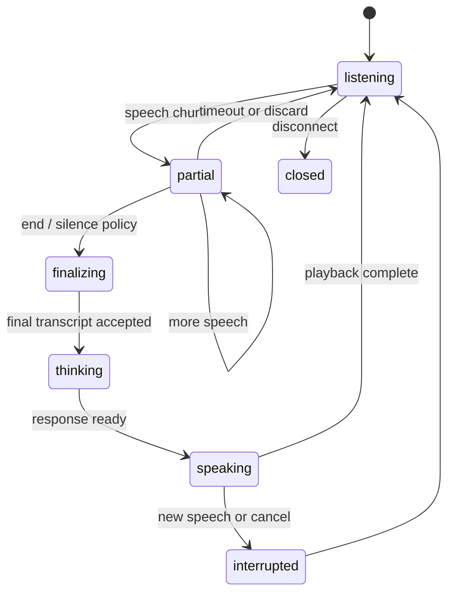

# Streaming speech

Status: draft — expansion and review pending
Sources: [Google DeepMind model cards — 2026-04-15](https://deepmind.google/models/model-cards/)

## In one sentence

Streaming speech is an event pipeline that must manage audio chunks, partial recognition, turn boundaries, interruption, and output playback without confusing an in-progress utterance for a completed request.

## Draft lesson

Unlike batch transcription, a live voice system continuously decides whether incoming audio is silence, a partial utterance, a completed turn, or an interruption. Voice activity detection (VAD) proposes speech boundaries; it is not an authority on conversational intent. A client should attach a session ID, sequence number, capture time, codec, and end-of-stream event to every audio path. The server should make its state observable: listening, partial, finalizing, thinking, speaking, interrupted, or closed.

The April model-card index records a Gemini 3.1 Flash Audio update on April 15, 2026. This is a release/index fact; it does not establish a universal latency or reliability guarantee. The engineering lesson is to set a budget for microphone buffering, network jitter, transcription partials, model first token, and synthesized audio. Measure end-to-end time from speech onset to audible response, not only model latency.

For barge-in, cancel or duck playback when fresh user speech crosses a configured threshold, preserve the last committed turn, and label any discarded generated audio. Never execute a payment, booking, or account change from an unstable partial transcript. Ask for a typed confirmation after the final transcript and authorization checks.

## Build direction

Implement a finite-state machine with tests for: silence, a final turn, audio arriving out of order, an interruption during playback, duplicate end-of-stream, and reconnect after a network break. Keep captions and audio outputs separately versioned so an accessibility fallback can show what the system believed it heard.

## Background: what existed before

Batch speech-to-text has a simple interface: upload a completed recording and receive a transcript later. It works for meeting notes and call archives because the user has already finished speaking. Interactive voice is different. The application must receive an endless sequence of small audio packets, decide when an utterance starts and ends, give useful partial feedback, and sometimes speak while the user begins a new turn. The interface is a distributed state machine with human expectations attached to every transition.

Voice activity detection is often the first component. It classifies a short audio window as likely speech or non-speech. It can reduce wasted compute and suggest a turn boundary, but a pause is ambiguous: a caller may be thinking, a network may have dropped packets, or the caller may be interrupted by the assistant. Treat VAD output as one event in a policy, not as proof that the user has completed a request.

## What changed this month

The Google DeepMind model-card index lists Gemini 3.1 Flash Audio (Flash Live, TTS) with an April 15, 2026 update. This is a narrow source fact about the index. The lesson does not infer feature availability, quality, pricing, or suitability for a particular account from that listing. The month matters because it puts real-time audio interfaces alongside April's other multimodal systems: inputs arrive over time, and timing is part of correctness.

## Impact on current processing and architecture

Build an explicit event contract. Audio events should carry `session_id`, monotonically increasing `sequence`, capture timestamp, encoding, sample rate, and byte count. Control events should include `audio_started`, `audio_ended`, `cancel_playback`, `final_transcript`, and `session_closed`. An event may be duplicated after reconnect; a consumer needs idempotent handling keyed by session and sequence. Store only the retention-allowed portion of raw audio, while retaining redacted timing and state metadata for debugging.

Separate provisional and committed state. A partial transcript can update captions but must not start a side effect. A final transcript may be sent to an understanding model, yet a high-impact instruction still needs application confirmation and authorization. A generated response may be ready as text before speech synthesis starts. Keep text, audio, and UI state linked by response ID so an interruption can identify exactly which output was discarded.



Latency needs a budget, not an aspiration. Break end-to-end time into capture-window delay, network jitter, buffering, transcription partial/final delay, model first-token time, response completion, synthesis, and playback queueing. Measure p50 and p95 for each component and the whole path. A fast model can still feel slow when a client waits too long to finalize a turn; a responsive first token can still be unusable when synthesized speech is queued behind an old response.

## Real-world applications and constraints

Customer support is a useful low-risk starting point: stream captions, propose a knowledge-base answer, and let the user see or hear it. The system must disclose recording behavior, observe consent and retention rules, and provide a text path for accessibility or noisy environments. A partial transcript can be incorrect for names, numbers, negation, or a technical identifier, so it should never silently change a ticket or account.

For a hands-free field workflow, a worker may say “mark this gauge as unsafe.” The pipeline should capture the utterance, bind it to the current equipment and authenticated operator, show a confirmation, and create a ticket only after a final confirmation. The voice model does not own the worker's identity or the authority to change an asset state. If connectivity drops after the confirmation but before the ticket receipt, reconcile using an idempotency key rather than creating another alert.

Accessibility is an engineering constraint, not a feature flag. Users may need captions, keyboard control, slower playback, a repeat control, or an alternative input method. Regional accents, code switching, background noise, assistive devices, and speech differences affect both transcription and VAD. Evaluate the system with representative consenting data and provide a reliable fallback when confidence is low.

## Mental model: a turn is a lease on shared state

Model a turn as a lease. It begins when the server accepts a speech-start event, can receive partial updates, and either commits a final transcript or expires/cancels. Output playback has a related lease: it belongs to one response and can be cancelled by new user speech or an explicit UI action. This prevents an old answer from continuing after the conversation moved on.



The state machine should return typed outcomes: `partial`, `final`, `interrupted`, `stale_sequence`, `timeout`, `unavailable`, and `needs_confirmation`. Avoid representing all of these with an empty string or a generic error. Typed states let a UI show captions, preserve the final user request, cancel stale audio, and truthfully explain that an action was not executed.

## Engineering consequence

Use sequence and correlation IDs end to end. The client sends audio sequence 41; the transcription service emits partial revision 3; the reasoning request includes final transcript revision 7; the synthesizer returns response ID 88; the playback client records whether 88 completed or was interrupted. A trace can then answer whether a complaint came from capture, recognition, conversation policy, model latency, synthesis, or device playback.

Backpressure is mandatory. Cap buffered seconds per session, max active sessions per tenant, maximum transcript size, and response duration. When overloaded, prefer a typed degraded experience such as “caption-only” or “please repeat after a short delay” over accumulating unbounded audio. On reconnect, choose one clear policy: resume from a persisted final turn, or ask the user to repeat. Do not merge uncertain partial buffers from two connections.

## Limits and failure modes

**False endpointing:** VAD ends a turn during a natural pause. Control it with a configurable silence window, client push-to-talk option, and a UI that lets the user continue or edit before high-impact operations.

**Barge-in race:** playback starts just as new speech arrives. Give speech-start/cancel events priority, tag playback by response ID, and make cancellation idempotent.

**Out-of-order or duplicate packets:** mobile reconnects and transport retries are normal. Reject sequences older than the committed watermark and safely ignore duplicates.

**Transcript hallucination or ambiguity:** a final transcript can still be wrong. Display it for confirmation where appropriate; validate identifiers against authoritative systems instead of trusting phonetic text.

**Privacy leakage:** raw audio can contain more personal information than a transcript. Minimize storage, apply access controls, and redact operational logs.

## Packet handling, confirmations, and evaluation

Audio transport has its own contract. A mobile client may send 20-millisecond chunks while a browser sends a different frame size; a gateway should normalize or explicitly reject unsupported formats before the recognizer sees them. It should bound a jitter buffer by duration as well as bytes. When packets are missing, do not invent time by concatenating adjacent chunks without recording the gap. A recognizer may produce a usable partial after loss, but the event trace needs to show degraded input quality so downstream policy can choose a safer route.

Use one canonical clock for server decisions and retain the device capture time as diagnostic metadata. Client clocks drift. A client timestamp can help diagnose a poor network path, but it should not let a client claim that an expired action is current. On a reconnect, rotate the connection ID while retaining the conversation session ID; this makes it possible to reject late packets from the old connection without discarding a safely committed final turn.

Confirmation deserves its own UI contract. Read back the material parameters—recipient, amount, date, or asset—and require a final confirmation that binds to those values. A bare “yes” after a long spoken conversation is ambiguous if the model has just summarized a different interpretation. Store a confirmation digest and expiry; invalidate it if the request parameters, authenticated actor, or authoritative price changes. Send the effect through an idempotent command owner, then return the owner’s receipt rather than a generated assurance.

Evaluate transcription quality separately from interaction quality. A word-error score may hide unstable partials that constantly rewrite captions, aggressive endpointing that cuts speakers off, or barge-in cancellation that takes too long. Build replay sessions with silence, overlap, background noise, code words, numbers, mid-turn corrections, and a user who interrupts twice. For each, assert the expected terminal state and whether a side effect was prohibited. Human evaluation should include accessibility users and should inspect frustration-inducing transitions, not only final transcript text.

Capacity planning requires session admission and fair scheduling. Reserve enough output and model capacity for active turns, cap a single tenant's concurrent streams, and make an overload message short and deterministic. Queueing raw audio behind an overloaded model can turn a realtime system into a delayed surveillance recording. If the system cannot respond within its interactive deadline, close or downgrade the turn with an explicit status and preserve the user's option to continue in text.

Treat language and locale as input metadata, not a guess hidden in a model prompt. The selected locale, vocabulary hints, and accessibility preferences should be traceable and editable by the user. A correction to one turn must not silently alter the transcript or authorization context of another session.

## Build it locally

Save this dependency-free example as `turn_state.py`, then run `python3 turn_state.py`. It demonstrates event ordering and an interruption, not audio recognition.

```python
from dataclasses import dataclass

@dataclass
class Session:
    state: str = "listening"
    last_sequence: int = 0
    response_id: str | None = None

def handle(session, event):
    if event["sequence"] <= session.last_sequence:
        return {"status": "stale_sequence"}
    session.last_sequence = event["sequence"]
    if event["type"] == "speech":
        if session.state == "speaking":
            session.state, session.response_id = "partial", None
            return {"status": "interrupted"}
        session.state = "partial"
        return {"status": "partial"}
    if event["type"] == "end" and session.state == "partial":
        session.state = "thinking"
        return {"status": "finalize_turn"}
    if event["type"] == "response":
        session.state, session.response_id = "speaking", event["response_id"]
        return {"status": "speaking"}
    return {"status": "ignored"}

s = Session()
assert handle(s, {"type": "speech", "sequence": 1})["status"] == "partial"
assert handle(s, {"type": "end", "sequence": 2})["status"] == "finalize_turn"
assert handle(s, {"type": "response", "sequence": 3, "response_id": "r1"})["status"] == "speaking"
assert handle(s, {"type": "speech", "sequence": 4})["status"] == "interrupted"
print(s)
```

1. Add a silence timeout event and decide whether it commits or discards the partial turn.
2. Add a duplicate sequence and assert the state does not change.
3. Add a `confirm_action` event that requires a committed final transcript and authenticated user.
4. Record transition metrics by state and reason code.
5. Add a caption-only overload mode that never queues unbounded audio.

## Mini exercise (15–30 min)

Design a voice booking request with the states listening, partial, final, confirmation, booked, and interrupted. List which fields come from the session, which come from final transcription, and which must come from the authenticated booking service. Define what happens if audio disconnects after confirmation but before the booking receipt arrives.

## Interview Q&A

**Why is VAD not enough to end a turn?** It detects acoustic activity, not user intent. A pause can be hesitation, network loss, or a point where the user expects interruption.

**How do you prevent a barge-in race?** Give new speech priority, cancel output using a response ID, and make both cancellation and duplicate events idempotent.

**What should be measured?** End-to-end speech-onset-to-audible-response latency, partial stability, endpoint errors, interruption latency, stale-event rate, fallback rate, and action-confirmation failures.

**Can final transcription authorize a payment?** No. It is untrusted input. The application still authenticates the user, validates current state, asks for a clear confirmation, and executes idempotently.

## Glossary

- **VAD:** voice activity detection, a classifier for likely speech versus non-speech.
- **Barge-in:** new user speech that interrupts system playback.
- **Partial transcript:** a provisional recognition result that can change.
- **Endpointing:** deciding an utterance has ended.
- **Jitter buffer:** short queue used to smooth irregular packet arrival.
- **Turn lease:** bounded ownership of a conversation state transition.

## References

- [Google DeepMind model cards](https://deepmind.google/models/model-cards/)
- [April 2026 learning map](README.md)

## Claim ledger

| Claim | Source | Fact or inference |
|---|---|---|
| The Google DeepMind model-card index lists Gemini 3.1 Flash Audio with an April 15, 2026 update. | [Model cards](https://deepmind.google/models/model-cards/) | Fact, vendor index |
| A live voice service needs explicit turn and interruption state. | Systems-design reasoning | Inference |
