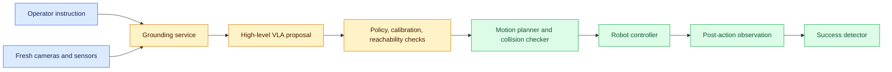
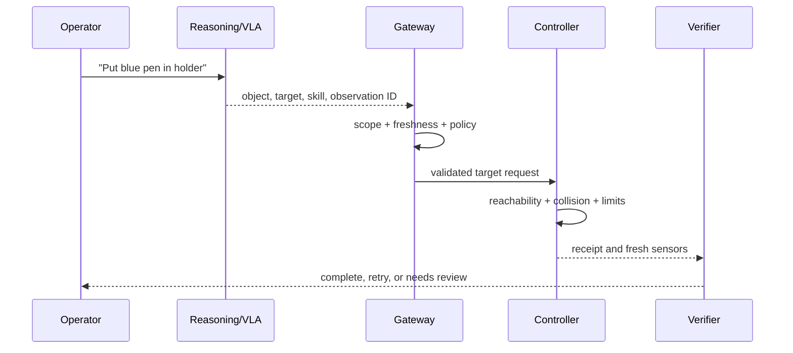

# Vision-language-action

Status: draft — expansion and review pending
Sources: [Google DeepMind — 2026-04-14](https://deepmind.google/blog/gemini-robotics-er-1-6/)

## In one sentence

A vision-language-action system turns a grounded instruction and current perception into a proposed action, but a separate controller must validate reachability and safety before motion.

## Draft lesson

A VLA stack spans different time scales. Perception produces object locations and uncertainty; a high-level model selects a task or target; low-level control converts that target into joint trajectories and enforces limits. Do not collapse these into a single “robot call.” A point in an image is not a gripper pose, and a gripper pose is not permission to move.

The April robotics announcement describes Gemini Robotics-ER 1.6 as a high-level reasoning model that can call VLAs and other functions. That is a vendor capability statement. In an implementation, bind a proposed action to the current observation ID, calibration version, robot identity, workspace policy, deadline, and dry-run result. Re-read sensors after movement and make success detection a new observation, not a model memory.

Useful initial workloads are advisory: identify an object, propose a pick point, or create a simulated motion plan. Gate physical actions behind collision checking, speed limits, emergency stop ownership, and a human review threshold. Test occlusion, moving targets, confusing objects, calibration changes, and a command that becomes stale while waiting in a queue.

## Claim ledger

| Claim | Source | Fact or inference |
|---|---|---|
| Google DeepMind describes the announced model as a high-level robotics reasoning model able to call VLAs or user-defined functions. | [Announcement](https://deepmind.google/blog/gemini-robotics-er-1-6/) | Fact, vendor claim |
| Independent motion and policy checks should own physical actuation. | Systems-design reasoning | Inference |

## Background: what existed before

Industrial robots traditionally receive programs written against a stable cell: known fixtures, calibrated cameras, guarded workspaces, and repeatable parts. Computer vision can add a detection stage, but a conventional integration still needs an engineer to define every coordinate transform and exception path. Natural-language interfaces make the system more flexible—an operator can name an object or goal—but they also introduce ambiguity. “Put that tool over there” has no executable meaning until the software resolves object identity, target frame, and allowed motion.

A **vision-language-action** (VLA) system closes this gap by connecting perception and language to an action proposal. The word “action” is important: a proposal may be a target point, a grasp type, a navigation waypoint, or a request to call a low-level skill. It should not be a direct motor command. The controller that owns motors needs current joint state, collision geometry, speed and force limits, tool configuration, and an emergency stop. These authoritative values cannot safely come from a model response.

## What changed and why now

Google DeepMind's April 14 announcement describes Gemini Robotics-ER 1.6 as a high-level reasoning model for robotics that can call vision-language-action models and user-defined functions. It also describes visual and spatial understanding, task planning, and success detection. Those are vendor statements about the release. The broader engineering change is a practical separation of responsibilities: an embodied reasoning component can interpret a scene and select a skill, while deterministic components preserve the physical safety contract.

This separation helps an SDE explain failures. If a requested action cannot be executed, the cause may be object detection, reference resolution, camera calibration, inverse kinematics, collision planning, safety policy, queue delay, or a failed actuator. Calling every failure “the robot model was wrong” hides the component that needs repair.

## Impact on current processing and architecture

Represent every action proposal as a typed object. At minimum include task ID, robot ID, source observation IDs, source calibration version, target object ID, target frame, requested skill, constraints, expiry, and reason code. The gateway binds tenant, authenticated operator, and workspace policy. The motion planner resolves any image-space point into a physical frame only after verifying that the calibration is current.



Each boundary has a different validation job. Grounding checks that “blue pen” maps to one object candidate or asks for clarification. Policy checks whether the operator may use this robot and workspace. Reachability checks that a target pose has a valid path. Collision checking considers the current environment. The controller enforces real-time limits. Success detection consumes post-action evidence rather than trusting that a dispatched command completed.

## Real-world applications and constraints

Start with advisory behavior: identify a part, point to a likely grasp region, or produce a simulated trajectory for a trained operator. These workflows provide useful data about ambiguity and failure without giving the model authority to move hardware. A next step can be low-speed motion inside an empty, geofenced test cell with an operator present. Production manipulation around people, liquids, sharp tools, or uncontrolled inventory requires a documented safety case and independent protections.

Latency affects safety. A target calculated from a frame may be invalid by the time a motion planner receives it. Give proposals an observation age and expiry, invalidate them after scene change, and acquire a new observation before any consequential step. Do not solve this by letting a queue replay a stale action; use a state machine that returns `stale_observation` or `replan_required`.

## Mental model

Treat a VLA as a planner that proposes a constrained next state transition. The model is valuable for mapping an ambiguous instruction and scene into a candidate skill. The rest of the system proves whether that skill is allowed and feasible now. A high model confidence does not replace a collision check.



## Engineering consequence

Instrument the proposal-to-effect chain. Record observation digest, candidate objects, selected object, policy result, planner result, controller receipt, post-action state, and reason for every rejection. Protect raw imagery according to retention policy, but retain enough IDs and metrics to reproduce a failure. Monitor calibration mismatch, stale-proposal rejection, no-path rate, emergency-stop events, success false positives, and human overrides.

Use a command queue only between validated stages. Commands need a unique ID and idempotency behavior; a robot controller must not execute the same physical command twice after an uncertain network response. On controller timeout, query robot state or receipt before retrying. If state cannot be reconciled, enter a safe hold and require operator takeover.

### Coordinate frames and action contracts

Much of VLA integration fails at the boundary between semantic and geometric representations. The reasoning component may return “grasp the handle at this point,” perhaps as normalized image coordinates. The controller needs a target in a robot-base or tool frame, with units, orientation, tolerance, and an uncertainty bound. A transformation service uses camera intrinsics, camera-to-robot extrinsics, depth or scene geometry, and calibration version to make that conversion. If one required measurement is unavailable, it should return `cannot_project_target`; estimating a three-dimensional pose from an unverified two-dimensional point can be hazardous.

Include frame names in every API payload. `camera_front`, `camera_wrist`, `robot_base`, and `tool_tip` are not interchangeable. Include a convention for axes and units, because millimeters versus meters can turn a small interface mismatch into a collision. Version transformations and invalidate cached targets when calibration changes. In a test system, deliberately swap two frame names or scale a coordinate by one thousand; the controller should reject the request before motion planning.

Action contracts also need bounded semantics. Prefer `inspect_target`, `point_at_target`, `simulate_pick`, and `request_pick_review` over one unrestricted `move_robot` tool. A narrow tool definition tells the planner what it can propose and tells the controller what it must validate. It allows different approval policy for a camera move, an empty-cell demonstration, and a real pick. Tool outputs should be typed too: `accepted`, `no_path`, `collision_risk`, `stale_scene`, `blocked_by_policy`, or `unknown_execution`. Natural-language explanations can accompany those states but should not replace them.

### Evaluation and rollout

Evaluate a VLA system as a chain. Grounding tests ask whether the correct object and relation were selected from a labeled scene. Projection tests ask whether a known camera point maps to the expected physical target under a known calibration. Planner tests ask whether safe and unsafe trajectories are classified correctly. End-to-end tests ask whether the desired state was achieved and whether unsafe or ambiguous cases stopped. Keep the evaluator independent from the planning model and include hard negatives: a similar-colored object, a target behind a barrier, an instruction that conflicts with workspace policy, and a success state that only looks complete from one camera.

Roll out in stages. First replay recorded scenes and compare proposals with expert labels. Next use a digital twin or hardware-in-the-loop test cell with no valuable inventory. Then permit advisory output to trained operators. Only after measured performance and operating procedures exist should a narrow autonomous action be enabled, initially with conservative speed and approval limits. At every stage, include a kill switch, a safe idle pose, and ownership for intervention. An increase in task completion does not justify a regression in stop behavior or override rate.

### Data and privacy constraints

Camera feeds can include people, badges, proprietary work, and neighboring tenants. Apply physical and logical scope before imagery reaches a model: choose only required camera views, crop where appropriate, control retention, and protect replay fixtures. Do not reuse a production scene as a casual prompt example. If a vendor service processes imagery, account for the approved data path and retention configuration. The same provenance that helps diagnose an action also helps prove which data was accessed, but logs must avoid becoming an unrestricted image archive.

### A practical incident example

Suppose an operator asks a cell robot to place a blue connector into a fixture. The camera sees two blue connectors. The VLA selects one, but its target comes from a frame captured before a conveyor moved. The gateway should reject the proposal because its observation is expired. If fresh perception still leaves two equally plausible objects, the UI should highlight both candidates and request a selection. If a selected connector is reachable but the planned path crosses a guarded zone, the motion planner returns `collision_risk` and the task remains pending. None of those outcomes should be disguised as model refusal or silent retry.

After a task completes, the verifier checks the connector's physical relation to the fixture using current sensors. If it cannot establish success because the wrist camera is blocked, it returns `needs_review` or requests a new view. This distinction makes operations actionable: a perception owner investigates occlusion, a calibration owner investigates coordinate drift, and a safety owner investigates blocked motions. A single aggregate “robot failed” metric cannot support those decisions.

For capacity, bound concurrent plans and reserve controller bandwidth for safety messages. A delayed planning request should expire before it reaches the controller; sending it faster after a queue backlog is not a safe optimization. Track queue age alongside model latency and include expired proposals in reliability reports. This is how a VLA system behaves like an engineered control loop rather than an impressive but opaque demo in a changing physical environment.

## Limits and failure modes

**Reference ambiguity:** two blue objects exist. Return candidates or request clarification; never choose by convenience for a destructive action.

**Calibration mismatch:** a valid pixel point maps to the wrong physical point. Require calibration version and fail closed after replacement or drift detection.

**Occlusion and motion:** the target disappears after planning. Re-observe and replan; do not execute an old trajectory.

**Skill overreach:** a broad “move” interface allows unsafe targets. Expose narrow skills with explicit constraints and side effects.

**False success:** the controller finished a trajectory but the task did not complete. Use independent post-action predicates and retry limits.

## Build it locally

Save as `vla_gate.py` and run `python3 vla_gate.py`. It demonstrates a proposal boundary, not robot control.

```python
def validate(proposal, scene):
    if proposal["observation_id"] != scene["id"]:
        return {"status": "stale_observation"}
    if proposal["object_id"] not in scene["visible_objects"]:
        return {"status": "needs_review", "reason": "object_not_visible"}
    if proposal["skill"] not in {"point", "simulate_pick"}:
        return {"status": "denied", "reason": "skill_not_allowed"}
    return {"status": "accepted", "command_id": "cmd-42"}

scene = {"id": "frame-9", "visible_objects": {"blue-pen", "black-holder"}}
proposal = {"observation_id": "frame-9", "object_id": "blue-pen", "skill": "simulate_pick"}
assert validate(proposal, scene)["status"] == "accepted"
print(validate(proposal, scene))
```

1. Add an expired timestamp and reject it before the skill check.
2. Add an ambiguous object list and return `needs_review`.
3. Add a fake reachability function that denies targets outside a box.
4. Record a command receipt and verify a duplicate command ID returns the same receipt.
5. Add a post-action scene and check an explicit success predicate.

## Mini exercise (15–30 min)

Define `place_object.v1` with source frame, object ID, target frame, speed class, robot ID, expiry, and confirmation requirement. Mark which fields can be model proposals and which must be bound by the gateway or controller. Write one test each for stale frame, inaccessible object, collision, duplicate command, and false completion.

## Interview Q&A

**Why not let a VLA call motor APIs directly?** It has incomplete and potentially stale observations. A controller must enforce current physical constraints and policy.

**What is the difference between task planning and motion planning?** Task planning chooses a high-level step such as pick or place. Motion planning produces a feasible physical trajectory for that step.

**How should a timeout be handled?** Treat the external state as unknown, reconcile from robot telemetry or receipt, and avoid blind retry.

**What is success detection?** Independent evidence that the desired world state was reached, not merely that a command was sent.

## Glossary

- **VLA:** a system connecting visual observations and language to action proposals.
- **Grounding:** resolving words to entities, frames, and constraints in a scene.
- **Reachability:** whether a robot can physically achieve a target pose.
- **Collision check:** evaluation of whether a planned path intersects forbidden geometry.
- **Calibration:** mapping sensor coordinates to physical coordinates.

## References

- [Google DeepMind: Gemini Robotics-ER 1.6](https://deepmind.google/blog/gemini-robotics-er-1-6/)
- [April 2026 learning map](README.md)
