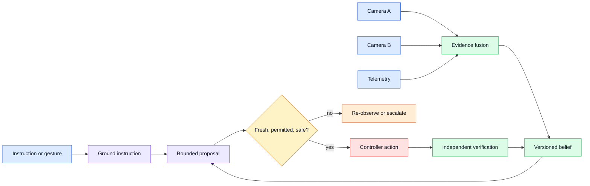
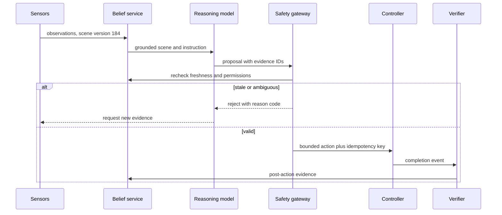

# Embodied reasoning

Status: draft — expansion and review pending
Sources: [Google DeepMind — 2026-04-14](https://deepmind.google/blog/gemini-robotics-er-1-6/)

## In one sentence

Embodied reasoning connects language and visual observations to a changing physical world, so every conclusion must be tied to a viewpoint, time, coordinate frame, and uncertainty state.

## Draft lesson

“Behind the box,” “nearest valve,” and “place it there” are not stable facts without a camera pose and a reference frame. A production embodied agent therefore needs observation provenance: which sensor supplied the image, when it was captured, what calibration was applied, and whether another camera confirms the view. Occlusion and stale observations should produce abstention or re-observation, not an invented spatial answer.

The April announcement highlights multi-view understanding, pointing, and success detection. Its examples motivate an engineering architecture with distinct perception, planning, action, and verification stages. A task only advances when post-action evidence satisfies an explicit success predicate. Logging the planned action is not proof the world changed.

Build a simulated scene with object IDs, locations, camera timestamps, and a command queue. Reject an action derived from a stale frame and test contradictory views. For a physical device, the safety controller must still reject out-of-bounds motion even when a model reports high confidence.

## Background

Earlier physical automation usually divided work between a detector, a pose-estimation service, a planner, and a controller. A detector found a known class, pose estimation located it, a planner selected a predefined movement, and a controller executed the movement. This remains a good architecture because it assigns clear responsibilities. Its weak point is the handoff: recognizing a cup does not resolve which cup a person intended, and finding a route does not prove that the route is still clear.

An embodied system receives partial measurements, not a database row that is permanently current. A camera frame may be delayed; a depth sensor can be occluded; an instrument reading may have units or glare uncertainty. Treat every observation as immutable evidence with a sensor ID, capture timestamp, calibration version, coordinate frame, and quality flags. The application then builds a versioned belief state from that evidence. A belief is allowed to be uncertain. It is not the same as a physical fact.

This distinction is familiar in distributed systems. A planner reads a version of state, proposes an update, and must reject the update if the entity changed before the write. Here the update is physical: the planner reads scene version 184, suggests picking box 7, and a guard must confirm that the box, transform, permissions, and safety envelope still match before execution. A generated sentence should never become an actuator command without this state transition.

## What changed

Google DeepMind's April 14 announcement for Gemini Robotics-ER 1.6 describes enhanced multi-view understanding, pointing, instrument reading, task planning, and task-success detection. These are vendor capability claims, not independent reliability guarantees. The useful systems lesson is that better multimodal reasoning increases the importance of the integration boundary: a product needs to connect model interpretation to guarded action and post-action evidence.

Multi-view understanding helps with perspective ambiguity. A carton can appear behind a tool in one camera and in front of it in another. Pointing helps resolve deictic language such as “this valve.” Instrument reading is not merely OCR: a value needs a range, unit, time, and confidence. Success detection closes the execution loop. A gripper can close without holding an object, a button can be pressed without changing a machine state, and a device can acknowledge a command before the physical effect completes.



## Impact on current processing

Make the physical-world boundary an API boundary. An observation schema should include an observation ID, sensor ID, captured-at time, received-at time, frame ID, calibration ID, scene version, detected entities, and quality flags. Capture time and receive time differ: a camera can promptly send an old cached frame, or a fresh frame can arrive late through a congested network. The action gateway should compare capture age to an action-specific maximum.

Grounding should return candidate object IDs, confidence, and evidence references instead of selecting silently. “The box beside the red bin” can have several matches. If ambiguity remains, ask for another view, a pointing gesture, or user confirmation. A phrase like “the small box” is not a stable actuator target; convert it into an internal ID scoped to the belief-state version used by the planner.

Coordinate frames are separate namespaces. Pixel coordinates, robot-base coordinates, workcell coordinates, and warehouse-map coordinates cannot be mixed. Each transform needs calibration metadata and a validity interval. A correct visual grounding using obsolete calibration can still move equipment to the wrong location. Reject a plan if its transform differs from the active controller transform.



## Real-world applications

In a warehouse, an assistant can turn a spoken request into a pick proposal. The warehouse-management service owns SKU, location, and reservation truth; cameras only establish whether a physical item appears reachable. Movement should be constrained to certified routes, limited around people, and logged with evidence references. Re-observation adds latency, but is usually cheaper than a damaged pallet or an unsafe interaction.

In a laboratory, reasoning can guide sample handling or inspect a panel. Constraints include chain of custody, contamination, instrument interlocks, and regulatory traceability. A model may summarize a protocol step, while the execution system enforces reagent identity, lot number, temperature range, and sign-off. A post-action image alone is not sufficient evidence; pair it with barcode scans and device telemetry.

For accessibility, pointing can make home-device controls less burdensome. The main constraints are consent and reversibility. “Turn that off” might mean a lamp, television, or safety-critical appliance. State the grounded target in plain language, request confirmation for consequential actions, and provide immediate stop or undo where possible.

## Mental model

Think of the model as a skilled dispatcher looking through intermittently updated cameras, not as a robot nervous system. It can synthesize context and nominate a next step. The surrounding application owns the evidence ledger, action permissions, and completion definition. A high-confidence narration has no special authority unless it cites fresh evidence and passes the same gates as every other client.

The useful state machine has more than success and failure. An action begins as `PROPOSED`, becomes `AUTHORIZED` only after checks, becomes `DISPATCHED` when a controller accepts the bounded command, and becomes `VERIFIED` only when independent evidence satisfies the success predicate. It can also become `EXPIRED`, `REJECTED`, `CANCELLED`, or `UNKNOWN`. `UNKNOWN` is essential: if a network timeout occurs after dispatch, the application cannot safely infer either that nothing happened or that the desired outcome occurred. It should query the controller and gather fresh evidence before retrying.

Different action types need different predicates. For a pick, confirmation might combine gripper force, pose, and a new view in which the object is absent from its original location. For a device setting, it might combine a command receipt, an instrument reading within tolerance, and a stable dwell period. For a handoff to a human, it can require an explicit acknowledgement rather than a model's interpretation of body language. Encode these predicates as deterministic code where possible. A model can help propose which evidence to inspect, but it should not be the only judge of whether it succeeded.

Confidence is not a universal safety score. A high confidence from a vision model may describe image classification quality, while a controller needs uncertainty over position, calibration, and collision risk. Preserve the provenance and meaning of each score. Do not average unrelated confidences into an appealing but meaningless number. A good gateway uses hard constraints for non-negotiable rules, calibrated thresholds for empirical signals, and an escalation path for the remaining uncertainty.

Observability is part of the product. A useful trace links instruction, user confirmation, observations, belief version, model output, policy decision, controller receipt, and verification result. Redact sensitive images and audio according to retention policy, but preserve enough hashes and metadata to reconstruct an incident. Dashboards should separate rejection reasons from controller faults and verification failures. Otherwise a rise in “task failures” can conceal whether a camera became stale, a policy correctly prevented risky actions, or a mechanical component degraded.

The same discipline enables gradual rollout. Begin in shadow mode: let the system construct plans and log what it would do without actuating. Compare proposals to operator decisions and label mismatches. Next, permit low-consequence actions in a constrained testbed with a human supervisor. Expand only when evidence coverage, intervention procedures, and failure recovery are demonstrated. Rollback means disabling authority at the gateway, not hoping the model will follow a later text instruction.

## Limits and failure modes

More cameras do not automatically yield truth. Views can share an obstruction, have unsynchronized clocks, or use a common bad calibration. Sensor fusion can also create false certainty when systems treat correlated errors as independent signals. Track sensor health and disagreement rather than requiring a simple majority vote. In environments with people, unexpected motion and changing lighting make any fixed offline dataset an incomplete approximation.

Language grounding has social as well as technical ambiguity. A user might be mistaken about an object's identity, give an incomplete instruction, or change their mind during a multistep task. Preserve confirmation points and permissions for each consequential transition. Never infer that a user has authorized a new target merely because it resembles a previously authorized one.

Finally, a robust safety envelope cannot be delegated to a generative service. Software limits, physical interlocks, workspace fencing, emergency stop hardware, and trained operator procedures remain necessary. The model improves usability and interpretation within that envelope; it is not a substitute for it.

Document the residual risk for every enabled task: which sensors and assumptions it depends on, what evidence can be missing, the maximum consequence of an incorrect action, and exactly who can intervene. This turns a model demonstration into an operable engineering system.

## Engineering consequence

Start with a narrow task contract: a small action vocabulary, bounded workspace, maximum observation age, and explicit success predicates. Name failure states before optimizing success rate: `STALE_OBSERVATION`, `AMBIGUOUS_TARGET`, `CALIBRATION_MISMATCH`, `PRECONDITION_FAILED`, `CONTROLLER_TIMEOUT`, and `VERIFY_FAILED`. Emit every transition with a correlation ID and idempotency key.

Do not send free-form generated text to an actuator. Define a typed action schema, allowlisted verbs, duration and magnitude bounds, and action-specific preconditions. The controller must have an emergency stop and a lease so two agents cannot issue competing commands. Queue requests with idempotency keys; a timeout retry must not press a physical button twice.

Evaluate the complete loop rather than grounding accuracy alone. Test stale frames, occluded targets, duplicate camera messages, contradictory views, delayed acknowledgements, malformed tool calls, and people entering a safety zone. Measure false-success rate, intervention rate, time to safe abstention, recovery time, and the proportion of actions with complete evidence provenance. A model can score well in an offline benchmark while a missing guard makes the deployment unreliable.

## Build it locally

This dependency-free example models an evidence gate. It is deliberately not robot-control code; it shows how an application can refuse stale, ambiguous, or forbidden proposals.

```python
from dataclasses import dataclass
from datetime import datetime, timedelta, timezone

@dataclass(frozen=True)
class Observation:
    scene_version: int
    captured_at: datetime
    targets: tuple[str, ...]

@dataclass(frozen=True)
class Proposal:
    verb: str
    target: str
    scene_version: int

ALLOWED = {"pick", "place", "inspect"}
MAX_AGE = timedelta(seconds=2)

def authorize(proposal: Proposal, evidence: Observation, now: datetime) -> str:
    if proposal.verb not in ALLOWED:
        return "REJECT: forbidden action"
    if now - evidence.captured_at > MAX_AGE:
        return "REJECT: stale observation; re-observe"
    if proposal.scene_version != evidence.scene_version:
        return "REJECT: belief state changed; replan"
    if sum(item == proposal.target for item in evidence.targets) != 1:
        return "REJECT: ambiguous or missing target"
    return "ALLOW: bounded command; require verification"

now = datetime.now(timezone.utc)
fresh = Observation(184, now - timedelta(seconds=1), ("box_7", "bin_red"))
stale = Observation(184, now - timedelta(seconds=8), ("box_7",))
request = Proposal("pick", "box_7", 184)
print(authorize(request, fresh, now))
print(authorize(request, stale, now))
assert authorize(request, fresh, now).startswith("ALLOW")
assert "stale" in authorize(request, stale, now)
```

1. Save the code as `embodied_gate.py` and run `python3 embodied_gate.py`.
2. Change the proposal version to 183 and confirm the version check rejects it.
3. Add a `calibration_id` to both records and reject a mismatch.
4. Persist a JSON decision record containing proposal, evidence IDs, decision, and reason code.
5. Add a simulated verifier that completes a pick only after a newer observation reports the destination state.

## Interview Q&A

**Why is a vision-language model alone insufficient for a physical task?** It interprets incomplete evidence. A production loop still needs deterministic permission checks, coordinate validation, bounded control, and independent verification.

**How do you handle “that box”?** Return candidate internal object IDs with evidence and confidence. If candidates remain, request a gesture, another view, or confirmation.

**What is execution success versus task success?** Execution success means the controller accepted a command. Task success means fresh evidence confirms the intended physical state change.

**How do you make retries safe?** Use an idempotency key, record acknowledgement separately from verified outcome, and query prior state before resending a command.

## Glossary

**Belief state:** A versioned, uncertain interpretation of evidence.

**Coordinate frame:** The origin, axes, and units used to express a position or orientation.

**Grounding:** Mapping language or a gesture to an entity, relation, or action parameter.

**Idempotency key:** An identifier that lets a service recognize a retry and avoid repeating its effect.

**Observation provenance:** Metadata showing sensor origin, time, and transformations.

**Success predicate:** An observable condition required before a task is complete.

## References

- [Google DeepMind, “Gemini Robotics-ER 1.6,” 2026-04-14](https://deepmind.google/blog/gemini-robotics-er-1-6/)
- [NIST, “AI Risk Management Framework 1.0”](https://www.nist.gov/itl/ai-risk-management-framework)

## Claim ledger

| Claim | Source | Fact or inference |
|---|---|---|
| Google DeepMind describes enhanced multi-view reasoning, pointing, and task success detection. | [Announcement](https://deepmind.google/blog/gemini-robotics-er-1-6/) | Fact, vendor claim |
| Spatial conclusions require provenance and post-action verification in production. | Systems-design reasoning | Inference |
