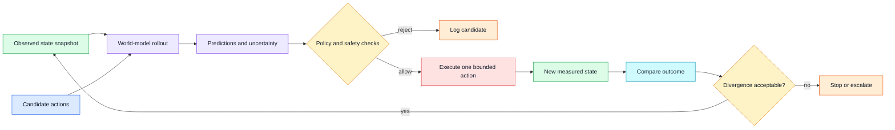
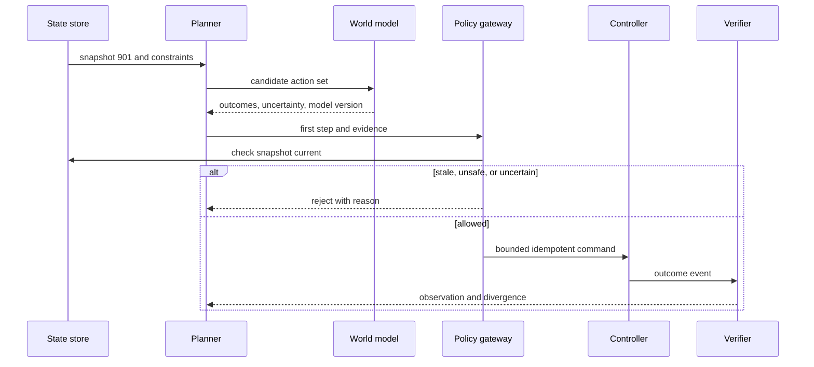

# World models

Status: draft — expansion and review pending
Sources: [Google DeepMind — 2026-04-14](https://deepmind.google/blog/gemini-robotics-er-1-6/)

## In one sentence

A world model predicts possible future observations or task outcomes, letting a planner test candidate actions before spending time, money, or physical safety margin on execution.

## Draft lesson

Software engineers already use test doubles and simulators: a payment sandbox predicts an API interaction without charging a card. A learned world model plays a related role for perception and action, but its predictions are approximate and can drift outside its training conditions. Treat a rollout as a hypothesis, not a receipt.

The April robotics source discusses high-level planning and success detection in an embodied setting. A practical architecture can generate several candidate plans, score them against constraints, execute only one permitted low-risk step, then compare the new observation with the predicted state. Large prediction error is a reason to stop, slow down, or request review.

Record environment version, random seed where applicable, state snapshot ID, action proposal, predicted outcome, observed outcome, and divergence metric. Test the dangerous cases: object missing, altered friction, camera blackout, delayed sensor update, and a plan that is valid only in a stale scene. A simulator can improve planning throughput without granting authority to bypass deterministic safety checks.

## Background

Engineers use predictive models constantly. A unit-test double predicts how a dependency will respond; a capacity model predicts queue growth; a digital twin predicts how a configured system should behave. A learned world model applies the same broad idea to environments whose relevant state is too large or expensive to specify by hand. It maps a current observation or internal state plus a candidate action to possible later states, observations, rewards, or task outcomes.

Classical robotics uses explicit kinematics and physics. Given a joint angle, mass, friction coefficient, and workspace, a conventional simulator can calculate reachable poses and collisions. Such simulators remain the right choice when assumptions are known and assurance matters. Their limits are missing detail: clutter, deformable materials, changing lighting, unknown objects, and people are difficult to encode exactly. A learned model can capture regularities from data, but it inherits data gaps and can produce plausible predictions that are physically wrong.

The important architectural distinction is between a prediction and an observation. A planned state is an expectation. An observed state comes from a sensor, system of record, or measurement with provenance. Never write simulated outcomes into the same field as verified outcomes. Store predicted state, uncertainty, model version, seed, and input snapshot beside the observed result. That lets engineers discover whether a plan succeeded because its model was useful or despite a mistaken forecast.

## What changed

The April Google DeepMind announcement for Gemini Robotics-ER 1.6 describes high-level planning and task-success detection in an embodied setting. It does not establish that the model is a complete physical simulator. The operational lesson is that a reasoning service can propose intermediate outcomes while deterministic services constrain actions and a verifier checks what actually happened.

Instead of requesting a long autonomous script, an application can generate short candidate plans, estimate their effects, select one permitted low-risk step, execute it, and compare fresh evidence to the predicted state. A large difference is a signal to stop, slow down, re-observe, or ask for review. Reality corrects the model frequently rather than only at the end of a long task.



## Impact on current processing

Version world-model input as carefully as any production feature. A rollout should record snapshot ID, observation timestamps, environment and calibration versions, action schema version, model version, sampling settings, random seed where relevant, predicted outcome, uncertainty, and decision policy. Without this record, a divergence report cannot distinguish a changed environment from a changed model or malformed action.

Use typed state at the boundary. Raw images can feed a learned component, but the planner should consume a constrained summary: object IDs, poses, free-space intervals, machine mode, and confidence flags. Actions should be typed too: `move`, `inspect`, `pick`, or `wait`, with bounded parameters. Ordinary code can then validate permissions and numeric limits before execution. The model advises on likely outcomes; it does not widen the authorized action set.

Prediction horizon is a product decision. Long rollouts accumulate error. A short horizon with frequent observation is safer and easier to debug. Receding-horizon control follows this pattern: plan several steps, perform only the first permitted step, observe, and plan again. It costs more sensing and planning work, but new reality quickly replaces speculative state.

Choose divergence measures that match the task. Navigation can use expected pose error and collision status; manipulation can use object identity, grasp status, and destination zone; an instrument can use measured value, tolerance, and settling time. Do not hide these components behind one opaque score. Store each measure and define thresholds for warning, stop, and human review.



## Real-world applications

In warehouse handling, a model can estimate whether a tote is reachable or whether moves will block an aisle. Inventory, reservations, people detection, and speed limits remain external constraints. The model has no authority to override a blocked zone merely because a rollout predicts clearance.

For data-center operations, a world model can be a workload or cooling simulation. It can compare prospective routing or setpoint changes before release. Production telemetry verifies the effect, feature flags constrain blast radius, and automated rollback is based on measured service-level objectives rather than a forecast.

In laboratory automation, a rollout can choose an efficient order or estimate whether an instrument will be ready. Scientific and regulatory constraints require preserving input snapshots, instrument state, and actual measurements. A prediction cannot replace a recorded assay result.

## Mental model

Treat a world model as a weather forecast for the next decision, not a video of the future. A good forecast can help choose an umbrella or delay travel, but it is prudent to look outside and change course when weather differs. The model is an advisory service in a closed-loop control system; the evidence store and verifier remain authoritative.

## Engineering consequence

Define states for `PREDICTED`, `AUTHORIZED`, `DISPATCHED`, `OBSERVED`, `DIVERGED`, and `ESCALATED`. A timeout after dispatch is `UNKNOWN`, not success or failure. Query the controller and gather new evidence before retrying. Attach an idempotency key so a retry cannot repeat a physical or expensive effect.

Start in shadow mode. Generate rollouts and compare them to operator decisions without execution. Then allow a low-consequence task in a constrained testbed with an operator stop control. Monitor calibration drift, divergence distributions, intervention rate, and the share of actions with post-action observations. Roll back authority at the policy gateway, not by asking a model to behave differently in prose.

## Limits and failure modes

A learned model can fail most confidently outside the states represented in its data. Object substitution, altered friction, changed lighting, sensor dropout, and human motion can invalidate a familiar rollout. Two views with a shared bad clock or calibration are not independent evidence. Track sensor health and disagreement explicitly.

Optimization can exploit simulator gaps. A planner might find an action that scores well because the model omitted an important constraint. This resembles a test passing because a mock omitted production behavior. Keep hard constraints outside the model, include adversarial scenarios, and limit actions when uncertainty rises.

Data quality is an operational dependency, not a training detail. Training logs frequently overrepresent routine, successful behavior and underrepresent rare failures because failures are expensive, unsafe, or inconvenient to collect. A model trained on that distribution may predict normal execution very well and provide little warning before an unusual but consequential condition. Maintain a coverage inventory: environments, object classes, sensor quality ranges, action speeds, operator interactions, and known exclusions. When the system encounters an excluded condition, the policy should narrow authority rather than treating an unfamiliar input as ordinary.

Uncertainty estimates have limits too. Some models are uncertain only when their internal output distribution is broad; they can remain confident when an input is far outside training. Build independent guards that do not rely on the same learned representation: range checks, sensor-health monitoring, geometric collision tests, controller feedback, and human approval. This diversity matters because a world model and its perception inputs can fail together. A second service that repeats the same assumption is not a meaningful safeguard.

Cost and latency also shape the design. Generating many long rollouts can consume GPU budget while stale sensor data lowers their value. Set deadlines for planning and use a deterministic fallback—such as hold position, take a new image, or return work to an operator—when the deadline expires. Cache only inputs whose validity conditions are explicit; reusing a rollout after scene state or calibration changes is a correctness bug, not a performance optimization.

Security is part of the environment model. Untrusted sensor messages, corrupted configuration, or a compromised planner can create predictions that look internally consistent. Authenticate device messages, authorize tool calls at the gateway, constrain action payloads, and audit policy changes. Avoid exposing raw operational data to components that do not need it. In high-impact systems, review who can alter the simulator, model version, thresholds, or safety constraints: those changes can be as consequential as an actuator command.

For testing, combine recorded traces with deliberately constructed counterfactuals. Replay an actual task while removing an object, delaying telemetry, changing friction assumptions, or swapping an ID. Assert that the policy rejects, re-observes, or escalates at the expected point. Track failures by component: prediction error, policy rejection, controller failure, verifier failure, and missing evidence. This makes post-incident work actionable instead of attributing every defect to “the AI.”

There is also a human-factors boundary. Operators need to know whether they are seeing measured state, a predicted state, or a recommended action. Use distinct labels and visual treatment; never make a forecast look like a completed operation. Give operators a compact explanation: input snapshot, action considered, predicted effect, uncertainty, and the rule that permitted or rejected it. Explanation is not a substitute for safety, but it makes supervision, debugging, and override decisions faster.

When a prediction is wrong, retain it as evaluation data rather than immediately relabeling it as a defect in isolation. Group divergence by environment, action, model version, sensor health, and severity. A stable rise after a deployment can trigger rollback; a rare cluster in a particular workcell can trigger a local configuration review. This feedback loop is how a world-model feature becomes maintainable software instead of a one-time demonstration.

Set ownership explicitly: one team owns model quality, one owns policy and controller integration, and both share an incident process. An action should remain disabled whenever its verification path, rollback path, or on-call owner is missing.

## Build it locally

This dependency-free example keeps a predicted and observed position separate, then rejects a rollout when the difference exceeds a task threshold.

```python
from dataclasses import dataclass

@dataclass(frozen=True)
class Rollout:
    snapshot_id: int
    action: str
    predicted_x: float
    uncertainty: float

def decide(rollout: Rollout, observed_x: float, limit: float = 0.25) -> str:
    error = abs(rollout.predicted_x - observed_x)
    if rollout.uncertainty > 0.20:
        return "ESCALATE: prediction uncertainty too high"
    if error > limit:
        return f"DIVERGED: error={error:.2f}; stop and re-observe"
    return f"VERIFIED: error={error:.2f}; plan next bounded step"

candidate = Rollout(901, "move_0.5m", predicted_x=1.50, uncertainty=0.08)
print(decide(candidate, observed_x=1.42))
print(decide(candidate, observed_x=0.90))
assert decide(candidate, 1.42).startswith("VERIFIED")
assert decide(candidate, 0.90).startswith("DIVERGED")
```

1. Save the code as `world_model_gate.py` and run `python3 world_model_gate.py`.
2. Add a timestamp and reject a result whose observation is older than your selected freshness budget.
3. Add an action allowlist and a snapshot-version check before the decision function runs.
4. Persist each rollout, observed value, threshold, and decision as one JSON record.
5. Simulate ten readings with random error and plot the fraction that enters `DIVERGED`; adjust the threshold only with a documented task rationale.

## Interview Q&A

**What is the difference between a world model and a simulator?** A simulator commonly uses hand-specified rules; a world model may learn predictive structure from data. Either can be wrong, so neither replaces measurement and safety policy.

**Why execute only the first predicted action?** Prediction error compounds across a rollout. Re-observing after a short action lets the next decision use reality instead of a chain of assumptions.

**How should a system react to divergence?** Preserve the evidence and reason code, stop or reduce authority according to the task risk, collect a fresh state, and replan or escalate. Do not silently continue from a prediction.

**What does model versioning buy you?** It makes outcome changes diagnosable. Engineers can determine whether a divergence followed a model deployment, a changed calibration, or an environmental event.

## Glossary

**Divergence:** Difference between predicted and measured outcome, evaluated using task-specific measures.

**Receding horizon:** Planning several future steps but executing only the first before observing again.

**Rollout:** A simulated or predicted sequence of states following candidate actions.

**Snapshot:** Versioned representation of the input state used to produce a plan or prediction.

**World model:** A model that estimates future observations or state transitions from current state and actions.

## References

- [Google DeepMind, “Gemini Robotics-ER 1.6,” 2026-04-14](https://deepmind.google/blog/gemini-robotics-er-1-6/)
- [Sutton and Barto, *Reinforcement Learning: An Introduction*](http://incompleteideas.net/book/the-book-2nd.html)

## Claim ledger

| Claim | Source | Fact or inference |
|---|---|---|
| The April source describes planning and success detection as relevant robotics reasoning capabilities. | [Announcement](https://deepmind.google/blog/gemini-robotics-er-1-6/) | Fact, vendor claim |
| Predict–act–compare loops are a useful world-model operating pattern. | Systems-design reasoning | Inference |
