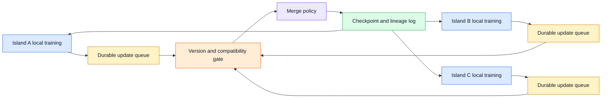
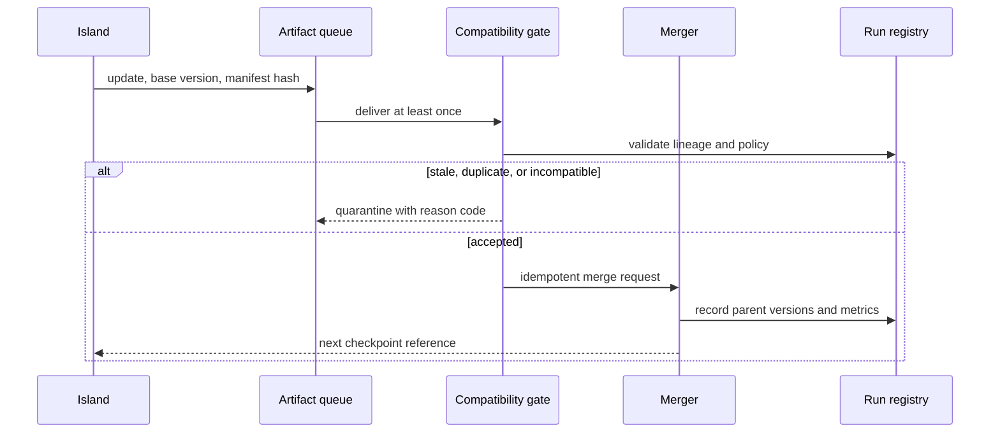

# Asynchronous distributed training

Status: draft — expansion and review pending
Sources: [Google DeepMind — 2026-04-23](https://deepmind.google/blog/decoupled-diloco/)

## In one sentence

Asynchronous distributed training lets compute groups progress with less frequent cross-site coordination, trading strict synchronization for staleness management, fault isolation, and measured convergence.

## Draft lesson

Traditional large training jobs synchronize workers tightly: each step often waits for peers. This is efficient in one fast cluster but makes a slow or failed worker expensive. The April Decoupled DiLoCo announcement describes compute “islands” with asynchronous data flow so local disruptions do not stop all training. That is a vendor research claim; convergence and quality must be measured for a particular workload.

For systems design, define the unit of exchange, its version, arrival deadline, and merge rule. A receiving island needs to know how old an update is and whether it was built from compatible weights, tokenizer, optimizer, and data policy. Queue updates durably, deduplicate them, and record merge lineage. Do not treat an eventually delivered gradient or model delta as automatically safe to apply.

Track step age, island availability, communication bytes, merge lag, loss curves, checkpoint recovery time, and validation quality by data slice. Inject a slow link, lost island, duplicated update, and incompatible version. A resilient job is not merely one that stays running; it must preserve a useful and reproducible training trajectory.

## Background

Synchronous data-parallel training normally has a barrier at each training step. Workers compute local gradients and exchange or reduce them before everyone advances. This is attractive in a tightly connected cluster because every worker uses the same model version and the optimizer state has a simple history. Its availability cost is the slowest participant: a straggling accelerator, network pause, or failed host can leave expensive peers waiting.

Distributed training across regions, organizations, or unreliable capacity changes that trade-off. Communication is slower and failures are normal rather than exceptional. An asynchronous design allows a local group, or island, to make progress and exchange model information later. That creates a queueing problem as well as an optimization problem. An update can be late, duplicated, incompatible, or computed from parameters that no longer resemble the receiver's current state.

The April Decoupled DiLoCo announcement describes decoupled compute islands and asynchronous data flow. This is a vendor research claim rather than a universal convergence guarantee. The engineering value is a useful architecture pattern: isolate local work, define an exchange contract, and make age, lineage, and recovery visible instead of pretending a geographically distributed job has one global clock.

## What changed

The core change is moving some coordination from a strict per-step barrier to a controlled asynchronous exchange. A worker group can train locally, publish a delta or checkpoint-derived artifact, and later merge compatible work from peers. This can reduce the blast radius of one slow island and permit useful work during network interruptions. It also means results must be evaluated under the actual data distribution, optimizer settings, topology, and failure schedule; uptime alone is not training success.



## Impact on current processing and architecture

Define the exchange unit before choosing a transport. It might be gradients, parameter deltas, optimizer summaries, periodic checkpoints, or a higher-level aggregate. Every unit needs a unique update ID, origin island, base model version, tokenizer and configuration fingerprint, data-policy version, local step range, creation time, checksum, and a payload location. A receiver cannot safely merge an update merely because it arrived successfully.

Use durable queues with at-least-once delivery assumptions. Deduplicate by update ID, verify checksums, and make merge operations idempotent. Separate receipt from acceptance: receipt means the artifact was stored; acceptance means compatibility and age checks passed. An update that is too stale can be rejected, downweighted, or routed to offline analysis. Never silently apply it just to keep queue latency low.

Staleness is multi-dimensional. Step age measures how far the origin model was behind; wall-clock age reflects communication delay; data age reflects whether the originating dataset policy is still valid. A small step difference can still be unacceptable after a tokenizer, safety filter, optimizer, or loss-function change. Publish an immutable run manifest and require exact compatibility for changes that alter parameter meaning.



Checkpointing becomes a recovery protocol. Store model weights, optimizer state when required, scheduler state, RNG state, tokenizer, code revision, run manifest, and merge lineage. Test a restart from an interrupted exchange, not only a clean periodic checkpoint. A recovered job should reproduce the same configuration and make it obvious which updates were included; otherwise later validation cannot explain a regression.

## Real-world applications and constraints

Compute islands can map to separate clusters, clouds, regions, or capacity pools. The pattern is useful when a global barrier is costly, but it adds storage, observability, and merge complexity. Egress cost and queue retention can dominate savings. Sensitive datasets require that exchange payloads, manifests, and access policies meet the same governance requirements as the primary training data.

For a research team, decoupling lets an experiment continue while a small pool is unavailable. For a production foundation-model program, it demands stronger change control: a seemingly small data-filter update can make two update streams incomparable. Schedule configuration changes at explicit merge boundaries and retain a known-good checkpoint for rollback.

## Mental model

Think of each island as a branch in a carefully governed distributed version-control system, not as an anonymous worker. Branches may progress independently, but merges require ancestry, compatibility checks, conflict policy, and a durable record. A fast merge that loses lineage is not resilience; it is untraceable state mutation.

## Engineering consequence

Monitor island availability, queue depth, update arrival age, merge lag, bytes transferred, rejected-update reasons, loss curves, validation by data slice, checkpoint recovery time, and quality drift after merges. Alert on an increasing stale-update fraction and on a worker that produces unusually divergent deltas. Correlate those signals with code, data, and configuration revisions.

Failure injection should include a slow link, lost island, duplicate delivery, corrupt payload, partial checkpoint write, incompatible manifest, and a merge timeout. Establish the safe response for each case: retry receipt, quarantine artifact, restore checkpoint, or halt a merge. A system that stays running while silently admitting incompatible updates is not fault tolerant.

Convergence is a measured outcome, not an assumption from transport design. Compare an asynchronous run to a controlled baseline using matched data budget, tokenizer, model initialization, optimizer, and validation suite. Inspect not only aggregate loss but also held-out quality by language, task, safety category, and long-tail slice. A lower queue wait time is not a win if rare but important slices regress. Define acceptance thresholds before the run, and retain artifacts necessary to repeat the comparison.

Merge policy is a source of behavior. A simple policy may average deltas; another may weight updates by age, local steps, data volume, or validation signal. Each choice changes optimization dynamics and can create incentive problems when islands have different data distributions. Keep policy code versioned and test it with synthetic updates that are fresh, stale, conflicting, duplicated, and malformed. If a policy downweights an update, log the applied weight and reason so later analysis is possible.

Resource isolation is also necessary. One island with a runaway queue or a corrupted artifact must not exhaust shared storage, bandwidth, or merger capacity. Apply quota limits, backpressure, payload-size limits, and dead-letter storage. Quarantine records should preserve enough metadata for diagnosis while avoiding repeated automatic retries of a known-bad update.

Security and governance remain in scope. Authenticate publishing islands, authorize receivers, encrypt artifacts in transit and at rest, and treat manifests as signed configuration. Training data restrictions can change independently of code; a receiving system must reject an update built under a revoked policy even if its numerical shape appears compatible. Operational resilience without provenance can create a compliance failure.

For rollout, begin with observability-only exchange: publish artifacts and measure delivery, age, compatibility, and simulated merge outcomes without changing the training trajectory. Next merge into a sandbox run, then a low-risk experiment with an explicit rollback checkpoint. Assign an owner for the queue, merger, checkpoint store, and validation decision. A distributed system has no single point of failure only if its operators can still identify and recover every state transition.

## Build it locally

```python
from dataclasses import dataclass

@dataclass(frozen=True)
class Update:
    update_id: str
    base_version: int
    manifest: str
    step_age: int

def accept(update: Update, active_version: int, manifest: str, seen: set[str]) -> str:
    if update.update_id in seen:
        return "IGNORE: duplicate"
    if update.manifest != manifest:
        return "QUARANTINE: incompatible manifest"
    if active_version - update.base_version > 5 or update.step_age > 5:
        return "QUARANTINE: stale update"
    seen.add(update.update_id)
    return "MERGE: lineage recorded"

seen = set()
good = Update("a-17", 100, "run-v4", 2)
old = Update("b-18", 91, "run-v4", 9)
print(accept(good, 102, "run-v4", seen))
print(accept(good, 102, "run-v4", seen))
print(accept(old, 102, "run-v4", seen))
assert accept(old, 102, "run-v4", seen).startswith("QUARANTINE")
```

1. Save this as `async_merge.py` and run `python3 async_merge.py`.
2. Add a checksum and reject a payload whose checksum fails.
3. Replace the in-memory set with a small SQLite table keyed by update ID.
4. Log each acceptance or quarantine decision with update lineage.
5. Add a test that simulates a crash between receipt and merge, then confirm a retry is idempotent.

## Interview Q&A

**Why not make every worker asynchronous?** Less synchronization improves availability but increases staleness and merge complexity. The right boundary depends on network, optimizer, and evaluation behavior.

**What is the most important safety check?** Compatibility. An update must carry enough lineage to prove it was produced from an acceptable model, configuration, and data policy.

**How do you debug regression after a merge?** Compare merge lineage, update age, data slice metrics, configuration fingerprint, and checkpoints. This requires recording them at receipt and merge time.

## Glossary

**Compute island:** A locally coordinated training group that exchanges updates with peers less frequently.

**Idempotent:** Safe to repeat without applying the same logical update twice.

**Lineage:** The parent versions, configuration, and data policy from which an artifact was produced.

**Staleness:** How outdated an update is relative to receiver state or policy.

## References

- [Google DeepMind, “Decoupled DiLoCo,” 2026-04-23](https://deepmind.google/blog/decoupled-diloco/)
- [PyTorch distributed documentation](https://docs.pytorch.org/docs/stable/distributed.html)

## Claim ledger

| Claim | Source | Fact or inference |
|---|---|---|
| Google DeepMind describes Decoupled DiLoCo as dividing training across decoupled compute islands with asynchronous data flow. | [Announcement](https://deepmind.google/blog/decoupled-diloco/) | Fact, vendor claim |
| Versioned updates and convergence monitoring are necessary operating controls. | Systems-design reasoning | Inference |
