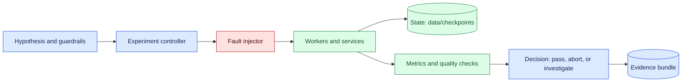
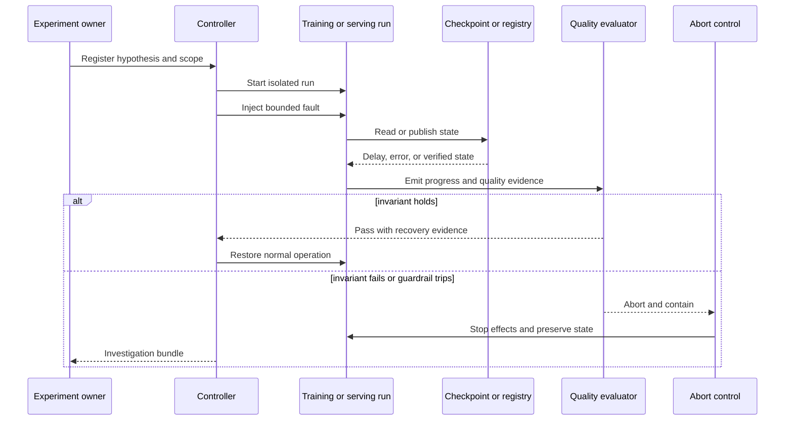

# Chaos engineering for ML
Status: emerging
Sources: [Google DeepMind — 2026-04-23](https://deepmind.google/blog/decoupled-diloco/)

## In one sentence

Chaos engineering for ML deliberately injects realistic faults into data, workers, networks, and dependencies to prove that training or serving degrades safely and recovers with evidence.

## Background: what existed before

Chaos engineering began with a simple operational question: what happens when a production dependency fails at an inconvenient time? Traditional web systems test instance termination, packet loss, overloaded queues, and dependency errors because a green unit-test suite does not prove distributed recovery. Machine-learning systems need the same discipline, but their state is richer. A service may be alive while its feature distribution is wrong, a training worker may reconnect with stale parameters, or a checkpoint may be readable but semantically incompatible with the current optimizer and data plan.

The prerequisites are basic distributed-systems vocabulary and ML lifecycle concepts. A worker is a process that computes a training step or serves inference. A checkpoint is a persisted snapshot of model parameters and related training state. A data manifest identifies the input shards and versions used by a run. A control plane records ownership, policy, scheduling, and lineage; the data plane performs computation. Recovery means reaching a known valid state, not merely restarting a process.

Before chaos testing, teams commonly relied on happy-path integration tests, manual failover drills, and provider availability claims. Those methods can miss timing interactions. A training job might recover from a worker crash but fail when object storage is slow during the same checkpoint window. A serving endpoint might return HTTP 200 while silently using stale features. Chaos experiments make the failure hypothesis explicit, constrain the blast radius, and measure both technical recovery and model-quality consequences.

## What changed and why now

The April source describes a distributed-training architecture intended to tolerate local disruptions and continue useful computation across separated training resources. That is a release-specific vendor claim about the announced design, not independent proof that every workload or deployment will recover safely. The engineering implication is that resilience must be evaluated at the boundary where updates, checkpoints, and data are exchanged.

ML workloads now span accelerators, object stores, feature services, model registries, queues, and regional networks. A fault can affect numerical state as well as availability. If one worker misses updates, the result may still look plausible while diverging from the intended run. If a data shard is duplicated, a metric can improve for the wrong reason. If a registry returns an older artifact, serving may continue with a model that passed an earlier evaluation but violates the current contract.

Chaos engineering therefore changes from “kill a pod and see if Kubernetes restarts it” to “inject a specific fault and verify the invariant that protects users.” The experiment must name the state that may change, the state that must not change, the recovery deadline, and the evidence required to decide whether the hypothesis passed.

## Impact on current processing and architecture

Place fault injection behind an experiment controller with explicit scope. It should select a synthetic tenant or isolated training run, register a hypothesis, inject one fault, observe the run, and automatically stop when the safety budget is exceeded. The controller must not share unrestricted credentials with the workload. Every event carries experiment ID, run ID, component version, fault parameters, and timestamps.



The data plane needs checkpoints with integrity and lineage. A checkpoint record should identify model revision, optimizer state, data manifest, code version, world size or serving topology, and completion status. Write to a temporary object, verify it, then publish an immutable completion marker. A worker must not resume from a partial or unknown checkpoint merely because the object exists.

Training and serving need different observations. Training experiments measure step progress, update freshness, worker membership, checkpoint age, loss, validation slices, duplicate samples, and final artifact identity. Serving experiments measure request success, latency, feature freshness, prediction distribution, fallback rate, and protected-slice quality. Availability alone can hide a silent semantic failure.

## Real-world applications and constraints

For distributed training, inject worker termination, network partition, delayed gradient or parameter updates, accelerator errors, object-storage throttling, and checkpoint corruption. The expected behavior may be to continue with reduced capacity, pause at a safe boundary, or restore from the latest verified checkpoint. Do not assume that continuing is always better: a stale-update merge can produce a completed artifact that should be rejected.

For feature-serving pipelines, deliver stale features, duplicate events, missing partitions, and schema changes to a test tenant. Verify that freshness gates produce an explicit degraded state or fallback, rather than silently treating an old value as current. For model serving, route a small synthetic cohort to an unavailable registry, delayed tokenizer, or overloaded inference worker. Confirm that the endpoint returns a bounded response and that fallback models satisfy the same data and safety contract.

For data governance, inject a deletion request during feature materialization or evaluation-fixture creation. The system should identify derived assets, apply the correct hold policy, and record what cannot yet be deleted. For security, test a compromised worker identity or a forged checkpoint marker only in an isolated environment. The expected result is rejection and an alert, not a more permissive recovery path.

Constraints include cost, experiment risk, privacy, and statistical interpretation. GPU failures can be expensive to reproduce. Production traffic may contain sensitive data and should not be used casually as a test input. Model-quality movement may be noise when the evaluation set is small. Run experiments first with synthetic data, then with approved shadow traffic, and define confidence and sample-size expectations before interpreting results. A passed experiment supports one hypothesis under one topology; it is not a universal reliability guarantee.

## Mental model

Treat a chaos experiment as a controlled scientific test of a state machine. The fault is the intervention, the invariant is the expected safety property, and the evidence bundle is the lab notebook. “The job eventually finished” is an outcome, not an invariant. A useful invariant might be: no unverified checkpoint is published; no sample is counted twice beyond the declared retry policy; no tenant crosses an access boundary; and no serving route emits a result after its feature freshness limit.

Use four layers of protection. The experiment guardrail limits where and how the fault can occur. The system control detects and contains the fault. The recovery path returns to a known state. The evaluation layer checks whether the recovered system still meets its model and business contract. A fault that passes through all four layers is a finding even if infrastructure dashboards remain green.

## What changed this month

The April source gives a timely example of designing distributed training around separation and resilience to local hardware or network disruption. The source fact is limited to the announced architecture and its stated goals. This lesson applies that idea to a broader test program: every resilience claim needs a workload-specific failure hypothesis, a bounded experiment, and independent checks on artifact integrity and model behavior.

The month’s change is also a shift in what counts as recovery. A restarted worker is not enough if it resumes from stale state. A successful API response is not enough if feature freshness or authorization is wrong. Recovery must include reconciliation of state, versions, receipts, and quality measurements. This makes chaos engineering relevant to data and model processing, not only to compute infrastructure.

## Engineering consequence

Create an experiment record with owner, scope, start and stop conditions, fault type, intensity, expected invariant, rollback action, and evidence retention. Use one fault at a time until single-fault behavior is understood. Then test combinations that are operationally plausible, such as a worker loss during checkpoint publication or a feature-store timeout during a model rollout.



Build recovery as explicit transitions: `healthy`, `fault_injected`, `degraded`, `paused`, `reconciling`, `recovered`, and `aborted`. Require a verified state transition before resuming. For asynchronous systems, include duplicate and delayed events in the test; queue ordering is not a proof of exactly-once processing. For model artifacts, verify cryptographic integrity, metadata compatibility, and evaluation identity before promotion.

## Limits and failure modes

### Unsafe blast radius

An injector with broad permissions can become the incident. Use a synthetic tenant, isolated credentials, quotas, and an automatic expiry. The controller should refuse production scope unless the experiment has an approved class and guardrail. Test the abort path before injecting the fault.

### False recovery

A process restart can hide stale state, duplicate updates, partial writes, or missing data. Define recovery evidence before the experiment: checkpoint hash, manifest identity, last committed step, provider receipt, and protected-slice metric. If any required evidence is absent, remain paused or reconciling.

### Quality drift

Loss may improve while a protected slice regresses. Use task-specific evaluation, data-integrity checks, and baseline comparison. Separate statistical noise from a deterministic contract violation such as an invalid schema, unauthorized prediction input, or wrong artifact version.

### Unrepresentative faults

Deleting a worker is easy but may not resemble the failure that matters. Inspect incidents, provider status patterns, queue behavior, and dependency SLOs to select faults. Vary delay, duration, location, and timing around checkpoints. Do not claim resilience to a region outage after testing only a local process kill.

### Recovery storms

Many workers may restart together, overload object storage, or retry the same queue item. Add jitter, bounded retries, admission control, and a recovery budget. Measure dependency load during recovery, not only steady state.

### Data and privacy leakage

Experiment logs can capture prompts, records, feature values, or model outputs. Use synthetic identifiers, field-level redaction, access-controlled evidence, and retention limits. A chaos program must not create a second uncontrolled data pipeline.

### Model and code drift

An experiment result becomes ambiguous when the model, tokenizer, data, runtime, or policy changes. Pin versions and record the full run manifest. Re-run representative experiments after material changes; do not reuse an old pass as evidence for a new artifact.

### Provider-specific behavior

Managed services may retry, buffer, or acknowledge requests differently from a local mock. Record which behavior is simulated and which is observed. Validate critical assumptions with provider documentation and a low-risk integration test. Vendor resilience claims remain claims until the deployment evidence supports them.

## Mini exercise (15–30 min)

Create a local fake training run with three workers and a JSON checkpoint. Inject one worker delay during checkpoint publication. Require an immutable completion marker and abort if a partial checkpoint is selected. Compare the baseline and recovered run IDs, checkpoint hashes, step counters, and validation output. Then add duplicate completion events and prove the controller remains idempotent.

## Build it locally

```python
from dataclasses import dataclass

@dataclass
class Run:
    state: str = "healthy"
    checkpoint: str | None = None
    verified: bool = False

def recover(run, event):
    if event == "worker_lost":
        run.state = "degraded"
    elif event == "partial_checkpoint":
        run.state, run.verified = "paused", False
    elif event == "verified_checkpoint":
        run.checkpoint, run.verified, run.state = "ckpt-7", True, "recovered"
    return run

run = Run()
for event in ("worker_lost", "partial_checkpoint", "verified_checkpoint"):
    print(event, recover(run, event))
```

1. Save the example as `ml_chaos.py` and run `python3 ml_chaos.py`.
2. Add an experiment ID, owner, and allowed scope to each event.
3. Reject a `resume` event unless `verified` is true.
4. Add duplicate and out-of-order events and assert that an unverified checkpoint is never selected.
5. Add a quality threshold and transition to `aborted` when the recovered score is below baseline tolerance.
6. Write the event log to a local JSON file and inspect it for secrets before retaining it.

## Interview Q&A

**What distinguishes chaos engineering from random failure injection?** A hypothesis, bounded scope, guardrails, expected invariant, and evidence-based decision distinguish a useful experiment from random disruption.

**Why is infrastructure recovery insufficient for ML?** The process can restart while model state, data lineage, feature freshness, or artifact identity remains wrong.

**What should happen after a checkpoint timeout?** Treat the state as unknown or partial, stop unsafe resume, and reconcile using integrity and completion evidence.

**Should every fault be tested in production?** No. Begin in an isolated environment and use approved shadow or synthetic traffic. Production experiments require explicit scope and abort controls.

**How do you test a resilience claim?** Translate it into a workload-specific invariant, inject the relevant fault, and measure availability, recovery state, data integrity, model quality, and operational cost.

## Glossary

**Chaos engineering:** Controlled experimentation that tests system behavior under realistic failure conditions.

**Invariant:** A property that must remain true during or after a fault.

**Checkpoint:** Persisted model and training state from which a run can safely resume.

**Manifest:** Versioned description of inputs, artifacts, code, and configuration used by a run.

**Degraded mode:** An explicitly bounded operating state with reduced capability or capacity.

**Reconciliation:** Comparing local records with authoritative external or persisted state before resuming.

**Blast radius:** The systems, users, data, or cost that an experiment can affect.

## References

- [Google DeepMind — Decoupled DiLoCo](https://deepmind.google/blog/decoupled-diloco/) — April source and stated distributed-training resilience goals.
- [Principles of Chaos Engineering](https://principlesofchaos.org/) — experiment discipline and steady-state hypothesis context.
- [NIST AI Risk Management Framework](https://www.nist.gov/itl/ai-risk-management-framework) — risk measurement and governance context.

## Claim ledger

| Claim | Source | Fact or inference |
| --- | --- | --- |
| The April source presents decoupled distributed training as a way to work across separated training resources and tolerate local disruptions. | Google DeepMind — Decoupled DiLoCo | Release-specific vendor claim |
| Chaos experiments should be hypothesis-driven and bounded by safety controls. | Principles of Chaos Engineering | Source-backed engineering practice |
| ML recovery must validate state, lineage, and quality in addition to process availability. | Lesson synthesis | Engineering inference |
| A checkpoint should not be resumed solely because an object exists. | Distributed-state reasoning | Engineering recommendation |
| Synthetic tenants, immutable evidence, and automatic aborts reduce experiment risk. | Lesson synthesis | Engineering recommendation |
