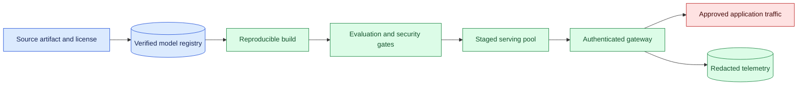
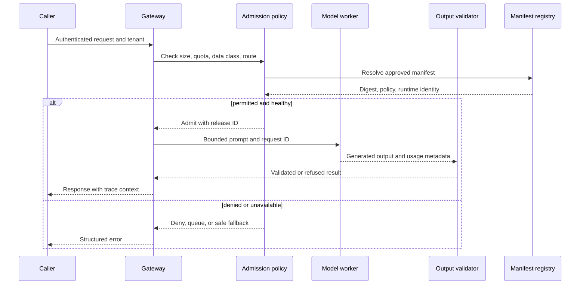

# Open-weight deployment
Status: emerging
Sources: [Google DeepMind model cards — 2026-04-02](https://deepmind.google/models/model-cards/)

## In one sentence

Open-weight deployment moves more of the model lifecycle into an engineering team’s environment: artifact verification, serving, hardware fit, update policy, access control, evaluation, and incident response.

## Background: what existed before

With a hosted model API, the provider operates the model-serving fleet and exposes a contract over HTTPS. The application team still owns prompts, data permissions, output validation, and user experience, but it usually does not choose the GPU kernel, load the model weights, or patch the inference runtime. Open-weight deployment changes that division of responsibility. The operator obtains a model artifact and runs some or all of the serving stack in an environment it controls.

“Open-weight” does not necessarily mean open source, unrestricted use, or permission to redistribute every component. A release may include parameters under a license, a tokenizer, configuration, code, safety guidance, and a model card with limitations. The exact terms must be reviewed before downloading, fine-tuning, exposing, or redistributing the artifact. The model is also not the entire application. A production release includes weights, architecture, tokenizer, quantization, runtime, prompt template, policy, evaluation set, hardware profile, and serving configuration.

The prerequisites are artifact identity, containers, GPU memory, batching, authentication, authorization, and observability. An artifact digest is a cryptographic identifier for the bytes that were reviewed. A model registry stores release metadata and promotes a known version. Inference is the computation that turns inputs into outputs. A gateway is the trusted boundary that authenticates callers, applies quotas and data policy, and forwards only allowed requests.

## What changed and why now

The historical baseline was a managed endpoint or a research checkpoint run by its authors. The April model-card index lists Gemma 4 with an April 2 update; that index entry is a source fact, not evidence that a local deployment has a particular quality, latency, safety, or cost profile. The current engineering change is that capable model artifacts are increasingly available for teams to run, adapt, and place near their data.

Local operation can improve data locality, control over upgrades, and the ability to tune hardware or runtime behavior. It also transfers responsibilities that a hosted provider may otherwise perform: capacity planning, vulnerability response, abuse prevention, model-card review, access logging, evaluation, rollback, and support during incidents. A download that works on a laptop is not a release process.

The relevant unit of change is the reproducible deployment manifest. It should identify the weight digest, tokenizer digest, model configuration, runtime image, accelerator type, quantization, prompt contract, policy version, and evaluation results. If any of these change, the team should know whether the old evidence still applies.

## Impact on current processing and architecture

Use a registry-to-gateway path. The registry verifies and stores an immutable artifact. A build step creates a signed deployment image or environment manifest. A staging worker loads the artifact, runs compatibility and quality checks, and publishes a release candidate. The production gateway admits requests only when the candidate is approved for the caller, data class, route, and hardware.



The gateway should enforce request size, generation limit, tenant, data region, rate, and allowed operations. The model process should run with the least filesystem and network access needed to load its artifact and serve inference. Do not give an inference container credentials for the model registry, deployment control plane, or unrelated data stores after startup. Separate model loading from user request handling so a malformed request cannot rewrite or replace the artifact.

Runtime processing is hardware-dependent. Weight memory, KV-cache growth, batch size, sequence length, kernel support, and concurrency determine capacity. Quantization may reduce memory while changing accuracy or requiring special kernels. Measure time to first token, token generation rate, queue wait, memory pressure, cold start, and error recovery for the exact runtime image and accelerator. A model card describes the model; it does not supply your SLO.



## Real-world applications and constraints

An enterprise may run an open-weight assistant inside a private network so sensitive documents do not leave its boundary. That does not remove privacy obligations: prompts, outputs, traces, caches, and backups still require access and retention controls. A coding assistant can run with repository-read access and a separate reviewed path for writes. A customer-support classifier can use a local model for predictable volume, but it still needs calibration, protected-slice evaluation, and a human escalation route.

An edge device may use a quantized model to avoid sending audio or images to a cloud service. The constraint is limited memory, intermittent connectivity, thermal throttling, and difficult update logistics. A regional service may deploy the same artifact near users to reduce latency, but now it must replicate manifests, monitor drift, and coordinate revocation across regions. A research lab can serve a checkpoint for experimentation while isolating it from production identities and untrusted uploads.

The economics include more than GPU hourly cost. Include storage of multiple artifacts, image build time, idle capacity, patching, monitoring, on-call, energy, egress, failed requests, evaluation, and human review. A local model can be cheaper at high volume but more expensive at low volume because a warm GPU fleet sits idle. Compare cost per accepted outcome and cost per protected request, not only cost per generated token.

Licensing is an operational constraint. Record the license version, attribution requirements, prohibited uses, geographic limits, and obligations for derivatives. Keep a software bill of materials for the runtime and serving image. A community conversion or quantization may carry a separate license and may not preserve the original artifact’s behavior. Do not call a locally measured result a property of the base model without stating the runtime, prompts, data, and evaluation conditions.

## Mental model

Treat an open-weight model as a supply-chain component plus a service, not as a file. The supply chain answers whether the bytes and permissions are known. The service answers whether requests are admitted, processed, observed, and recoverable. A trusted digest without a safe gateway is insufficient; a locked-down gateway serving an unverified artifact is also insufficient.

Use three identities: artifact identity, deployment identity, and request identity. Artifact identity is the exact weights and supporting files. Deployment identity is the runtime image, hardware, configuration, and policy that loaded them. Request identity is the caller, tenant, data class, and trace for one inference. A trace should connect all three without exposing secrets by default.

## What changed this month

The April model-card update gives a concrete release marker for a model family and reminds operators to read release documentation rather than treating all checkpoints as interchangeable. The source establishes the index entry and its date. The deployment controls in this lesson are engineering consequences: local quality, safety, performance, licensing compliance, and availability must be demonstrated in the operator’s environment.

The month’s practical change is responsibility shifting left into the application team. Model selection, image construction, artifact storage, rollout, rollback, monitoring, and incident response become part of the product. Teams gain control over locality and customization but must create evidence that a hosted service might have supplied through its own operational process.

## Engineering consequence

Create a release manifest such as:

```text
artifact_digest: sha256:...
tokenizer_digest: sha256:...
runtime_image: registry.example/inference@sha256:...
quantization: none
hardware: accelerator-class-x
prompt_contract: prompt-v4
policy_version: policy-19
evaluation_run: eval-2026-04-08-3
license_review: approved-42
```

Make the manifest immutable and require a new evaluation record for material changes. Promote through shadow, canary, and broad traffic. During shadow, prevent outputs from triggering effects and account for real compute cost. During canary, compare quality, safety refusals, latency tails, memory, and fallback rate on protected slices. Keep the previous manifest warm enough to roll back or document the time required to reload it.

Treat model loading as a state machine: `downloaded`, `verified`, `loaded`, `health_checked`, `serving`, `draining`, `rejected`, and `retired`. A process should not enter `serving` after only a liveness check. Verify a known prompt contract, output schema, safety route, tokenizer compatibility, and a small runtime smoke test. On an out-of-memory or corrupted-load event, mark the release rejected and preserve logs needed to investigate.

## Limits and failure modes

### Artifact substitution

A mutable filename or tag can point to new bytes after approval. Pin digests, verify signatures where available, and compare the loaded digest with the manifest at startup. Store the verification result in deployment telemetry.

### Runtime mismatch

A tokenizer, tensor-parallel setting, quantization kernel, or model configuration can be incompatible while the process still starts. Run compatibility tests and compare deterministic fixtures. Treat a changed runtime image as a new release candidate even if the weights are unchanged.

### Memory and tail latency

KV-cache growth and long requests can exhaust memory or cause queue collapse. Bound input and output tokens, reserve capacity for protected traffic, apply backpressure, and test mixed lengths. Measure p95 and p99 rather than reporting only average throughput.

### Security exposure

An exposed local endpoint can be scanned, abused, or used to extract sensitive behavior. Authenticate every route, rate-limit, cap expensive requests, isolate management APIs, and log abuse signals. Never assume “internal network” means trusted.

### Model-card overreach

A model card may describe intended use and evaluated limitations, but it cannot prove your prompt template, data, hardware, or user population is safe. Carry source claims as scoped facts and label deployment measurements as local evidence.

### Update and rollback gaps

An update may change refusal behavior, latency, or output structure. Maintain a rollback manifest, migration plan, and compatibility tests. If old and new workers coexist, route by release ID and compare outputs without allowing shadow results to cause side effects.

### License and provenance gaps

Untracked conversions, fine-tunes, datasets, or runtime packages can create legal and security uncertainty. Keep provenance, license review, and SBOM records with the deployment manifest. Stop promotion when required provenance is missing.

## Mini exercise (15–30 min)

Create two local manifest dictionaries for the same model: one approved and one with a changed tokenizer digest. Write a loader that verifies all required fields before entering `serving`. Add fixtures for an out-of-memory result, malformed output, and policy denial. Demonstrate that a changed digest is rejected even when the filename is unchanged.

## Build it locally

```python
import hashlib

def digest(data):
    return "sha256:" + hashlib.sha256(data.encode()).hexdigest()

def admit(manifest, loaded_bytes):
    required = ("artifact_digest", "runtime_image", "policy_version", "license_review")
    if any(not manifest.get(key) for key in required):
        return {"state": "rejected", "reason": "incomplete_manifest"}
    if manifest["artifact_digest"] != digest(loaded_bytes):
        return {"state": "rejected", "reason": "artifact_mismatch"}
    return {"state": "serving", "release": manifest["artifact_digest"]}

raw = "demo-weights"
manifest = {"artifact_digest": digest(raw), "runtime_image": "inference:v1", "policy_version": "p1", "license_review": "ok"}
print(admit(manifest, raw))
print(admit({**manifest, "artifact_digest": "sha256:wrong"}, raw))
```

1. Save the example as `manifest_gate.py` and run `python3 manifest_gate.py`.
2. Add tokenizer and quantization digests to the required fields.
3. Add a `rejected`, `loaded`, and `health_checked` state before `serving`.
4. Add a maximum prompt length and return a structured denial when it is exceeded.
5. Record a redacted release ID, request ID, and reason for every admission decision.
6. Create a second manifest and compare a protected fixture set before allowing a canary.

## Interview Q&A

**Does open-weight mean open source?** No. Weight access, source-code access, redistribution, and permitted uses are separate questions governed by the release terms.

**What must a deployment manifest contain?** At minimum the exact artifact and tokenizer identities, runtime image, hardware or quantization profile, policy, prompt contract, evaluation run, and license decision.

**Why is a health endpoint insufficient?** A process can be alive while loading the wrong artifact, producing invalid output, violating policy, or exhausting memory under realistic context lengths.

**Who owns safety in a local deployment?** The operator owns the deployment-specific controls and evidence, while the model publisher’s documentation remains scoped source context rather than a guarantee for the operator’s system.

**How should an update roll out?** Verify and evaluate it, shadow without side effects, canary protected traffic, compare quality and operational metrics, and retain a tested rollback path.

## Glossary

**Open-weight:** A release that makes model parameters available under stated terms; it does not automatically imply unrestricted use.

**Artifact digest:** A cryptographic identifier for exact file contents.

**Model card:** Documentation describing a model’s intended uses, evaluations, limitations, and other release context.

**Inference runtime:** Software and hardware configuration that loads weights and computes outputs.

**Manifest:** Immutable metadata describing the artifact and deployment contract.

**Canary:** A limited serving cohort used to evaluate a change before broad rollout.

**KV cache:** Stored attention state used to continue autoregressive generation efficiently.

**SBOM:** Software bill of materials listing components in a build.

## References

- [Google DeepMind model cards](https://deepmind.google/models/model-cards/) — April 2026 model-card index and release context.
- [NIST Secure Software Development Framework](https://csrc.nist.gov/projects/ssdf) — software supply-chain and release-process context.
- [NVIDIA Triton Inference Server documentation](https://docs.nvidia.com/deeplearning/triton-inference-server/user-guide/docs/) — serving, batching, and deployment runtime context.

## Claim ledger

| Claim | Source | Fact or inference |
| --- | --- | --- |
| The Google DeepMind model-card index lists Gemma 4 with an April 2, 2026 update. | Google DeepMind model cards | Release-specific source fact |
| Local serving transfers operational responsibilities such as capacity, updates, evaluation, and rollback to the operator. | Systems-design reasoning | Engineering inference |
| A deployment should bind artifact, tokenizer, runtime, policy, and evaluation identity in a manifest. | Lesson synthesis | Engineering recommendation |
| A liveness check alone cannot establish a safe serving release. | Reliability reasoning | Engineering inference |
| Local quality, safety, cost, and latency must be measured in the target topology. | Lesson synthesis | Engineering recommendation |
