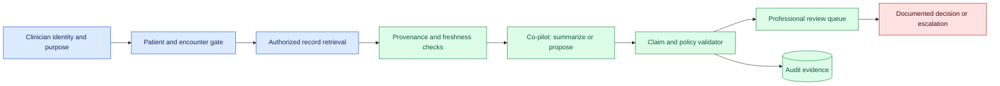
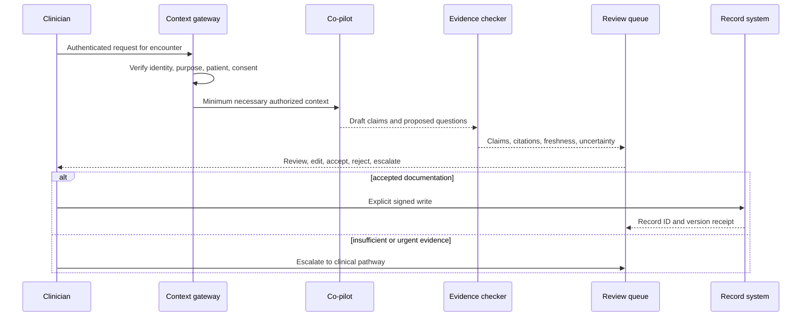

# Clinical co-pilots
Status: emerging
Sources: [Google DeepMind — 2026-04-30](https://deepmind.google/blog/ai-co-clinician/)

## In one sentence

A clinical co-pilot can organize evidence and propose questions or documentation, but patient identity, consent, clinical authority, escalation, and final decisions remain inside accountable healthcare workflows.

## Background: what existed before

Clinical work already uses decision support: clinicians search guidelines, review laboratory results, reconcile medicines, consult colleagues, and document an assessment. These activities are constrained by patient identity, privacy, professional responsibility, and the need to act on evidence that is current for the patient and the setting. A co-pilot adds a probabilistic language or multimodal system that can summarize records, surface possible questions, draft documentation, or suggest a next step.

The word “co-pilot” is useful only if it describes the division of authority. A pilot remains responsible for the aircraft; similarly, an AI assistant should not silently become the decision-maker for diagnosis, prescription, triage, or discharge. A fluent draft can contain a wrong patient, omitted contraindication, or unsupported recommendation. The system should make review easy and make unsafe delegation difficult.

Prerequisites include authentication, authorization, provenance, uncertainty, human-in-the-loop queues, and prospective evaluation. Provenance records where a fact came from and when it was observed. Prospective evaluation tests a system in the intended workflow and population before claiming operational benefit. A safety-critical escalation is a transition to a qualified person or service when the system lacks evidence, detects risk, or reaches its authority boundary.

## What changed and why now

The April 30 Google DeepMind announcement describes AI co-clinician as a research initiative and reports a simulation study involving hypothetical telemedical encounters. Those are source-specific research claims, not evidence of general clinical deployment safety or effectiveness. The engineering question is how to translate a promising research capability into a bounded workflow with consent, privacy, evidence review, monitoring, and a way to stop or correct it.

The historical baseline often separated clinical records from general-purpose chat systems. A co-pilot connected to records, transcription, scheduling, or orders crosses more boundaries. It may process protected health information, infer a patient’s condition from incomplete context, and produce text that is copied into a durable record. The system therefore needs controls both before generation and before any clinical consequence.

The change is not that professional review becomes unnecessary. It is that the review surface must show what the model saw, what it inferred, what evidence supports each claim, what it omitted, and which action is being proposed. Review is a workflow state, not a disclaimer printed below an answer.

## Impact on current processing and architecture

Use a patient-context gateway that resolves identity and purpose before retrieval. Filter records by the clinician’s authorization and the encounter, label source timestamps, and distinguish observed facts from generated hypotheses. The model receives the minimum necessary context. Its output is a draft with claim-level citations and uncertainty markers, not a write operation.



Keep the write boundary separate. A draft note may be stored in a temporary workspace, but copying it into the legal record requires an explicit reviewer action and a record of edits. Medication, referral, and order systems require stronger authorization and often a distinct confirmation. A model should never manufacture an approval by emitting a structured order that downstream code accepts without a professional transition.

Processing must handle incomplete and conflicting records. A lab result can be pending, a medication list can be stale, and a transcription can assign the wrong speaker. The co-pilot should say when evidence is unavailable or inconsistent. Retrieval freshness, source type, encounter, and timestamp belong in the review view. Aggregate answer quality cannot show whether a dangerous omission occurred on a small protected slice.



## Real-world applications and constraints

A documentation assistant can draft a visit summary from a transcript, but speaker attribution and missing information must be visible. The clinician reviews before signing, and the source transcript remains governed separately from the note. A retrieval assistant can surface guideline passages, but it must show version and applicability, and it should not turn a citation into a patient-specific order.

In triage, a co-pilot may ask structured questions or identify symptoms that deserve attention. The system needs a defined emergency path, latency target, language coverage, and a policy for unanswered questions. It must not reassure a patient simply because no high-risk phrase was detected. In care coordination, it can identify missing follow-up tasks, but assignment and completion need a responsible owner and receipt.

For clinical research, a system can help screen records against protocol criteria. Protected health information, consent, cohort definitions, and false-negative review are central constraints. A screen is not enrollment. For medical coding, the model can suggest codes with evidence, but the submitted code remains subject to professional and organizational controls.

Cost and staffing matter. If every suggestion requires a specialist but the queue has no capacity, the system creates hidden risk. Measure review time, edit rate, escalation rate, missed-case rate, and workload by clinic and language. A faster draft that increases documentation corrections or clinician fatigue may not improve care. Plan downtime behavior so the clinical workflow remains safe when the model, retrieval service, or record connector is unavailable.

## Mental model

Think of the co-pilot as a junior assistant whose notebook is always marked “unverified.” It may collect evidence, compare alternatives, and ask useful questions, but a qualified professional owns the clinical transition. The notebook must preserve source citations, timestamps, uncertainty, and corrections. A polished sentence is not a verified observation.

Use three ledgers. The context ledger records which patient data entered the computation. The claim ledger maps each generated assertion to evidence or marks it unsupported. The action ledger records who accepted, edited, rejected, or escalated the proposal and what durable system changed. These ledgers connect quality review to privacy and incident response without requiring hidden reasoning text.

## What changed this month

The source’s April research announcement makes AI co-clinician a timely concept and reports simulated telemedical evaluations. The source fact is limited to what the announcement and its cited research describe. It does not establish that a local deployment is safe, approved, unbiased, or effective for a new patient population. Those claims require independent, prospective evidence and governance.

The engineering consequence is to place the co-pilot inside a staged workflow: shadow or retrospective review, silent prospective observation, limited professional use, and only then any carefully governed action integration. At each stage, define what the model may do and what it must never do. Keep clinical authority with the credentialed workflow rather than with the model output format.

## Engineering consequence

Define a typed proposal schema containing encounter ID, source references, generated claims, missing-data flags, confidence or uncertainty explanation, suggested questions, risk category, model and policy versions, and expiry. The schema should not be accepted by an order API. A separate human action records the reviewer identity, edits, decision, and reason for escalation.

Create protected evaluation slices for wrong-patient context, rare symptoms, contraindications, incomplete records, language variation, age groups, and conflicting measurements. Compare against current clinical workflow, not an imagined perfect answer. Review false reassurance and dangerous omission separately from harmless verbosity. A model can be useful for drafting while unsafe for triage; capability and safety are different claims.

Model lifecycle changes require review. Changing the model, prompt, retrieval index, guideline source, transcription engine, or policy can change the clinical behavior. Pin versions, run regression cases, obtain approval for the intended population, and keep a rollback or disable route. Record source terms, privacy decisions, and any regulatory or institutional review required for the deployment.

## Limits and failure modes

### Wrong-patient context

A correct summary for the wrong encounter is dangerous. Resolve patient and encounter from authenticated context, display identifiers, and require a deliberate confirmation before retrieval. Test merged records, duplicate names, stale browser tabs, and handoffs. A model cannot repair an identity boundary it never receives correctly.

### Omission and false reassurance

Summaries compress. A missing allergy, negative symptom, pending result, or red-flag phrase may alter the decision. Require source links and “not found” or “not assessed” states. Use targeted omission tests and professional review; do not interpret fluent completeness as coverage.

### Unsupported specificity

A model may turn a general guideline into a patient-specific dosage or diagnosis without sufficient evidence. Validate units, ranges, dates, and contraindications with deterministic rules where possible. Route patient-specific treatment proposals to a qualified reviewer and keep the write path separate.

### Stale and conflicting evidence

Guidelines change, records arrive late, and sources can disagree. Show timestamps and source hierarchy. Do not silently choose one result when the conflict is clinically material. Escalate or request clarification, and log which evidence was unavailable.

### Transcription error

Speech recognition can confuse names, numbers, and negation. Treat transcript text as evidence with error risk, not as ground truth. Highlight uncertain spans and require review before durable documentation. Test accents, noise, multiple speakers, and corrections.

### Automation bias

A busy clinician may accept a suggestion because it looks authoritative. Use clear proposal language, require active confirmation for consequential actions, show disagreement and missing evidence, and measure edit and overturn patterns. Interface design is part of the safety control.

### Privacy and secondary use

Prompts and outputs may contain protected health information. Minimize context, encrypt storage, restrict access, define retention, and document whether data may be used for improvement. Do not send records to an unapproved provider or retain raw conversations indefinitely for convenience.

### Distribution shift

A system evaluated on one clinic, language, age range, or simulated case set may behave differently elsewhere. Monitor slices, solicit clinician reports, and pause expansion when uncertainty grows. Prospective validation is a new question after a population or workflow change.

### Downtime and escalation failure

If the co-pilot is unavailable, the clinical process needs a safe manual route. If an escalation queue is full, do not continue presenting a false “review available” state. Show ownership, deadline, and backup pathway. Test outages during realistic workload, not only at idle.

## Mini exercise (15–30 min)

Build a local claim-review queue with synthetic patient records. Give each claim a source timestamp, encounter ID, risk class, and reviewer state. Include a wrong-patient claim, a stale guideline, and a missing citation. Require explicit accept, edit, reject, or escalate transitions and verify that no proposal writes to a simulated record without a reviewer receipt.

## Build it locally

```python
def review(proposal, reviewer, action):
    if proposal["encounter"] != reviewer["encounter"]:
        return {"state": "blocked", "reason": "encounter_mismatch"}
    if not proposal["sources"] and action == "accept":
        return {"state": "escalate", "reason": "missing_evidence"}
    if action not in {"accept", "edit", "reject", "escalate"}:
        return {"state": "blocked", "reason": "invalid_action"}
    return {"state": action, "reviewer": reviewer["id"]}

p = {"encounter": "E-1", "sources": ["lab-7"]}
print(review(p, {"id": "clinician-1", "encounter": "E-1"}, "accept"))
print(review(p, {"id": "clinician-2", "encounter": "E-2"}, "accept"))
```

1. Save the example as `clinical_review.py` and run `python3 clinical_review.py`.
2. Add a patient ID, source freshness, and risk category to the proposal.
3. Reject acceptance when a high-risk proposal lacks a second required review.
4. Add an explicit `record_receipt` step and prohibit direct writes from the model.
5. Create synthetic cases for stale, conflicting, and wrong-patient evidence.
6. Report acceptance, edit, rejection, escalation, and queue-age counts separately.

## Interview Q&A

**Is a clinical co-pilot a clinician?** No. It is an assistive system whose outputs require the authority and accountability defined by the clinical workflow.

**Why distinguish simulated research from prospective validation?** Simulations can test useful behavior, but they may not represent real patients, records, staffing, interruptions, or consequences in the intended deployment.

**What should a reviewer see?** Patient and encounter identity, source citations and timestamps, missing evidence, generated claims, uncertainty, proposed action, and the exact decision choices.

**Should a model write directly to an order system?** Consequential writes should require an explicit, authorized professional transition with a receipt; generated structure alone is not approval.

**How do you test safety?** Use protected slices and realistic workflow cases for omissions, wrong identity, stale data, conflicts, transcription errors, escalation, and downtime, then measure outcomes separately from fluency.

## Glossary

**Co-pilot:** An assistive system that proposes or organizes work while a qualified person retains defined authority.

**Provenance:** Metadata describing a fact’s source, version, timestamp, and transformation history.

**Protected health information:** Health-related information tied to an identifiable person and governed by applicable privacy controls.

**Prospective evaluation:** Testing during the intended future workflow and population rather than only on historical or simulated cases.

**Escalation:** Transfer to a qualified clinical pathway when risk, uncertainty, or authority exceeds the system boundary.

**Automation bias:** Uncritical acceptance of a system suggestion because it appears authoritative.

**Clinical receipt:** Evidence that an authorized reviewer accepted a specific version of a proposal or write.

## References

- [Google DeepMind — AI co-clinician](https://deepmind.google/blog/ai-co-clinician/) — April 2026 research announcement and simulation context.
- [NIST AI Risk Management Framework](https://www.nist.gov/itl/ai-risk-management-framework) — risk, governance, measurement, and accountability context.
- [WHO — Ethics and governance of artificial intelligence for health](https://www.who.int/publications/i/item/9789240029200) — health-AI governance and human oversight context.

## Claim ledger

| Claim | Source | Fact or inference |
| --- | --- | --- |
| Google DeepMind announced AI co-clinician research and described simulated telemedical encounters. | Google DeepMind AI co-clinician announcement | Vendor research claim, scoped to source |
| Simulation results do not establish safety for every clinical population or workflow. | Evaluation reasoning | Engineering inference |
| Patient identity, provenance, escalation, and professional review should be enforced in the workflow. | WHO guidance plus systems design | Engineering recommendation |
| A co-pilot’s ability to draft documentation is distinct from authority to alter care. | Lesson synthesis | Engineering distinction |
| Claim-level citations, protected slices, and explicit receipts improve auditability. | Lesson synthesis | Engineering recommendation |
