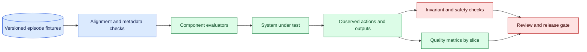
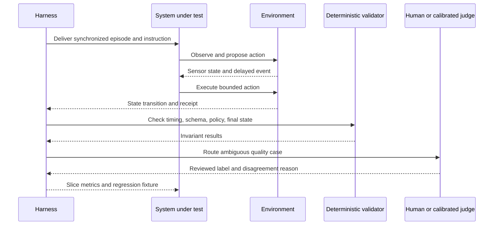

# Evaluation across modalities
Status: emerging
Sources: [Google DeepMind — 2026-04-14](https://deepmind.google/blog/gemini-robotics-er-1-6/)

## In one sentence

Multimodal evaluation checks whether a system reaches the intended outcome under realistic inputs, timing, viewpoints, and safety constraints—not merely whether one model answers a benchmark question.

## Background: what existed before

Text systems often use exact match, classification accuracy, retrieval metrics, or human preference. Vision systems may report detection precision and recall, while speech systems report word error rate. Robotics adds task completion and trajectory safety. These metrics are useful, but they measure different interfaces. A robot can identify a cup while failing to grasp it; a voice assistant can transcribe a sentence accurately while missing an interruption; a video model can label an action while confusing the order of events.

Multimodal means that information from two or more channels—such as text, image, audio, video, depth, or robot state—is processed together or compared across channels. Evaluation must therefore cover both representation and behavior. The prerequisite concepts are a test fixture, a slice, a baseline, a metric, and an invariant. A fixture is a versioned input and expected result. A slice is a meaningful subgroup such as low light, accent, camera angle, or object type. A baseline is the current system against which a change is compared. An invariant is a condition that must hold, such as never moving after a stop command.

## What changed and why now

The April robotics announcement reports vendor benchmark comparisons and notes that its single-view and multi-view success-detection evaluations contain different examples and are not comparable. That disclosure is a source-specific fact and an important evaluation lesson: identical metric names do not imply identical task definitions. The engineering team must record whether examples, viewpoints, environments, sensors, and scoring rules match before interpreting a delta.

The historical baseline treated modalities as separate model benchmarks. Current systems combine a camera, microphone, text instruction, retrieved context, and action policy in one loop. Errors can cross boundaries: a transcription error changes the text plan, a stale frame changes object selection, and an overconfident success detector advances state before the physical action is complete. End-to-end tests expose these interactions while component tests explain their causes.

Evaluation also needs time. A frame can be correct when captured but stale when acted upon. Audio can be accurate but delayed beyond the interruption budget. A system can eventually complete a task while violating a safety deadline. Include timestamps, latency, synchronization, and action windows in the test contract.

## Impact on current processing and architecture

Build an evaluation harness that receives a complete multimodal episode: input streams, timestamps, environment state, system version, actions, and outcome labels. It should run component checks, align channels, execute the system in a simulator or controlled environment, validate safety invariants, and produce slice-level results. Do not let one generative judge replace deterministic checks for identity, timing, collision, authorization, or final state.



An episode manifest should include modality names, source IDs, capture times, synchronization tolerance, environment version, camera or microphone configuration, task instruction, expected outcome, safety policy, and redaction status. The output manifest should include model and policy versions, tool calls, action timestamps, validator results, and final state. This allows a failure to be replayed without relying on an undocumented live environment.

Use a matrix rather than a single score. One axis is modality combination: text-only, image-text, audio-text, video-text, and sensor fusion. Another is condition: normal, occluded, noisy, delayed, missing, contradictory, and adversarial. A third is consequence: informational, reversible action, irreversible action, and safety-critical stop. Report denominators and confidence intervals where appropriate. A high average score can hide a serious protected-slice failure.



## Real-world applications and constraints

In robotics, evaluate perception, grounding, planning, control, success detection, and stop behavior. Test viewpoints, lighting, object arrangement, surface friction, latency, and sensor dropout. Record whether an action was safe even when it failed to complete the task. A missed grasp and a collision are not equivalent errors.

For voice assistants, measure transcription, endpointing, interruption latency, turn-taking, tool authorization, and final task state. Include accents, background noise, overlapping speakers, and network delay. Word error rate alone may improve while the assistant becomes slower or more likely to execute the wrong command.

For video analysis, test temporal order, long gaps, occlusion, frame sampling, and camera changes. A model may correctly identify two objects but invent their interaction. Use event-level labels with start and end tolerances, and separate observation from inference. For image-document workflows, vary layout, handwriting, resolution, language, and missing pages; validate extracted fields against trusted fixtures.

For industrial inspection, evaluate defect detection across production lines and lighting conditions, but also measure false alarms, missed defects, operator workload, and traceability. For accessibility tools, include users with varied speech, vision, motor control, and communication patterns; measure task completion and dignity-relevant failure modes rather than only recognition accuracy.

Constraints include expensive labeling, nondeterministic model output, simulator gaps, privacy, and safety. Build a small high-quality seed set, use synthetic perturbations carefully, and have domain reviewers label disagreements. Keep a holdout set protected from prompt and threshold tuning. Run physical experiments only within a controlled envelope with a human stop path. A simulator can test logic and timing but cannot establish real-world contact physics unless validated for that use.

## Mental model

Think of an episode as a film with synchronized tracks and a contract for what counts as success. Text is one track, images another, audio another, and actions the visible consequence. If the tracks are shifted, evaluation can reward a model for reacting to information it should not yet have. If the ending is labeled only by a generated sentence, the system may claim success without changing the world.

Use two scoreboards. The capability scoreboard asks whether the system recognized, generated, or completed the requested task. The safety scoreboard asks whether it stayed within authority, timing, privacy, and physical boundaries. A system can score well on capability and fail safety. Release decisions should specify which scoreboard is gating for each route.

## What changed this month

The April source reports separate single-view and multi-view success-detection evaluations and says the example sets are not comparable. The lesson’s fact is limited to that announcement. The engineering consequence is to treat benchmark labels as contracts: preserve task definition, data construction, sensor setup, environment, and scoring procedure before comparing versions.

This month’s shift is from modality-specific quality to system-level outcome evaluation. A multimodal model may have strong perception but fail because synchronization, tool policy, queue delay, or action verification is weak. Evaluation must follow the data and state through the full processing path.

## Engineering consequence

Create a release gate with minimum requirements for component metrics, end-to-end completion, protected slices, and safety invariants. Store every result with fixture-set digest, system version, environment, modality configuration, evaluator version, and random seed. When a metric moves, inspect examples and error categories before changing the model. If a benchmark’s examples or scoring procedure changes, start a new series rather than presenting a continuous trend.

Separate “not observed,” “observed but uncertain,” “incorrect,” “unsafe,” and “system unavailable.” This makes recovery and product decisions clearer. A missing frame should not be counted as a model hallucination; a collision should not be averaged into a generic task failure. Add incidents and near misses to the regression set after removing sensitive content.

## Limits and failure modes

### Misaligned channels

Timestamp drift, dropped frames, and audio buffering can let the model see future information or miss the event it should detect. Validate capture and delivery timestamps, define tolerance, and test deliberate skew.

### Non-comparable benchmarks

Different object sets, camera views, prompts, environments, or labels can make two percentages incomparable. Store fixture manifests and report changes explicitly. Never infer progress from a metric name alone.

### Simulator overconfidence

A simulator may omit friction, sensor noise, human behavior, or network delay. Validate simulator assumptions against a small physical or shadow set and state what the simulator cannot establish.

### Success-detector errors

Advancing a plan after a visually plausible but incomplete action can create repeated or unsafe effects. Require independent state evidence, temporal stability, and a safe retry or escalation state.

### Missing-modality shortcuts

A model may rely on a correlated text label or camera angle rather than the intended cross-modal relationship. Hold out environments, remove one modality, and test counterfactual changes.

### Judge leakage and bias

A language-model judge can reward fluent descriptions or inherit the same blind spot as the system under test. Calibrate it against domain labels, inspect disagreement, and use deterministic checks for contracts.

### Aggregate masking

Overall accuracy can hide failure for a language, device, lighting condition, or rare safety event. Set protected-slice thresholds and report denominators. A small slice may need more data or a manual gate rather than statistical overconfidence.

### Cost and throughput

Video and physical evaluation are expensive. Use a funnel: cheap deterministic checks, replay, targeted simulation, then controlled real-world runs. Cache immutable fixtures but do not cache results across system versions without clear identity.

### Privacy and retention

Audio, images, and clinical or workplace scenes may identify people. Minimize collection, redact or synthesize where possible, restrict access, and define retention for raw media and derived labels. Evaluation infrastructure is part of the data system.

### Triage and diagnosis of failures

When an episode fails, preserve the first divergence between expected and observed state. Was the input incorrectly aligned, did perception miss the object, did the planner choose an invalid action, did the controller execute it incorrectly, or did success detection misclassify the result? Attach the relevant frame, transcript segment, sensor value, action, and validator decision under the evaluation retention policy. This decomposition prevents teams from changing the model when the real defect is a stale camera or a queue timeout.

Run a small error taxonomy review after each release. Count failures by modality, environment, consequence, and recoverability. A recoverable incomplete task may need a better retry policy; an unsafe action needs a gate or scope reduction even if it is rare. Compare the candidate with the baseline using identical episodes, then separately test newly added cases. Keep failures that the candidate fixes and failures that it introduces so a rising average cannot erase regressions.

For human labels, define the question before showing the output. Ask whether the final state was achieved, whether the action was safe, whether the evidence was sufficient, and whether the system should have escalated. Randomize presentation order where practical, measure reviewer agreement, and adjudicate disagreements with a domain owner. Labels are observations with uncertainty, not an unquestionable ground truth; record that uncertainty in the release decision.

## Mini exercise (15–30 min)

Create ten synthetic episodes containing a text instruction, an image label, a timestamp, and an action result. Include one delayed image, one missing modality, one wrong final state, and one unsafe action. Write deterministic checks for synchronization, completion, and safety. Report capability and safety scores separately, then add one protected slice and a human review path for ambiguous cases.

## Build it locally

```python
def evaluate(ep, max_age=2):
    aligned = ep["action_time"] - ep["image_time"] <= max_age
    complete = ep["observed_state"] == ep["expected_state"]
    safe = not ep["collision"] and ep["policy_ok"]
    if not aligned: status = "invalid_timing"
    elif not safe: status = "unsafe"
    elif complete: status = "success"
    else: status = "incomplete"
    return {"status": status, "capability": complete, "safety": safe}

print(evaluate({"image_time": 10, "action_time": 11, "observed_state": "placed",
                "expected_state": "placed", "collision": False, "policy_ok": True}))
```

1. Save the example as `episode_eval.py` and run `python3 episode_eval.py`.
2. Add audio and text timestamps and reject episodes outside the synchronization tolerance.
3. Create normal, delayed, missing, contradictory, and unsafe fixtures.
4. Report capability and safety denominators separately by condition.
5. Add a release threshold that blocks any unsafe result in the protected slice.
6. Store a fixture digest and system version with each result.

## Interview Q&A

**Why are single-view and multi-view scores not automatically comparable?** They may use different examples, sensors, viewpoints, labels, and scoring procedures even when the metric name is the same.

**What is an end-to-end multimodal test?** It follows synchronized inputs through the system to a validated final state, including timing, actions, and safety constraints.

**Why separate capability from safety?** A system can complete tasks while violating authority, privacy, timing, or physical boundaries.

**How should a missing sensor value be scored?** As an explicit missing or degraded condition, with the expected fallback or escalation, rather than silently as ordinary model error.

**What makes a benchmark reproducible?** Versioned fixtures, modality configuration, environment, labels, evaluator, system versions, timing rules, and scoring procedure.

## Glossary

**Modality:** A type of input or output such as text, image, audio, video, depth, or robot state.

**Episode:** A time-ordered multimodal interaction with inputs, actions, and outcomes.

**Synchronization:** Alignment of streams by timestamps and an allowed tolerance.

**Protected slice:** A high-risk or representative subgroup with separately enforced evaluation criteria.

**Success detection:** Determining whether an action achieved the intended state.

**Invariant:** A condition that must remain true, such as no collision or unauthorized write.

**Prospective evaluation:** Testing in the intended future workflow rather than only on historical or simulated data.

## References

- [Google DeepMind — Gemini Robotics ER 1.6](https://deepmind.google/blog/gemini-robotics-er-1-6/) — April source and disclosed single-view/multi-view evaluation distinction.
- [NIST AI Risk Management Framework](https://www.nist.gov/itl/ai-risk-management-framework) — risk measurement and governance context.
- [ML Test Score](https://research.google/pubs/the-ml-test-score-a-rubric-for-ml-production-readiness-and-technical-debt-reduction/) — production-oriented ML testing context.

## Claim ledger

| Claim | Source | Fact or inference |
| --- | --- | --- |
| The April announcement reports separate single-view and multi-view success-detection evaluations and says their examples are not comparable. | Google DeepMind Gemini Robotics ER 1.6 | Vendor source fact |
| Multimodal benchmark scores require matching task, data, sensor, environment, and scoring contracts before comparison. | Evaluation reasoning | Engineering inference |
| End-to-end evaluation should include timing, final state, and safety invariants. | Lesson synthesis | Engineering recommendation |
| Component quality does not guarantee safe task completion. | Systems reasoning | Engineering inference |
| Deterministic checks should gate identity, timing, authorization, and physical safety where possible. | Lesson synthesis | Engineering recommendation |
