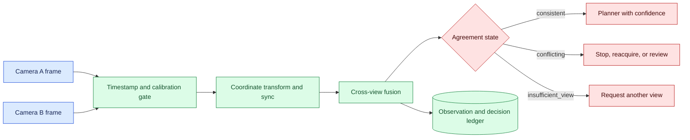
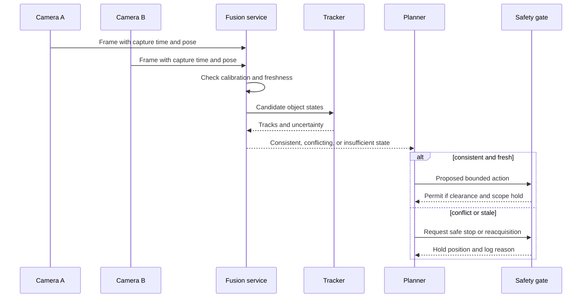

# Multi-view consistency
Status: emerging
Sources: [Google DeepMind — 2026-04-14](https://deepmind.google/blog/gemini-robotics-er-1-6/)

## In one sentence

Multi-view consistency checks whether observations from different cameras can describe one current world state before a system relies on either view.

## Background: what existed before

A single camera gives a projection of the world. It can identify an object, but it may not see behind another object, distinguish depth, or tell whether an apparent change is motion or a lighting artifact. Multiple cameras add coverage and geometric constraints, yet they also add synchronization, calibration, bandwidth, and identity problems. Two images are not automatically two independent confirmations of the same fact.

The prerequisites are coordinate frames, calibration, timestamps, tracking, confidence, and state estimation. A camera pose describes where the sensor is relative to a shared frame. Calibration estimates the camera’s internal parameters and its relationship to other sensors. A timestamp says when an observation was captured, not when it arrived. Tracking links observations over time. State estimation combines uncertain observations into a representation of the current world.

The historical baseline was to choose one camera, stream the latest frame, or concatenate images and ask a model to decide. That can work for a stable, low-risk scene, but it hides disagreement. A wrist camera may show an object close up while an overhead camera sees that the robot’s path is blocked. A delayed frame may be sharp and internally coherent but no longer current.

## What changed and why now

The April robotics announcement describes multi-view reasoning for dynamic and occluded environments. That is a source-specific vendor claim about the announced system; it does not establish that arbitrary cameras, robots, or task policies will fuse safely. The engineering change is to make cross-view agreement a first-class state and to test whether the system knows when views cannot be reconciled.

More capable multimodal models can compare views semantically, but semantic agreement does not repair bad timestamps or coordinate transforms. A model might say both images contain a cup while missing that one image is from before the cup moved. Conversely, two valid views can appear contradictory because one sees a reflection or an occluded edge. The fusion contract must include data quality and geometry in addition to model confidence.

## Impact on current processing and architecture

Each observation should carry camera ID, capture time, arrival time, pose, calibration version, modality, object or region coordinates, confidence, and tenant or scene scope. A synchronization layer rejects frames outside the task’s freshness window. A geometric or learned fusion layer proposes a shared state. A conflict resolver classifies the result as `consistent`, `conflicting`, or `insufficient_view`. Downstream planning consumes the state and its uncertainty, not a bare label.



The policy depends on consequence. A read-only inventory query may tolerate a conflict by asking for a fresh frame. A robot motion command should stop when object location or clearance is uncertain. A warehouse system may route a bin to manual inspection. The state and reason must be observable so operators can distinguish a blocked camera, a transform mismatch, a moving object, and a model disagreement.

Keep the perception and action loops separate. The perception service can publish a versioned scene state, while the planner checks state age and confidence immediately before acting. If the robot moves, earlier observations may be invalid. For fast motion, the freshness window may be shorter than the model inference latency, making a slower but more precise fusion route unsafe for control.



## Real-world applications and constraints

In manipulation, an overhead camera can estimate table layout while a wrist camera resolves grasp geometry. Test a moved object between captures, a blocked lens, reflective surfaces, and a calibration drift. The controller should not reach based on a stale location simply because the close-up view is confident.

In navigation, front and side cameras can identify a person, vehicle, or obstacle. Cross-view tracking should handle partial visibility and avoid double-counting one object. A disagreement near the planned path should result in a speed reduction or stop, not an optimistic average. Measure false-clear and false-obstacle outcomes separately because their costs differ.

In industrial inspection, multiple cameras may view a weld, package, or machine component. A consistent defect across views is useful evidence, but a missing angle can conceal a critical defect. Record camera coverage and lighting. Do not treat “not visible” as “not present.” For inventory, combine barcode, visual, and depth observations while preserving item identity and location uncertainty.

For security monitoring, cameras can provide corroboration but introduce privacy, retention, and access concerns. Use the minimum views and resolution needed for the task. A multi-view model should not create a new identity-tracking system without governance. For teleoperation, consistent views help the operator understand occlusion, but latency and viewpoint changes can increase workload; expose source frames and timestamps rather than only a fused narrative.

Constraints include calibration cost, synchronization hardware, network bandwidth, edge compute, privacy, and dynamic scenes. A mobile camera’s pose changes as the robot moves, and calibration can drift after impact or maintenance. Wireless delivery may reorder or drop frames. GPU batching can improve throughput while increasing staleness. Measure end-to-end age from capture to action and reserve a safe fallback when the budget is exceeded.

## Mental model

Think of each camera as a witness with a viewpoint, clock, and blind spots. Two witnesses who describe the same event at different times may disagree without either being wrong. The fusion service is an evidence clerk: it aligns statements, records uncertainty, and refuses to turn an unresolved conflict into a fact. The planner acts only on a current state whose confidence and consequence policy fit the task.

Use three separate questions: do the views refer to the same object, do they describe the same time, and is the resulting state sufficient for this action? High semantic similarity answers none of these by itself. A consistent state can still be incomplete; an inconsistent state can become usable after a new observation; an apparently confident state can be unsafe if the calibration version is unknown.

## What changed this month

The April source presents multi-view capability for dynamic and occluded robotic environments. The source fact is limited to the announcement’s description and reported evaluations. The engineering consequence is to define the sensor, time, geometry, and action contract around that capability rather than assuming a model output is a trusted world state.

This month’s shift is from selecting the best frame to maintaining an explicit state of agreement and freshness. A system can use one view when another is unavailable, but that degraded mode must be intentional, bounded, and appropriate to the consequence. For high-risk motion, disagreement is a reason to stop or reacquire.

## Engineering consequence

Define an observation schema with immutable IDs and units. Store camera calibration and pose versions with frames. Use a monotonic capture sequence in addition to wall-clock time. Reject impossible transforms and stale observations before model fusion. Have the fusion result include source IDs, state timestamp, confidence interval or categorical uncertainty, disagreement reason, and expiry.

Evaluation should include geometry and timing fixtures, not only labeled images. Recreate a scene with one camera shifted, one delayed, one blocked, one duplicated, and one reporting an impossible pose. Compare the fused state with a trusted fixture and inspect action decisions. A model may be useful for proposing correspondence, while deterministic geometry and safety gates decide whether a command is allowed.

Track operational metrics: frame age, dropped and reordered frames, calibration mismatches, conflict rate, reacquisition latency, safe-stop rate, false-clear rate, task completion, and operator interventions. Set route-specific thresholds. If conflict rate rises after a camera firmware change, stop attributing the regression to the model until the sensor pipeline is checked.

## Limits and failure modes

### Timestamp skew

Frames captured at different times can describe different states. Align by capture time, not arrival order, and enforce a task-specific freshness window. Test clock drift and delayed delivery.

### Calibration drift

A small pose error can move a projected object enough to cause a bad grasp or collision. Version calibration, run known-target checks, and fail closed when a camera moves or its calibration is expired.

### Occlusion mistaken for absence

One camera not seeing an object is not evidence that the object is absent. Track visibility and coverage; request another view or preserve uncertainty.

### Duplicate identity

Two views may count one object twice or assign one track to two objects. Use geometry, appearance, temporal continuity, and conservative behavior near consequences.

### Confident semantic disagreement

A model can produce a fluent scene description despite conflicting pixels. Expose source frames and confidence, and gate action on state and evidence rather than prose.

### Bandwidth and compute pressure

Sending every high-resolution frame increases cost and latency. Sample or crop deliberately, but measure whether sampling misses short events. Edge preprocessing must preserve timestamps and provenance.

### Moving-camera latency

A view may become stale during inference. Predictive tracking can help but is itself uncertain. Bound prediction horizon and stop when uncertainty grows beyond the action envelope.

### Privacy and access

Multiple cameras collect more personal data and create broader access scope. Authenticate streams, apply retention and purpose limits, and ensure a tenant cannot receive another scene’s frames or tracks.

### Confidence and decision thresholds

Confidence should describe the state estimate, not merely the model’s certainty in a label. A view can be highly certain that an object is present while its position is inaccurate because calibration is stale. Store separate measures for correspondence, geometric agreement, freshness, and action clearance. Choose thresholds by consequence and validate them on held-out episodes. A threshold that works for inventory counting may be unsuitable for a fast robot arm.

When evidence is insufficient, prefer an information-seeking action when it is safe: rotate a camera, request a fresh frame, slow the robot, or ask an operator. Information gathering has a cost and can itself change the scene, so record the action and update the state afterward. If no safe observation is available, stop and expose the reason. This explicit refusal is more useful than returning a guessed coordinate that downstream code treats as exact.

### Change and maintenance

Recalibrate after camera movement, lens replacement, firmware change, or mechanical impact. Put calibration checks in deployment readiness and scheduled maintenance. Re-run multi-view regression episodes after changing camera placement, frame rate, compression, tracker, fusion model, or planner. Keep a known-target fixture so an operator can distinguish a model regression from a physical sensor problem. The evidence should identify the sensor configuration that produced it, because a passing result from yesterday’s rig may not apply after today’s repair.

## Mini exercise (15–30 min)

Create two synthetic camera observations of one object with positions, capture times, and calibration versions. Implement a fusion function that accepts only observations within a freshness window and rejects calibration mismatch. Add a moved-object case, a blocked-view case, and a duplicate frame. Print `consistent`, `conflicting`, and `insufficient_view` results and define the action for each.

## Build it locally

```python
def fuse(a, b, now, max_age=2, tolerance=1):
    if max(now - a["time"], now - b["time"]) > max_age:
        return "insufficient_view"
    if a["calibration"] != b["calibration"]:
        return "conflicting"
    if abs(a["x"] - b["x"]) > tolerance:
        return "conflicting"
    return "consistent"

print(fuse({"time": 10, "x": 4, "calibration": "c1"},
           {"time": 11, "x": 4.5, "calibration": "c1"}, now=12))
```

1. Save the example as `view_fusion.py` and run `python3 view_fusion.py`.
2. Add camera IDs, y coordinates, and a coordinate-transform version.
3. Test a delayed frame and require `insufficient_view` instead of guessing.
4. Test calibration drift and route a conflict to a safe stop.
5. Add a third view and define whether two agreeing views can override one stale view.
6. Emit source IDs and a state expiry with every fusion decision.

## Interview Q&A

**Does two-camera agreement prove truth?** No. The cameras can share a blind spot, stale state, calibration error, or common environmental artifact.

**Why store capture and arrival time?** Arrival order can differ from capture order; action safety depends on how current the observation was when it was captured.

**What should happen on a conflict?** The consequence policy decides, but high-risk motion should stop or reacquire rather than silently choosing a fluent interpretation.

**Why version calibration?** A transform is part of the observation’s meaning; a changed or expired transform can invalidate otherwise good pixels.

**How do you evaluate multi-view reasoning?** Use synchronized, geometry-aware fixtures with occlusion, movement, delay, dropout, calibration drift, and action-level safety outcomes.

## Glossary

**Multi-view:** Use of observations from multiple viewpoints or sensors to estimate a shared state.

**Calibration:** Estimated mapping between sensor measurements and a physical or coordinate frame.

**Pose:** Position and orientation of a camera or object in a coordinate frame.

**Freshness:** How recent an observation is relative to the action that consumes it.

**Occlusion:** A condition where an object or region is hidden from a sensor.

**Fusion:** Combining observations into one state estimate.

**Safe stop:** A controlled transition that prevents further risky motion or effects.

## References

- [Google DeepMind — Gemini Robotics ER 1.6](https://deepmind.google/blog/gemini-robotics-er-1-6/) — April source for multi-view reasoning context.
- [ROS 2 tf2 documentation](https://docs.ros.org/en/rolling/Tutorials/Intermediate/Tf2/Introduction-To-Tf2.html) — coordinate-frame and transform context.
- [NIST AI Risk Management Framework](https://www.nist.gov/itl/ai-risk-management-framework) — risk measurement and governance context.

## Claim ledger

| Claim | Source | Fact or inference |
| --- | --- | --- |
| Google DeepMind describes multi-view reasoning for dynamic and occluded robotic environments. | Google DeepMind Gemini Robotics ER 1.6 | Vendor source claim |
| Two views are not automatically comparable without time, pose, calibration, and object-identity checks. | Sensor-fusion reasoning | Engineering inference |
| High-consequence actions should stop or reacquire when observations conflict or become stale. | Safety design reasoning | Engineering recommendation |
| A fused state should retain source IDs, uncertainty, freshness, and expiry. | Lesson synthesis | Engineering recommendation |
| Multi-view capability, local reliability, and safe physical behavior are separate claims. | Lesson synthesis | Engineering distinction |
