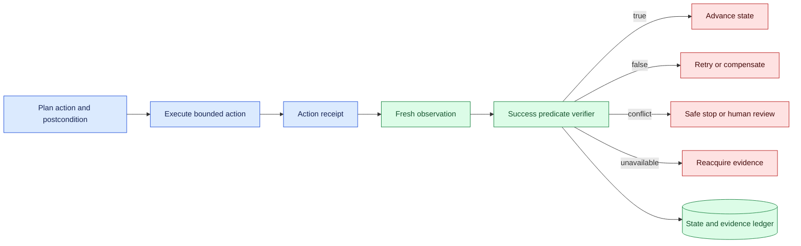
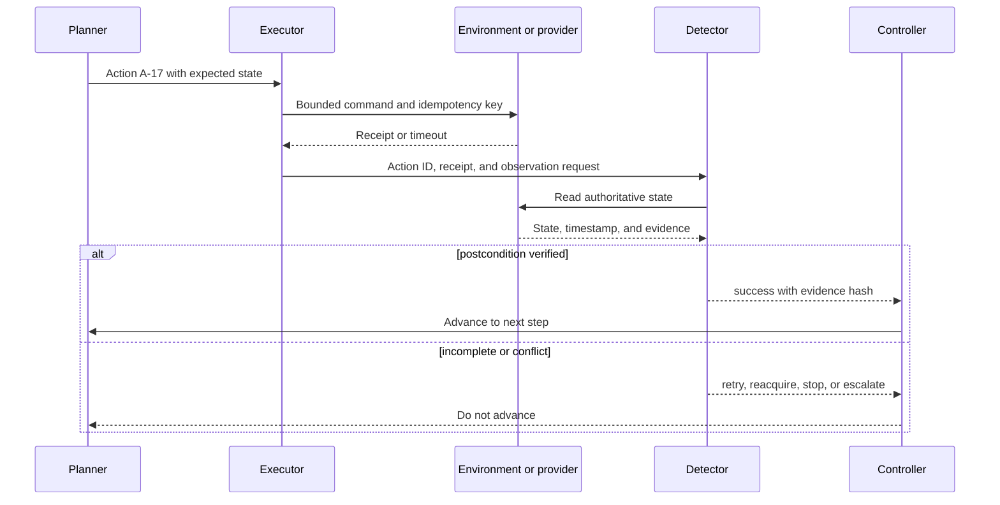

# Success detection
Status: emerging
Sources: [Google DeepMind — 2026-04-14](https://deepmind.google/blog/gemini-robotics-er-1-6/)

## In one sentence

Success detection is a separate verification decision: did the intended final state happen, with enough current evidence to advance the workflow?

## Background: what existed before

Many software workflows treat a successful function return or HTTP status as completion. That convention works when the service owns the state transition and the response is authoritative. Physical and multimodal systems are different. A robot can receive an actuator acknowledgement while the object remains outside its target. A browser agent can receive a successful click while the page changes asynchronously. A support workflow can send a message while the customer record remains unchanged.

Success detection compares an intended state with observed evidence. It is not the same as planning, action execution, or a model’s description of what happened. The prerequisite concepts are state machines, observability, idempotency, timestamps, and invariants. An invariant is a condition that must remain true. An idempotency key identifies one logical attempt so a timeout does not automatically create a duplicate effect.

The baseline approach often used a single image, a tool return value, or a generated sentence such as “done.” Those signals are useful inputs but are not sufficient for every consequence. A robust detector defines the expected predicate, gathers evidence from the right sensor or authoritative system, applies a freshness and confidence policy, and returns success, incomplete, conflict, unavailable, or unsafe states.

## What changed and why now

The April source calls success detection important for deciding whether an embodied system should retry or progress, and discusses single-view and multi-view evaluations. Those are source-specific vendor claims about the announced system. The engineering implication is broader: autonomy requires a verified state transition, not just a capable action policy.

When an agent can execute multi-step tasks, a false completion compounds. If it believes a part was installed, it may begin calibration; if the part is actually loose, the next action can damage equipment. False incompletion has a different cost: it may repeat a delivery, send duplicate communication, or move an object that is already correctly placed. The detector therefore needs consequence-aware thresholds and a bounded recovery path.

Success detection also changes evaluation. A benchmark that measures whether a model names the correct object does not establish whether the object reached the correct location. Record action ID, expected predicate, observations, evidence source, timestamp, detector version, and the transition decision. Keep the original evidence for disputed or safety-relevant cases under appropriate retention controls.

## Impact on current processing and architecture

Represent a task as an explicit state machine. The planner emits a proposed action with an expected postcondition. The executor performs a bounded action and records a receipt. The verifier reads authoritative or independent observations and evaluates the postcondition. Only then may the controller advance, retry, ask for another view, stop, or escalate.



The postcondition should be concrete. “Place the red block in bin B” can become: object identity is red block 7, location is bin B, containment is true, position uncertainty is below the task limit, observation age is under two seconds, and no collision or policy violation occurred. A detector may use vision, depth, force, barcode, a provider receipt, or a combination. The source of truth depends on the task.



Keep an unknown external outcome separate from failure. A timeout may mean the action did not happen, happened partially, or happened successfully with a lost response. Query the authoritative state before retrying. If no read-back exists, require a compensating or human decision rather than guessing. This is especially important for payments, messages, deployments, and physical motion.

## Real-world applications and constraints

In manipulation, success may require object identity, pose, containment, support, and stability over a time window. A single frame can show the desired relation while the object is still moving. Use temporal confirmation and a safe retry that does not grasp the same object twice. For insertion or assembly, force or electrical checks may be stronger evidence than appearance alone.

In navigation, success can mean reaching a region without collision, respecting a route, and stopping within a position tolerance. GPS, visual localization, map state, and obstacle sensors have different error modes. A destination label is not proof that the vehicle is safely parked. Near people or obstacles, false-clear errors should gate the controller more strictly than slow completion.

In browser or API automation, success detection should read back the resource or observe the durable event. A click receipt can precede asynchronous processing. Use request IDs, event versions, and idempotency keys. If a form submission times out, search by the logical key before submitting again.

In data pipelines, success means the expected partition, schema, row count, and quality checks are present, not merely that a worker exited zero. In deployment, it includes artifact identity, health, traffic, and rollback readiness. In customer operations, it includes the actual record version and notification receipt. Each domain needs a predicate owned by a domain expert.

Constraints include sensor coverage, latency, false positives, false negatives, labeling cost, and the possibility that verification changes the state. A camera pan can disturb a scene; a read-back may be eventually consistent; a health probe may warm a cache and hide a cold-start problem. Define the observation contract and account for its cost. If the evidence is too weak for the consequence, stop or escalate.

## Mental model

Think of an action as a hypothesis: “if I execute A, the world will satisfy P.” Success detection is the experiment that tests P. The action receipt tells you what a component accepted, while observation tells you what state exists. The controller advances only when the evidence is current, relevant, and sufficient for the next action.

A detector is not a binary oracle. It has uncertainty, coverage, and expiry. `false` means evidence says the predicate is not met; `unknown` means evidence is missing or contradictory; `unsafe` means continuing is prohibited regardless of task completion. Making these states explicit prevents the common failure where every non-success becomes a retry and every timeout becomes a duplicate effect.

## What changed this month

The April announcement presents success detection as part of an autonomous robotics engine and distinguishes single-view and multi-view evaluations. The source fact is limited to the announcement and its reported evaluation framing. This lesson applies the idea to a general processing architecture: completion needs a postcondition, evidence source, freshness rule, and controlled transition.

The month’s shift is from output-centric automation to state-centric automation. A model’s answer can propose that a task is complete, but an independent validator or authoritative receipt must decide whether the workflow may advance. This distinction is useful for both physical agents and ordinary tool-using software.

## Engineering consequence

Create a postcondition registry with task name, expected state schema, evidence sources, tolerances, freshness window, consequence class, retry policy, and escalation owner. Version the registry with the planner, executor, and detector. Bind each result to action ID and attempt number. Store hashes or references rather than sensitive payloads in the general ledger, with restricted evidence for investigation.

Test false completion and false incompletion separately. Build fixtures where an object is almost in place, an API accepted but did not apply a change, a receipt is delayed, a duplicate exists, a camera is blocked, and two sensors disagree. Measure precision and recall by consequence slice, but also measure time to verify, retry count, duplicate effects, safe stops, and operator workload.

Do not let an evaluator that sees the same generated text as the planner provide the only evidence. Use independent sensors, read-backs, deterministic validators, or domain-owned checks where available. When a model-based detector is necessary, calibrate it on held-out cases and set a conservative escalation route. Capability and reliability claims remain separate from safety claims.

## Limits and failure modes

### False completion

The detector advances after a partial, stale, or visually plausible result. Require a concrete predicate, independent evidence, and temporal stability for high-consequence actions.

### False incompletion

The detector misses a real success and repeats an effect. Use idempotency keys, read-backs, bounded retries, and compensation. Do not retry an unknown irreversible operation blindly.

### Stale evidence

The observed state was true earlier but is no longer true. Record capture time and action time, enforce freshness, and reacquire before acting.

### Sensor or provider conflict

Two sources disagree, or a local receipt conflicts with remote state. Return conflict, preserve evidence, and route to reconciliation. Never average away a safety-relevant contradiction.

### Weak postconditions

“Response received” or “object visible” may not express the state users care about. Ask the domain owner what must be true after the action and what evidence can establish it.

### Verification side effects

Read-backs can be eventually consistent or can trigger work. Treat them as operations with their own identity, permissions, latency, and failure modes.

### Detector drift

Camera placement, API schema, model, environment, or object distribution changes can alter detector behavior. Re-run regression cases and monitor protected slices after each material change.

### Privacy and retention

Evidence may include images, audio, records, or customer identifiers. Minimize and redact evidence, restrict access, and define retention for raw media and derived decisions.

### Designing the observation contract

Start by asking what a domain expert would inspect if the system claimed success. For a warehouse placement, that may be object ID, bin ID, containment, stability, and the last motion timestamp. For an API mutation, it may be resource version, changed fields, authorization decision, and provider receipt. Convert that inspection into a contract with required fields, allowed tolerances, and an expiry. If no available sensor or read-back can establish the contract, the task is not ready for autonomous progression.

The contract should also specify what evidence is deliberately unavailable. A camera may not see the rear of a bin; a provider may expose only eventual status; a medical workflow may not expose a complete external record. Missing coverage is a property of the detector, not a reason to infer success. Return that limitation to the planner so it can choose a lower-risk observation, ask for a person, or stop. This makes uncertainty actionable instead of merely displaying a confidence number.

### Retry and compensation policy

Retries must be selected by effect class. A read-only observation can usually be repeated, although it may return a newer state. A reversible action can use a bounded retry with an idempotency key and a postcondition check. An irreversible action should enter reconciliation when its result is unknown. Compensation is not always a true rollback: sending an email cannot unsend it, and moving a physical object may have changed the scene. Record the limitation and notify the accountable owner.

## Mini exercise (15–30 min)

Implement a local task with an action ID, expected state, receipt, and read-back. Simulate success, partial completion, a timeout with an eventual success, stale evidence, and a duplicate retry. Ensure the controller advances only on verified success and that an unknown result enters reconciliation.

## Build it locally

```python
def verify(action, observed):
    if observed is None:
        return "unknown"
    if observed["action_id"] != action["id"]:
        return "conflict"
    if observed["state"] != action["expected"]:
        return "incomplete"
    if observed["age"] > action["max_age"]:
        return "unknown"
    return "success"

action = {"id": "A-7", "expected": "inside-bin", "max_age": 2}
print(verify(action, {"action_id": "A-7", "state": "inside-bin", "age": 1}))
print(verify(action, {"action_id": "A-7", "state": "inside-bin", "age": 4}))
```

1. Save the example as `success_check.py` and run `python3 success_check.py`.
2. Add object identity and confidence to the observed state.
3. Add an explicit `reconcile` state for a missing receipt.
4. Test a mismatched action ID and prohibit retry on `conflict`.
5. Add a temporal rule requiring two agreeing observations before a high-risk transition.
6. Record evidence ID, detector version, and decision reason for every result.

## Interview Q&A

**Why separate execution from success detection?** An executor knows what it attempted or what a provider acknowledged; a detector verifies whether the intended state actually exists.

**What should happen after a timeout?** Treat the outcome as unknown, query authoritative state or reconcile evidence, and use idempotency before retrying.

**Is a model confidence score enough?** No. Confidence may ignore stale data, calibration, coverage, or the consequence of a false completion.

**What is a strong postcondition?** A versioned, observable predicate tied to the intended resource, acceptable freshness, and the evidence needed for the next transition.

**How do you measure a detector?** Report false completion, false incompletion, unknown rate, verification latency, duplicate effects, safe stops, and protected-slice outcomes.

## Glossary

**Postcondition:** The state expected after an action completes.

**Success detector:** A component that evaluates evidence against a postcondition.

**Receipt:** Evidence that a system accepted or applied an operation.

**Freshness:** The age of evidence relative to the decision that uses it.

**Reconciliation:** Resolving uncertain local records against authoritative state.

**False completion:** Advancing when the intended state was not achieved.

**False incompletion:** Retrying or blocking when the intended state was achieved.

## References

- [Google DeepMind — Gemini Robotics ER 1.6](https://deepmind.google/blog/gemini-robotics-er-1-6/) — source context for success detection and single-/multi-view evaluation.
- [NIST AI Risk Management Framework](https://www.nist.gov/itl/ai-risk-management-framework) — risk measurement and governance context.
- [ROS 2 lifecycle nodes](https://design.ros2.org/articles/node_lifecycle.html) — explicit operational state-transition context.

## Claim ledger

| Claim | Source | Fact or inference |
| --- | --- | --- |
| The April announcement describes success detection as important for deciding whether to retry or progress. | Google DeepMind Gemini Robotics ER 1.6 | Vendor source claim |
| The announcement discusses single-view and multi-view success-detection evaluations. | Google DeepMind Gemini Robotics ER 1.6 | Vendor source claim |
| A success predicate should be independent from an action proposal. | State-verification reasoning | Engineering inference |
| Unknown external outcomes should be reconciled before irreversible retries. | Distributed-systems reasoning | Engineering recommendation |
| Freshness, evidence provenance, and consequence-specific thresholds are required for trustworthy completion decisions. | Lesson synthesis | Engineering recommendation |
