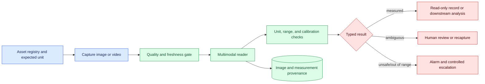
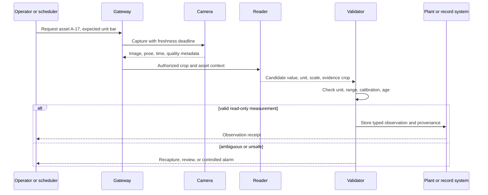

# Instrument reading
Status: emerging
Sources: [Google DeepMind — 2026-04-14](https://deepmind.google/blog/gemini-robotics-er-1-6/)

## In one sentence

Instrument reading converts a visual measurement into a typed operational observation with unit, asset identity, range checks, provenance, and review behavior.

## Background: what existed before

Industrial, laboratory, and clinical systems use sensors and instruments to represent physical state. A gauge may show pressure, a sight glass may show liquid level, a meter may show voltage, and a display may show a temperature. Traditional automation reads a digital signal with a known calibration and unit. Humans inspect analog or damaged instruments when no reliable digital interface exists. A multimodal agent can help interpret a photograph or video, but its output is a measurement proposal, not automatically a trusted sensor value.

The prerequisite concepts are units, calibration, range checks, provenance, uncertainty, and typed state. Calibration relates an instrument’s displayed value to a reference. Provenance records the asset, image, time, and method behind a result. A typed state distinguishes `measured` from `unreadable`, `ambiguous_unit`, `out_of_range`, and `needs_review`. This prevents a missing or guessed value from entering a numeric pipeline as zero or as a plausible normal reading.

The baseline failure is treating optical recognition as a number extraction problem. A model may read the pointer but miss the scale multiplier, confuse bar with psi, invert a logarithmic scale, read a reflection, or associate the gauge with the wrong machine. The system must identify the instrument and scale, locate the indicator, estimate the value, validate it against physical and operational constraints, and preserve the image evidence.

## What changed and why now

The April robotics source describes instrument reading with visual reasoning, pointing, zooming, and code execution. That is a source-specific vendor claim about the announced workflow, not independent evidence of safe industrial operation. The engineering change is that a general-purpose multimodal system can participate in a previously manual observation loop, while the surrounding system must enforce units, asset identity, freshness, calibration, and escalation.

The historical workflow often had a person transcribe a value into a spreadsheet or a controller with a dedicated sensor. An agent can improve coverage where wiring a sensor is expensive, but it introduces probabilistic interpretation and new failure modes. A deployment should begin with read-only measurement and compare results with calibrated references. It should not directly actuate a valve, medication, machine, or alarm reset from one uncertain image.

## Impact on current processing and architecture

Use an asset-aware measurement pipeline. The request identifies an asset, location, instrument type, unit expectation, and purpose. Image capture records camera, pose, focus, exposure, and time. The reader proposes a value with a crop and scale interpretation. Deterministic checks validate unit, range, calibration age, and plausibility. A reviewer or control system accepts the observation according to consequence.



The asset registry is essential. Two identical gauges can display different values, scales, or alarm limits. Bind the observation to an immutable asset ID and expected instrument configuration. If the camera view cannot establish identity, return `wrong_or_unknown_asset`, not a reading. Store the original image or a governed reference so a reviewer can inspect the pointer and scale.



Never let a model silently choose a unit. If the image says “psi” but the asset expects bar, convert only with an explicit, tested conversion and retain both source and normalized units. For analog scales, represent pointer position and reading interval, not false precision. If the pointer lies between marks, report a range or uncertainty appropriate to the instrument resolution.

## Real-world applications and constraints

In manufacturing, an agent can read pressure gauges, temperature dials, tank levels, counters, or maintenance labels. Constraints include glare, vibration, dirt, low light, camera angle, protective glass, and rapidly changing values. A reading near an alarm limit needs a fresh capture and a safe response, not a single-frame automatic command.

In laboratories, the system may transcribe a display or compare a sample label with a reading. Asset and sample identity must be linked, and units may differ between instruments. An incorrect association can invalidate an experiment even if the number was read perfectly. Keep an audit trail connecting image, instrument, sample, operator, model, and calibration certificate.

In facilities and utilities, visual readings help inspect old equipment without replacing every meter. The business case includes camera installation, connectivity, reviewer time, and maintenance. A reading service must handle camera failure, stale images, missing access, and changes in equipment layout. It should report coverage gaps rather than implying that unobserved assets are normal.

In healthcare, an optical reading may assist with a home device or monitor, but patient identity, device calibration, accessibility, and clinical escalation are high stakes. A model output is not a diagnosis. Store readings as proposals until the governed clinical workflow accepts them, and show the image and uncertainty to the appropriate professional.

Constraints include privacy, safety, calibration, model cost, latency, and environmental change. High-resolution crops improve readability but may increase bandwidth. Zooming may create an apparently sharp image without adding information. Code execution can calculate a conversion or interpolation, but it cannot make an unreadable pointer reliable. Physical references and periodic calibration remain important.

## Mental model

Treat the image as a measurement instrument with an uncertain sensor path. The camera captures a scene, the model interprets marks, and deterministic code checks a proposed value. The result is evidence with a confidence and validity state, not a magic number. A reviewer sees the evidence needed to disagree.

Separate observation from decision. “Gauge reads 8.2 bar” is an observation proposal. “Open relief valve” is an operational decision with authority, timing, and safety requirements. The first may be automated in a bounded route; the second needs independent controls and often a human or certified controller.

## What changed this month

The April announcement describes instrument reading using visual reasoning, pointing, zooming, and code execution. The source fact is limited to the announced capability and examples. It does not establish accuracy across gauges, environments, units, or safety-critical applications.

The engineering shift is to combine flexible visual interpretation with strict measurement contracts. The agent may choose where to look and propose how to read a scale, but identity, unit, freshness, calibration, range, and actuation policy belong to the surrounding system. This preserves the usefulness of multimodal assistance without treating its output as an unqualified sensor.

## Engineering consequence

Define a measurement schema with asset ID, instrument ID and type, source image ID, capture and arrival timestamps, source unit, normalized unit, value or interval, scale range, calibration version, reader version, evidence crop, quality state, uncertainty, reviewer state, and expiry. Require an asset registry lookup before generation. Make downstream consumers reject untyped or expired values.

Use deterministic checks for unit conversion, numeric range, monotonicity where applicable, impossible jumps, and alarm thresholds. A model can propose the scale and pointer location; code should calculate normalized values and reject malformed fields. For critical measurements, compare against a redundant digital sensor or require two independent observations. Measure false-normal and false-alarm outcomes separately.

Run shadow mode first. Store proposals without affecting controls and compare them with calibrated readings. Then use the system for operator assistance with explicit accept/edit/reject states. Only consider automatic downstream use after prospective evaluation under the intended environment and after a safe fallback is tested. Version instrument layouts and camera placement because a maintenance change can invalidate image assumptions.

## Limits and failure modes

### Unit confusion

A number without a unit is not a measurement contract. Display and validate source and expected units, and use explicit conversion tables. Reject ambiguous or missing units.

### Wrong asset

Repeated instruments may look identical. Resolve asset identity from authenticated context, location, markers, or operator confirmation. Never let a model-selected label alone authorize a consequential action.

### Scale and pointer error

A pointer can be occluded, reflected, thick, or between marks. Store the crop and reading interval, and route low-resolution or ambiguous cases to review.

### Stale image

A value may change after capture. Enforce freshness relative to the decision and recapture before actuation or alarm acknowledgment.

### Calibration drift

Instrument calibration can expire or change after maintenance. Attach calibration version and certificate date, and mark observations conditional when unknown.

### Out-of-range and impossible values

A visually plausible number may violate physical limits or jump unexpectedly. Use asset-specific bounds and trend checks; return an alarm or review state instead of clipping it into range.

### False precision

The display resolution and image quality limit meaningful digits. Report intervals or resolution-aware values. More decimal places do not increase measurement quality.

### Action coupling

A read should not directly trigger an irreversible action. Separate observation, validation, authorization, and actuation, with an explicit receipt and rollback or safe stop.

### Privacy and retention

Images can reveal workers, patients, facilities, or documents. Minimize frames, redact unrelated content, restrict access, and define retention for raw images and derived readings.

### From reading to trend

A sequence of readings can reveal drift, but trend processing needs the same provenance as an individual value. Do not join values from different assets or calibration periods merely because their labels match. Normalize units before calculating a slope, preserve gaps caused by unreadable images, and mark interpolated values as derived rather than measured. A sudden change may represent a real process event, a moved camera, a replaced instrument, or a unit mistake. Route a surprising trend to inspection and show the underlying evidence.

Use baseline windows that are appropriate to the equipment and task. A stable tank and a rapidly changing pressure line need different freshness and change thresholds. Thresholds should be versioned with the asset policy and reviewed when operating conditions change. A trend alarm can prioritize a human inspection, but it should not silently rewrite the raw observation or bypass a safety controller. This separation lets operators improve the reader without losing the original record.

### Operational readiness

Before launch, walk the entire path with a maintenance technician or domain owner. Confirm that the camera can reach the expected angle, the asset registry is current, calibration records are available, and a reviewer can inspect evidence quickly. Test camera outage, storage outage, model unavailability, and an instrument that has been replaced. Define whether the system should stop collecting, retain the last known value as stale, or require a manual reading. Every choice should be visible in the downstream status.

## Mini exercise (15–30 min)

Create ten synthetic gauge observations with asset IDs, expected units, pointer values, timestamps, and calibration versions. Implement unit validation, freshness, range checks, and typed states. Include an ambiguous unit, wrong asset, stale image, and out-of-range value. Require review for all non-measured states and verify that no result can call an actuator directly.

## Build it locally

```python
def validate(reading, asset, now):
    if reading["asset"] != asset["id"]:
        return "wrong_asset"
    if reading["unit"] != asset["unit"]:
        return "ambiguous_unit"
    if now - reading["time"] > asset["max_age"]:
        return "stale"
    if not asset["minimum"] <= reading["value"] <= asset["maximum"]:
        return "out_of_range"
    return "measured"

asset = {"id": "gauge-7", "unit": "bar", "minimum": 0, "maximum": 10, "max_age": 2}
print(validate({"asset": "gauge-7", "unit": "bar", "value": 6, "time": 9}, asset, 10))
print(validate({"asset": "gauge-7", "unit": "psi", "value": 6, "time": 9}, asset, 10))
```

1. Save the example as `instrument_gate.py` and run `python3 instrument_gate.py`.
2. Add source image ID, calibration version, and uncertainty interval.
3. Add an explicit conversion path that records both units and rejects unknown units.
4. Test stale, wrong-asset, and out-of-range observations.
5. Add a reviewer transition and prohibit actuator calls from the validation function.
6. Record every result with a reason code and evidence reference.

## Interview Q&A

**Why is instrument reading different from OCR?** It requires asset identity, scale interpretation, units, calibration, freshness, uncertainty, and operational validation, not only character recognition.

**What should happen when the unit is unclear?** Return an explicit ambiguous state and request a better view or human review; do not guess or silently convert.

**Can a model reading control equipment?** Not directly. Observation, validation, authorization, and actuation should be separate boundaries with consequence-aware controls.

**How do you evaluate it?** Compare with calibrated references across instruments, viewpoints, lighting, dirt, motion, units, and failure cases, reporting false-normal and false-alarm outcomes separately.

**Why retain the original image?** It provides provenance and lets a reviewer investigate whether the error came from identity, scale, visibility, calibration, or interpretation.

## Glossary

**Instrument reading:** A typed observation extracted from an instrument’s display or physical scale.

**Calibration:** Relationship between an instrument’s output and a trusted reference.

**Provenance:** Evidence about source, time, asset, method, and versions behind a result.

**Freshness:** Whether an observation is recent enough for the decision using it.

**Unit normalization:** Converting a source unit into an explicitly recorded expected unit.

**False-normal:** Treating an abnormal or unsafe condition as normal.

**Typed state:** A value plus a status that distinguishes valid, ambiguous, stale, and unsafe outcomes.

## References

- [Google DeepMind — Gemini Robotics ER 1.6](https://deepmind.google/blog/gemini-robotics-er-1-6/) — source context for instrument reading, pointing, zooming, and code execution.
- [NIST AI Risk Management Framework](https://www.nist.gov/itl/ai-risk-management-framework) — risk measurement and governance context.
- [NIST measurement traceability](https://www.nist.gov/pml/owm/metric-si/si-units) — units and measurement context.

## Claim ledger

| Claim | Source | Fact or inference |
| --- | --- | --- |
| Google DeepMind describes instrument reading with visual reasoning, pointing, zooming, and code execution. | Google DeepMind Gemini Robotics ER 1.6 | Vendor source claim |
| A visual reading should be bound to asset, unit, time, calibration, and evidence metadata. | Measurement and systems reasoning | Engineering recommendation |
| Model capability does not establish safety or accuracy for a local industrial or clinical deployment. | Evaluation reasoning | Engineering inference |
| Observation and actuation should be separate control boundaries. | Safety architecture reasoning | Engineering recommendation |
| Explicit ambiguous, stale, and out-of-range states reduce unsafe coercion of uncertain readings into normal values. | Lesson synthesis | Engineering recommendation |
