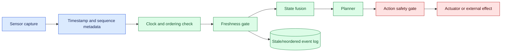
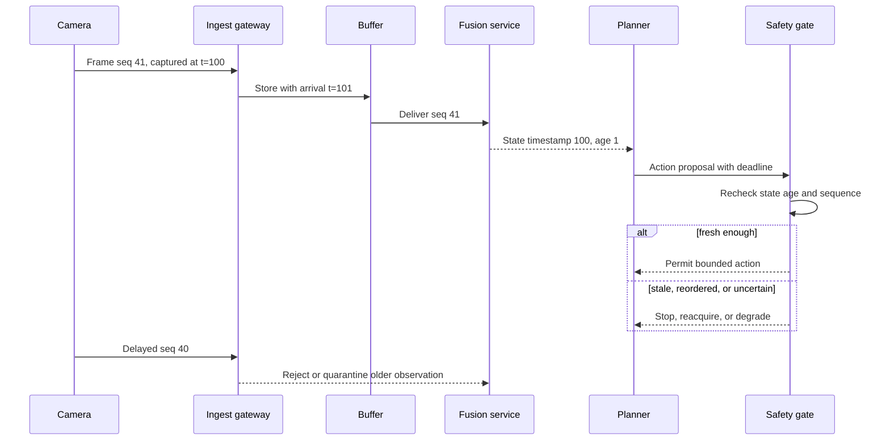

# Sensor freshness
Status: emerging
Sources: [Google DeepMind — 2026-04-14](https://deepmind.google/blog/gemini-robotics-er-1-6/)

## In one sentence

Sensor freshness makes age, ordering, and synchronization explicit so a system cannot mistake historical evidence for the current physical world.

## Background: what existed before

Software usually treats a database row or API response as current enough for the request that retrieved it. Physical systems do not offer that convenience. A camera frame is captured at one time and delivered at another. A temperature reading can change while it waits in a queue. A robot can move after its scene was observed. An event can arrive out of order, be duplicated, or be delayed by a congested network.

Freshness is the relationship between an observation’s capture time and the decision that consumes it. It is not simply the time a message entered a service. The prerequisites are clocks, sequence numbers, queue delay, synchronization, state expiry, and bounded deadlines. A source clock is the clock that produced the observation; an ingest clock records arrival. A monotonic sequence helps order messages even when wall clocks disagree.

The baseline failure is to use “latest received” as “latest observed.” That can make a delayed frame overwrite a newer one or allow a stale obstacle map to authorize motion. A system needs a freshness budget per task and a policy for expiry: reacquire, slow down, stop, use a conservative fallback, or escalate.

## What changed and why now

The April robotics source discusses dynamic multi-camera environments for robotics reasoning. That is a source-specific vendor claim about the announced capability, not proof that any deployment handles timing safely. The engineering change is that multimodal agents consume more asynchronous streams while producing actions whose safety depends on current state.

The historical approach often optimized image quality or model accuracy while treating transport timing as infrastructure detail. In an agent loop, capture, upload, batching, inference, planning, and actuation all consume time. A high-quality frame may be unusable by the time a command is ready. Freshness must therefore be part of the data contract and the action gate, not merely a dashboard metric.

## Impact on current processing and architecture

Every observation carries capture time, ingest time, source clock ID, sequence number, sensor ID, calibration version, and an expiry or maximum age. The gateway rejects impossible timestamps and stale data before it enters a current-state cache. A fusion service aligns streams and publishes a state timestamp and uncertainty. The planner checks state age again immediately before proposing an effect.



Use absolute deadlines for a task and monotonic durations for age. Wall-clock corrections can move time backward or forward; elapsed-time calculations should not depend on that behavior. When clocks cannot be synchronized tightly, use conservative bounds and include clock uncertainty in the freshness budget. A frame that is technically within age but has unknown clock error may still be insufficient for a fast action.



The state cache must prevent an old message from replacing a newer one. Compare sequence numbers when they are monotonic and compare capture timestamps with clock uncertainty. Keep late observations for diagnosis, but mark them ineligible for current decisions unless a replay or historical query explicitly requests them. Do not use one global age threshold: a dashboard, inventory count, grasp, collision avoidance loop, and emergency stop have different budgets.

## Real-world applications and constraints

In robotics, a grasp planner may tolerate a frame age of hundreds of milliseconds in a static scene but far less near a moving object. A navigation map can be useful for route planning while a local obstacle detector needs current frames. An expired observation should trigger a safe stop or slower mode, not a blind retry of the last action.

In industrial control, a stale pressure or temperature reading can produce a dangerous command. Use a certified controller for hard safety limits where appropriate, and use visual agents for inspection or operator assistance unless the full path is validated. Include sensor health and calibration status, not only the reading value.

In voice and video services, audio buffers and frame sampling affect interruption and event timing. Measure capture-to-decision latency, not only model inference time. A transcription that arrives after a user has changed intent should be treated as late evidence. For video moderation or monitoring, report event-time versus processing-time windows so downstream users understand delay.

In data pipelines, freshness means the feature or record reflects the required business cutoff. A model may produce a prediction quickly from a feature store that is hours old. Add feature timestamps and maximum age to the request contract. For dashboards, distinguish delayed data from zero activity so operators do not misread a transport outage as a quiet system.

Constraints include clock synchronization, transport jitter, storage, batching, compute cost, and physical dynamics. Tight budgets may require edge processing and smaller models. Larger batches improve throughput but can increase age. Retransmission can improve completeness while worsening timeliness. Choose whether the task values a complete old observation or an incomplete current one, and make the trade-off explicit.

## Mental model

Think of an observation as milk with an expiration label. It can be authentic and high quality yet unsafe to consume after the deadline. Ingest time is when it arrived at the store; capture time is when it was produced. A queue can deliver old milk after new milk. The consumer needs an expiry policy, not just a full shelf.

Freshness also has a causal meaning. An action may only use evidence that was available before the action decision. Replay and evaluation must preserve this order; otherwise a system can appear better because it receives future information. Store event times and decision times, and reject tests that violate causality.

## What changed this month

The April source’s dynamic multi-camera context makes timing and freshness central to embodied reasoning. The source claim is limited to the announced system and its described environment. This lesson turns the concern into a general architecture: current state must include age, ordering, clock uncertainty, and expiry, and every consequential action must revalidate it.

The practical shift is from “latest message wins” to “latest eligible observation wins.” Eligibility depends on task, source, sequence, calibration, and age. A stale state is an explicit operational condition with metrics, fallbacks, and an owner.

## Engineering consequence

Define a freshness schema with capture timestamp, arrival timestamp, source clock, sequence, sensor ID, calibration version, state version, maximum age, and rejection reason. Compute age at the decision boundary. Track stale, future-dated, reordered, duplicated, and missing observations separately. Alert on camera- or route-specific changes because a rising stale rate may be transport or hardware failure rather than model drift.

Use a freshness budget table for each task. Allocate time for capture, transport, queue, inference, fusion, planning, and actuation, with reserve for jitter. If the remaining budget is too small, return `unavailable` or choose an explicitly safer mode. Do not extend the budget silently just to increase completion rate.

Test boundaries around expiry, not only obviously old data. Inject a frame one millisecond before and after the limit, reorder two messages, advance the source clock, delay a high-resolution frame, and duplicate an event. Verify state transitions and action decisions. Include a recovery test in which a sensor returns after an outage but its calibration is outdated.

## Limits and failure modes

### Clock skew

Source and receiver clocks may disagree. Use synchronization monitoring, monotonic sequences, conservative uncertainty, and an explicit unknown-clock state.

### Queue delay

Batching, retries, and backpressure can make an observation stale before inference begins. Measure each stage and reject data at the action boundary.

### Reordering and duplicates

Network delivery can reorder or repeat messages. Use sequence and observation IDs, preserve the newest eligible state, and make downstream updates idempotent.

### Future timestamps

A bad clock can make an observation appear newer than reality. Detect implausible future values and quarantine the source until verified.

### Variable dynamics

A global threshold is wrong for both a static shelf and a fast arm. Set budgets by task and consequence, and include motion or change-rate uncertainty.

### Partial modality freshness

One current camera and one stale depth map can create a misleading fused state. Track age per modality and define whether fusion may proceed in degraded mode.

### Late recovery

When a sensor returns, its buffered history may be useful for diagnosis but unsafe for current control. Drain or mark it explicitly and require a fresh eligible sample.

### Stale cache or plan

Refreshing the sensor is not enough if the planner or action queue holds an old state. Bind plan versions to state versions and revalidate before effect.

### Privacy and retention

Timestamped media and location can reveal people and operations. Minimize data, restrict access, and retain stale events only as needed for governed diagnosis.

### Freshness and planning state

The plan itself has an age. A planner may consume a fresh scene, spend time computing a path, and enqueue an action after the robot or external resource has changed. Attach the source state version and expiry to the plan. The executor checks that version against current state and either continues within the permitted window or requests replanning. This is stronger than refreshing a sensor after the action has already been authorized.

For multi-step tasks, use a freshness policy per step. A route plan may survive several seconds, while a grasp point or safety clearance may expire between control cycles. A completed step should not automatically extend the validity of evidence for the next step. Record which observation supported each transition and invalidate dependent plans when a required source is late, revoked, or recalibrated.

### Operational ownership

Assign owners for sensor clocks, transport, state fusion, and task policies. A stale-rate alert without an owner can leave an agent operating in degraded mode indefinitely. Define a response that checks hardware, network, queue, calibration, and model latency in that order. During an incident, preserve late events for diagnosis but make the current action gate conservative. After recovery, replay a synthetic stream and confirm that the sensor is fresh before restoring normal autonomy.

### Capacity planning

Freshness is a capacity constraint. If input rate exceeds processing capacity, queues grow and every observation ages. Estimate capture rate, frame size, compression, network bandwidth, inference time, and action frequency. Apply backpressure or sampling deliberately; dropping an old frame may be safer than processing everything late, but dropping a rare safety event is not. Monitor age distributions and the percentage of decisions made in degraded mode, not only throughput.

## Mini exercise (15–30 min)

Create a local stream of timestamped observations with sequence numbers. Implement a freshness gate with a two-second budget, then inject delayed, reordered, duplicate, and future-dated events. Print the accepted state and rejection reason. Add an action function that refuses to act when the state version changes after planning.

## Build it locally

```python
def eligible(obs, now, max_age, newest_seq):
    if obs["seq"] <= newest_seq:
        return False, "reordered_or_duplicate"
    age = now - obs["captured"]
    if age < 0:
        return False, "future_timestamp"
    if age > max_age:
        return False, "stale"
    return True, "fresh"

print(eligible({"seq": 8, "captured": 10}, now=11, max_age=2, newest_seq=7))
print(eligible({"seq": 7, "captured": 10}, now=11, max_age=2, newest_seq=7))
```

1. Save the example as `freshness_gate.py` and run `python3 freshness_gate.py`.
2. Add arrival time, source clock ID, and clock uncertainty.
3. Test an observation just beyond the maximum age.
4. Add per-modality freshness and reject fusion when a required modality is stale.
5. Bind a proposed action to the accepted sequence and reject a changed state at execution.
6. Emit metrics for stale, duplicate, reordered, future, and accepted observations.

## Interview Q&A

**Is arrival time enough to measure freshness?** No. An observation’s meaning depends on capture time; arrival time alone hides queue and network delay.

**Should every stale observation be discarded?** It may be retained for historical analysis, but it should not be eligible for a current decision unless the task explicitly requests historical state.

**Why use different freshness budgets?** A dashboard, inventory task, grasp, and collision-avoidance loop have different dynamics and consequences.

**What happens when clocks disagree?** Monitor synchronization, use sequences and conservative uncertainty, and enter an explicit unknown or safe state when age cannot be trusted.

**How do you test freshness?** Use delayed, reordered, duplicated, future-dated, missing, and partially stale streams, then verify state and action transitions.

## Glossary

**Freshness:** Whether an observation is recent and causally eligible for a decision.

**Capture time:** When a sensor produced the observation.

**Ingest time:** When a service received the observation.

**Clock skew:** Difference between time sources.

**Sequence number:** An ordering token used to detect reordering and duplication.

**State expiry:** Time after which an observation or fused state may no longer support an action.

**Degraded mode:** Explicit operation with reduced or alternative evidence under bounded risk.

## References

- [Google DeepMind — Gemini Robotics ER 1.6](https://deepmind.google/blog/gemini-robotics-er-1-6/) — source context for dynamic multi-camera robotics.
- [NTP documentation](https://www.ntp.org/documentation/) — clock synchronization context.
- [NIST AI Risk Management Framework](https://www.nist.gov/itl/ai-risk-management-framework) — risk measurement and governance context.

## Claim ledger

| Claim | Source | Fact or inference |
| --- | --- | --- |
| The April source discusses dynamic multi-camera environments for robotics reasoning. | Google DeepMind Gemini Robotics ER 1.6 | Vendor source claim |
| A received message is not necessarily the newest or most current observation. | Distributed-systems reasoning | Engineering inference |
| Freshness budgets should be task- and consequence-specific. | Safety and control reasoning | Engineering recommendation |
| Actions should revalidate state freshness and version immediately before execution. | Lesson synthesis | Engineering recommendation |
| Model capability, sensor freshness, and safe physical behavior are separate claims. | Lesson synthesis | Engineering distinction |
