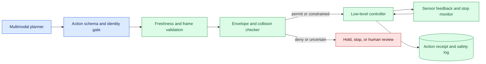
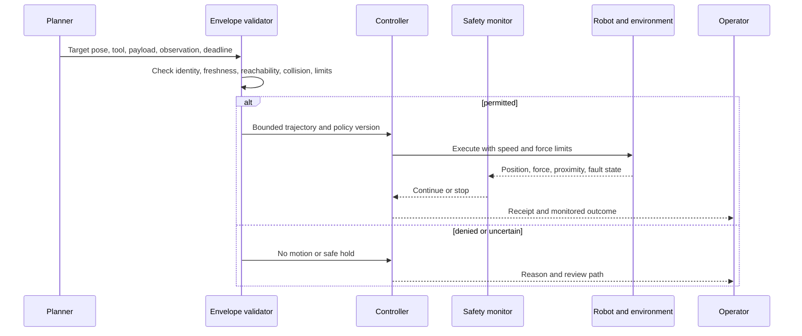

# Robotic safety envelopes
Status: emerging
Sources: [Google DeepMind — 2026-04-14](https://deepmind.google/blog/gemini-robotics-er-1-6/)

## In one sentence

A robotic safety envelope is deterministic policy around a proposed action: allowed workspace, speed, force, payload, proximity, timing, and emergency-stop behavior.

## Background: what existed before

Industrial robots traditionally operate inside engineered cells with known tooling, fixed workspaces, guarded access, and controllers that enforce joint, speed, torque, and collision limits. A task program may select a trajectory, but a lower-level controller checks whether the trajectory is valid for the robot configuration. Safety systems are designed around hazards and failure states rather than around the fluency of a command.

Generative planning changes the proposal layer. A multimodal model can interpret a natural-language instruction, identify objects, and suggest a goal pose. It may be useful at the edge of a system, but it does not know the full physical state and should not be the final authority for motion. A safety envelope is the independent boundary that converts a proposal into permit, modify, slow, stop, or review.

Prerequisites include coordinate frames, kinematics, velocity, force, payload, collision geometry, workspace, state freshness, and fail-safe design. Kinematics relates joint positions to tool position. A pose describes position and orientation. A fail-safe behavior moves toward a state where additional harm is less likely when evidence or control is lost. These terms must be represented in typed requests and validated before trajectory generation.

## What changed and why now

The April announcement reports vendor safety evaluations and describes handling constraints such as liquids and weight. Those are source-specific vendor claims about the announced model and evaluation setup. They are not a safety certification for a different robot, tool, facility, or task. The engineering consequence is to place the model behind deterministic site-specific constraints and to test what happens when the proposal is wrong or the sensor becomes stale.

The historical baseline assumed a bounded program and known environment. Agents operate in less structured scenes, receive changing instructions, and may chain perception, planning, and action. This increases the need for a clear action contract. The model can suggest “pick up the bottle,” but the control system must determine whether the object is identified, the grip is permitted, the payload is within limits, people are clear, and the observation remains fresh.

## Impact on current processing and architecture

Use a layered control path. The agent proposes a typed action with target, tool, payload, source observation, deadline, and purpose. A policy gateway checks identity and scope. A geometric validator checks reachability, workspace, collision, speed, and force. A lower-level controller executes only a bounded trajectory and has an independent stop path. Sensors and receipts are recorded for later verification.



The envelope is state-dependent. A speed limit may be safe in an empty cell but unsafe near a person. A payload limit depends on tool orientation and acceleration. A workspace can change when a fixture or temporary barrier is added. Keep the current scene, robot mode, calibration, tool, and policy version in the decision record. A proposal that was valid one second ago may expire before execution.



Use defense in depth. The model prompt can describe preferred behavior, but the envelope, controller, proximity sensor, and physical emergency stop provide independent barriers. No single check should be trusted for every hazard. A software stop may fail if the process is blocked; an electrical stop may remove power without preserving a stable object. Define the safe state for each mechanism and practice it.

## Real-world applications and constraints

In manipulation, limits cover reach, joint range, velocity, acceleration, force, grip, payload, and contact. Liquids can spill, flexible objects can deform, and grasp points can be occluded. Use a conservative payload assumption when the object is uncertain. Require a fresh observation before lifting and verify that the object is stable before the next step.

In collaborative workspaces, the envelope includes human proximity, reduced speed, separation monitoring, and a stop response. A camera-based person detector can support awareness but should not be the only safety barrier for a high-energy axis. Test a person entering unexpectedly, sensor dropout, ambiguous segmentation, and a stale frame. Define recovery so motion does not resume merely because the person disappears from one view.

In warehouses, mobile robots need geofences, speed zones, obstacle clearance, right-of-way, and route expiry. A planner can propose a path while a local controller handles immediate avoidance. A path through a currently clear aisle may become invalid when a pallet moves. Use local sensors and revalidate the route at execution time.

In laboratories, a robot may handle samples, chemicals, or glassware. The envelope includes container type, liquid volume, tilt, temperature, contamination zones, and operator access. A successful visual grasp is not proof that a chemical transfer is safe. Keep hazardous operations in a certified or human-supervised mode unless the entire control path has been evaluated.

In consumer devices, a smaller actuator may interact with children, pets, or household objects. The energy and consequence thresholds differ from an industrial cell, but uncertainty can be greater. Make slow mode, hold, and manual recovery understandable to users. Never hide a safety stop to make a demo look smoother.

Constraints include model latency, actuator dynamics, sensor coverage, calibration, maintenance, network outages, and operator workload. A safety envelope adds computation and can reduce throughput. That is a deliberate trade-off; optimize within the safe region rather than enlarging the region to meet a task metric. Measure stops, near misses, false denials, intervention time, and successful completion separately.

## Mental model

Think of the envelope as a cliff edge painted around a construction site. The planner can suggest where to work, but the boundary says where the equipment may move, how fast, and under what conditions. A map is not a guardrail; the controller needs an enforceable limit and a state that it can enter when the map is uncertain.

Separate intent, feasibility, and permission. Intent asks what task the user wants. Feasibility asks whether the robot can perform a bounded motion in the current geometry. Permission asks whether the operation is allowed for the identity, tool, payload, and environment. A model may answer the first; trusted components must decide the latter two.

## What changed this month

The April source reports safety-policy and physical-constraint evaluations for its robotics release, including examples involving liquids and weight. The source facts are limited to the announcement’s scope and vendor-reported results. This lesson treats them as a motivation for site-specific safety engineering, not as proof that a model can enforce a physical envelope by itself.

The practical shift is from an unconstrained action proposal to a typed, observable, and independently checked motion request. The envelope is versioned, tested against the actual robot and environment, and connected to a stop and recovery path. Capability, reliability, and physical safety remain separate claims.

## Engineering consequence

Define an action schema with request ID, caller, task, target frame, target pose, tool, payload range, source observation ID, state version, speed and force limits, deadline, workspace, policy version, and idempotency key. Reject missing or ambiguous fields. Resolve the target frame through a trusted transform service and verify that the observation and calibration are current.

Use a hierarchy of checks: authorization and scope, state freshness, kinematic reachability, collision and clearance, payload and contact limits, trajectory timing, and runtime sensor monitoring. The envelope checker should return reason codes, not a Boolean alone. A `stale_state` response needs reacquisition; `over_payload` needs a different tool or manual handling; `human_too_close` needs a hold until the zone is clear and verified.

Test in simulation, replay, and controlled hardware. Simulation can cover geometric edge cases cheaply, while hardware tests reveal vibration, friction, latency, and emergency-stop behavior. Pin robot firmware, calibration, tool geometry, model, policy, and environment. After maintenance or a tool change, treat the envelope as a new configuration and rerun relevant tests.

## Limits and failure modes

### Wrong frame

A target pose in the wrong coordinate frame can produce a valid-looking but dangerous trajectory. Version transforms and reject unknown frames.

### Stale state

The robot or object can move after perception. Bind actions to state versions and enforce freshness immediately before motion.

### Payload uncertainty

An estimated mass or center of gravity can be wrong. Use conservative limits, force monitoring, and a safe test motion; do not infer safe handling from appearance alone.

### Collision-model gaps

An unmodeled fixture, cable, person, or flexible object can defeat geometric checks. Keep a local sensor layer and test changed environments.

### Stop failure

A command may be delayed or a controller may fail. Use an independent stop monitor, bounded leases, and a defined physical safe state. Test stop under network loss and sensor failure.

### Resume after stop

Automatically resuming when a hazard disappears from one sensor can repeat the original error. Require a fresh state, cause assessment, and appropriate operator or policy transition.

### Over-conservative envelope

Excessive denials can cause operators to bypass the system. Explain reason codes, provide safe manual alternatives, and tune only with evidence. Never loosen a critical limit solely to improve completion metrics.

### Model overreach

A confident plan or explanation does not grant motion authority. Keep generated text and action permission separate.

### Calibration and maintenance drift

Tool replacement, camera movement, firmware, or mechanical wear can invalidate limits. Record configuration identity and run readiness checks.

### Verification and recovery

After a stop, do not treat the absence of the original alarm as permission to continue. Identify whether the stop came from proximity, stale state, force, controller fault, or operator action. Preserve the last action request and sensor evidence, inspect the physical scene, and perform a low-energy verification before restoring motion. If the object may have shifted or the tool may be damaged, invalidate the old plan and require fresh perception. A recovery receipt should name the person or controller that authorized the transition and the policy version applied.

Safety envelopes should be reviewed when the operating domain changes. A new fixture, floor layout, payload, speed mode, or user population can change the hazard analysis. Maintain a small library of boundary cases and replay them after software, firmware, calibration, or model updates. Record both prevented violations and false denials; the latter may reveal a bad transform or stale configuration rather than an overly strict safety rule.

### Service boundaries

Keep the envelope validator close to the controller that owns motion authority. A remote planner may be unavailable, but the robot should still stop safely. Likewise, a gateway should not claim that a command is safe merely because a downstream controller has not reported an error. Return a clear permit or no-permit result, include the state and configuration versions, and make timeouts conservative. This separation prevents a fluent remote service from becoming a hidden safety dependency.

## Mini exercise (15–30 min)

Implement a two-dimensional envelope for a toy robot. Accept a target only when it is inside a workspace, below a speed limit, within payload range, and supported by a fresh observation. Add a person-proximity violation and verify that the controller returns `hold` rather than a modified command. Record policy and observation versions.

## Build it locally

```python
def permit(req, policy):
    if req["age"] > policy["max_age"]: return "hold:stale"
    if req["speed"] > policy["max_speed"]: return "deny:speed"
    if req["payload"] > policy["max_payload"]: return "deny:payload"
    if req["distance"] < policy["min_distance"]: return "hold:proximity"
    return "permit"

policy = {"max_age": 2, "max_speed": 1.0, "max_payload": 5, "min_distance": 0.5}
print(permit({"age": 1, "speed": .4, "payload": 2, "distance": 1}, policy))
print(permit({"age": 1, "speed": .4, "payload": 2, "distance": .2}, policy))
```

1. Save the example as `safety_envelope.py` and run `python3 safety_envelope.py`.
2. Add workspace coordinates and reject targets outside the polygon.
3. Add tool identity and require a matching payload limit.
4. Add observation version and reject a changed state at execution.
5. Add a stop lease that expires unless the monitor renews it.
6. Log each permit, deny, and hold with reason and policy version.

## Interview Q&A

**Why can’t the model be the safety controller?** It interprets uncertain inputs and proposes actions; deterministic and independent controls must enforce physical limits and stop behavior.

**What belongs in an action request?** Target frame and pose, tool, payload, observation and state version, deadline, caller, limits, and policy identity.

**What should happen when a person is too close?** Hold or stop according to the engineered safe state, log the reason, and require fresh verification before resuming.

**How do you validate a safety envelope?** Use simulation, replay, and controlled hardware tests with stale state, calibration drift, obstacles, payload uncertainty, network loss, and stop failures.

**Why distinguish false denial from unsafe permission?** False denial costs throughput and usability; unsafe permission can cause physical harm. They require different thresholds and escalation.

## Glossary

**Safety envelope:** Enforceable limits on when and how an action may occur.

**Pose:** Position and orientation in a coordinate frame.

**Kinematics:** Relationship between robot joints and tool position or motion.

**Clearance:** Minimum allowed distance from an obstacle or person.

**Payload:** Mass and physical properties carried by a tool.

**Safe stop:** Controlled state that prevents or reduces further hazardous motion.

**State freshness:** Whether the observation is current enough for an action.

## References

- [Google DeepMind — Gemini Robotics ER 1.6](https://deepmind.google/blog/gemini-robotics-er-1-6/) — source context for robotics safety-policy and physical-constraint evaluations.
- [ROS 2 Control documentation](https://control.ros.org/) — controller and hardware-interface context.
- [NIST AI Risk Management Framework](https://www.nist.gov/itl/ai-risk-management-framework) — risk and accountability context.

## Claim ledger

| Claim | Source | Fact or inference |
| --- | --- | --- |
| Google DeepMind reports safety-policy and physical-constraint evaluations for its robotics release. | Google DeepMind Gemini Robotics ER 1.6 | Vendor source claim |
| A generated action proposal should be checked by independent physical and policy controls. | Safety architecture reasoning | Engineering recommendation |
| Observation freshness, calibration, payload, and clearance are inputs to a robotic action boundary. | Robotics systems reasoning | Engineering recommendation |
| Model capability, local reliability, and physical safety are separate claims. | Lesson synthesis | Engineering distinction |
| Emergency-stop and recovery behavior must be tested under realistic failures. | Safety engineering reasoning | Engineering recommendation |
