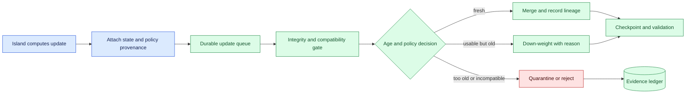
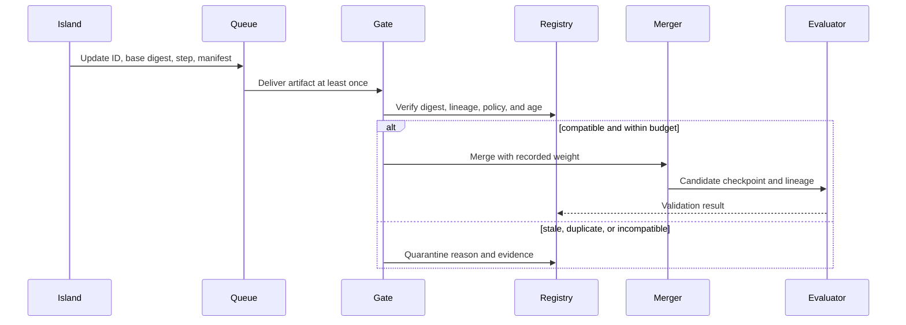

# Training staleness
Status: emerging
Sources: [Google DeepMind — 2026-04-23](https://deepmind.google/blog/decoupled-diloco/)

## In one sentence

Training staleness is the distance between the state that produced an update and the state that receives it, which asynchronous systems must measure rather than ignore.

## Background: what existed before

In synchronous data-parallel training, workers commonly compute a step from the same model version and wait at a coordination barrier before advancing. The barrier gives a simple interpretation to an update: the gradients or reduced result correspond to a known point in the training trajectory. Its cost is availability and latency. One slow accelerator, network interruption, or failed host can hold the rest of the job.

Asynchronous training lets a worker or compute island continue while peers are delayed. The benefit is less waiting and better tolerance of local disruption. The cost is that an update may be computed from an older model, older optimizer state, older data policy, or older environment. Staleness is not only a timestamp; it is a compatibility and causality question.

The prerequisites are model versions, step counters, checkpoints, manifests, queues, merge policies, and validation. A model version identifies the parameters used for an update. A step counter records progress. A manifest identifies code, tokenizer, data, optimizer, and policy. A merge policy decides how an update is accepted, weighted, quarantined, or rejected. Validation tests whether the resulting state remains useful and within the deployment contract.

## What changed and why now

The April DiLoCo source describes asynchronous flow between decoupled compute islands. That is a source-specific vendor claim about the architecture and its intended resilience, not a universal convergence guarantee. The engineering change is that update age becomes an explicit lifecycle state. A system must know how old an update is, whether it shares compatible semantics, and what quality evidence supports merging it.

The historical baseline used a global step and a tight barrier. Current systems may span regions, organizations, or intermittent accelerator pools. One island can be offline while another advances. When the offline island reconnects, its update may reflect useful data or may be actively harmful because the active model, vocabulary, loss function, or safety filter changed. Treating every delayed artifact as valuable creates hidden state corruption.

## Impact on current processing and architecture

Attach provenance to every update: update ID, source island, base model digest, source step, local step range, optimizer and tokenizer fingerprints, data manifest and policy versions, creation time, delivery time, checksum, and parent checkpoint. A receiver first verifies integrity and compatibility, then computes step and wall-clock age. Only after those checks does the merge policy choose an action.



Use several age measures. Step staleness is active receiver step minus source base step. Wall-clock staleness is delivery or creation age. Data staleness describes whether the data policy and source snapshot remain valid. Configuration staleness captures changes to tokenizer, labels, optimizer, loss, or safety policy. A low step age does not compensate for an incompatible policy version.



The merge operation must be idempotent. Queue redelivery should not apply the same update twice. A receipt says an update was stored; an acceptance record says it passed the gate; a merge record says it changed active state. Keep these events separate. If a merge is interrupted, replay the acceptance and merge IDs rather than assuming the final response indicates whether parameters changed.

## Real-world applications and constraints

In distributed foundation-model training, islands may collect different data distributions. An island that is late may contain a rare language or domain that the fastest islands underrepresent. Blindly discarding it can reduce coverage; blindly applying it can destabilize the model. Use validation by slice and document whether weighting prioritizes freshness, data coverage, or numerical stability.

In federated or privacy-sensitive learning, a client update may be delayed by connectivity or approval. It can also be based on data that has been withdrawn or a policy that no longer permits use. The receiver must check data-policy version and retention state, not merely tensor shape. A quarantined update may be retained under governance for audit without entering the model.

In recommendation and ranking systems, feature or label distributions change quickly. A stale update may optimize yesterday’s behavior and worsen current performance. Measure data cutoff, training-to-serving skew, and protected slices. For online fine-tuning, bound update age and maintain a stable fallback model.

In reinforcement learning or robotics, the environment can change while an island trains. An update based on an old simulator, action space, or safety policy may be semantically invalid. Require environment and policy fingerprints. Never merge an update that was produced while a critical safety rule was disabled unless a separate review explicitly permits it.

Constraints include communication, storage, optimizer behavior, statistical heterogeneity, privacy, and cost. Tighter staleness budgets reduce available updates and may recreate a barrier. Larger budgets improve utilization but can increase divergence or erase recent corrections. Compare policies experimentally using matched initialization, data budget, validation set, and fault schedule. The right budget is workload-specific.

## Mental model

Think of updates as messages from branches in a version-control system. A branch can be valuable even when old, but a merge needs ancestry, compatibility, conflict rules, and review. “Arrived” is not “current,” and “same shape” is not “same meaning.” A quarantine is a normal state that preserves evidence while protecting active state.

Use two clocks and one contract. The clocks are training progress and wall time. The contract contains model, data, optimizer, policy, and environment identity. An update is eligible only when its ages and contract satisfy the task’s rule. The merge policy then chooses how much influence it has. This makes staleness observable and tunable instead of an unexplained quality regression.

## What changed this month

The April source describes asynchronous data flow among decoupled training islands. The source fact is limited to the announced architecture and claims. The lesson applies that concept to update lifecycle design: staleness must be measured across steps, time, data policy, and configuration, with explicit merge and quarantine decisions.

The practical shift is from assuming one global training clock to maintaining a lineage graph. A recovered or delayed island is not automatically equivalent to a current worker. Its artifact is accepted only when evidence shows that it remains compatible and useful.

## Engineering consequence

Define a staleness policy table by workload. Record maximum step age, wall-clock age, policy age, allowed weighting, action after expiry, and owner. For example, a read-only experiment may quarantine old updates for analysis, while a production safety model may reject any update built under an old policy. Make the policy version part of the update and active run manifest.

Evaluate staleness with controlled experiments. Compare synchronous, bounded asynchronous, and permissive asynchronous policies under the same data and initialization. Inject delays around checkpoint and merge boundaries. Report convergence, validation by slice, update rejection, communication, recovery time, cost, and final artifact lineage. A higher utilization rate does not establish a better model.

Monitor update age distributions, duplicate rate, quarantine causes, merge weights, rejected policy versions, divergence signals, and time from source creation to validation. Alert on sudden age increases or one island producing unusual deltas. When a model or policy changes, stop or drain incompatible queues and start a new lineage segment.

## Limits and failure modes

### Numerical staleness

An old gradient or delta may point in a direction that no longer fits current parameters. Bound age, test weighting, and validate the merged checkpoint.

### Semantic staleness

Matching tensor shapes can hide changed tokenizer, labels, loss, optimizer, or safety rules. Fingerprint these dependencies and reject mismatch.

### Data-policy staleness

An update can contain information from a source that is no longer permitted. Check data manifest and policy version before merge and document quarantine retention.

### Queue replay

At-least-once delivery can duplicate an update. Use stable IDs and idempotent acceptance and merge records.

### Reconnection burst

An offline island can release many old updates at once. Bound queue and merge rate, preserve evidence, and apply backpressure.

### Straggler bias

Fast islands may dominate while slow islands contain important data. Inspect slice coverage and weighting consequences.

### Hidden configuration drift

Runtime, environment, or policy changes can invalidate old artifacts. Include them in manifests and create explicit migration boundaries.

### False availability

Workers may stay busy while model quality or protected slices regress. Gate promotion on validation, not utilization.

### Recovery ambiguity

A timeout can leave an update stored, accepted, or merged. Keep separate event states and reconcile before retrying.

### Promotion and rollback

Staleness policy should not end at the merge. The candidate checkpoint needs a promotion decision that includes its complete parent lineage, the set of accepted and rejected updates, evaluation results, and the active policy. Keep the last known-good checkpoint available while validation runs. If a protected slice regresses or a late update is discovered to have violated data policy, route traffic or future training back to the known-good artifact and mark the suspect lineage unavailable for automatic reuse.

Rollback is complicated when downstream systems have already consumed the candidate. Record which serving workers, feature transforms, or evaluation jobs used each artifact. A model rollback does not necessarily undo predictions, actions, or data derived from the model. Notify owners and preserve the incident evidence. For an online learner, pause new updates while the cause is investigated; otherwise a rollback can be immediately overwritten by another stale or incompatible update.

### Choosing a budget

Choose a staleness budget from failure consequences and measured behavior. Start with a narrow threshold and widen it only when matched experiments show acceptable quality, convergence, and recovery. A single average loss curve is insufficient: inspect rare classes, safety cases, language slices, calibration, and action outcomes. Document the reason for the budget and the conditions that require re-evaluation. Network improvement may reduce wall-clock age without fixing semantic drift, while a policy change may require zero tolerance for old data.

### Operator workflow

Operators need a view of the active state and the delayed state. Show the oldest queued update, source island, base digest, policy version, estimated influence, quarantine reason, and validation status. Provide actions to pause merge, drain a source, re-run validation, or accept a documented exception. Avoid a button that says “force merge” without requiring owner, reason, expiry, and evidence. The interface should make the safe path visible during a network recovery or incident.

## Mini exercise (15–30 min)

Create three synthetic updates with source steps 98, 100, and 104 while the receiver is at step 105. Implement a policy that merges fresh updates, down-weights usable old updates, and quarantines incompatible manifests. Add duplicate delivery and a data-policy change. Report each decision with age and reason.

## Build it locally

```python
def decide(update, active, manifest, seen):
    if update["id"] in seen:
        return "duplicate"
    if update["manifest"] != manifest:
        return "quarantine:manifest"
    age = active - update["base"]
    if age > 5:
        return "quarantine:stale"
    seen.add(update["id"])
    return "merge:full" if age <= 2 else "merge:downweighted"

seen = set()
u = {"id": "u-1", "base": 103, "manifest": "run-4"}
print(decide(u, 105, "run-4", seen))
print(decide(u, 105, "run-4", seen))
```

1. Save the example as `staleness_policy.py` and run `python3 staleness_policy.py`.
2. Add creation time and a wall-clock age check.
3. Add tokenizer, optimizer, and policy fingerprints to the manifest.
4. Add a quarantine record with reason, source island, and evidence reference.
5. Simulate a merge crash and verify that replaying the same ID does not apply it twice.
6. Compare full and down-weighted updates on a small held-out fixture.

## Interview Q&A

**What is training staleness?** The age and compatibility distance between the state that produced an update and the state that receives it.

**Is wall-clock age enough?** No. Step age, data-policy age, and configuration compatibility can matter even when delivery is fast.

**What can a receiver do with an old update?** Merge, down-weight, quarantine, or reject according to a versioned workload policy and validation evidence.

**Why separate receipt and merge?** Storage or delivery acknowledgement does not prove that an update passed policy or changed active parameters.

**How do you know an asynchronous policy works?** Compare it with a controlled baseline under matched data and initialization, and measure convergence, protected-slice quality, recovery, cost, and lineage.

## Glossary

**Staleness:** Difference between an update’s source state and receiver state or policy.

**Update:** A gradient, parameter delta, checkpoint, or other training artifact exchanged between workers.

**Manifest:** Versioned record of model, data, code, optimizer, tokenizer, environment, and policy.

**Merge policy:** Rules determining whether and how an update changes active state.

**Quarantine:** Isolated retention of an artifact that is not eligible for active use.

**Lineage:** Parent versions and configuration history behind an artifact.

**Data-policy version:** Identifier for the permissions and processing rules applied to training data.

## References

- [Google DeepMind — Decoupled DiLoCo](https://deepmind.google/blog/decoupled-diloco/) — source context for asynchronous decoupled training islands.
- [PyTorch Distributed documentation](https://docs.pytorch.org/docs/stable/distributed.html) — distributed training concepts and implementation context.
- [NIST AI Risk Management Framework](https://www.nist.gov/itl/ai-risk-management-framework) — risk measurement and governance context.

## Claim ledger

| Claim | Source | Fact or inference |
| --- | --- | --- |
| The April DiLoCo source describes asynchronous flow between decoupled compute islands. | Google DeepMind Decoupled DiLoCo | Vendor source claim |
| An update’s age includes more than wall-clock delay because model, data, optimizer, and policy versions affect meaning. | Distributed-training reasoning | Engineering inference |
| Receipts, acceptance, and merge events should be recorded separately. | Systems-design reasoning | Engineering recommendation |
| Old updates may be useful for coverage but must follow explicit weighting or quarantine policy. | Lesson synthesis | Engineering recommendation |
| Utilization or continued worker activity does not establish convergence or model quality. | Evaluation reasoning | Engineering inference |
