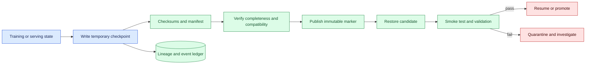
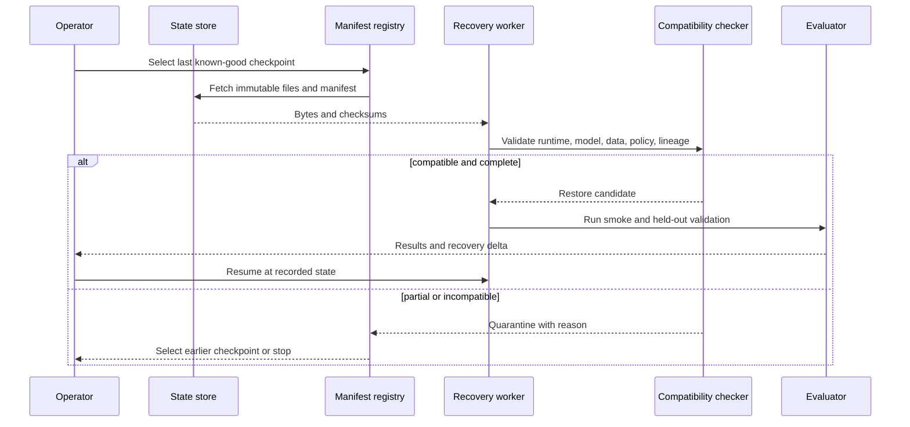

# Checkpoint recovery
Status: emerging
Sources: [Google DeepMind — 2026-04-23](https://deepmind.google/blog/decoupled-diloco/)

## In one sentence

Checkpoint recovery is the ability to restart work from a verified, compatible snapshot without silently losing, duplicating, or corrupting training progress.

## Background: what existed before

A training run or stateful inference service accumulates state that does not fit in one process. Model weights describe parameters, but training also depends on optimizer moments, learning-rate scheduler, step counters, random-state choices, data position, tokenizer, code, configuration, and policy. A checkpoint is a persisted snapshot intended to let a run resume or let an operator inspect a known state.

The simplest checkpoint is a file of weights. That can be enough for stateless inference, but it is not enough to reproduce or safely resume training. Restoring weights with a different tokenizer or optimizer can change the meaning of subsequent updates. Restarting from a checkpoint without recording which data shards were consumed can duplicate or omit examples. Loading an object that was only partially written can produce a corrupted or plausible-looking artifact.

Prerequisites include object storage, atomic publication, checksums, manifests, version compatibility, idempotent retries, and recovery objectives. A digest identifies exact contents. A manifest describes the files and configuration that make a snapshot meaningful. Atomic publication means readers see either a complete checkpoint or no published checkpoint, not a half-written one.

## What changed and why now

The April distributed-training source presents resilience to local disruptions as a goal of its decoupled architecture. That is a source-specific vendor claim, not evidence that every workload can recover without quality loss. The engineering consequence is to make recovery a tested protocol: identify the last trusted state, verify its contents and lineage, restore in an isolated environment, validate behavior, and only then resume or promote.

The historical baseline assumed a single cluster and periodic snapshots managed by a training framework. Current workloads may span compute islands, regions, ephemeral accelerators, and asynchronous update queues. A failure can happen during an update merge, data-manifest change, or object-store outage. Recovery must therefore explain which updates were included, which were quarantined, and whether the restored job may safely receive new work.

## Impact on current processing and architecture

Write checkpoints in stages. First write content to a unique temporary prefix. Calculate and store per-file checksums. Write a manifest containing model, optimizer, scheduler, data, code, runtime, policy, and lineage identifiers. Verify all parts, then publish an immutable completion marker. Consumers discover only completed markers and verify the manifest and digest before loading.



Do not overwrite a published checkpoint. Immutable versions make rollback and investigation possible. A retention policy can remove old versions, but it should preserve the last known-good artifact and the evidence required by governance. A delete or legal hold is itself a state transition that the registry records.



A restore must preserve semantics. For training, include optimizer and scheduler state when the continuation contract requires it, plus data cursor, step, random seeds, gradient scaler, and distributed topology assumptions. For inference, weights and tokenizer may be sufficient for one route, but prompt template, safety policy, quantization, and runtime still matter. State what is intentionally not restored and how that changes the experiment.

## Real-world applications and constraints

In distributed training, checkpoint recovery lets a failed island restart without discarding all progress. The system needs a clear boundary for updates in flight. An update acknowledged by storage but not merged should not be counted as active. A merge interrupted after writing parameters but before recording lineage requires reconciliation, not an automatic replay.

For online learning, checkpoints create a stable fallback when a fresh update harms protected slices. The fallback must be identified in serving routes and kept compatible with feature schemas. Rollback does not undo predictions or actions already made by the newer model; record affected artifacts and owners.

For model serving, an artifact can be restored after a node failure or redeployed during a canary rollback. Verify loaded digest, tokenizer, prompt contract, output schema, and policy before admitting traffic. A liveness response from the process is not enough. Warm-up cost and memory pressure may make an older artifact operationally preferable even if the newest one is more accurate.

For data pipelines, checkpoints can represent partition progress. Store input manifest, offsets, output IDs, and idempotency keys. A restart should not create duplicate downstream writes. If the source is mutable, snapshot or version it so a re-run does not silently process different data.

Constraints include storage cost, upload time, consistency semantics, encryption, access control, and recovery time. Frequent checkpoints reduce lost work but increase bandwidth and contention. Large checkpoints can delay training and make recovery itself a storm. Compress and shard deliberately, but retain metadata that allows a partial failure to be diagnosed. Test the object store behavior your deployment actually uses.

## Mental model

Think of a checkpoint as a sealed time capsule with a table of contents, chain of custody, and test certificate. The files are the contents; the manifest says what they mean; the digest proves which bytes were inspected; the validation result says whether the capsule can be opened in the current environment. A file copied successfully is not necessarily a valid time capsule.

Recovery is a state machine: `writing`, `verifying`, `published`, `candidate`, `validated`, `active`, `quarantined`, or `retired`. Transitions need events and owners. A failed restore should not silently become an active run. A successful restore should not erase the prior checkpoint’s identity or the fact that a failure occurred.

## What changed this month

The April source motivates checkpoint and fault isolation through decoupled distributed training. The source fact is limited to the announced architecture and goal. This lesson turns the idea into an artifact protocol with completeness, compatibility, lineage, validation, and rollback evidence.

The practical shift is from “save weights periodically” to “publish a verifiable release of state.” That applies to training, serving, and data processing. Recovery quality is measured by restored correctness and reproducibility, not merely by how quickly a process restarts.

## Engineering consequence

Define a checkpoint manifest with checkpoint ID, parent ID, model and tokenizer digests, optimizer and scheduler versions, code and runtime image, data manifest and cursor, policy version, topology, step, RNG state policy, creation time, checksums, and completion status. Make the marker immutable and require readers to verify it. Encrypt sensitive state and restrict restore credentials; checkpoint access may expose training data or optimizer information.

Define recovery objectives: maximum lost work, restore time, acceptable validation delta, artifact availability, and duplicate-effect tolerance. Test cold restore, partial upload, corrupt file, missing dependency, incompatible manifest, revoked access, and interrupted resume. Measure time to identify the last good checkpoint separately from time to load it and time to validate it.

Use a recovery canary. Restore into an isolated worker, run deterministic smoke cases and protected validation, compare output schema and key metrics, then admit a small workload. Keep the old route available until the candidate proves compatible. For training, compare lineage and validation before merging new updates. For data, reconcile output receipts before replaying partitions.

## Limits and failure modes

### Partial publication

A reader may find some files but not all. Use temporary prefixes and completion markers; never infer completeness from directory listing.

### Corruption or tampering

Verify checksums and signatures where available, restrict storage access, and compare loaded identity with the manifest.

### Semantic mismatch

Matching tensor shapes do not prove matching tokenizer, optimizer, labels, policy, or data. Check all required dependencies.

### Duplicate progress

A restart can repeat data or external writes. Store cursors, idempotency keys, and receipts; reconcile uncertain effects.

### Stale rollback

An older checkpoint may not include current policy, schema, or deletion state. Validate governance and compatibility before use.

### Recovery storm

Many workers restoring together can overload storage and network. Add backoff, quotas, and staged admission.

### Missing optimizer state

Training may continue from weights but with altered dynamics. Label the run as a fork or restore the required state; do not claim exact continuation.

### Validation shortcut

Passing a load or liveness check does not establish quality or safety. Run task, protected-slice, and policy checks.

### Retention and privacy

Snapshots can contain sensitive data or model secrets. Apply encryption, roles, retention, legal holds, and deletion verification.

### Recovery drills

Run restore drills while the primary system is healthy. Select a checkpoint by policy, restore it into an isolated environment, verify its digest and manifest, and execute a small set of representative requests or training steps. Compare outputs, state transitions, and validation metrics with the recorded baseline. Record the time spent finding the artifact, downloading it, loading it, checking it, and making the recovery decision. A drill that is never measured cannot reveal whether the recovery objective is realistic.

Vary the drill conditions. Test missing credentials, slow object storage, a malformed marker, one missing shard, an incompatible runtime, a revoked policy, and an operator who is unavailable. The safe outcome may be an earlier checkpoint or a controlled stop. Keep the drill evidence separate from production state and remove temporary restore permissions afterward. Exercises should result in a runbook change or a regression fixture when a step is unclear.

### State and data boundaries

A checkpoint can be internally valid while its external dependencies have moved. Feature schemas, label definitions, permission rules, and source data may have changed since the snapshot was written. The manifest must state whether these dependencies are embedded, versioned, or required at restore. If a current policy prohibits use of an old data source, quarantine the checkpoint even when its numerical checksum is correct. Recovery is a compatibility decision across the whole processing graph.

For data-producing jobs, record output partitions and side-effect receipts alongside progress. After restoring, compare the planned cursor with durable downstream state. Reuse idempotency keys and reconcile unknown writes before replay. A checkpoint that prevents duplicate computation but not duplicate customer notifications is incomplete for the actual workflow.

### Human handoff

Recovery often crosses teams: platform staff restore infrastructure, ML engineers assess lineage and metrics, security approves credentials, and a domain owner accepts residual risk. Define the handoff data and decision rights before an outage. The operator should see the candidate checkpoint, evidence status, known limitations, and rollback route. Do not make a responder infer safety from a filename or a green process monitor. A clear handoff reduces recovery time without encouraging an unverified resume.

## Mini exercise (15–30 min)

Create a local checkpoint directory with a model file and manifest. Write a completion marker only after checksums match. Simulate a partial file and a changed runtime version, then make the loader quarantine both. Add an idempotent restore record and a smoke-test result before marking the checkpoint active.

## Build it locally

```python
import hashlib

def digest(text):
    return hashlib.sha256(text.encode()).hexdigest()

def restore(snapshot, runtime):
    if not snapshot.get("complete"):
        return "quarantine:incomplete"
    if snapshot["runtime"] != runtime:
        return "quarantine:runtime"
    if digest(snapshot["weights"]) != snapshot["digest"]:
        return "quarantine:checksum"
    return "active"

snap = {"complete": True, "runtime": "r1", "weights": "weights-7"}
snap["digest"] = digest(snap["weights"])
print(restore(snap, "r1"))
print(restore({**snap, "complete": False}, "r1"))
```

1. Save the example as `checkpoint_restore.py` and run `python3 checkpoint_restore.py`.
2. Add model, tokenizer, data, and policy versions to the snapshot.
3. Add a parent checkpoint and reject a missing lineage reference.
4. Add a validation state between checksum verification and `active`.
5. Simulate an interrupted restore and ensure retrying the same checkpoint ID is idempotent.
6. Record recovery time and validation delta in a local evidence record.

## Interview Q&A

**Why are weights alone insufficient for training recovery?** Optimizer, scheduler, data position, random state, code, tokenizer, and policy can change the continuation semantics.

**How should a partial checkpoint be handled?** Keep it unpublished or quarantine it; never use object existence as proof of completeness.

**What does a successful restore prove?** Only that the artifact loaded and passed the defined checks. Quality, safety, and reproducibility still require workload-specific validation.

**Why record lineage?** It explains which parent, updates, data, and configuration produced the state and prevents incompatible or duplicate replay.

**How do you test recovery?** Regularly restore in isolation with corruption, access failure, interruption, version mismatch, duplicate delivery, and protected validation cases.

## Glossary

**Checkpoint:** Persisted model, training, serving, or pipeline state intended for safe restore.

**Manifest:** Metadata describing checkpoint contents, versions, configuration, and lineage.

**Completion marker:** Immutable record indicating a checkpoint passed publication checks.

**Lineage:** Parent artifacts and updates that produced a checkpoint.

**Restore:** Loading a checkpoint into a compatible runtime and state machine.

**Quarantine:** Isolated retention of a state that is not eligible for active use.

**Recovery objective:** Defined target for restore time, lost work, quality, and availability.

## References

- [Google DeepMind — Decoupled DiLoCo](https://deepmind.google/blog/decoupled-diloco/) — source context for distributed resilience and recovery.
- [PyTorch Distributed Checkpoint](https://pytorch.org/docs/stable/distributed.checkpoint.html) — distributed checkpointing implementation context.
- [NIST AI Risk Management Framework](https://www.nist.gov/itl/ai-risk-management-framework) — risk and accountability context.

## Claim ledger

| Claim | Source | Fact or inference |
| --- | --- | --- |
| The April source presents resilience to local disruptions as a distributed-training goal. | Google DeepMind Decoupled DiLoCo | Vendor source claim |
| A checkpoint needs integrity, compatibility, and lineage checks before restore. | Systems-design reasoning | Engineering recommendation |
| A process restart or liveness response does not establish successful model recovery. | Reliability reasoning | Engineering inference |
| Training and data recovery require duplicate and partial-effect handling. | Distributed-systems reasoning | Engineering recommendation |
| Restored artifacts require workload-specific quality and safety validation. | Lesson synthesis | Engineering recommendation |
