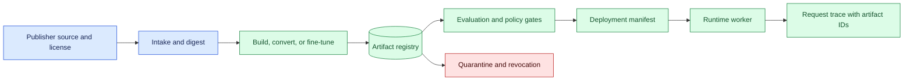
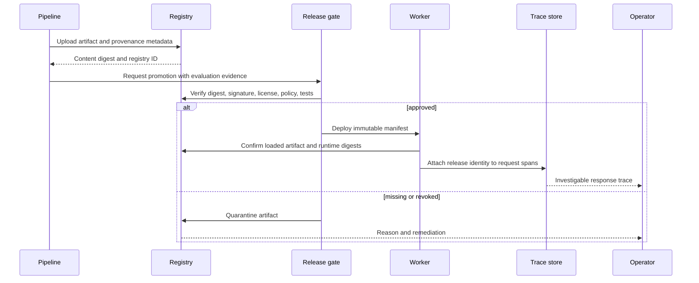

# Model artifact provenance
Status: emerging
Sources: [Google DeepMind model cards — 2026-04-02](https://deepmind.google/models/model-cards/)

## In one sentence

Model artifact provenance connects a running model response to the exact weights, tokenizer, runtime, license, configuration, data lineage, and evaluation record that produced it.

## Background: what existed before

Software engineers learned to identify releases with source commits, package versions, build IDs, and container digests. A model release needs the same discipline, but its behavior depends on more than one executable. Weights, architecture configuration, tokenizer, prompt template, quantization, adapters, runtime kernels, hardware, safety policy, retrieval index, and evaluation data can all change the result.

An artifact name or a mutable download tag is not immutable identity. A model registry should store content digests, source and license information, parent artifacts, conversion settings, training or fine-tuning metadata, and approval state. Provenance is the record that lets an operator answer: which bytes were loaded, by which runtime, under which policy, for which request, and with what evidence?

The prerequisites are hashes, signatures, registries, build pipelines, software bills of materials, access control, deployment manifests, and traces. A digest identifies content; a signature binds content or metadata to a trusted signer. A registry is a controlled store for artifacts and metadata. An SBOM lists software components in a build. A trace connects processing stages for one request.

## What changed and why now

The April model-card index lists a Gemma 4 update dated April 2, 2026. That is a source fact about the publisher’s index, not evidence that any downloaded artifact, conversion, local runtime, or deployment is equivalent to the source entry. The engineering change is that teams can obtain, convert, fine-tune, quantize, and serve model artifacts in many environments, making supply-chain identity part of model reliability.

The historical baseline relied on a hosted endpoint whose provider controlled model loading and often exposed a model identifier in the API response. Local or open-weight operation transfers more responsibility to the operator. A file can be replaced, a tokenizer can be mismatched, a community quantization can alter behavior, or a runtime image can contain an unreviewed package. Without provenance, an incident investigation becomes speculation.

Provenance is not a claim that an artifact is good. It establishes identity and history. Quality, safety, license compliance, and production reliability require separate evidence. A signed artifact can still be unsafe for a new population; a reproducible build can still encode a flawed data policy.

## Impact on current processing and architecture

Use a provenance pipeline from source intake to request trace. Intake records source URL, publisher, license, release date, and downloaded digest. Build records parent artifact, conversion, code, dependencies, and output digest. Evaluation records fixtures, policy, environment, and results. Deployment records the manifest and loaded digests. The gateway attaches release identity to traces and blocks artifacts without required approval.



Keep the manifest immutable. Example fields include model digest, tokenizer digest, configuration digest, adapter digest, runtime image digest, hardware, quantization, prompt contract, policy version, evaluation run, license decision, signer, creation time, and expiry. A worker reports the values it actually loaded; the deployment controller compares them with the approved manifest.



The runtime should not fetch arbitrary model files based on user input. Give it a read-only reference to the approved artifact and restrict network and filesystem access after load. The registry and deployment control plane need stronger credentials than the inference worker. A model response should carry a release ID in operational metadata, while sensitive source or prompt data remains governed separately.

## Real-world applications and constraints

For open-weight deployment, provenance distinguishes original weights from quantized, merged, pruned, or fine-tuned derivatives. Store parent digests and transformation parameters. A derivative may be useful but cannot inherit every parent evaluation or license conclusion automatically. Re-evaluate changed behavior and review redistribution obligations.

For a hosted model route, record provider model ID, API version, adapter version, request policy, and the time of the call. The provider may change behavior behind a stable identifier; local evidence should state what the identifier guarantees and what it does not. A request trace cannot prove hidden provider weights, but it can prove which contract and route the application selected.

For retrieval-augmented systems, model provenance is only one part of the answer’s lineage. Record embedding model, index build, source versions, prompt template, reranker, and policy. If a user disputes an answer, the team must reproduce the context and model route or state why exact replay is unavailable.

For regulated or safety-sensitive systems, provenance supports change control and incident response. The deployment must map an artifact to evaluation, reviewer, license, data, and rollback records. Retention can conflict with privacy or deletion requirements; retain hashes and decisions when raw data must expire, and document the limitation.

Constraints include large files, expensive storage, signing-key management, offline environments, reproducibility limits, and multi-region consistency. Hashing identifies bytes but does not prove honest training or safe behavior. Signatures establish signer control but not signer competence. A container digest does not enumerate dynamically downloaded files unless the build prevents them. State these limits in the claim ledger.

## Mental model

Think of an artifact as a package with a passport and a chain of custody. The passport identifies its contents; the chain records transformations and handlers; the deployment manifest says where it is allowed to travel; the request trace records which passport was active. Provenance makes an artifact identifiable, not trustworthy by magic.

Separate identity, history, and evidence. Identity is digest and signature. History is parent, source, transformation, and environment. Evidence is evaluation, review, license, and deployment observation. A strong release links all three while keeping secrets and sensitive datasets out of general logs.

## What changed this month

The April model-card index provides a dated release-documentation reference for Gemma 4. The source fact is limited to that index entry. The engineering shift is to treat model-card and artifact intake as the beginning of a supply-chain record, then preserve identity through conversion, serving, and investigation.

This month’s practical change is from “we run model X” to “we run artifact digest Y, loaded by runtime Z, under manifest M, evaluated by run E.” That level of specificity is necessary when local quantization, fine-tuning, adapters, or provider changes can alter behavior.

## Engineering consequence

Define a provenance record with artifact ID, content digest, signer, source, license, parent IDs, transformation code and parameters, tokenizer, runtime image, dependencies, data and policy versions, evaluation run, approver, deployment targets, and revocation state. Store it in version control or an append-only registry. Require promotion gates to verify required fields and block unknown or revoked artifacts.

Generate an SBOM for runtime images and scan dependencies. Pin base images and packages. Make builds deterministic where practical, but record nondeterminism such as GPU kernels, random seeds, and compiler differences. A reproducible build should have a reproducibility check that compares expected digests or explains permitted variance.

At startup, the worker verifies the manifest, reports loaded identities, runs compatibility tests, and refuses traffic when the loaded artifact differs. At request time, the gateway attaches release, policy, route, and adapter IDs. On incident, query traces by release and compare affected requests, not only by friendly model name.

## Limits and failure modes

### Mutable tags

A name can point to new bytes. Pin digests and verify them at build and startup.

### Parent loss

A derivative without parent and transformation metadata cannot be evaluated or licensed confidently. Require lineage before promotion.

### Signature confusion

A valid signature may belong to an untrusted or unauthorized key. Maintain key ownership, rotation, revocation, and approval policy.

### Runtime drift

Weights can be unchanged while kernels, tokenizer, prompt template, or policy changes. Include them in deployment identity.

### Untracked downloads

Runtime code that fetches files at startup can defeat image provenance. Restrict network access or record and verify every fetched dependency.

### False reproducibility

Same input and digest may not produce bit-identical output across hardware or sampling. Record generation settings and permitted variance.

### Stale evaluation

An artifact can be identifiable but evaluated under an old policy or population. Set evidence expiry and re-run after material changes.

### License gaps

Parent, derivative, dataset, and runtime terms may differ. Keep a license review and stop promotion when obligations are unknown.

### Incident blindness

If traces store only a friendly model name, affected traffic cannot be isolated. Attach immutable release and policy IDs.

### Evidence at the promotion boundary

Promotion should be a decision with a complete evidence packet, not a file copy. The packet names the artifact and all runtime dependencies, records the evaluation dataset and protected slices, states known limitations, identifies the reviewer, and specifies the rollback manifest. Automated checks can verify digests, signatures, required fields, vulnerability results, license metadata, and schema compatibility. A human or accountable owner still needs to decide whether the evidence is relevant to the intended users and consequences.

Keep failed promotions and superseded manifests. They explain why a release was blocked and prevent a later operator from repeating the same mistake. If an artifact is withdrawn, mark it revoked with a reason and time rather than deleting the identity record. The registry can retain a digest and decision metadata while applying separate retention to large weights or sensitive evaluation data.

### Runtime attestation and drift

The registry describes what should run; runtime evidence describes what did run. At startup, emit a signed or access-controlled attestation containing manifest ID, loaded file digests, image digest, hardware, configuration, and health-check version. Periodically compare the running state with the approved manifest. Alert when a worker has an unexpected file, policy, or adapter. This is particularly important for long-lived workers that can survive a registry update or a partial deployment.

Do not include raw prompts, training examples, or secrets in a general attestation. Link to governed evidence by ID and restrict access to payloads. A useful incident query can identify all requests served by a release without exposing every customer input to every investigator.

### Migration and coexistence

During a migration, old and new artifacts may serve simultaneously. Route by explicit release ID, keep feature and tokenizer compatibility visible, and compare results on a controlled shadow set. If a downstream consumer expects a schema, validate it before traffic is admitted. When the migration completes, drain old workers and verify that no queue or cache still points to a retired artifact. Record the retirement event so later traces remain interpretable.

## Mini exercise (15–30 min)

Create a local artifact record for a text file representing weights. Hash it, record a parent and runtime, and build an approval gate that rejects changed bytes or missing license review. Add a derived artifact with a transformation parameter and show that its digest and lineage differ from the parent.

## Build it locally

```python
import hashlib

def digest(content):
    return "sha256:" + hashlib.sha256(content.encode()).hexdigest()

def approve(record, loaded):
    if not record.get("license_ok") or not record.get("parent"):
        return "reject:metadata"
    if record["digest"] != digest(loaded):
        return "reject:digest"
    return "approve"

artifact = {"digest": digest("weights-v2"), "license_ok": True, "parent": "base-v1"}
print(approve(artifact, "weights-v2"))
print(approve(artifact, "tampered"))
```

1. Save the example as `artifact_gate.py` and run `python3 artifact_gate.py`.
2. Add tokenizer, runtime, policy, and evaluation IDs.
3. Add a signature placeholder and reject an unapproved signer.
4. Create a derived artifact and record transformation code and parent digest.
5. Add a revocation state and prohibit deployment of revoked records.
6. Attach the approved artifact ID to a simulated request trace.

## Interview Q&A

**What does provenance prove?** It establishes identity and history of an artifact and deployment; it does not prove quality, safety, or legal suitability by itself.

**Why is a model name insufficient?** Names and tags can be mutable, while behavior also depends on tokenizer, runtime, policy, prompt, quantization, and hardware.

**What belongs in a model manifest?** Digests, parents, transformations, runtime, dependencies, policy, evaluation, license decision, signer, and deployment identity.

**Can a signature prove a model is safe?** No. It proves that an approved key signed content; safety requires independent evaluation and operational controls.

**How does provenance help incidents?** It isolates affected requests, identifies the loaded artifact and policy, supports rollback, and preserves a reproducible evidence trail.

## Glossary

**Provenance:** Record of an artifact’s source, identity, transformations, deployment, and evidence.

**Digest:** Hash-based identifier for exact content.

**Signature:** Cryptographic assertion by a key that binds content or metadata to a signer.

**Model manifest:** Immutable deployment metadata for artifacts and their operating contract.

**Lineage:** Parent artifacts and transformations behind a derivative.

**SBOM:** Software bill of materials for build dependencies.

**Quarantine:** State where an artifact is retained but not eligible for use.

## References

- [Google DeepMind model cards](https://deepmind.google/models/model-cards/) — dated model-release documentation context.
- [SLSA framework](https://slsa.dev/spec/v1.0/) — software supply-chain provenance and build integrity context.
- [NIST AI Risk Management Framework](https://www.nist.gov/itl/ai-risk-management-framework) — risk and accountability context.

## Claim ledger

| Claim | Source | Fact or inference |
| --- | --- | --- |
| The model-card index lists a Gemma 4 April 2026 update. | Google DeepMind model cards | Vendor index fact |
| A content name or mutable tag is not immutable artifact identity. | Supply-chain reasoning | Engineering inference |
| Derivatives should retain parent and transformation lineage. | Provenance design reasoning | Engineering recommendation |
| Artifact identity, deployment identity, and safety evidence are separate claims. | Lesson synthesis | Engineering distinction |
| Release and request traces should carry immutable artifact and policy IDs. | Systems-design reasoning | Engineering recommendation |
