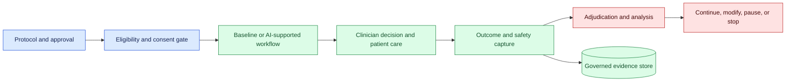
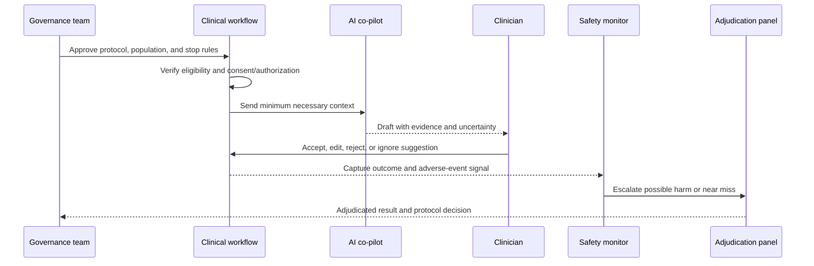

# Prospective clinical evaluation
Status: emerging
Sources: [Google DeepMind — 2026-04-30](https://deepmind.google/blog/ai-co-clinician/)

## In one sentence

Prospective clinical evaluation tests an AI-supported workflow in the intended setting and population before claims about care quality, safety, workload, or equity are generalized.

## Background: what existed before

Clinical software is often evaluated with retrospective records, curated benchmarks, expert review, usability studies, and simulations. These methods are valuable because they are controllable and can expose obvious failures before a patient encounters the system. They do not fully reproduce live care: records are incomplete, patients differ from the training set, clinicians interrupt one another, alerts compete for attention, and a suggestion can change behavior.

Prospective evaluation observes the system as it will actually be used, with an explicitly defined population, workflow, intervention, comparator, outcomes, safety process, and analysis plan. It is not synonymous with a randomized trial; a prospective pilot, silent deployment, stepped rollout, or observational study can have different designs. The important property is that the protocol is defined before live cases are interpreted and that safety responsibilities are clear.

Prerequisites include a target population, inclusion and exclusion criteria, baseline workflow, outcome definitions, consent or authorization, privacy controls, human oversight, incident reporting, and stop conditions. A primary outcome is the main measure the evaluation is designed to estimate. A safety event is a harmful or potentially harmful outcome that triggers review. A denominator is the number of eligible cases against which a rate is calculated; without it, percentages can mislead.

## What changed and why now

The April co-clinician announcement describes a research initiative and a simulation study involving hypothetical telemedical encounters. Those are source-specific research claims, not authorization or evidence of general clinical deployment safety. The engineering question is how a promising result should be tested in the actual population, record environment, staffing model, and escalation pathway.

The historical baseline often evaluated decision support after collecting records or in a laboratory with standardized cases. An AI co-pilot can alter documentation time, question selection, clinician attention, and patient communication. The evaluation must measure workflow effects as well as model output. A model that improves a rubric score but adds review burden or delays urgent escalation may not improve care.

Prospective evaluation also reveals deployment drift. New sites have different devices, languages, disease prevalence, record conventions, and staffing. A simulation may not include a missing allergy, a delayed lab result, or a clinician who disagrees with the draft. The protocol should treat these differences as data and safety signals rather than as inconvenient exceptions.

## Impact on current processing and architecture

Use a governed evaluation service. The protocol registry stores purpose, population, versioned intervention, comparator, outcomes, data access, reviewer roles, and stop rules. An enrollment gate verifies that a case is eligible and that the AI route is authorized. The co-pilot produces a draft or recommendation with provenance. The clinician remains accountable for the decision. An outcome service records workflow and safety results without exposing more patient data than required.



Do not let the research database become an uncontrolled clinical record. Link proposal IDs to encounter IDs through access-controlled references. Store source, model, policy, and prompt versions. Separate model exposure from clinician acceptance, edit, rejection, and final outcome. A silent mode can measure behavior without showing suggestions, while an assisted mode measures real workflow effects; compare them carefully.



## Real-world applications and constraints

For documentation assistance, measure note completion time, correction rate, omission rate, clinician workload, and patient-reported problems. Compare the signed record with source evidence, not only with a reference summary. A fast draft that introduces incorrect medications is a safety failure even if clinicians usually edit it.

For triage, define whether the AI is visible to patients, staff, or both. Measure time to escalation, missed urgent cases, unnecessary escalations, unanswered questions, language coverage, and availability. A prospective protocol needs an emergency fallback and a rule for what happens when review capacity is exhausted.

For guideline retrieval, measure evidence relevance, freshness, citation correctness, and time to a decision. The outcome is not that the model quoted a guideline; it is whether the authorized professional could use current evidence appropriately. Capture disagreement and unsupported specificity.

For clinical research screening, define the reference standard and how false negatives are reviewed. The AI can prioritize records, but it should not silently exclude a participant or alter consent. Protect the cohort definition and monitor for changes in prevalence or documentation practices.

For remote monitoring, account for sensor quality, device access, connectivity, and patient ability to respond. A prospective evaluation should distinguish missing data from normal values and define escalation ownership. An alert with no available clinician is not an operational control.

Constraints include sample size, rare harms, privacy, clinician fatigue, learning effects, site differences, and confounding. Early pilots may be too small to estimate rare safety rates precisely. State uncertainty, use staged exposure, and combine prospective observation with simulation, retrospective error analysis, and incident review. Do not overclaim from an underpowered study.

## Mental model

Think of prospective evaluation as a flight test with passengers, procedures, and an abort button. The test must be designed before takeoff, the crew must know who can stop it, and the destination must be measured. A model score is one instrument reading; it is not the complete flight record.

Separate three questions: does the model produce a useful proposal, does the workflow help professionals, and does the system improve patient outcomes without unacceptable harm? They require different evidence. A capable model may not fit a clinic; a faster workflow may not improve outcomes; and a positive average may conceal an unsafe subgroup.

## What changed this month

The April source describes AI co-clinician research and simulated telemedical evaluation. The source fact is limited to the reported initiative and simulation context. This lesson’s claim is that prospective evaluation is needed to understand the intended population and workflow; that is an engineering and clinical-governance inference, not a claim that the source authorizes deployment.

The practical shift is from evaluating an AI artifact in isolation to evaluating a governed socio-technical process. Patient identity, consent, record access, professional review, escalation, outcomes, and stop rules are part of the system under test.

## Engineering consequence

Write a protocol before exposure. Specify hypothesis, target population, sites, inclusion and exclusion, comparator, model and policy versions, primary and secondary outcomes, safety events, subgroup slices, missing-data handling, reviewer roles, privacy, retention, monitoring, and stop conditions. Predefine what counts as a protocol deviation and how it is reported.

Create a case-level ledger containing eligibility result, AI exposure, context version, proposal ID, clinician actions, final decision, outcome window, adverse-event signal, and adjudication state. Minimize payloads and use controlled identifiers. Keep model-generated text separate from signed clinical records until a professional accepts it.

Use staged rollout: retrospective rehearsal, silent prospective observation, limited professional assistance, and expansion only after review. At every stage, define an emergency disable route and a manual fallback. Monitor subgroup metrics and workflow workload. Review disagreement cases rather than averaging them away.

## Limits and failure modes

### Selection bias

Eligible cases may differ from excluded or non-participating cases. Record eligibility and exposure denominators and inspect missingness.

### Confounding

Clinicians may change behavior when the AI is visible. Choose a comparator and record co-interventions, staffing, and site changes.

### Learning and novelty

Performance can improve as users learn the interface or decline as novelty fades. Measure over time and separate ramp-up from stable operation.

### Rare harm

A small pilot cannot rule out rare serious events. Use simulation, targeted adversarial cases, conservative gates, and explicit uncertainty.

### Workflow overload

Extra alerts or review tasks can delay care. Measure queue age, acceptance, edits, escalation, and workload, not only model quality.

### Outcome delay

Some outcomes occur after the evaluation window. Define follow-up and distinguish missing outcome from negative outcome.

### Site and population shift

New languages, devices, disease mix, or documentation practices can change behavior. Gate expansion and monitor slices.

### Privacy and consent

Prospective data may contain sensitive records. Minimize collection, authorize access, define retention, and document patient communication.

### Analysis and evidence quality

Write the analysis plan before looking at the outcome differences. Define the unit of analysis, treatment or exposure window, missing-data handling, subgroup comparisons, and how protocol deviations affect the denominator. Report counts as well as percentages. If five of six escalated cases were reviewed, say that six were eligible and one lacked a review rather than presenting a clean five-case rate. Keep raw clinical content under access control and publish only the minimum evidence needed for governance.

Adjudication should be independent of the system’s own confidence. A clinical reviewer can determine whether a suggestion was supported, incomplete, harmful, or simply unnecessary. For serious events, use a panel or established safety process and preserve the original proposal, context version, clinician action, and outcome timeline. Do not overwrite a disputed suggestion with the corrected note; retain both with clear status and permissions.

### Rollout decision

At each stage, make the decision criteria visible. Continue when the primary outcome improves or remains neutral, safety events stay within bounds, protected slices do not regress, and reviewers can use the fallback. Modify when performance is useful but workload, equity, or evidence gaps need controls. Pause when a serious event, privacy issue, or escalation failure occurs. Stop when the risk cannot be bounded. A positive mean result should not override a predeclared stop rule.

### Sustainability

Prospective evaluation continues after launch. Monitor drift in population, source systems, model versions, clinician behavior, and outcome delays. Set a review cadence and triggers for re-evaluation: model update, new clinic, new language, new data source, changed policy, incident, or sustained subgroup movement. Retire the route when the manual workflow changes or the evidence expires. This prevents an early pilot result from becoming an unexamined permanent claim.

### Communication

Explain the evaluation to clinicians and patients in terms they can act on: what the AI sees, what it may suggest, who reviews it, how to report a problem, and what happens when it is unavailable. Avoid describing a simulation result as clinical proof. Internally, give operators a dashboard with exposure, queue age, edits, escalations, safety events, and current protocol state. Clear communication is part of safety because it determines whether a person recognizes a proposal as unverified and knows how to override it.

### Unsafe interruption

An AI outage or protocol pause must leave a functioning manual route. Test disablement during peak workload.

## Protocol execution and clinical workflow

Prospective evaluation is an operational protocol, not merely a before-and-after score. Freeze the eligibility rule, exposure definition, comparator, outcome window, and safety-event process before enrollment. At the point of care, record whether the system was available, what version produced the suggestion, whether a clinician saw it, and what action followed. “Not used” can mean unavailable, ignored, overridden, or withheld by policy; those states have different interpretations and should not be collapsed.

The clinical workflow also needs a clean separation between assistance and care delivery. A co-pilot may summarize records, surface a differential, or suggest a next question, but a licensed professional remains responsible for the decision path defined by the protocol. Present evidence and uncertainty with the suggestion, make the manual route usable, and capture edits without implying that acceptance equals correctness. If the source’s reported system is tested in a particular setting, treat that setting as a bounded fact; generalization to another specialty, site, or population is an inference requiring new evidence.

Analyze workflow burden alongside patient outcomes. A useful suggestion that adds an unmanageable review queue can worsen care indirectly. Track time to review, alert volume, override reasons, missing follow-up, subgroup exposure, and escalation completion. Define stop rules that can pause the AI route while preserving ordinary care. The evaluation should be able to answer both “did the measured outcome change?” and “could this team safely operate the process that generated the result?”

## Mini exercise (15–30 min)

Draft a prospective pilot protocol for a synthetic documentation co-pilot. Define population, comparator, primary outcome, safety events, protected slices, reviewer roles, stop rules, and missing-data policy. Build a ten-case ledger with accepted, edited, rejected, unavailable, and escalated proposals. Calculate rates using explicit denominators.

## Build it locally

```python
def enroll(case, protocol):
    if case["age"] not in protocol["ages"]:
        return "ineligible:age"
    if not case["consent"]:
        return "ineligible:consent"
    if case["risk"] > protocol["max_risk"]:
        return "ineligible:risk"
    return "enrolled"

protocol = {"ages": range(18, 91), "max_risk": 2}
print(enroll({"age": 42, "consent": True, "risk": 1}, protocol))
print(enroll({"age": 42, "consent": False, "risk": 1}, protocol))
```

1. Save the example as `prospective_gate.py` and run `python3 prospective_gate.py`.
2. Add site, encounter, workflow, model, and policy identifiers.
3. Add a stop rule for an unsafe proposal or missing reviewer capacity.
4. Add a comparator field and calculate acceptance, edit, rejection, and escalation rates.
5. Add protected slices and report their denominators separately.
6. Remove direct patient text from the evidence record and retain only governed references.

## Interview Q&A

**Why is retrospective evaluation insufficient?** It cannot fully reproduce live handoffs, missing data, behavior change, staffing, consent, and consequences.

**What makes an evaluation prospective?** The population, workflow, measures, monitoring, and safety procedure are defined before observing the intended live cases.

**Does prospective mean randomized?** No. Prospective pilots, silent rollouts, observational studies, and randomized designs answer different questions.

**What should stop a pilot?** Predefined serious safety events, unacceptable subgroup regression, workflow overload, missing escalation capacity, privacy breach, or inability to maintain the manual fallback.

**Why measure clinician edits?** Edits reveal unsupported, incomplete, or unsafe suggestions and show whether the workflow actually reduces work.

## Glossary

**Prospective evaluation:** Testing a system in its intended future workflow and population under a predefined protocol.

**Comparator:** Baseline or alternative workflow used for interpreting outcomes.

**Primary outcome:** Main measure specified before the evaluation.

**Safety event:** Harmful or potentially harmful event requiring review or action.

**Protected slice:** Subgroup whose performance is reported and governed separately.

**Protocol deviation:** Departure from the approved evaluation procedure.

**Adjudication:** Structured review of ambiguous or potentially harmful cases.

## References

- [Google DeepMind — AI co-clinician](https://deepmind.google/blog/ai-co-clinician/) — April research and simulation context.
- [WHO — Ethics and governance of artificial intelligence for health](https://www.who.int/publications/i/item/9789240029200) — health-AI governance and human oversight.
- [NIST AI Risk Management Framework](https://www.nist.gov/itl/ai-risk-management-framework) — risk measurement and accountability.

## Claim ledger

| Claim | Source | Fact or inference |
| --- | --- | --- |
| The April source describes a research initiative and simulated telemedical evaluation. | Google DeepMind AI co-clinician announcement | Vendor research claim |
| Simulation or retrospective results do not establish safety for every live clinical workflow. | Evaluation reasoning | Engineering inference |
| Prospective protocols should define population, outcomes, monitoring, escalation, and stop rules. | Clinical governance reasoning | Engineering recommendation |
| Workflow effects and clinician behavior are part of evaluating a clinical co-pilot. | Socio-technical evaluation reasoning | Engineering inference |
| Model capability, clinical usefulness, and patient safety are separate claims. | Lesson synthesis | Engineering distinction |
