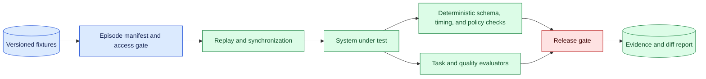
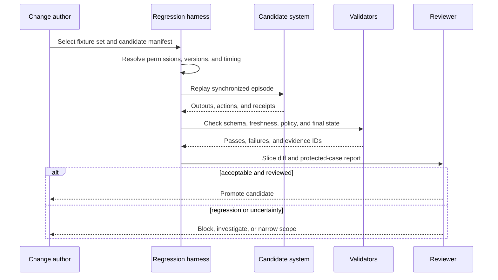

# Multimodal regression suites
Status: emerging
Sources: [Google DeepMind — 2026-04-14](https://deepmind.google/blog/gemini-robotics-er-1-6/)

## In one sentence

A multimodal regression suite preserves representative inputs, expected outcomes, timing, and safety assertions so changes in any component can be detected before release.

## Background: what existed before

Software regression tests preserve examples of behavior that must not break after a change. A text API may keep request fixtures, expected schemas, authorization cases, and error responses. Machine-learning teams add labeled data, golden outputs, and aggregate evaluation. Multimodal systems require more: camera frames, audio chunks, video timing, sensor readings, calibration, environment state, tool receipts, and final outcomes.

A regression fixture is not just a media file. It is a versioned episode with the context needed to interpret it. It identifies modality, capture time, source, environment, task, expected state, policy, and evaluator. The suite should test both capability and constraints. A model upgrade that recognizes more objects but acts on stale frames is a regression even if average task completion rises.

Prerequisites include version control, deterministic validators, replay, protected slices, data governance, and release gates. A protected slice is a high-risk or representative subset reported separately so an aggregate score cannot hide a serious failure. Replay feeds the same recorded scenario through a new system. Deterministic validation checks identities, timestamps, schemas, permissions, and state transitions without relying only on a generative judge.

## What changed and why now

The April robotics announcement separates evaluation conditions and discusses multiple views and physical-safety-related claims. Those are source-specific vendor claims about the reported release and experiments. The engineering implication is that a regression suite must preserve evaluation conditions, not only labels. If single-view and multi-view examples differ, they need separate fixture sets and must not be compared as if they were one benchmark.

The historical baseline treated a model version as the main change. Current multimodal applications have several moving parts: camera firmware, frame sampling, audio preprocessing, calibration, retrieval, prompt templates, policy, planner, controller, and runtime. Any one can alter outcome. A suite makes the processing graph observable and gives reviewers a reproducible way to inspect a failure.

## Impact on current processing and architecture

Build a fixture registry with immutable media references and a manifest. The manifest contains task, modalities, timestamps, environment, calibration, expected result, safety invariants, redaction status, and source license. The runner resolves a system manifest, replays the episode, applies deterministic gates, invokes the system, checks final state, and reports differences by slice.



Keep fixture and system versions separate. A fixture update can change labels or timing; a system update can change the model or policy. The report should state whether a failure is a new regression, an expected result of a fixture contract change, or an evaluator defect. Do not edit a fixture to make a new model pass without a review and a preserved prior version.



A suite should preserve causal order. The system must not receive frames captured after the decision it is evaluating. For video, keep frame timestamps and sampling configuration. For audio, preserve chunk order, endpointing, and interruption timing. For robotics, preserve action timing, sensor state, environment, and controller configuration. A replay that supplies future information can produce an invalidly optimistic result.

## Real-world applications and constraints

For robotics, fixtures cover grasping, navigation, pointing, tool use, success detection, and safe stops. Include good lighting, occlusion, moved objects, stale frames, calibration drift, person proximity, payload uncertainty, and controller delay. Assert final state and safety, not merely object labels. Keep a simulated set and a controlled hardware set; state what each can establish.

For voice agents, preserve audio chunks, speaker turns, transcription alternatives, interruption timing, tool authorization, and final account state. Test accents, noise, overlapping speech, delayed packets, and an operator interrupt. A transcript regression may matter less than a delayed or unauthorized tool call.

For video workflows, test frame sampling, temporal order, long gaps, scene changes, and multiple viewpoints. A model may recognize an event but place it at the wrong time. Store event boundaries and acceptable tolerance. For document pipelines, preserve layout, page order, resolution, and OCR confidence; validate extracted fields and downstream writes.

For clinical or industrial vision, use governed synthetic or de-identified fixtures and protected slices for rare but consequential conditions. Include unreadable, ambiguous, conflicting, and out-of-range cases. A regression suite must not become an unapproved store of sensitive media.

Constraints include fixture creation cost, label quality, nondeterministic outputs, privacy, simulator gap, and maintenance. Use exact assertions for contracts and ranges, tolerant assertions for generated language, and human review for ambiguous cases. Track fixture coverage and stale fixtures. A large suite can slow releases; tier it into fast smoke cases, full deterministic replay, and expensive physical or human evaluation.

## Mental model

Think of a regression suite as a museum of important failures and promises. Each exhibit has a provenance card, conditions, expected behavior, and reason it matters. A new model walks through the same rooms. If it behaves differently, the curator asks whether the change is improvement, regression, or a changed exhibit—not whether the average visitor liked it.

Separate three assertions: input integrity, system behavior, and world outcome. Input integrity asks whether the episode was delivered causally and with correct metadata. System behavior asks whether outputs, tool calls, and refusals fit the contract. World outcome asks whether the intended state was achieved safely. A passing first assertion does not imply the other two.

## What changed this month

The April release reports multiple evaluation settings and physical-safety-related claims. The source facts are limited to the announcement and its reported setup. This lesson applies that distinction to release engineering: preserve separate conditions, modalities, environments, and scoring rules so a result remains interpretable.

The practical shift is from testing the model in isolation to testing the complete multimodal processing path. A change to camera timing, prompt, policy, controller, or evaluator can produce a regression even when weights are unchanged. The suite records those dependencies and makes protected failures release-blocking when appropriate.

## Engineering consequence

Define an episode schema with fixture ID, source references, modality and timestamps, environment, calibration, task, expected final state, safety invariants, privacy classification, model and policy versions, and evaluator version. Keep sensitive media behind access control and let general reports reference evidence IDs. Use content digests so a fixture cannot change silently.

Create failure-derived fixtures. After an incident, remove secrets and identifying data, reproduce the causal condition, label expected safe behavior, and add it to the protected set. Retain the original incident link under restricted access. Near misses are valuable because they expose a boundary before harm occurs.

Release gates should include no new critical safety regression, required schema validity, protected-slice thresholds, acceptable timing, and an explicit reviewer decision for ambiguous changes. Report denominators, failure categories, and confidence. Do not waive a finding because a vendor benchmark or aggregate metric improved.

## Limits and failure modes

### Fixture leakage

If tuning repeatedly sees the same cases, the suite becomes a training target. Keep a protected holdout and rotate scenarios.

### Non-determinism

Sampling or external dependencies can vary outputs. Pin seeds where possible, use tolerance rules, and record permissible variance.

### Causal leakage

Future frames or post-action state can enter a replay. Preserve capture and decision times and validate ordering.

### Stale expectations

A policy or task contract can change. Version expected outcomes and review fixture updates instead of silently changing assertions.

### Evaluator blind spots

A judge may reward fluent text while missing an unsafe action. Use deterministic state and policy checks plus domain review.

### Simulator gap

Simulation may omit friction, lighting, people, or latency. Keep controlled real-world fixtures and state limitations.

### Privacy leakage

Media and derived labels can identify people or operations. Minimize, de-identify, restrict, and retain under policy.

### Coverage illusion

Many fixtures can still represent one easy environment. Track slices by condition, consequence, language, device, and workflow.

### Test fatigue

Slow or noisy suites encourage bypasses. Tier tests, report actionable diffs, and keep critical gates reliable.

### Managing suite ownership

Every fixture needs an owner, purpose, source, expected lifetime, and review date. A camera fixture may become invalid after a lens or room change; an audio fixture may reveal a person’s identity; a policy case may become obsolete after a workflow redesign. Mark a fixture `active`, `deprecated`, or `retired` and keep the reason for the transition. A deprecated case can remain useful for compatibility testing, but it should not silently count in the current release score.

The suite should have a clear failure triage path. First reproduce with the same manifest and confirm that the harness delivered the causal inputs. Then classify the difference as fixture, evaluator, dependency, model, policy, or environment failure. Assign an owner and decide whether to fix the system, update the expected contract, or add a new protected case. Do not automatically rerun until green; repeated retries can hide a genuine flaky or safety-relevant regression.

### Metrics that support decisions

Track pass rate by task and slice, critical-failure count, unknown or unavailable rate, replay latency, fixture freshness, evaluator disagreement, and time to triage. For actions, record duplicate effects, unauthorized proposals, safe stops, and final-state mismatches. For media, track synchronization and missing-modality rates. A suite is healthy when it finds meaningful changes and produces enough evidence for a reviewer to make a release decision, not when it reports a perfect score.

### Change isolation

Change one major dependency at a time when possible. If a model, tokenizer, camera pipeline, controller, and policy all change in one release, a regression report may identify only a symptom. Keep a baseline run, a candidate run, and a controlled ablation or component test. Compare fixture IDs and manifests before comparing scores. This is especially important when an evaluator or label definition changes, because a measurement change can look like a system improvement.

### Rollout and rollback

Use the suite before shadow deployment, during canary, and after rollback. A candidate that passes offline tests can still encounter traffic mix, resource pressure, or sensor timing not represented in the fixtures. Capture new incidents and near misses from each stage and add governed reproductions. If a critical regression appears, route to the prior manifest or a safe manual mode, then preserve the candidate output and environment for investigation. Rollback is an operational state, not deletion of the failed release.

## Mini exercise (15–30 min)

Create five synthetic multimodal episode manifests with text, image metadata, timestamps, expected state, and safety assertions. Run a fake system through them. Add one stale-frame and one policy-violation case; make the release gate fail on either. Store fixture and system digests in the report.

## Build it locally

```python
def regression(case, result):
    timing_ok = result["time"] - case["capture"] <= case["max_age"]
    state_ok = result["state"] == case["expected"]
    safe = result["policy_ok"] and not result["collision"]
    return {"pass": timing_ok and state_ok and safe,
            "timing": timing_ok, "state": state_ok, "safe": safe}

case = {"capture": 10, "max_age": 2, "expected": "placed"}
print(regression(case, {"time": 11, "state": "placed", "policy_ok": True, "collision": False}))
```

1. Save the example as `multimodal_regression.py` and run `python3 multimodal_regression.py`.
2. Add modality IDs, fixture digest, environment version, and model manifest.
3. Add cases for stale timing, missing modality, wrong final state, and unsafe action.
4. Report capability and safety results separately by slice.
5. Add a protected case and block promotion when it regresses.
6. Store a diff report with evidence IDs and no raw sensitive media.

## Interview Q&A

**What makes a multimodal regression fixture complete?** It includes synchronized inputs, timing, environment, calibration, expected outcome, safety assertions, provenance, and privacy metadata.

**Why are average scores insufficient?** They can hide a new unsafe action, protected-slice regression, stale-frame failure, or schema violation.

**How do you handle nondeterministic outputs?** Pin configuration where possible, use contract-specific tolerance, repeat uncertain cases, and require human or domain review when needed.

**Why preserve failure cases?** Incidents and near misses encode real boundaries and prevent the same defect from returning after a model or pipeline change.

**What should release gates check?** Input integrity, output and policy contracts, timing, final state, protected slices, and critical safety regressions.

## Glossary

**Regression suite:** Versioned tests that detect behavior becoming unacceptable after a change.

**Episode:** Time-ordered multimodal inputs, actions, and outcomes for one task.

**Fixture:** Reusable versioned test input and expected behavior.

**Protected slice:** High-risk or representative subset governed separately from aggregate results.

**Replay:** Running a system against recorded inputs and conditions.

**Invariant:** Condition that must hold, such as no collision or unauthorized action.

**Fixture leakage:** Tuning on protected tests until their results no longer estimate generalization.

## References

- [Google DeepMind — Gemini Robotics ER 1.6](https://deepmind.google/blog/gemini-robotics-er-1-6/) — source context for multiple evaluation settings and physical safety claims.
- [NIST AI Risk Management Framework](https://www.nist.gov/itl/ai-risk-management-framework) — risk measurement and governance context.
- [ML Test Score](https://research.google/pubs/the-ml-test-score-a-rubric-for-ml-production-readiness-and-technical-debt-reduction/) — ML production testing context.

## Claim ledger

| Claim | Source | Fact or inference |
| --- | --- | --- |
| The April release reports multiple evaluation settings and physical-safety-related claims. | Google DeepMind Gemini Robotics ER 1.6 | Vendor source claim |
| Replayable multimodal fixtures are an effective release control. | Systems-design reasoning | Engineering inference |
| Fixture conditions must preserve timing, environment, modality, and scoring contracts for comparison. | Evaluation reasoning | Engineering recommendation |
| Critical safety and policy regressions should block promotion even when aggregate capability improves. | Lesson synthesis | Engineering recommendation |
| Capability, reliability, and safety evidence should be reported separately. | Lesson synthesis | Engineering distinction |
