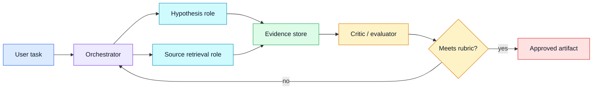
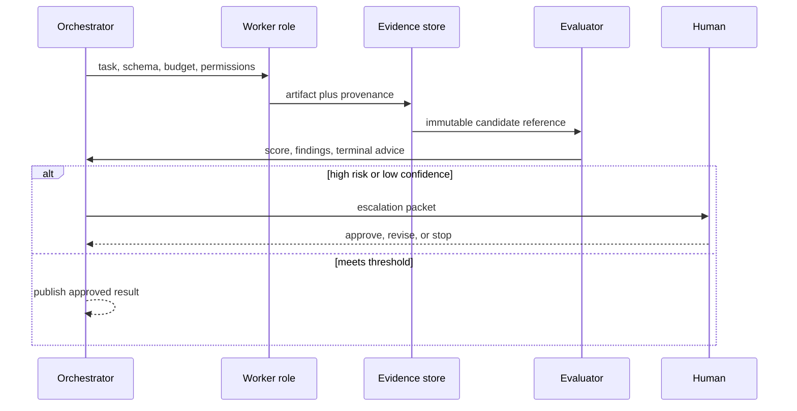

# Multi-agent decomposition
Status: draft — expansion and review pending
Sources: [Google DeepMind — Co-Scientist](https://deepmind.google/blog/co-scientist-a-multi-agent-ai-partner-to-accelerate-research/)

## Draft lesson
Decompose only when independent roles produce evidence a single bounded workflow cannot. Define each agent’s input schema, output schema, budget, authority, and stopping condition. Coordination adds latency, cost, correlated failure, and state-management work. Use a single agent plus tools when the work is sequential and the evaluator is clear.

## In one sentence

Multi-agent decomposition is a systems-design choice: split a task only when independent, bounded roles can create evidence or parallel progress that offsets the coordination, cost, and reliability burden they introduce.

## Background

A single agent with tools is often the simplest useful architecture. It reads a request, calls a search or internal API, applies a deterministic policy, and returns a result. This has a compact state model: one prompt context, one budget, one set of permissions, and one observable execution trace. Adding agents does not automatically add intelligence. It creates distributed state, queues, retries, handoffs, aggregation, and a larger attack surface for bad instructions or ungrounded claims.

Decomposition becomes useful when roles have genuinely different inputs, tools, evaluation criteria, or latency profiles. A research task may benefit from separate hypothesis generation, source retrieval, critique, and experimental planning because each can produce inspectable artifacts. A support workflow may separate classification, retrieval, policy checking, and response drafting because some stages need deterministic controls or different permissions. If the work is sequential, all agents use the same sources, and one evaluator can judge the result, a single agent plus tools is usually cheaper and easier to operate.

The unit of decomposition is an artifact contract, not a personality. Each role should have an input schema, output schema, authority, budget, deadline, and stopping condition. An agent that “researches” should return citations, claim IDs, uncertainties, and source excerpts or pointers—not a vague narrative handed to another agent. A critic should return explicit findings tied to a rubric, not merely rewrite the first answer. These contracts make the workflow testable and make it possible to replace an agent with conventional code where appropriate.

## What changed

Google DeepMind's Co-Scientist announcement presents a multi-agent AI partner for research. That is a vendor description of a particular system, not evidence that multi-agent architecture is universally superior. The engineering lesson is narrower: research workflows can have natural specialist stages, but their value depends on evidence flow and a reliable selection process, not on the number of model calls.

For a production team, the change is a shift from one long prompt toward an orchestrated workflow whose intermediate outputs are first-class data. The orchestrator selects roles, supplies scoped context, records lineage, and decides when to stop. It should be able to prove which candidate or source led to a final recommendation. This is especially important when agents can search, invoke tools, spend money, or affect external systems.



## Impact on current processing and architecture

Start with an orchestrator that is intentionally boring. It owns the run ID, task state, budgets, permissions, deadlines, and terminal statuses. It persists each handoff before delivery so a worker retry cannot lose or duplicate work. Every task message should include the artifact URI or content hash, input version, allowed tools, token or cost budget, and an idempotency key. Do not rely on an agent's conversational memory as the source of truth for workflow state.

Use a state machine such as `QUEUED`, `RUNNING`, `WAITING_FOR_EVIDENCE`, `EVALUATING`, `APPROVED`, `REJECTED`, `EXPIRED`, and `ESCALATED`. A timeout must have a defined response: use partial evidence, retry a safe idempotent operation, or return control to a human. An agent that fails after sending an external request is in an unknown-effect state; the system should query the external service before retrying.

Permissions should be role-specific. A retrieval worker might receive read-only web access; a drafting worker may receive only selected evidence; an execution worker may be denied external writes entirely. This limits prompt injection and reduces the chance that an untrusted document becomes an instruction. Treat agent output as untrusted input to the next stage: validate schemas, cap sizes, strip tool directives, and use allowlists for references.



## Real-world applications and constraints

In research support, one role can generate candidate hypotheses while another retrieves primary evidence and a third checks that claims are supported. The evaluator should judge source coverage and contradictions rather than rewarding agreement. For customer operations, classification, retrieval, policy checks, and drafting can be separated, but customer-data access must be minimized and external actions must remain behind deterministic approval gates.

Multi-agent work is not free parallelism. Calls compete for rate limits and GPU capacity, sources may overlap, and agents can amplify the same bad assumption when given the same context. Use a concurrency limit, per-run cost ceiling, duplicate-detection policy, and cancellation propagation. If an upstream claim is retracted, downstream artifacts should be invalidated by lineage rather than left silently cached.

## Mental model

Think of agents as services in a small workflow engine, not as a committee of people. They require interfaces, service-level objectives, permissions, observability, and failure handling. The orchestrator is responsible for the outcome, while an evaluator decides whether intermediate work is adequate evidence for the next transition.

## Engineering consequence

Measure end-to-end completion rate, latency, cost per approved artifact, evaluator disagreement, retry rate, duplicate evidence rate, escalation rate, and regression by task slice. Compare the workflow to a single-agent baseline. If decomposition does not improve a measurable outcome or reduce a meaningful risk, remove it. Complexity is a cost even when every component works.

Test malformed handoffs, missing citations, duplicated messages, a role exceeding budget, contradictory evidence, evaluator outage, cancelled runs, and prompt injection embedded in retrieved content. Keep a replayable trace with prompt and tool versions, but redact secrets and sensitive user data according to retention policy.

Budgeting needs more than a maximum number of calls. Allocate an end-to-end cost budget, then reserve portions for retrieval, generation, evaluation, and recovery. A workflow that spends its entire allowance generating candidates may be unable to validate the best one. Enforce both per-role and per-run limits, with a policy for partial work: perhaps return the best cited draft for human review, but never silently claim it passed evaluation. Include latency budgets as well. Parallel roles can lower wall-clock time, yet a fan-out that waits for every low-value worker can make the user experience worse than a single well-scoped call.

Cancellation must propagate. If a user changes the request, a policy rule rejects the task, or an evaluator finds a blocking safety issue, stop pending work where the underlying tools allow it. Mark queued messages obsolete, revoke short-lived credentials, and ensure late responses cannot reopen a terminal run. This is another reason to include run and state versions in every handoff. A worker response belonging to a cancelled attempt is evidence for debugging, not permission to alter the current result.

Evaluation should be layered. Schema validation checks that the artifact is parseable and within size limits. A deterministic evaluator checks citations, required fields, policy rules, and duplicate identifiers. A model-based evaluator can then judge synthesis, relevance, or explanation quality, but its score should be stored with rubric version and supporting findings. For high-impact decisions, add a human approval state. An ensemble of agents that all produce fluent text is not an evaluation system unless it can point to evidence and a decision rule.

Data minimization matters at every handoff. Passing the full customer record or entire document corpus to every role increases exposure and token cost. Retrieve a narrow evidence packet, redact unrelated fields, and give each worker only the tools required for its contract. Record access decisions so an audit can answer which agent saw which data. If a workflow crosses tenants, regions, or regulated datasets, isolation must be enforced in the orchestration layer rather than assumed from prompt wording.

Common anti-patterns include a “manager” agent that recursively creates workers without a quota, agents critiquing each other forever without a terminal condition, and a final writer that receives unverified summaries instead of sources. Another is fake independence: several agents search the same index with the same prompt and then vote, creating repetition rather than corroboration. Prefer targeted diversity, such as a primary-source retriever, a counterexample search, and a deterministic citation check.

## Limits and failure modes

Decomposition cannot repair an undefined objective. If the product has no agreed acceptance criteria, agents will optimize superficial proxies such as length, confidence, or agreement. Write the rubric first: required evidence, forbidden actions, budget, latency target, uncertainty behavior, and the conditions requiring escalation. A multi-agent workflow may be less reliable than one agent when the handoffs lose context or each role makes a slightly different assumption about the task.

Agents can also create feedback loops. A generator proposes a claim, a retriever searches using that claim as a query, and a critic treats the retrieved repetition as confirmation. Break the loop by preserving original source provenance, looking for disconfirming evidence, and requiring the evaluator to identify whether a source is primary, secondary, or merely derivative. Treat consensus as a signal to investigate, not as proof.

Operationally, failures can cluster during a provider outage or rate-limit event. Backoff, circuit breakers, dead-letter queues, and a graceful single-agent fallback reduce cascading retries. The fallback should have a smaller scope and clear disclosure, not silently pretend that missing specialist checks ran. Maintain test fixtures for each failure type and a runbook for cost spikes, stuck workflows, source outages, and accidental external actions.

An effective review cadence uses production traces as test cases. Sample completed, rejected, and escalated runs; replay their persisted artifacts against a newer evaluator or schema; and compare decisions. When a new role is proposed, require an experiment showing its marginal benefit against the existing workflow. This prevents the architecture from accumulating fashionable roles that add cost but no measurable evidence quality, latency improvement, or risk reduction.

Finally, ownership must be explicit. One team should own the orchestration service and reliability targets, while domain owners define evidence and approval rules. On-call staff need a way to pause a role, drain a queue, revoke an integration credential, and identify all outputs derived from a flawed source. These are ordinary service-management needs, but agents make them visible because a small defect can otherwise propagate through many generated artifacts quickly.

Privacy review should include intermediate artifacts. A final response may be safe to retain while a retrieval trace contains customer identifiers, proprietary source text, or tool parameters. Classify artifacts by sensitivity, apply retention limits, and avoid copying them into every downstream prompt. Encrypt stored evidence, restrict access by run owner and role, and log exports. If a user requests deletion, lineage should identify all durable workflow records that need handling under the product's policy.

Before launch, define a capacity test. Simulate many concurrent runs with normal completions, slow tools, retries, cancellations, and adversarially large artifacts. Confirm that quotas protect unrelated users, queues do not grow unbounded, and timeout behavior produces intelligible partial outcomes. The goal is not to make every agent finish; it is to preserve correct state, bounded cost, and safe authority whenever some of them do not.

The same standard applies to model upgrades. Pin a workflow to explicit model and prompt versions, replay a representative evaluation set, and compare cost, latency, evidence coverage, and escalation behavior before changing production traffic. A better benchmark score may still be unacceptable if it weakens citation checks or alters a role's tool-use pattern.

### A practical rollout sequence

Ship decomposition behind a feature flag and begin with a shadow run: execute the specialist roles for sampled requests while a single-agent baseline remains authoritative. Compare the final recommendation, citations, budget, and elapsed time without exposing extra output to customers. Next, enable the workflow only for low-impact tasks with a clear human fallback. Promote it after the evidence shows a measurable gain on the chosen rubric and after operators have exercised cancellation, retry, and rollback paths. This sequence limits blast radius and avoids mistaking a compelling demo for a production reliability result.

## Build it locally

```python
from dataclasses import dataclass

@dataclass(frozen=True)
class Artifact:
    role: str
    claim_ids: tuple[str, ...]
    sources: tuple[str, ...]
    cost: int

def accept(artifacts: list[Artifact], budget: int = 300) -> str:
    spent = sum(a.cost for a in artifacts)
    claims = {claim for a in artifacts for claim in a.claim_ids}
    sources = {source for a in artifacts for source in a.sources}
    if spent > budget:
        return "ESCALATE: budget exceeded"
    if not claims or len(sources) < 2:
        return "REJECT: insufficient independent evidence"
    return "EVALUATE: artifact set is complete enough to review"

items = [
    Artifact("hypothesis", ("c1",), (), 80),
    Artifact("retrieval", ("c1",), ("paper", "benchmark"), 110),
]
print(accept(items))
assert accept(items).startswith("EVALUATE")
```

1. Save as `agent_flow.py` and run `python3 agent_flow.py`.
2. Add a unique run ID and reject duplicate role artifacts.
3. Persist artifacts to SQLite with a parent-artifact column.
4. Add an evaluator requiring each claim to have a primary source.
5. Simulate an evaluator timeout and confirm the run enters `ESCALATED` rather than publishing.

## Interview Q&A

**When should you use multiple agents?** When bounded roles create independently verifiable evidence, need distinct permissions, or can safely parallelize a task with a clear evaluator.

**What is the biggest operational risk?** Unmanaged state: duplicate work, unclear lineage, uncontrolled cost, and an agent's unsupported output becoming trusted input downstream.

**How do you prevent correlated failure?** Diversify evidence sources and checks, keep roles scoped, and use deterministic evaluators where possible; separate prompts alone do not create independence.

## Glossary

**Artifact contract:** Typed agreement describing a role's input, output, provenance, and limits.

**Orchestrator:** Service that manages workflow state, budgets, permissions, and transitions.

**Lineage:** Links showing which inputs and artifacts produced an output.

**Terminal state:** A final run outcome such as approved, rejected, expired, or escalated.

## References

- [Google DeepMind, “Co-Scientist: a multi-agent AI partner to accelerate research”](https://deepmind.google/blog/co-scientist-a-multi-agent-ai-partner-to-accelerate-research/)
- [NIST AI Risk Management Framework](https://www.nist.gov/itl/ai-risk-management-framework)

## Claim ledger
| Claim | Source | Fact or inference |
|---|---|---|
| Co-Scientist is presented as a multi-agent research partner. | [Source](https://deepmind.google/blog/co-scientist-a-multi-agent-ai-partner-to-accelerate-research/) | Fact, vendor claim |
| Decomposition needs explicit contracts and budgets. | Systems-design reasoning | Inference |
