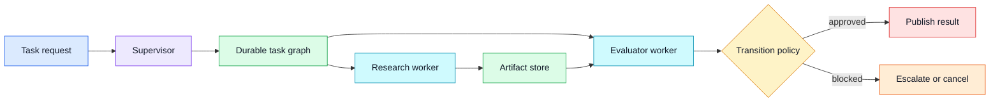
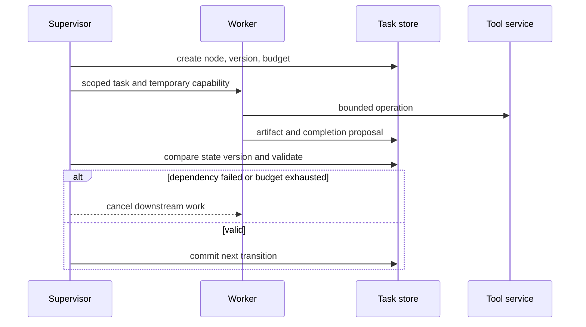

# Supervisor orchestration
Status: draft — expansion and review pending
Sources: [Google DeepMind — Co-Scientist](https://deepmind.google/blog/co-scientist-a-multi-agent-ai-partner-to-accelerate-research/)

## Draft lesson
A supervisor is a control-plane service, not a narrator. It assigns bounded tasks, stores shared state, records handoffs, applies deadlines, and cancels dependent work when a prerequisite fails. Model work as a DAG with durable IDs, retry class, owner, and terminal state. A supervisor should not grant workers ambient credentials.

## In one sentence

A supervisor is a control-plane service that turns agent work into a bounded, observable workflow with durable state, least-privilege permissions, explicit budgets, and safe terminal outcomes.

## Background

Single-agent applications can often keep state in one request context. Once several workers, tools, or long-running tasks are involved, that approach fails: context is lost on retry, late responses overwrite newer choices, and no component knows whether the user-visible task is actually complete. Traditional workflow engines solve this with a control plane. They schedule units of work, persist state transitions, enforce dependencies, handle deadlines, and expose a coherent status to callers.

An agent supervisor should play this role. It is not another free-form narrator that repeatedly asks workers what to do next. It owns task IDs, input versions, dependency edges, budgets, tool permissions, retry class, and terminal status. Workers perform bounded operations and return typed artifacts; the supervisor decides whether those artifacts satisfy the transition rules. This distinction keeps a fluent model answer from becoming unreviewed workflow authority.

## What changed

Google DeepMind's Co-Scientist announcement describes a multi-agent research system. It is a vendor description, not a specification for a general supervisor. The practical implication is that multi-role workflows need a coordination layer whose behavior is observable and testable. As model calls become capable of planning and tool use, the control plane must be more explicit about who may do what and when work is considered finished.



## Impact on current processing

Model the workflow as a directed acyclic graph when dependencies are known: retrieval precedes evidence review; evidence review precedes publication. Every node has an owner, input and output schema, deadline, retry policy, cost limit, and idempotency key. Persist the graph before dispatch. If a worker crashes after an external call, the supervisor can determine whether to query, retry, or mark the effect unknown rather than duplicating work.

Use states such as `QUEUED`, `RUNNING`, `WAITING`, `SUCCEEDED`, `FAILED`, `CANCELLED`, `EXPIRED`, and `ESCALATED`. State transitions must be compare-and-set operations against a version number. A late `SUCCEEDED` message from an earlier attempt must not revive a task cancelled after its prerequisite failed. Store the reason code and artifact references for every terminal transition.

Workers receive short-lived, role-specific credentials. A retrieval worker may read an approved source index; an evaluator may read artifacts but have no external-write permission; a publisher may require a separate human-approved token. Do not pass an ambient administrator credential through a general-purpose agent prompt. Validate worker output at the supervisor boundary, including schema, size, artifact hash, and references.



## Engineering consequence

Track queue wait, execution latency, timeout rate, retry count, cost by role, cancellation propagation time, stale-message rejection rate, and terminal outcome by task type. Test duplicate delivery, worker crash after tool use, evaluator outage, budget exhaustion, dependency cycles, and a user cancellation during execution. The safe default for an unknown external effect is investigation or escalation, not automatic repetition.

## Real-world applications and constraints

In a research workflow, a supervisor can schedule hypothesis, retrieval, critique, and experiment-design roles while ensuring that no finding is published until required primary-source evidence is attached. In customer support, it can keep classification, retrieval, policy review, and response drafting separate; a draft is not permitted to send an email or change an account merely because a worker suggested it. In operations, it can coordinate diagnosis and remediation proposals while a deterministic change-management service controls execution.

The main constraint is authority. A supervisor should know the difference between a read-only tool, a reversible action, and a consequential external write. Give high-impact actions an approval boundary, a narrow parameter schema, and a maximum blast radius. A model may choose among pre-authorized actions, but it should not create new privileges by composing instructions. Log policy version and approver identity with every state transition.

## Mental model

Treat the supervisor like an air-traffic controller, not a chief pilot. It does not need to perform every task itself; it creates separation, ensures dependencies are satisfied, manages scarce capacity, and refuses unsafe transitions. The workers can be clever, but the control plane must remain predictable under duplicate messages, timeouts, and partial failure.

## Limits and failure modes

The supervisor can become a bottleneck or single point of failure if all work depends on one process. Use durable storage, stateless dispatchers where practical, leases for active nodes, and recovery from persisted state. Do not use an in-memory conversation as the workflow ledger. A restarted process should reconstruct which tasks ran, what artifacts exist, and which external effects remain unknown.

Recursive delegation is another failure mode. A planner may keep creating sub-tasks because each answer suggests more research. Enforce maximum depth, maximum active workers, per-role budgets, and a terminal condition defined before dispatch. If the task requires a human decision, surface a concise escalation packet rather than consuming the remaining budget on speculative alternatives.

Scheduling policy affects both fairness and outcome quality. A simple first-in, first-out queue can let a long research run delay a short customer request. Priority queues can correct that, but need protection against starvation. Establish service classes, maximum queue age, per-tenant concurrency limits, and admission control. Record why a task was delayed or rejected so users and operators can distinguish capacity pressure from a model failure.

The supervisor must also manage shared context deliberately. A task may need a small evidence packet from a predecessor, not every transcript and raw tool output. Store artifacts separately, pass references plus a compact typed summary, and fetch full data only when a role is authorized and needs it. This reduces latency, token cost, accidental leakage, and the chance that old instructions embedded in a document alter downstream behavior.

Planning can be dynamic without becoming unbounded. Let a worker request a known follow-up task type, then require the supervisor to validate its dependency, budget, permission, and deduplication key. A research worker requesting “retrieve citation for claim c12” is a bounded request; asking for “more agents until confident” is not. This distinction gives product teams a way to evolve workflows while retaining predictable limits.

Audit records should support a reconstruction of every externally meaningful decision. Store task IDs, attempt IDs, input and policy versions, worker identity, tool calls, artifact hashes, evaluator findings, and state transitions. Redact secrets and minimize personal data, but retain enough metadata to determine whether a result came from the correct inputs and whether an unauthorized path occurred. An audit trail is especially useful after model or prompt updates, when a change in behavior may be caused by orchestration rather than the model itself.

## Operational rollout

Begin with a read-only shadow workflow. Let the supervisor build the graph, dispatch non-consequential workers, and compare its proposed outcomes to current human or deterministic processes. Use this phase to find missing terminal states, confusing escalation packets, and unexpected cost concentration. Next, enable a narrow task class with a manual approval gate. Expand authority only after cancellation, retry, and recovery behavior have been exercised under load.

Set service-level objectives for the control plane: successful durable dispatch rate, state-transition latency, maximum time to cancellation, artifact availability, and recovery time after a restart. These differ from model-quality metrics. A workflow can produce good drafts but still be operationally unusable if a cancelled run continues spending money or a restart loses evidence. Keep dashboards for control-plane health separate from worker-model accuracy.

Incident response should include a kill switch at the supervisor. It must stop new dispatch, cancel queued work, revoke temporary capabilities, and prevent late results from publishing. For an already-executed external action, the supervisor should surface the action ID and verification status to an operator rather than fabricate certainty. Rehearse this process with game days, including a storage outage, a compromised integration credential, and a sudden rate-limit reduction.

## Security and privacy

Workers and tools should authenticate to the supervisor, and the supervisor should authenticate each request to an external service. Capabilities should be narrowly scoped and short lived. Validate all task metadata: a malicious worker must not be able to set its own role, increase its budget, or point a dependent task to another tenant's artifact. Treat retrieved documents and generated text as data, not as control instructions.

Apply data-retention policies to intermediate state. A final response might be safe to retain while a trace contains sensitive source material, customer fields, or tool arguments. Classify artifacts, encrypt stored data, constrain access by role, and make deletion and export workflows follow lineage. Supervisory observability should improve accountability without creating an uncontrolled copy of all user content.

## Design review checklist

Before enabling a new supervised workflow, answer concrete questions. What is the authoritative state store? Which roles may create child tasks? What evidence must be present before a result is published? Which tool calls are reversible, and which require approval? What is the maximum spend and the user-visible timeout? Which transitions are idempotent, and how is an unknown external effect resolved? Who owns the runbook at 2 a.m.? If these answers exist only in prompts, the workflow is not yet ready for consequential traffic.

Review the workflow graph for privilege escalation. A low-privilege worker should never be able to smuggle an instruction into an artifact that causes a higher-privilege worker to act. Make privilege changes explicit graph edges with policy checks and, when appropriate, user or human approval. This is safer than relying on a downstream model to recognize every malicious or confusing instruction in its context.

Use small, meaningful rollout metrics. Track whether the supervisor reached a correct terminal state, whether all required artifacts were present, whether cancellation completed within the objective, and whether any action occurred outside authority. Pair these with quality measurements for the resulting task. A high completion rate is not valuable if the supervisor routinely approves unsupported work; a high rejection rate is not valuable if valid work cannot proceed.

When changing orchestration code, run replay tests over representative persisted traces. Verify that older states can still be decoded or migrated deliberately, that duplicate completions remain harmless, and that new policy rules do not accidentally authorize legacy artifacts. Version schemas and state transitions just as carefully as public APIs. Workflow compatibility bugs often surface only after a retry or delayed message, when the original run no longer exists in memory.

## Build it locally

```python
from dataclasses import dataclass

@dataclass
class Task:
    state: str = "QUEUED"
    version: int = 0

def transition(task: Task, expected: int, target: str) -> str:
    if task.version != expected:
        return "REJECT: stale worker message"
    if task.state in {"CANCELLED", "SUCCEEDED", "FAILED"}:
        return "REJECT: terminal task"
    task.state, task.version = target, task.version + 1
    return f"OK: {task.state}@{task.version}"

task = Task()
print(transition(task, 0, "RUNNING"))
print(transition(task, 0, "SUCCEEDED"))
print(transition(task, 1, "SUCCEEDED"))
assert task.state == "SUCCEEDED"
```

1. Save as `supervisor_state.py` and run `python3 supervisor_state.py`.
2. Add `cost` and reject a transition that exceeds a run budget.
3. Add dependency IDs and permit a node to run only after required tasks succeed.
4. Persist state in SQLite and replay a simulated process restart.
5. Add cancellation propagation for all dependent queued tasks.

## Interview Q&A

**Why not let a model be the supervisor?** A model can help select work, but durable state transitions, permissions, budgets, and retries need deterministic enforcement.

**How do you prevent late worker results from corrupting a run?** Use task versions and compare-and-set transitions; reject results that do not match the current attempt.

**What should happen after an external-tool timeout?** Mark the effect unknown, query for state when possible, and escalate rather than blindly retrying.

## Glossary

**Control plane:** Service that coordinates work and enforces policy rather than performing the work itself.

**Idempotency key:** Identifier that prevents retried requests from repeating an effect.

**Lease:** Time-limited ownership of an active task or resource.

**Terminal state:** Final status that cannot be changed by late normal work.

## References

- [Google DeepMind, “Co-Scientist: a multi-agent AI partner to accelerate research”](https://deepmind.google/blog/co-scientist-a-multi-agent-ai-partner-to-accelerate-research/)
- [Temporal documentation, durable execution](https://docs.temporal.io/)

## Claim ledger
| Claim | Source | Fact or inference |
|---|---|---|
| The source discusses a multi-agent research system. | [Source](https://deepmind.google/blog/co-scientist-a-multi-agent-ai-partner-to-accelerate-research/) | Fact, vendor claim |
| Supervisors require quotas, cancellation, and durable state. | Systems-design reasoning | Inference |
