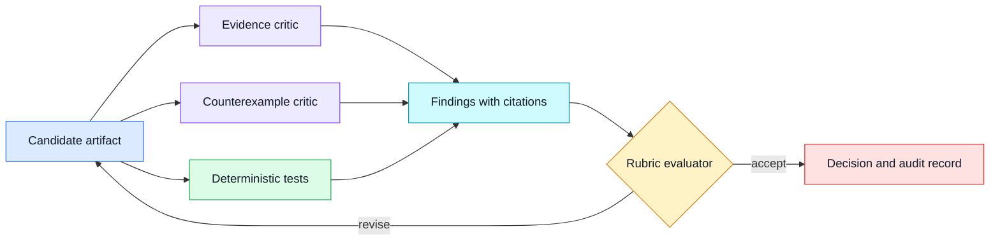
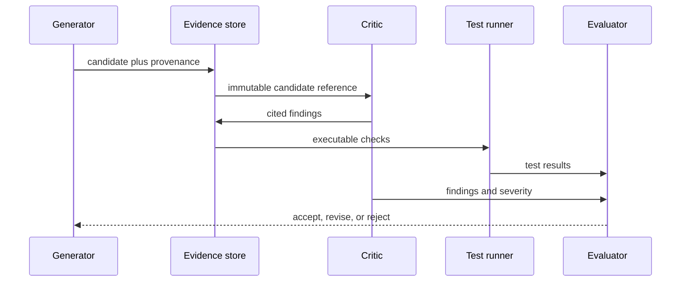

# Debate and critique
Status: draft — expansion and review pending
Sources: [Google DeepMind — Co-Scientist](https://deepmind.google/blog/co-scientist-a-multi-agent-ai-partner-to-accelerate-research/)

## Draft lesson
Critique is useful only when it tests evidence or a concrete artifact. Two agents sharing prompts, tools, and assumptions can agree on the same error. Require cited evidence, independent retrieval or test cases, and a deterministic final check. Log dissent; consensus is a signal, not proof.

## In one sentence

Debate improves an engineering decision only when critics test a concrete artifact against independent evidence, explicit rubrics, and deterministic checks rather than simply generating more confident prose.

## Background

Code review, design review, and incident analysis all use structured critique. The useful part is not disagreement for its own sake: a reviewer compares a change against requirements, tests, source data, and operational constraints. AI debate follows the same rule. One model can propose a plan, another can seek counterexamples, and an evaluator can decide whether the proposal has evidence. Without a shared artifact contract, the exchange becomes a conversation whose agreement is easy to mistake for correctness.

Models are often correlated. They may share a provider, training distribution, prompt framing, tools, retrieved documents, and incentives to produce plausible explanations. Asking three agents the same question and counting votes can therefore multiply the same error. Independence comes from different evidence paths or tests: retrieve a primary source, execute a program, inspect a database record, construct a counterexample, or apply a deterministic policy. Diverse wording alone is not independent validation.

## What changed

Google DeepMind's Co-Scientist announcement motivates multi-agent research workflows. It is a vendor description rather than a general proof that debate improves accuracy. The practical change is a stronger focus on artifact-centered workflows: a candidate hypothesis, claim ledger, experiment plan, or code patch can be criticized against known checks and then accepted, revised, or rejected with recorded reasons.



## Impact on current processing

Make the object of critique typed and immutable. A research claim should have an ID, text, source references, source type, date, and confidence. A code change should have a commit or patch hash, test command, and expected behavior. A critic returns findings with severity, affected artifact IDs, evidence references, and a recommended disposition. The evaluator should be able to reject a finding that lacks evidence instead of treating every criticism as equally valid.

Separate generation from judgment. A generator may create several candidates, but it should not be the only component selecting the winner. Use deterministic checks for required citations, schema validity, policy constraints, test execution, and duplicate claims. Use a model-based critic for synthesis, missing assumptions, and plausible counterexamples, while preserving its rubric version and reasoning artifacts for audit.



## Engineering consequence

Set a bounded number of critique rounds, per-round budget, and terminal conditions. A finding must either block publication, request a specific revision, or be dismissed with a reason. Log dissent rather than averaging it away. Track evidence coverage, finding precision, reopen rate, test failure rate, cost per accepted artifact, and regression after evaluator changes.

## Real-world applications

For code changes, a critic can inspect a patch while a test runner supplies reproducible evidence. For research, a counterexample role can search primary sources that challenge the central claim. For operations, a proposed remediation can be checked against change policy and current telemetry. The key constraint is that every critique references an artifact and a decision rule; otherwise debate is merely another generation step.

In a security review, the candidate can be a threat model: assets, trust boundaries, attack paths, and mitigations. A critic searches for missing permissions, untrusted inputs, and unsafe defaults, while automated scanners test the code and configuration. In a clinical or scientific workflow, the candidate can be a study proposal. Critics check evidence quality, protocol feasibility, and whether an inference is being presented as a measured fact. The final approval policy must reflect the domain's actual risk rather than the rhetorical confidence of the agent.

## Operational design

Route each artifact through the cheapest reliable check first. Schema validation and citation presence are inexpensive; executing a test suite may cost more; a human review is scarce and should receive a compact evidence packet. This ordering reduces waste while preserving a strong gate for consequential decisions. It also gives operators clear reason codes when a workflow stops: malformed candidate, missing evidence, failed deterministic test, unresolved critical finding, or human decision required.

Keep candidate generation and evaluation on separate budgets. Otherwise a generator can consume the capacity needed for independent review, especially when it produces many nearly identical alternatives. Apply deduplication using claim IDs, source hashes, or semantic similarity thresholds, then request critique only for materially different candidates. Cancellation should propagate when a candidate is rejected so queued critics do not continue spending resources on obsolete work.

Reliability requires handling late and duplicate messages. Store each finding with an artifact hash and critique-round number. The evaluator should reject a finding for an obsolete candidate or record it as post-decision evidence rather than reopening an accepted result silently. Use idempotency keys for tool calls and state transitions. If a critic times out after invoking a tool, the orchestrator should check whether the tool call completed before retrying.

## Evaluation strategy

Build a labeled evaluation set from real artifacts: claims with missing citations, sources that do not support a claim, genuine counterexamples, harmless stylistic differences, and valid results that should be accepted. Measure finding precision and recall by severity, not merely the total number of objections. A critic that catches every issue by blocking every result is not operationally useful. Calibrate thresholds against the cost of false acceptance and false rejection for the task.

Run ablations before claiming that debate helped. Compare a single generator, generator plus deterministic checks, generator plus one critic, and the full workflow using matched inputs and budgets. Inspect the marginal value of each role. If a critic adds latency and cost without finding unique, evidence-backed defects, remove or redesign it. This protects the architecture from accumulating agents because they sound prudent rather than because they improve an observed outcome.

## Security and privacy

Critics can be exposed to untrusted documents, code, and user text. Treat those as data, not instructions. Limit tool access, strip or isolate embedded directives, validate URLs and artifact references, and do not give a critique role authority to publish or execute changes. Retain enough audit data to reconstruct a decision, but minimize sensitive content in long-lived logs. A retrieved document can contain a prompt injection; it is not an instruction to change the evaluation rubric or reveal private context.

## Rollout and maintenance

Introduce critique in shadow mode first. Generate findings beside the existing process, but do not let them block users. Sample cases where the critic would have rejected or revised an artifact and have domain reviewers label whether the finding was useful. This establishes a baseline for precision, escalation load, and latency. Next enable blocking only for a narrow, well-defined category, such as missing required citations or a failed test. Expand the gate only after observed behavior matches the intended rubric.

Changes to prompts, models, retrieval indexes, or tools require regression testing. Replay a fixed set of accepted and rejected artifacts, compare severities and final decisions, and review material differences. Store the critic and evaluator version in every record. Without versioning, an organization cannot explain why an answer accepted last month would be rejected today, or whether a change fixed a blind spot versus simply changed tone.

Human review is a control, not an overflow bucket. Escalation packets should contain the candidate, the exact blocking finding, the supporting evidence, the decision rule, and the action requested from the reviewer. Avoid sending a full conversation transcript when a concise evidence packet is sufficient. Measure time to review and disagreement with the evaluator; a growing queue can indicate that the automated rubric is too broad or that the product needs more deterministic checks.

When incidents occur, classify the failure: unsupported claim accepted, valid candidate falsely blocked, stale evidence, tool-test defect, rubric ambiguity, or orchestration error. Correct the underlying category and add a regression fixture. Do not merely add another critic prompt after every incident. The objective is a system that learns from observable failures while preserving bounded cost, explainable decisions, and a clear path to human accountability.

## Limits and failure modes

More rounds can amplify a false premise. Bound the loop, retain dissent, and escalate when evidence remains inconclusive. Do not use consensus as a substitute for a source, test, or accountable human decision.

An adversarial critic can also become unproductive. If a role is rewarded only for finding flaws, it may produce low-severity objections or demand impossible certainty. Assign severity levels and require a proposed resolution. For example, a critical finding blocks publication because it identifies an unsupported central claim; a warning requests a clarifying sentence; an informational finding is retained for future work but does not restart the task. This lets an evaluator prioritize real risk instead of counting findings.

The quality of a critique depends on the rubric. A vague request such as “review this answer” invites stylistic preference. A useful rubric asks whether each factual claim has a source, whether a source directly supports the claim, whether evidence is current enough, whether a proposed action is authorized, and whether required tests passed. Version the rubric as code or data. When an evaluator changes, replay representative artifacts to see which prior decisions would change and why.

Disagreement is valuable data. Preserve the candidate, each finding, evidence pointers, evaluator decision, and disposition in an append-only record. A later incident may show that a dismissed concern was valid, or that a critic systematically generated false alarms for a task slice. This record enables calibration: measure precision, recall, time to resolution, and the rate at which accepted artifacts are reopened.

## Build it locally

The example below demonstrates a small deterministic layer around critique. A model could create the findings, but publication is controlled by evidence and severity rules.

```python
from dataclasses import dataclass

@dataclass(frozen=True)
class Finding:
    claim_id: str
    severity: str
    has_evidence: bool

def decide(findings: list[Finding]) -> str:
    unsupported = [f for f in findings if not f.has_evidence]
    blockers = [f for f in findings if f.severity == "critical" and f.has_evidence]
    if blockers:
        return "REVISE: evidence-backed critical finding"
    if unsupported:
        return "DISMISS: finding lacks evidence"
    return "ACCEPT: no evidence-backed blocker"

items = [Finding("c1", "critical", True), Finding("c2", "warning", False)]
print(decide(items))
assert decide(items).startswith("REVISE")
assert decide([Finding("c1", "warning", False)]).startswith("DISMISS")
```

1. Save the file as `critique_gate.py` and run `python3 critique_gate.py`.
2. Add a required source type field and reject a critical factual finding that cites no primary source.
3. Persist findings in SQLite with artifact ID, rubric version, and disposition.
4. Add a rule that permits at most two revision rounds before escalation.
5. Write tests for duplicate findings, missing claim IDs, and a late finding arriving after acceptance.

## Interview Q&A

**Why is model voting weak evidence?** Multiple models can share the same retrieved documents, assumptions, and blind spots. Agreement measures similarity of outputs, not independent confirmation.

**How do you make critique independent?** Change the evidence path or test: use a different primary source, execute code, query a system of record, or build a counterexample. Record the provenance so independence can be examined.

**When should a critic block release?** When an evidence-backed finding violates a defined acceptance rule, such as an unsupported critical claim, failed security test, or forbidden external action.

**What is the evaluator's role?** It applies a versioned rubric to findings and evidence, decides the next state, and records why. It should not silently rewrite a candidate to hide a disagreement.

## Glossary

**Artifact:** Immutable candidate under review, such as a claim set, patch, plan, or report.

**Counterexample:** Valid case that contradicts a candidate assertion or reveals a missing condition.

**Critique round:** One bounded cycle of findings, evidence checks, and a decision.

**Rubric:** Explicit decision rules used to judge an artifact.

**Severity:** Consequence category for a finding, commonly informational, warning, or critical.

## References

- [Google DeepMind, “Co-Scientist: a multi-agent AI partner to accelerate research”](https://deepmind.google/blog/co-scientist-a-multi-agent-ai-partner-to-accelerate-research/)
- [NIST AI Risk Management Framework](https://www.nist.gov/itl/ai-risk-management-framework)

## Claim ledger
| Claim | Source | Fact or inference |
|---|---|---|
| The source motivates multi-agent research workflows. | [Source](https://deepmind.google/blog/co-scientist-a-multi-agent-ai-partner-to-accelerate-research/) | Fact, vendor claim |
| Critique should be evaluated against independent evidence. | Systems-design reasoning | Inference |
