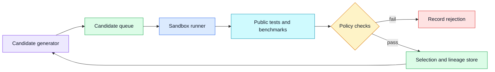
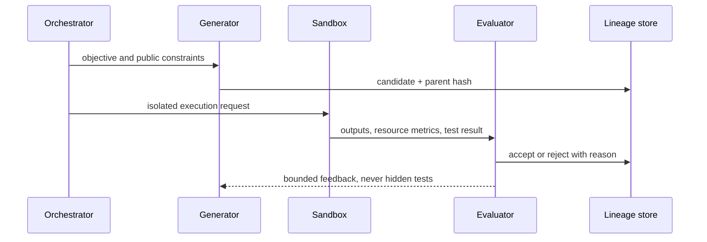

# Search over programs
Status: draft — expansion and review pending
Sources: [Google DeepMind — AlphaEvolve](https://deepmind.google/blog/alphaevolve-impact/)

## Draft lesson
Program search generates candidates, runs an evaluator, and retains candidates that improve a defined objective. The evaluator is the product: weak tests reward shortcuts. Run candidates in a sandbox, cap resources, preserve seeds and diffs, and keep hidden tests outside the generation context.

## In one sentence

Search over programs generates candidate implementations, evaluates them in a constrained environment, and keeps only changes that improve an explicitly measured objective without violating safety, cost, or correctness rules.

## Background

Engineers already search over programs in constrained ways: a compiler explores optimizations, a test runner validates a patch, and a tuning system tries configurations against a benchmark. Evolutionary program search makes this loop explicit. A generator proposes a mutation, an evaluator runs it, and a selection policy preserves useful candidates. The generator may use a language model, templates, random mutation, or all three; the evaluator determines whether the system is useful.

The baseline is ordinary software development: a human writes a change, tests it, reviews it, and merges it. Automated search can explore more alternatives, especially for a narrow numerical kernel, schedule, heuristic, or data transformation. It also creates a strong incentive to exploit whatever the evaluator forgets to measure. A program that passes a weak test may hard-code inputs, skip error handling, consume excessive memory, or rely on undefined behavior. Treat the benchmark as an attack surface.

## What changed

Google DeepMind presents AlphaEvolve as an evolutionary approach to improving algorithms. This is a vendor claim about a particular system, not proof that every code-search workload benefits from evolution. The useful engineering takeaway is that code generation and selection can be separated into an iterative system with artifacts, isolated execution, objective functions, and reproducible evidence.

## Impact on current processing

Make each candidate an immutable artifact with parent IDs, source hash, generator version, prompt or mutation configuration, random seed, dependency lockfile, and declared objective. The evaluator records environment image, resource limits, test version, benchmark inputs, measurements, and decision. This lineage is required to reproduce a winner and to distinguish an improvement from a changed compiler, cache state, or input distribution.

Run untrusted candidates in a sandbox with no network, read-only fixtures, a temporary filesystem, CPU and memory limits, wall-clock timeout, process limit, and output-size cap. A language model should not receive hidden tests or production credentials. Separate public tests, which guide iteration, from held-out tests and operational checks, which decide promotion. Otherwise the generator can optimize to the exact evaluator rather than the intended behavior.

## Engineering consequence

Define objectives as a vector, not one vanity score. A candidate may need functional correctness, latency under a fixed workload, bounded memory, deterministic output, dependency policy compliance, and readability or reviewability. Set minimum gates before optimization: no candidate can trade away a required security test for a faster benchmark result. Use statistical repeats when measurements are noisy and record the machine class and cache policy.

Search budgets are production controls. Limit candidate count, total CPU time, concurrent sandboxes, storage, and external dependency fetches. Cancel descendants when a parent is invalidated. Deduplicate exact and near-identical source artifacts so a generator cannot spend the budget rediscovering the same patch. The system should retain rejected artifacts and reason codes for debugging, without promoting them as viable alternatives.

## Real-world applications

Program search is suited to bounded targets: a numerical routine, query rewrite, schedule heuristic, compiler flag set, data-layout transformation, or test-case generator. It is poorly suited to unrestricted application changes with unclear tests or broad security impact. For production services, start with offline benchmarks and shadow traffic; do not allow a search loop to deploy its own code.

In scientific computing, it can explore algorithms against known datasets, but validation must include held-out distributions and numerical-stability checks. In infrastructure, it can suggest an allocation or batching policy, but rollback, quota, and service-level objectives remain external controls. A faster result that increases tail latency or makes failures unrecoverable is not an improvement.

## Mental model

Think of program search as continuous integration with a very prolific contributor. It can submit many patches, but every patch still needs isolated execution, tests, policy gates, provenance, and a promotion process. The evaluator is the maintainers' contract with the search system.

## Limits and failure modes

Goodhart's law is the central risk: once a score becomes the target, candidates can exploit it. Include hidden tests, adversarial inputs, fuzzing, static analysis, and resource checks. Beware benchmark leakage, cached outputs, nondeterminism, flaky tests, and dependency substitution. A candidate that merely memorizes public fixtures may look excellent until it sees a real input.

## Claim ledger
| Claim | Source | Fact or inference |
|---|---|---|
| AlphaEvolve is presented as an evolutionary approach to improving algorithms. | [Source](https://deepmind.google/blog/alphaevolve-impact/) | Fact, vendor claim |
| Sandboxed evaluation and hidden tests reduce optimization loopholes. | Systems-design reasoning | Inference |
